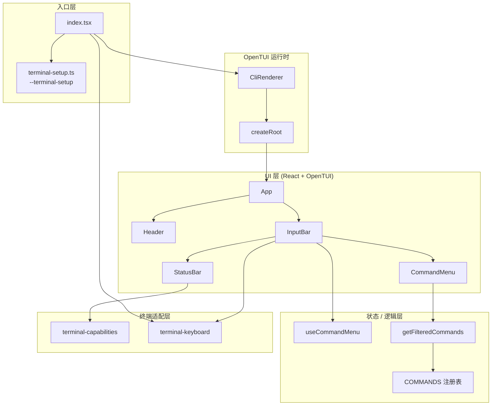
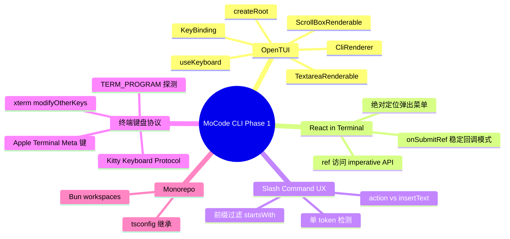
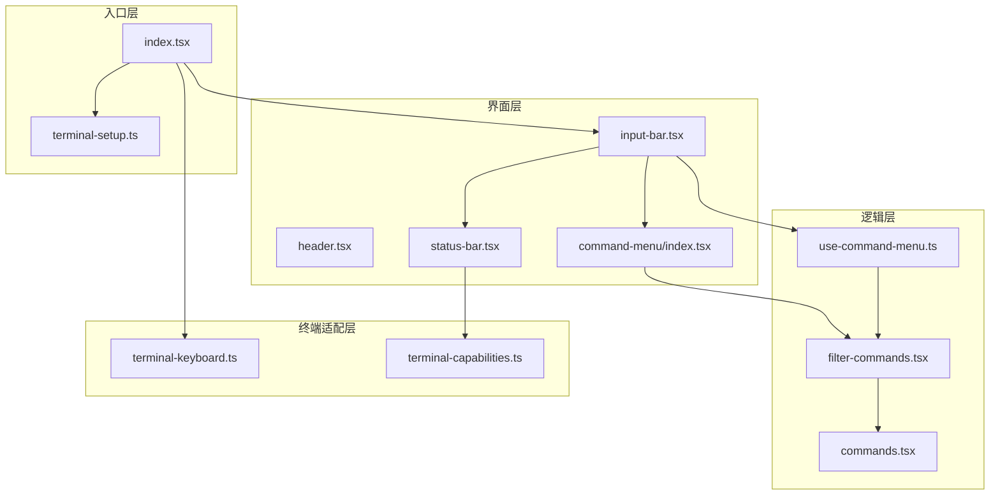
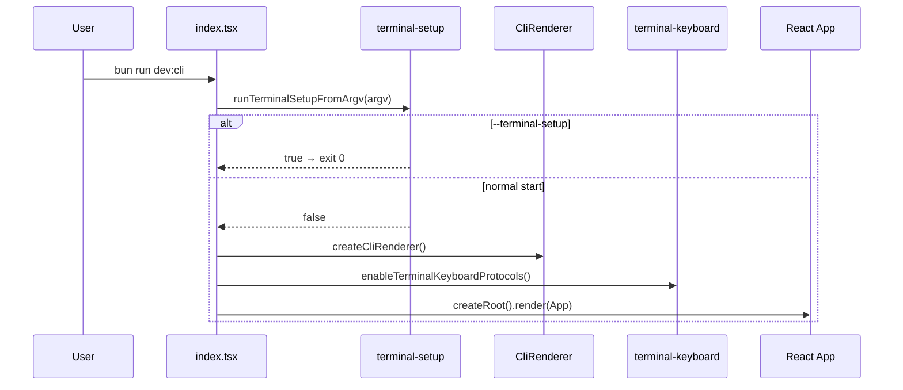
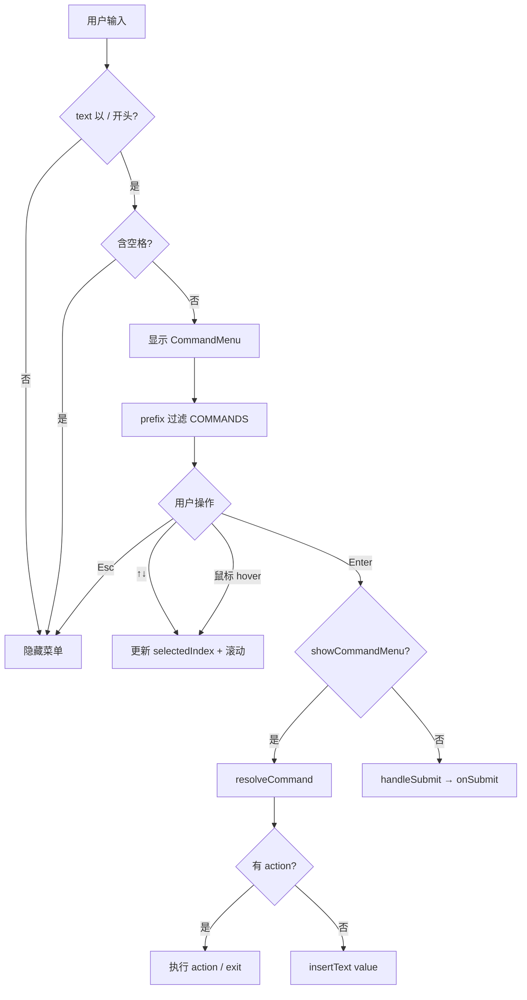
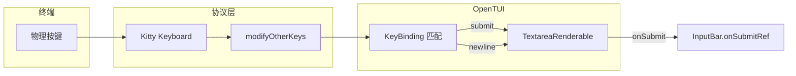

用 **React 写终端 UI**（OpenTUI），在输入框上方实现 **Slash 命令自动补全**，并通过 **Kitty Keyboard + xterm modifyOtherKeys** 让 Enter / Shift+Enter 在不同终端里行为可区分。Apple Terminal 有硬限制，用 `--terminal-setup` 启用 Option-as-Meta 作为降级方案。


---


## 目录

1. 背景与目标
2. 技术选型
3. 架构总览
4. 知识点思维导图
5. 模块与关键代码
6. 核心流程
7. 知识点详解（含官方文档与用法）
8. 文件索引
9. 开发与调试

---


## 1. 背景与目标


### 要做什么


| 能力          | 状态 | 说明                                    |
| ----------- | -- | ------------------------------------- |
| 终端全屏 TUI 壳层 | ✅  | Header + 输入区 + 状态栏                    |
| 多行输入        | ✅  | Enter 提交，Shift+Enter / Ctrl+J / ⌥↵ 换行 |
| Slash 命令菜单  | ✅  | 输入 `/` 触发，前缀过滤，键盘/鼠标选择                |
| 命令执行        | 部分 | `/exit` 可退出；其余命令插入文本占位                |
| 消息提交回调      | 占位 | `onSubmit={() => {}}` 尚未接入后端          |


### 非目标（本阶段不做）

- AI 对话、Session 持久化、模型切换的真实逻辑
- 主题系统、登录/OAuth 实现
- 单元测试与 E2E

---


## 2. 技术选型


| 层级     | 选择                                               | 理由                                    |
| ------ | ------------------------------------------------ | ------------------------------------- |
| 运行时    | **Bun**                                          | 原生 TS/TSX、`--watch` 开发体验好             |
| 仓库结构   | **npm workspaces**                               | `packages/cli` 独立演进                   |
| TUI 框架 | **OpenTUI** (`@opentui/core` + `@opentui/react`) | React 组件模型 + 终端渲染器，与 Claude Code 同类方案 |
| UI 范式  | **React 19 + JSX intrinsic elements**            | `<box>` `<textarea>` 等由 OpenTUI 提供    |
| 类型     | **TS strict +** **`noUncheckedIndexedAccess`**   | 数组索引访问更安全                             |


---


## 3. 架构总览


### 3.1 分层图





### 3.2 依赖方向（单向）


```plain text
index.tsx
  → components/* (纯 UI + 组合)
  → terminal-* (平台能力，无 React 依赖)

command-menu/
  types.ts          ← 无依赖（纯类型）
  commands.tsx      → types
  filter-commands   → commands
  use-command-menu  → filter-commands, @opentui/react
  index.tsx         → filter-commands, commands
```


**原则**：终端协议、命令注册、UI 渲染三者解耦；新增 Slash 命令只改 `commands.tsx`。


---


## 4. 知识点思维导图





---


## 5. 模块与关键代码

> **给非技术读者的导读**
>
> 可以把 MoCode CLI 想成一台「在终端里运行的聊天 App」：
> - **入口文件** = 开机按钮（先检查要不要做一次性设置，再打开界面）
> - **输入框** = 你打字的地方（回车发送、换行、弹出命令菜单）
> - **命令菜单** = 输入 `/` 后出现的快捷指令列表（像微信里输入 `/` 出表情）
> - **终端键盘** = 让不同终端（iTerm、Apple Terminal、Cursor 内置终端）对「回车 / 换行」理解一致
>
>
> 下面每个小节都按：**通俗说明 → 带注释代码 → 关键逻辑** 展开。代码里的 `//` 注释面向「第一次看代码的人」。
>
>

---


### 5.1 入口 — `packages/cli/src/index.tsx`


**通俗说明**：程序从这里开始。做两件事：① 若用户带了 `--terminal-setup` 参数，只做 Mac 终端配置然后退出；② 否则创建「画布」（渲染器）、打开键盘增强、把界面画出来。


**类比**：像打开游戏前先检查「要不要先改手柄设置」；改完就直接关设置界面，不进游戏。


```typescript
// ── 第 1 步：导入依赖 ─────────────────────────────────────────
// createCliRenderer：创建「终端画布」，负责把 UI 画到屏幕上
// createRoot：把 React 组件挂到这张画布上（类似网页里的 ReactDOM.render）
import { createCliRenderer } from "@opentui/core";
import { createRoot } from "@opentui/react";
import { Header } from "./components/header";       // 顶部 Logo
import { InputBar } from "./components/input-bar"; // 底部输入区（核心）
import { runTerminalSetupFromArgv } from "./terminal-setup";
import {
  disableTerminalKeyboardProtocols,
  enableTerminalKeyboardProtocols,
  KITTY_KEYBOARD_OPTIONS,
} from "./terminal-keyboard";

// ── 第 2 步：启动前处理特殊参数 ───────────────────────────────
// process.argv = 用户在命令行里输入的参数列表
// 若包含 --terminal-setup，配置 Apple Terminal 后 process.exit(0) 直接结束，不进入 TUI
if (runTerminalSetupFromArgv(process.argv.slice(2))) {
  process.exit(0);
}

// ── 第 3 步：定义主界面（App 组件）────────────────────────────
function App() {
  return (
    // box = 布局容器，类似 HTML 的 div
    <box
      alignItems="center"           // 子元素水平居中
      justifyContent="center"       // 子元素垂直居中
      backgroundColor="#0D0D12"     // 深色背景
      width="100%"
      height="100%"
      gap={2}                       // 子元素间距
    >
      <Header />                    {/* 顶部 MoCode 字样 */}
      <box width="100%" maxWidth={78} paddingX={2}>
        {/* onSubmit 目前还是占位：用户按回车提交文字时会调用这里 */}
        <InputBar onSubmit={() => {}} />
      </box>
    </box>
  );
}

// ── 第 4 步：创建渲染器并启动 ─────────────────────────────────
const renderer = await createCliRenderer({
  targetFps: 60,                    // 每秒刷新 60 次，动画更顺滑
  exitOnCtrlC: false,               // 不用 Ctrl+C 退出，统一走 /exit 命令
  useKittyKeyboard: KITTY_KEYBOARD_OPTIONS, // 让终端能区分 Shift+回车 和 普通回车
  onDestroy: disableTerminalKeyboardProtocols, // 退出时恢复终端默认按键行为
});

enableTerminalKeyboardProtocols(renderer);  // 再开一层 xterm 键盘协议（双保险）
createRoot(renderer).render(<App />);       // 把 App 画到终端上
```


| 关键点                               | 用人话说                             |
| --------------------------------- | -------------------------------- |
| `runTerminalSetupFromArgv` 先于 TUI | 配置终端是一次性任务，不应进入全屏聊天界面            |
| `exitOnCtrlC: false`              | 避免用户误按 Ctrl+C 和 `/exit` 两套退出逻辑打架 |
| `onDestroy: disable...`           | 程序关掉后，别把用户的终端键盘搞乱                |


---


### 5.2 输入核心 — `components/input-bar.tsx`


**通俗说明**：屏幕底部那块「输入框 + 状态栏 + 可能弹出的命令菜单」。负责：你按什么键是换行、什么是发送、输入 `/` 时是否弹出菜单、回车时执行菜单项还是发送文字。


**类比**：像聊天软件底部的输入栏 + 斜杠命令浮层；Enter 有时是「发送消息」，有时是「选中菜单里那一项」。


### 5.2.1 按键表 — 同一颗回车键，不同按法不同含义


```typescript
/**
 * 终端里「回车」和「Shift+回车」在底层可能是同一种信号。
 * 下面这张表告诉输入框：见到哪种组合键，就执行 submit（提交）还是 newline（换行）。
 */
export const TEXTAREA_KEY_BINDINGS: KeyBinding[] = [
  // ── 提交（发送 / 执行命令）──
  { name: "return", action: "submit" },      // 普通回车
  { name: "enter", action: "submit" },       // 部分终端叫 enter
  { name: "kpenter", action: "submit" },     // 小键盘回车

  // ── 换行（多行输入）──
  { name: "return", shift: true, action: "newline" },  // Shift+回车（需终端支持）
  { name: "enter", shift: true, action: "newline" },
  { name: "kpenter", shift: true, action: "newline" },
  { name: "linefeed", action: "newline" },             // Ctrl+J 的底层信号，通用换行
  { name: "j", ctrl: true, action: "newline" },        // 显式绑定 Ctrl+J
  { name: "return", meta: true, action: "newline" },   // ⌥+回车（Mac 需 terminal-setup）
  { name: "enter", meta: true, action: "newline" },
  { name: "kpenter", meta: true, action: "newline" },
];
```


| 用户操作     | 程序行为    | 典型终端                                  |
| -------- | ------- | ------------------------------------- |
| 回车       | 提交或执行菜单 | 全部                                    |
| Shift+回车 | 换行      | Ghostty、Kitty、iTerm2                  |
| Ctrl+J   | 换行      | 全部（兜底）                                |
| ⌥+回车     | 换行      | Apple Terminal（需先 `--terminal-setup`） |


### 5.2.2 `onSubmitRef` — 为什么不用普通变量？


**问题**：输入框的 `onSubmit` 回调只在启动时绑定一次，但「菜单是否打开、选中第几项」每次打字都会变。


**做法**：放一个「可随时替换内容的盒子」`onSubmitRef`；绑定永远指向 `onSubmitRef.current()`，而每次界面刷新时更新盒子里的函数。


```typescript
export function InputBar({ onSubmit, disabled = false }: Props) {
  const textareaRef = useRef<TextareaRenderable>(null);  // 指向真实输入框实例
  const onSubmitRef = useRef<() => void>(() => {});      // 「最新版提交逻辑」的存放处

  // useCommandMenu：管理斜杠菜单的显示、过滤、上下键选中
  const {
    showCommandMenu,   // 菜单是否可见
    commandQuery,      // "/" 后面用户已打的字，用于过滤
    selectedIndex,     // 高亮第几条
    scrollRef,
    resolveCommand,    // 根据索引取出命令并关菜单
    handleContentChange,
    setSelectedIndex,
  } = useCommandMenu();

  // ── 只绑定一次：按回车时永远走 onSubmitRef.current() ──
  useEffect(() => {
    const textarea = textareaRef.current;
    if (!textarea) return;
    textarea.onSubmit = () => {
      onSubmitRef.current();  // 不直接写业务逻辑，而是读「最新版」
    };
  }, []);

  // ── 每次 render 更新「最新版」逻辑（能读到最新的 showCommandMenu 等）──
  onSubmitRef.current = () => {
    if (disabled) return;

    if (showCommandMenu) {
      // 菜单开着：回车 = 执行当前高亮命令
      const command = resolveCommand(selectedIndex);
      handleCommand(command);
      return;
    }

    // 菜单关着：回车 = 正常提交文字
    handleSubmit();
  };

  // ... 下方 return 渲染 textarea、CommandMenu、StatusBar
}
```


**Enter 键路由（流程图）**：


```plain text
用户按下回车
  │
  ├─ 菜单正在显示？ ──是──▶ 执行高亮项（/exit 会退出，/models 会插入文字）
  │
  └─ 否 ──▶ 取输入框文字 → trim 去首尾空格 → 非空则 onSubmit(文字) → 清空输入框
```


### 5.2.3 `handleCommand` — 命令分两类


```typescript
const handleCommand = useCallback((command: Command | undefined) => {
  const textarea = textareaRef.current;
  if (!textarea || !command) return;

  textarea.setText("");  // 先清空，避免旧命令残留

  if (command.action) {
    // 类型 A：有副作用的命令（目前只有 /exit）
    // action 里可以调用 ctx.exit() 关闭整个程序
    command.action({
      exit: () => {
        renderer.destroy();
      },
    });
  } else {
    // 类型 B：无 action → 把命令文字塞回输入框，让用户继续打字
    // 例如选 /models 后变成 "/models "，用户可接着输入参数
    textarea.insertText(command.value + " ");
  }
}, [renderer]);
```


| 命令示例      | 有 `action`? | 用户看到的效果               |
| --------- | ----------- | --------------------- |
| `/exit`   | ✅           | 程序退出                  |
| `/models` | ❌           | 输入框变成 `/models`，可继续编辑 |
| `/new`    | ❌           | 输入框变成 `/new`          |


### 5.2.4 界面结构（非技术版）


```plain text
┌─ 输入区域外框（左边青色竖线装饰）────────────────┐
│  ┌─ 命令菜单（仅输入 /xxx 且无空格时出现，浮在上方）┐
│  │  /new      Start a new conversation              │
│  │  /models   Select AI model ...    ← 高亮行       │
│  └──────────────────────────────────────────────────┘
│  [ Ask anything...                    ]  ← 多行输入框
│  Build > opus-4-6 · ↵ 提交 · ⇧↵ 换行   ← 底部提示条
└────────────────────────────────────────────────────┘
```


---


### 5.3 命令菜单状态机 — `command-menu/use-command-menu.ts`


**通俗说明**：专门管「斜杠菜单」的大脑。不负责画菜单（那是 `CommandMenu` 组件的事），只负责：什么时候显示、过滤哪些项、上下键选哪条、列表滚到哪。


**类比**：像手机输入法里的「候选词逻辑」——你打字它决定显示什么、光标在第几个候选上。


### 5.3.1 什么时候显示菜单？


```typescript
const handleContentChange = (text: string) => {
  setTextValue(text);           // 记住当前输入框全文

  const prefix = text.startsWith("/") ? text.slice(1) : null;
  // prefix = "/" 后面的部分；不是斜杠开头则为 null

  if (prefix !== null && !prefix.includes(" ")) {
    // 规则：以 / 开头，且还没有空格 → 还在「选命令」阶段 → 显示菜单
    // 例："/mod" 显示；"/models gpt" 已有空格 → 隐藏（进入参数阶段）
    setShowCommandMenu(true);
  } else {
    setShowCommandMenu(false);
  }
};

// commandQuery：去掉开头的 "/"，交给过滤器
// 用户输入 "/mod" → commandQuery = "mod" → 只显示 name 以 mod 开头的命令
const commandQuery =
  showCommandMenu && textValue.startsWith("/") ? textValue.slice(1) : "";
```


```plain text
输入内容                    菜单？
─────────────────────────────────
"你好"                      隐藏（不是命令）
"/"                         显示（列出全部命令）
"/mod"                      显示（过滤出 models 等）
"/models gpt-4"             隐藏（空格后出现，视为在填参数）
```


### 5.3.2 键盘分工 — 为什么 Enter 不在这里处理？


```typescript
// useKeyboard：OpenTUI 提供的「全局按键监听」
useKeyboard((key) => {
  if (!showCommandMenu) return;  // 菜单没开就不处理

  if (key.name === "escape") {
    key.preventDefault();        // 阻止 Esc 的默认行为
    setShowCommandMenu(false);   // 关菜单
  } else if (key.name === "up") {
    key.preventDefault();
    setSelectedIndex((i) => Math.max(0, i - 1));  // 上移选中，不越界
    // ... 同时 scrollbox.scrollTo，让高亮行始终在可见区域
  } else if (key.name === "down") {
    // 同理下移 + 滚动
  }
  // 注意：这里没有处理 Enter！
  // Enter 交给 InputBar 的 textarea.onSubmit，避免「按一次回车触发两次」
});
```


| 按键    | 谁处理                         | 效果                 |
| ----- | --------------------------- | ------------------ |
| ↑ / ↓ | `use-command-menu`          | 移动高亮 + 滚动列表        |
| Esc   | `use-command-menu`          | 关闭菜单               |
| Enter | `input-bar` 的 `onSubmitRef` | 执行高亮命令或提交文字        |
| 鼠标悬停  | `CommandMenu` 组件            | 改变 `selectedIndex` |
| 鼠标点击  | `CommandMenu` 组件            | 直接执行该项             |


### 5.3.3 向下滚动时如何「跟着高亮走」


```typescript
// 简化版逻辑：算出「当前窗口能看到最后一行的索引」
const visibleEnd = scrollbox.scrollTop + viewportHeight - 1;

if (newIndex > visibleEnd) {
  // 高亮行跑到窗口下面去了 → 把滚动条往下挪，让它重新可见
  scrollbox.scrollTo(newIndex - viewportHeight + 1);
}
```


---


### 5.4 命令注册与菜单 UI


### 5.4.1 数据结构 — `types.ts`


**通俗说明**：每条斜杠命令就是一张「名片」，写明名字、说明、插入什么文字、要不要执行特殊动作。


```typescript
/** 执行带 action 的命令时，框架传给回调的「遥控器」 */
export type CommandContext = {
  exit: () => void;  // 例如 /exit 里调用，关闭整个 TUI
};

export type Command = {
  name: string;        // 过滤用短名，如 "models"（菜单显示为 /models）
  description: string; // 菜单右侧灰色说明文字
  value: string;       // 选中后插入输入框的文本，如 "/models"
  action?: (ctx: CommandContext) => void | Promise<void>;
  // action 可选：有则执行函数；无则只插入 value
};
```


### 5.4.2 命令表 — `commands.tsx`


**通俗说明**：所有可用命令登记在一个数组里。**加新命令 = 往数组里加一条**，菜单和过滤会自动跟上。


```typescript
export const COMMANDS: Command[] = [
  {
    name: "new",
    description: "Start a new conversation",
    value: "/new",
    // 无 action → 选中后输入框变成 "/new "
  },
  {
    name: "models",
    description: "Select AI model for generation",
    value: "/models",
  },
  // ... 更多命令 ...
  {
    name: "exit",
    description: "Quit the application",
    value: "/exit",
    action: (ctx) => {
      ctx.exit();  // 唯一带「立即执行」的命令
    },
  },
];
```


### 5.4.3 过滤 — `filter-commands.tsx`


```typescript
/** 前缀匹配：query="mod" 能匹配 models，不能匹配 theme */
export function getFilteredCommands(query: string): Command[] {
  if (query.length === 0) return COMMANDS;  // 只输入 "/" 时显示全部

  return COMMANDS.filter((command) =>
    command.name.toLowerCase().startsWith(query.toLowerCase()),
  );
}
```


### 5.4.4 菜单绘制 — `command-menu/index.tsx`


**通俗说明**：把过滤结果画成可滚动列表；最多显示 8 行，多了就滚；选中行变蓝底黑字；支持鼠标。


```typescript
const MAX_VISIBLE_ITEMS = 8;  // 菜单最高 8 行，再多出现滚动条

export function CommandMenu({ query, selectedIndex, scrollRef, onSelect, onExecute }) {
  const filtered = getFilteredCommands(query);

  if (filtered.length === 0) {
    return <text>No matching commands</text>;  // 没有匹配项时的提示
  }

  return (
    <scrollbox ref={scrollRef} height={Math.min(filtered.length, MAX_VISIBLE_ITEMS)}>
      {filtered.map((cmd, i) => {
        const isSelected = i === selectedIndex;
        return (
          <box
            key={cmd.value}
            backgroundColor={isSelected ? "#89B4FA" : undefined}  // 选中：浅蓝底
            onMouseMove={() => onSelect(i)}   // 鼠标移上去 = 改选中
            onMouseDown={() => onExecute(i)}  // 鼠标按下 = 执行
          >
            <text fg={isSelected ? "black" : "white"}>/{cmd.name}</text>
            <text fg={isSelected ? "black" : "gray"}>{cmd.description}</text>
          </box>
        );
      })}
    </scrollbox>
  );
}
```


---


### 5.5 底部状态栏 — `components/status-bar.tsx`


**通俗说明**：输入框下面一行小字，告诉用户「当前模型」和「在这个终端里怎么提交 / 怎么换行」。


```typescript
export function StatusBar() {
  const hint = getNewlineHint();  // 根据终端类型生成不同快捷键文案

  return (
    <box flexDirection="row" gap={1}>
      <text fg="cyan">Build</text>
      <text fg="gray">{">"}</text>
      <text>opus-4-6</text>                    {/* 当前模型名（占位） */}
      <text fg="gray">·</text>
      <text fg="gray">{hint.submit} 提交</text>   {/* 如 ↵ 提交 */}
      <text fg="gray">·</text>
      <text fg="gray">{hint.newline} 换行</text>  {/* 如 ⇧↵ 或 Ctrl+J */}
      {hint.note ? <text fg="gray">{hint.note}</text> : null}
      {/* Apple Terminal 会多一行：⌥↵ 需 bun run dev:cli -- --terminal-setup */}
    </box>
  );
}
```


---


### 5.6 终端键盘协议 — `terminal-keyboard.ts`


**通俗说明**：不同终端对「Shift+回车」报告方式不一。这段代码在程序启动时给终端发「请用增强键盘协议」的指令，让程序能分清修饰键。


**类比**：像跟遥控器厂家说「请用高清信号格式」，否则按 Shift 和没按 Shift 看起来一样。


```typescript
// 发给终端的 ANSI 转义序列（人眼看不见的控制指令）
const MODIFY_OTHER_KEYS_ON = "\x1b[>4;2m";   // 开启 xterm modifyOtherKeys 等级 2
const MODIFY_OTHER_KEYS_OFF = "\x1b[>4;0m";  // 关闭，恢复默认

export const KITTY_KEYBOARD_OPTIONS = {
  disambiguate: true,    // 区分「纯回车」和「Shift+回车」
  alternateKeys: true,   // 支持更多组合键报告
};

export function enableTerminalKeyboardProtocols(renderer: CliRenderer): void {
  // ① OpenTUI 内置：Kitty Keyboard Protocol
  renderer.enableKittyKeyboard(buildKittyKeyboardFlags(KITTY_KEYBOARD_OPTIONS));

  // ② 额外：xterm 的 modifyOtherKeys（兼容更多终端）
  process.stdout.write(MODIFY_OTHER_KEYS_ON);
}

export function disableTerminalKeyboardProtocols(): void {
  // 程序退出时一定要关掉，否则用户回到 shell 里按键可能还受影响
  process.stdout.write(MODIFY_OTHER_KEYS_OFF);
}
```


| 阶段                                 | 做什么                               |
| ---------------------------------- | --------------------------------- |
| 启动                                 | `enableTerminalKeyboardProtocols` |
| 正常退出（`/exit` → `renderer.destroy`） | `onDestroy` 回调里 `disable...`      |


---


### 5.7 终端能力探测 — `terminal-capabilities.ts`


**通俗说明**：读环境变量 `TERM_PROGRAM`（当前是哪个终端 App），判断 Shift+回车是否可靠，并生成 StatusBar 文案。


```typescript
export function terminalSupportsShiftEnter(): boolean {
  const program = process.env.TERM_PROGRAM ?? "";

  if (program === "Apple_Terminal") return false;
  // Apple 自带终端：Shift+回车和普通回车信号相同，程序无法区分

  if (program === "vscode") return false;
  // Cursor / VS Code 内置终端：默认也不可靠，需用户自己配键位

  return true;  // Ghostty、Kitty、iTerm2 等一般可用 Shift+回车换行
}

export function getNewlineHint(): NewlineHint {
  if (terminalSupportsShiftEnter()) {
    return { submit: "↵", newline: "⇧↵", note: "Ctrl+J" };
  }
  // 不支持时，主推 Ctrl+J 换行；Mac 终端额外提示 ⌥↵ 需 setup
  return {
    submit: "↵",
    newline: "Ctrl+J",
    note: isAppleTerminal()
      ? "⌥↵ 需 bun run dev:cli -- --terminal-setup"
      : "⌥↵",
  };
}
```


| `TERM_PROGRAM`             | Shift+回车换行 | StatusBar 推荐         |
| -------------------------- | ---------- | -------------------- |
| `Apple_Terminal`           | ❌          | Ctrl+J / ⌥↵（需 setup） |
| `vscode`（含 Cursor）         | ❌ 默认       | Ctrl+J               |
| Ghostty / Kitty / iTerm2 等 | ✅          | ⇧↵                   |


---


### 5.8 Apple Terminal 一次性配置 — `terminal-setup.ts`


**通俗说明**：Mac 自带「终端.app」默认不把 Option 键当 Meta。运行下面命令会改系统 plist，让 **⌥+回车** 能被程序识别为换行。


```bash
bun run dev:cli -- --terminal-setup
```


```typescript
export function runTerminalSetupFromArgv(argv: string[]): boolean {
  if (!argv.includes("--terminal-setup")) return false;  // 没这个参数 → 继续正常启动

  if (!process.env.TERM_PROGRAM?.includes("Apple_Terminal")) {
    console.log("当前不是 Apple Terminal，无需此配置。");
    return true;  // 告诉入口文件：已处理，应 exit
  }

  // 用 macOS 自带 PlistBuddy 改 com.apple.Terminal.plist
  // 给当前「启动时使用的描述文件」设置 useOptionAsMetaKey = true
  const result = setupAppleTerminal();
  console.log(result.message);
  process.exit(result.ok ? 0 : 1);
}
```


**用户需要知道**：

1. 这是一次性配置，不是每次启动都要带 `-terminal-setup`
2. 改完后要**完全退出并重新打开** Terminal.app
3. Apple Terminal **仍然无法**区分 Shift+回车，换行请用 **Ctrl+J** 或 **⌥+回车**

---


### 5.9 模块关系总览





| 文件                         | 一句话职责                  |
| -------------------------- | ---------------------- |
| `index.tsx`                | 启动、创建画布、挂界面            |
| `input-bar.tsx`            | 输入、按键、回车路由、菜单浮层        |
| `use-command-menu.ts`      | 菜单显隐、过滤、上下键、滚动         |
| `commands.tsx`             | 命令登记表（改这里加新命令）         |
| `command-menu/index.tsx`   | 把命令画成列表                |
| `status-bar.tsx`           | 底部快捷键提示                |
| `terminal-keyboard.ts`     | 启动/关闭键盘增强协议            |
| `terminal-capabilities.ts` | 判断终端能力、生成提示文案          |
| `terminal-setup.ts`        | Mac Terminal 一次性 ⌥ 键配置 |


---


## 6. 核心流程


### 6.1 应用启动





### 6.2 Slash 命令交互





### 6.3 按键从终端到 Textarea





---


## 7. 知识点详解（含官方文档与用法）

> 每个知识点均标注 **官方文档链接**、**核心 API / 用法**、**MoCode 中的落点**。建议按编号顺序阅读，7.2–7.5 为 OpenTUI 主线，7.6–7.8 为终端键盘专题。

### 7.1 TUI、CLI 与终端 UI 框架


| 概念          | 说明                                | 参考                                                                   |
| ----------- | --------------------------------- | -------------------------------------------------------------------- |
| **传统 CLI**  | 单行 prompt + 流式 stdout（`readline`） | —                                                                    |
| **TUI**     | 全屏、帧渲染、可聚焦组件、鼠标                   | [OpenTUI Getting Started](https://opentui.com/docs/getting-started/) |
| **OpenTUI** | React reconciler + Zig 原生渲染器      | [React Bindings](https://opentui.com/docs/bindings/react/)           |


OpenTUI 官方推荐用 **Bun** 运行（原生 TS/TSX、watch 模式）。Node.js 也可导入包，但创建原生 `CliRenderer` 需要 Node 26.3+ 且开启 FFI。


**MoCode 落点**：`packages/cli` 整条链路基于 OpenTUI React 绑定，入口为 `index.tsx`。


---


### 7.2 OpenTUI 安装与 React 绑定


**官方文档**：[React Bindings](https://opentui.com/docs/bindings/react/) · [Getting Started](https://opentui.com/docs/getting-started/)


### 安装


```bash
bun install @opentui/react @opentui/core react
```


也可用脚手架：`bun create tui --template react`（官方 Quick start）。


### 最小启动模式（官方推荐）


```typescript
import { createCliRenderer } from "@opentui/core";
import { createRoot } from "@opentui/react";

function App() {
  return <text>Hello, world!</text>;
}

const renderer = await createCliRenderer();
createRoot(renderer).render(<App />);
```


| API                          | 作用                     | 返回值                           |
| ---------------------------- | ---------------------- | ----------------------------- |
| `createCliRenderer(config?)` | 加载 Zig 渲染库、配置终端、启动渲染循环 | `Promise<CliRenderer>`        |
| `createRoot(renderer)`       | 创建 React root          | `{ render(node), unmount() }` |

> `render(element, config?)` 已 **Deprecated**，官方要求改用 `createRoot(renderer).render(node)`。

### JSX 内置组件（本项目用到的）


| 组件             | 用途                        | 文档                                                           |
| -------------- | ------------------------- | ------------------------------------------------------------ |
| `<box>`        | 布局容器（flex、border、padding） | [React Components](https://opentui.com/docs/bindings/react/) |
| `<text>`       | 文本                        | 同上                                                           |
| `<textarea>`   | 多行输入                      | [Textarea](https://opentui.com/docs/components/textarea/)    |
| `<scrollbox>`  | 可滚动列表                     | [ScrollBox](https://opentui.com/docs/components/scrollbox/)  |
| `<ascii-font>` | ASCII 艺术字                 | [React Components](https://opentui.com/docs/bindings/react/) |


### TypeScript 配置（官方要求）


[React Bindings — TypeScript configuration](https://opentui.com/docs/bindings/react/) 要求：


```json
{
  "compilerOptions": {
    "jsx": "react-jsx",
    "jsxImportSource": "@opentui/react",
    "moduleResolution": "bundler",
    "strict": true
  }
}
```


**MoCode 落点**：`packages/cli/tsconfig.json` 继承根 `tsconfig.base.json` 并设置 `jsxImportSource`。


---


### 7.3 CliRenderer 生命周期与配置


**官方文档**：[Renderer](https://opentui.com/docs/core-concepts/renderer/)


`createCliRenderer` 工厂函数做三件事：

1. 加载原生 Zig 渲染库
2. 配置终端（鼠标、键盘协议、screen mode）
3. 返回已初始化的 `CliRenderer`

### 常用配置项（摘自官方 Renderer 文档）


| 选项                 | 类型                             | 默认                   | 说明                        |
| ------------------ | ------------------------------ | -------------------- | ------------------------- |
| `targetFps`        | `number`                       | `30`                 | 渲染循环目标帧率                  |
| `maxFps`           | `number`                       | `60`                 | 即时重绘上限                    |
| `exitOnCtrlC`      | `boolean`                      | `true`               | Ctrl+C 时自动 `destroy()`    |
| `useKittyKeyboard` | `KittyKeyboardOptions \| null` | `{}`                 | Kitty 键盘协议；`null` 禁用      |
| `onDestroy`        | `() => void`                   | —                    | 清理完成后回调                   |
| `screenMode`       | `ScreenMode`                   | `"alternate-screen"` | 全屏 TUI 用 alternate buffer |


### 运行时关键属性


| 属性                          | 说明       |
| --------------------------- | -------- |
| `renderer.root`             | 组件树根节点   |
| `renderer.width` / `height` | 终端列/行数   |
| `renderer.destroy()`        | 退出并恢复终端  |
| `renderer.keyInput`         | 底层键盘事件总线 |


**MoCode 落点**（`index.tsx`）：


```typescript
const renderer = await createCliRenderer({
  targetFps: 60,
  exitOnCtrlC: false,              // 由 /exit 统一退出
  useKittyKeyboard: KITTY_KEYBOARD_OPTIONS,
  onDestroy: disableTerminalKeyboardProtocols,
});
enableTerminalKeyboardProtocols(renderer); // 额外开启 modifyOtherKeys
```


`screenMode` 保持默认 `alternate-screen`：退出后恢复 scrollback，适合全屏聊天类 TUI。


---


### 7.4 OpenTUI React Hooks


**官方文档**：[React Bindings — Hooks](https://opentui.com/docs/bindings/react/)


### `useRenderer()`


获取当前 React 树绑定的 `CliRenderer` 实例，用于 `destroy()`、console overlay 等。


```typescript
import { useRenderer } from "@opentui/react";

function App() {
  const renderer = useRenderer();
  // renderer.destroy() ...
}
```


**MoCode 落点**：`input-bar.tsx` 中 `/exit` 的 `command.action({ exit })` 调用 `renderer.destroy()`。


### `useKeyboard(handler, options?)`


注册全局键盘回调；在 handler 内可 `key.preventDefault()` 阻止默认行为。


```typescript
import { useKeyboard } from "@opentui/react";

useKeyboard((key) => {
  if (key.name === "escape") {
    key.preventDefault();
    setShowCommandMenu(false);
  }
});
```


| `key` 常用字段                | 说明                                  |
| ------------------------- | ----------------------------------- |
| `name`                    | 规范键名：`"return"`、`"up"`、`"escape"` 等 |
| `ctrl` / `shift` / `meta` | 修饰键状态                               |
| `preventDefault()`        | 阻止事件继续传播                            |


可选 `{ release: true }` 同时接收 key release 事件（需 Kitty `events: true`）。


**MoCode 落点**：`use-command-menu.ts` 处理 ↑↓ / Esc；**Enter 故意不在这里处理**，交给 textarea `onSubmit`，避免双重触发。


### `useTerminalDimensions()` / `useOnResize()`


响应式获取终端宽高、监听 resize——Phase 2 做自适应布局时可用。


---


### 7.5 Textarea 与 KeyBinding


**官方文档**：[Textarea](https://opentui.com/docs/components/textarea/) · [Keyboard input](https://opentui.com/docs/core-concepts/keyboard/)


### JSX 用法（MoCode 采用）


```typescript
<textarea
  ref={textareaRef}
  focused={!disabled}
  keyBindings={TEXTAREA_KEY_BINDINGS}
  onContentChange={handleTextareaContentChange}
  placeholder="Ask anything..."
/>
```


### `keyBindings` 结构


```typescript
type KeyBinding = {
  name: string;           // 如 "return", "j", "linefeed"
  action: "submit" | "newline" | string;
  shift?: boolean;
  ctrl?: boolean;
  meta?: boolean;
};
```


官方 Textarea 文档示例——Ctrl+Enter 提交：


```typescript
keyBindings: [{ name: "return", ctrl: true, action: "submit" }],
onSubmit: () => console.log("Submitted:", textarea.plainText),
```


### 键名别名（官方默认）


[Keyboard — Keybinding aliases](https://opentui.com/docs/core-concepts/keyboard/) 说明组件内部会做别名映射：

- `enter` ↔︎ `return`
- `esc` → `escape`
- `kpenter` → `enter`（小键盘）

因此 MoCode 的 `TEXTAREA_KEY_BINDINGS` 同时绑定 `return` 和 `enter` 是合理冗余。


### 命令式 API（通过 ref）


| 方法 / 属性           | 用途                          |
| ----------------- | --------------------------- |
| `plainText`       | 读取纯文本                       |
| `setText("")`     | 清空                          |
| `insertText(str)` | 插入（命令补全后用）                  |
| `onSubmit = fn`   | 绑定 Enter 提交回调（非 React prop） |
| `newLine()`       | 程序化换行                       |


**MoCode 落点**：

- `TEXTAREA_KEY_BINDINGS`：Enter→submit，Shift+Enter / Ctrl+J / Meta+Enter→newline
- `onSubmitRef` + `textarea.onSubmit`：菜单打开时 Enter 执行命令，否则 `handleSubmit`
- `handleCommand` 用 `insertText(command.value + " ")` 插入占位命令

---


### 7.6 ScrollBox 与列表滚动


**官方文档**：[ScrollBox](https://opentui.com/docs/components/scrollbox/)


### 核心 API


```typescript
scrollbox.scrollTo(0);                    // 滚到顶部（过滤变化时重置）
scrollbox.scrollTo(index);                // 滚到绝对行
scrollbox.scrollTop;                        // 当前滚动位置（可读可写）
scrollbox.viewport.height;                  // 可见行数
```


命令菜单在 `use-command-menu.ts` 中手动同步滚动：


```plain text
向上：newIndex < scrollTop → scrollTo(newIndex)
向下：newIndex > scrollTop + viewportHeight - 1 → scrollTo(newIndex - viewportHeight + 1)
```


这与官方 ScrollBox「键盘导航」不同——我们是 **外部** 用 `useKeyboard` 驱动选中项，再 **命令式** 调整 `scrollTop`，因为选中高亮由 React state 控制而非 ScrollBox 内置 focus。


**MoCode 落点**：`command-menu/index.tsx` 的 `<scrollbox ref={scrollRef} height={visibleHeight}>`，`MAX_VISIBLE_ITEMS = 8` 限制可视高度。


---


### 7.7 React useRef 与稳定回调模式


**官方文档**：[useRef — React.dev](https://react.dev/reference/react/useRef) · [Referencing values with refs](https://react.dev/learn/referencing-values-with-refs)


React 官方说明：

- `useRef` 返回 `{ current }`，**修改 current 不触发重渲染**
- 适合存 interval ID、timeout、或 **需要在 effect 外访问的最新回调**
- 可在 `useEffect` 和事件处理器中读写 `ref.current`

### MoCode 的 `onSubmitRef` 模式


问题：`textarea.onSubmit` 在 `useEffect([])` 里只赋值一次，但提交逻辑依赖 `showCommandMenu`、`selectedIndex` 等会变状态。


```typescript
// 1. effect 里绑定稳定外壳
useEffect(() => {
  textarea.onSubmit = () => onSubmitRef.current();
}, []);

// 2. 每次 render 更新实际逻辑
onSubmitRef.current = () => {
  if (showCommandMenu) { /* 执行命令 */ return; }
  handleSubmit();
};
```


这是 React 官方「用 ref 存可变值、避免 stale closure」的标准手法，等价于把最新闭包挂到命令式 API 上。


---


### 7.8 Kitty Keyboard Protocol


**官方文档**：

- [Kitty — Comprehensive keyboard handling](https://sw.kovidgoyal.net/kitty/keyboard-protocol/)（权威规范）
- [OpenTUI — Kitty keyboard protocol](https://opentui.com/docs/core-concepts/keyboard/#kitty-keyboard-protocol)

### 解决的问题（Kitty 官方列举）

- 传统终端难以可靠区分修饰键组合
- `Esc` 与 ESC 序列开头歧义（timing hack 易出 bug）
- 无法区分 press / repeat / release

### 应用侧 Quickstart（Kitty 官方）

1. 启动时发送 `CSI > 1 u`（主屏）或进入 alternate screen 时发送
2. 退出前发送 `CSI < u` 恢复
3. 按键以 `CSI ... u` 格式上报，带完整 modifier

### OpenTUI 封装


通过 `createCliRenderer({ useKittyKeyboard: { ... } })` 或运行时 `renderer.enableKittyKeyboard(flags)`：


| 选项              | 默认      | 说明                               |
| --------------- | ------- | -------------------------------- |
| `disambiguate`  | `true`  | 消除 Esc / Alt 歧义；Ctrl+C 作为独立按键事件  |
| `alternateKeys` | `true`  | 上报 shifted / base-layout 键，跨键盘布局 |
| `events`        | `false` | 设为 `true` 可收 release 事件          |
| `null`          | —       | 传 `null` 完全禁用协议                  |


**MoCode 落点**（`terminal-keyboard.ts`）：


```typescript
export const KITTY_KEYBOARD_OPTIONS = {
  disambiguate: true,
  alternateKeys: true,
};

renderer.enableKittyKeyboard(buildKittyKeyboardFlags(KITTY_KEYBOARD_OPTIONS));
```


与 Claude Code / OpenTUI 推荐配置一致。


---


### 7.9 xterm modifyOtherKeys


**官方 / 权威参考**：

- [xterm Control Sequences — XTFMTKEYS](https://invisible-island.net/xterm/ctlseqs/ctlseqs.pdf)（`CSI > Pp ; Pv m`，`Pp=4` 即 modifyOtherKeys）
- [XTMODKEYS — ansicode](https://ansicode.eversources.app/en/sequence/xtmodkeys)
- [modifyOtherKeys — Terminfo.dev](https://terminfo.dev/input/modify-other-keys)

### 控制序列


| 序列           | 含义                                        |
| ------------ | ----------------------------------------- |
| `\x1b[>4;2m` | 启用 modifyOtherKeys **mode 2**（所有修饰键组合均上报） |
| `\x1b[>4;0m` | 禁用，恢复终端默认                                 |


mode 2 下 Shift+Enter 编码为 `CSI 27;2;13~`（与裸 `\r` 区分）。


### 与 Kitty 协议的关系


| 特性   | Kitty (CSI u)           | modifyOtherKeys (CSI 27)          |
| ---- | ----------------------- | --------------------------------- |
| 格式   | `CSI keycode;mod u`     | `CSI 27;mod;keycode ~`            |
| 查询支持 | 有                       | 无                                 |
| 启用方式 | `CSI > 1 u`             | `CSI > 4;2m`                      |
| 典型终端 | Kitty, WezTerm, Ghostty | xterm, iTerm2, Terminal.app, tmux |


现代 TUI 常 **两者叠加**：OpenTUI 内部走 Kitty，MoCode 额外 `stdout.write(MODIFY_OTHER_KEYS_ON)` 覆盖不支持 Kitty 但支持 xterm 扩展的终端。


**MoCode 落点**：`enableTerminalKeyboardProtocols` 开启，`onDestroy` / `disableTerminalKeyboardProtocols` 必须关闭，否则污染用户 shell。


---


### 7.10 终端能力探测与 `TERM_PROGRAM`


**背景**：没有单一「官方标准」文档；各终端模拟器自行设置环境变量。


| `TERM_PROGRAM`             | Shift+Enter | MoCode 策略                                      |
| -------------------------- | ----------- | ---------------------------------------------- |
| `Apple_Terminal`           | ❌ 永远裸 `\r`  | StatusBar 提示 Ctrl+J / ⌥↵；提供 `--terminal-setup` |
| `vscode`                   | ❌ 默认可靠      | 提示 Ctrl+J；用户可配 keybindings                     |
| Ghostty / Kitty / iTerm2 等 | ✅（协议启用后）    | StatusBar 显示 ⇧↵                                |


### Apple Terminal：Option as Meta


无公开 API，MoCode 用 `PlistBuddy` 写 `com.apple.Terminal.plist`：


```plain text
Set :'Window Settings':<Profile>:useOptionAsMetaKey true
```


之后 ⌥+Enter 在 OpenTUI 中映射为 `meta+return` → `newline` action。


**官方等价操作**：Terminal.app → 设置 → 描述文件 → 键盘 →「将 Option 键用作 Meta 键」。


**MoCode 落点**：`terminal-capabilities.ts` 探测 + `terminal-setup.ts` 一键配置。


---


### 7.11 Bun Workspaces Monorepo


**官方文档**：

- [Bun — Workspaces guide](https://bun.com/docs/guides/install/workspaces)
- [Bun — Filter / run scripts](https://bun.com/docs/pm/filter)

### 根 `package.json`


```json
{
  "workspaces": ["packages/*"],
  "scripts": {
    "dev:cli": "bun run --watch packages/cli/src/index.tsx"
  }
}
```


| 命令                                 | 作用                    |
| ---------------------------------- | --------------------- |
| `bun install`                      | 在根目录安装所有 workspace 依赖 |
| `bun run dev:cli`                  | watch 模式跑 CLI 入口      |
| `bun run --filter @mocode/cli dev` | 按包名过滤执行 script        |
| `bun run --filter '*' <script>`    | 对所有 workspace 并行执行    |


子包 `packages/cli/package.json` 声明 `@mocode/cli`，依赖 `@opentui/core`、`@opentui/react`、`react`。


**MoCode 落点**：根目录统一开发入口，CLI 包可独立发布或扩展 script。


---


### 7.12 知识点 ↔︎ 源码 ↔︎ 文档 速查表


| #    | 知识点                       | MoCode 文件                              | 官方文档                                                                                     |
| ---- | ------------------------- | -------------------------------------- | ---------------------------------------------------------------------------------------- |
| 7.2  | OpenTUI React 绑定          | `index.tsx`                            | [opentui.com/docs/bindings/react](https://opentui.com/docs/bindings/react/)              |
| 7.3  | CliRenderer               | `index.tsx`                            | [Renderer](https://opentui.com/docs/core-concepts/renderer/)                             |
| 7.4  | useKeyboard / useRenderer | `use-command-menu.ts`, `input-bar.tsx` | [React Hooks](https://opentui.com/docs/bindings/react/)                                  |
| 7.5  | Textarea + KeyBinding     | `input-bar.tsx`                        | [Textarea](https://opentui.com/docs/components/textarea/)                                |
| 7.6  | ScrollBox                 | `command-menu/index.tsx`               | [ScrollBox](https://opentui.com/docs/components/scrollbox/)                              |
| 7.7  | useRef 稳定回调               | `input-bar.tsx`                        | [react.dev/useRef](https://react.dev/reference/react/useRef)                             |
| 7.8  | Kitty 协议                  | `terminal-keyboard.ts`                 | [Kitty spec](https://sw.kovidgoyal.net/kitty/keyboard-protocol/)                         |
| 7.9  | modifyOtherKeys           | `terminal-keyboard.ts`                 | [ctlseqs PDF](https://invisible-island.net/xterm/ctlseqs/ctlseqs.pdf)                    |
| 7.10 | 终端探测                      | `terminal-capabilities.ts`             | —                                                                                        |
| 7.11 | Bun workspaces            | 根 `package.json`                       | [bun.com/docs/guides/install/workspaces](https://bun.com/docs/guides/install/workspaces) |


---


## 8. 文件索引


| 文件                                                | 层级 | 一句话                        |
| ------------------------------------------------- | -- | -------------------------- |
| `src/index.tsx`                                   | 入口 | 启动渲染器，挂载 App               |
| `src/terminal-setup.ts`                           | 终端 | Apple Terminal Meta 键一键配置  |
| `src/terminal-keyboard.ts`                        | 终端 | Kitty + modifyOtherKeys 开关 |
| `src/terminal-capabilities.ts`                    | 终端 | 能力探测 + StatusBar 文案        |
| `src/components/input-bar.tsx`                    | UI | 输入框、快捷键、菜单浮层、提交路由          |
| `src/components/command-menu/use-command-menu.ts` | 逻辑 | 菜单状态机 + 键盘导航               |
| `src/components/command-menu/index.tsx`           | UI | 命令列表渲染                     |
| `src/components/command-menu/commands.tsx`        | 数据 | Slash 命令注册表                |
| `src/components/command-menu/filter-commands.tsx` | 逻辑 | 前缀过滤                       |
| `src/components/command-menu/types.ts`            | 类型 | Command / CommandContext   |
| `src/components/status-bar.tsx`                   | UI | 模型 + 快捷键提示                 |
| `src/components/header.tsx`                       | UI | ASCII 品牌标题                 |
| `src/components/border.tsx`                       | UI | 边框字符集                      |


---


## 9. 开发与调试


### 启动


```bash
# 仓库根目录
bun install
bun run dev:cli
```


### Apple Terminal 换行配置


```bash
bun run dev:cli -- --terminal-setup
# 完全退出并重启 Terminal.app 后 ⌥↵ 生效
```


### 调试 checklist


| 现象              | 排查                                                             |
| --------------- | -------------------------------------------------------------- |
| Shift+Enter 变提交 | 检查 `enableTerminalKeyboardProtocols` 是否调用；`TERM_PROGRAM` 是否不支持 |
| 菜单不弹出           | 输入是否以 `/` 开头且不含空格                                              |
| Enter 无反应       | `textarea.onSubmit` 是否绑定；`disabled` 是否为 true                   |
| 退出后终端键异常        | 确认 `onDestroy` 调用了 `disableTerminalKeyboardProtocols`          |


---


## 补充


/Bun 是一个快速、**易于逐步部署的**一体化 JavaScript、TypeScript 和 JSX 工具包。您可以**在 Node.js 项目中使用 `bun test` 或 `bun install`**等单个工具，也可以采用包含快速 JavaScript 运行时、打包器、[测试运行器](https://bun.com/docs/cli/test)和[包管理器的](https://bun.com/package-manager)完整技术栈。Bun 的目标是 100% 兼容 Node.js。

> 
>
> **使用 Bun 的主要原因是：**
>
> 1. **支持 Monorepo 的 Workspaces 功能**
>
>     项目是一个 **monorepo**（包含多个 package：CLI、server、shared、database 等）。Bun 的 package manager 内置了强大的 **workspaces** 支持，能轻松管理多个包的依赖、链接和安装，非常适合这种结构。
>
> 2. **Open TUI（终端 UI 库）高度依赖 Bun**
>
>     项目使用 **Open TUI**（带 React 绑定的终端 UI 框架）构建 CLI 界面。为了避免兼容性问题和获得最佳体验，推荐全程使用 Bun。
>
> 3. **Bun 整体优势**（速度 + 简化开发流程）
>     - 极快的安装、运行和开发体验（比 npm/pnpm 快很多）。
>     - 原生支持 TypeScript/JSX，无需额外配置。
>     - 内置测试、打包等工具，减少配置复杂度。
>     - 项目后续会用到 Bun 的这些特性来开发 CLI 和相关包。
>

---


**`<ascii-font>`** **是 OpenTUI（React 绑定）中的一个内置组件**。


它用于在**终端 UI** 中快速显示 **ASCII Art 风格的大字文本**，支持几种预设的艺术字体样式，让 CLI 界面看起来更酷、更醒目（比如标题、Logo 等）。


**使用示例（来自 OpenTUI 文档）**


```typescript
import { useState } from "react"

function App() {
  const text = "NIGHTCODE"
  const [font, setFont] = useState<"block" | "shade" | "slick" | "tiny">("tiny")

  return (
    <box>
      <ascii-font text={text} font={font} />
    </box>
  )
}
```


**支持的字体样式**

- `tiny`（默认，小巧）
- `block`
- `shade`
- `slick`

简单来说：**`<ascii-font>`** **= 终端里的 ASCII Art 文本渲染器**，是 OpenTUI 提供的便利组件之一。


---


## 问题记录


TUI 多行输入：为什么 Shift+Enter 在 macOS Terminal 不工作

> 场景：用 Bun + OpenTUI + React 做 CLI 聊天界面，期望 **Enter 提交、Shift+Enter 换行**。

---


**1. 问题现象**

- **Enter**：正常提交 ✓
- **Shift+Enter**：和 Enter 一样提交，无法换行 ✗
- 在 **macOS 自带 Terminal.app** 和 **Cursor 集成终端** 均复现
- 应用层 `keyBindings` 已正确配置 `{ name: "return", shift: true, action: "newline" }`，仍无效

第一反应通常是：「是不是 keyBindings 写错了？」——不是。


---


**2. 排查过程**

- 应用层配置

OpenTUI `textarea` 默认 Enter = 换行。要实现「Enter 提交、Shift+Enter 换行」，需要覆盖默认绑定：


```typescript
export const TEXTAREA_KEY_BINDINGS: KeyBinding[] = [
  { name: "return", action: "submit" },
  { name: "return", shift: true, action: "newline" },
  // ...
];
```


配置无误，问题仍在 → 说明输入在到达应用前就已丢失 modifier 信息。

- 启用终端键盘增强协议

参考 Claude Code / OpenTUI 实践，启动时开启：

- **Kitty Keyboard Protocol**（`disambiguate` + `alternateKeys`）
- **xterm modifyOtherKeys level 2**（`\x1b[>4;2m`）

```typescript
renderer.enableKittyKeyboard(buildKittyKeyboardFlags({
  disambiguate: true,
  alternateKeys: true,
}));
process.stdout.write("\x1b[>4;2m");
```


在 Ghostty / iTerm2 / Kitty 等终端上通常足够；**在 Terminal.app 上仍无效**。

- 运行时证据

在按键处理路径打日志，对比 Enter 与 Shift+Enter：


| 用户操作        | `sequence` | `shift` | `shiftHeld` |
| ----------- | ---------- | ------- | ----------- |
| Enter       | `\r`       | `false` | `false`     |
| Shift+Enter | `\r`       | `false` | `false`     |


结论：**Terminal.app 根本没把 Shift 信息传给应用**。应用层再怎么绑 `shift: true` 也匹配不到。


---


**根因：终端键盘协议的历史包袱**


Unix TUI 诞生于「Enter = 换行」时代。现代聊天 UI 需要「Enter = 提交、Shift+Enter = 换行」，但底层协议没有统一的 modifier 上报标准。


```plain text
用户按键
  → 终端模拟器（是否保留 Shift/Ctrl/Meta？）
    → 字节流（\r / \n / CSI 转义序列）
      → 应用解析（name + modifiers）
        → keyBindings 匹配
```


**Terminal.app 的局限：**

- 不支持 Kitty Keyboard Protocol
- 不支持 xterm modifyOtherKeys
- Shift+Enter 与 Enter 均发送 `\r`（Carriage Return，ASCII 13）

因此问题不在 React 组件或 OpenTUI，而在 **终端 → 应用** 这一层。


相关讨论：[OpenTUI #434](https://github.com/anomalyco/opentui/issues/434)、[Terminal Keyboard Protocol 深度文章](https://blog.fsck.com/agent-blog/2026/02/26/terminal-keyboard-protocol/)


---


**为什么 Ctrl+J 可以，Shift+Enter 不行？**


| 按键          | Terminal.app 发送 | 应用识别                  | 绑定结果 |
| ----------- | --------------- | --------------------- | ---- |
| Enter       | `\r`            | `return`              | 提交   |
| Shift+Enter | `\r`（相同）        | `return`, shift=false | 提交   |
| Ctrl+J      | `\n`            | `linefeed`            | 换行   |


Ctrl+J 在终端层被映射为 **Line Feed（****`\n`****）**，与 Enter 的 `\r` 是**不同键码**，可单独绑定。


Shift+Enter 需要终端上报 `shift: true` 或发送 `\x1b[13;2u` 等 CSI u 序列；Terminal.app 不做这件事。


---


**解决思路：分层 fallback**


无法在所有终端强制 Shift+Enter，策略是 **协议增强 + 通用 fallback + 终端检测 + 用户引导**。


**Layer 1：支持协议的终端 → Shift+Enter**


Ghostty、iTerm2、Kitty、WezTerm、Warp 等：

- 启动时启用 Kitty Keyboard + modifyOtherKeys
- `Shift+Enter` → 换行，`Enter` → 提交

**Layer 2：通用 fallback → Ctrl+J**


`\n` / `linefeed` 在各终端行为一致：


```typescript
{ name: "linefeed", action: "newline" },
{ name: "j", ctrl: true, action: "newline" },
```


**Terminal.app 用户应优先使用 Ctrl+J。**


**Layer 3：Apple Terminal 专用 → Option+Enter**


启用「Use Option as Meta Key」后，Option+Enter 发送 `ESC + \r`，应用识别为 `meta+return`：


```typescript
{ name: "return", meta: true, action: "newline" },
```


可提供 `--terminal-setup`，用 PlistBuddy 写入 Terminal 配置（类似 Claude Code 的 `/terminal-setup`）。


**Layer 4：UX 引导**


按 `TERM_PROGRAM` 检测终端能力，在 StatusBar 动态提示：

- 支持 Shift+Enter：`↵ 提交 · ⇧↵ 换行 · Ctrl+J`
- Apple Terminal：`↵ 提交 · Ctrl+J 换行 · ⌥↵ 需 setup`

避免用户误以为应用有 bug。


---


**终端兼容性速查**


| 终端                                 | Shift+Enter         | Ctrl+J | Option+Enter（需 Meta） |
| ---------------------------------- | ------------------- | ------ | -------------------- |
| Ghostty / Kitty / iTerm2 / WezTerm | ✓                   | ✓      | ✓                    |
| macOS Terminal.app                 | ✗                   | ✓      | ✓（需 setup）           |
| VS Code / Cursor 集成终端              | 需写 keybindings      | ✓      | 视配置而定                |
| tmux 内                             | 需 `extended-keys` 等 | ✓      | 视配置而定                |


Claude Code 文档称 Terminal「无需 setup 即可 Shift+Enter」，与 Terminal.app 实测不符。