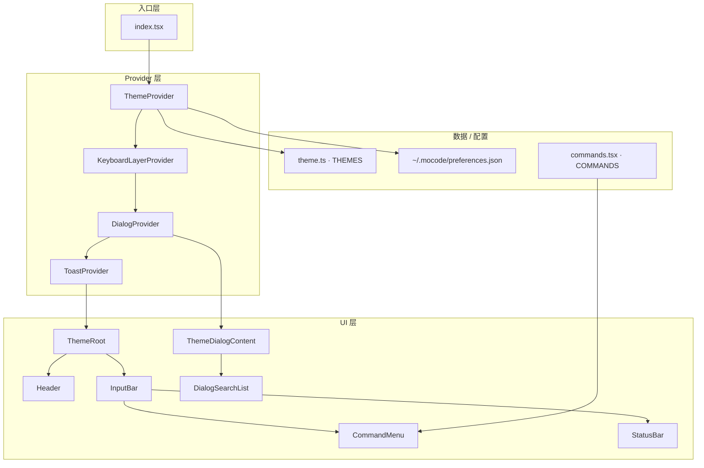
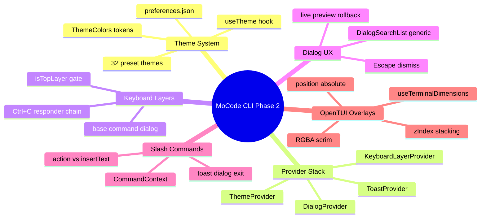
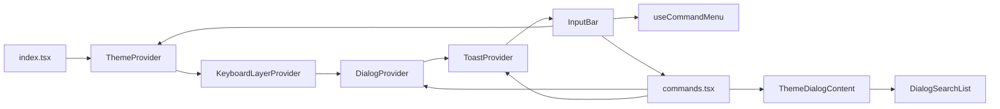
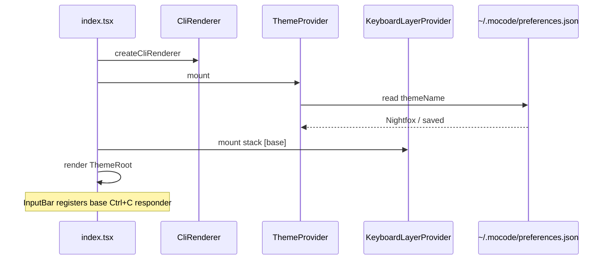
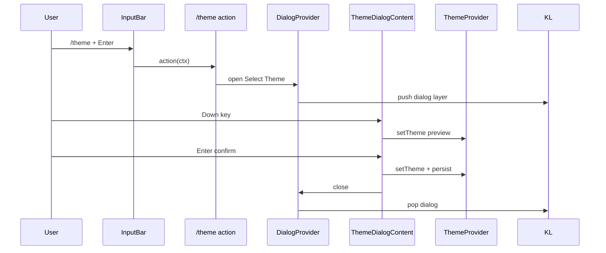
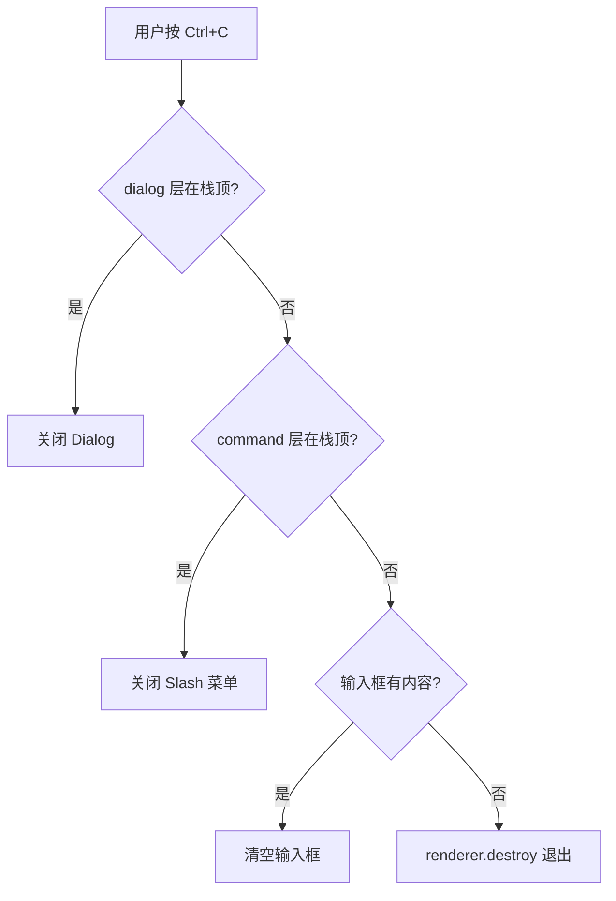
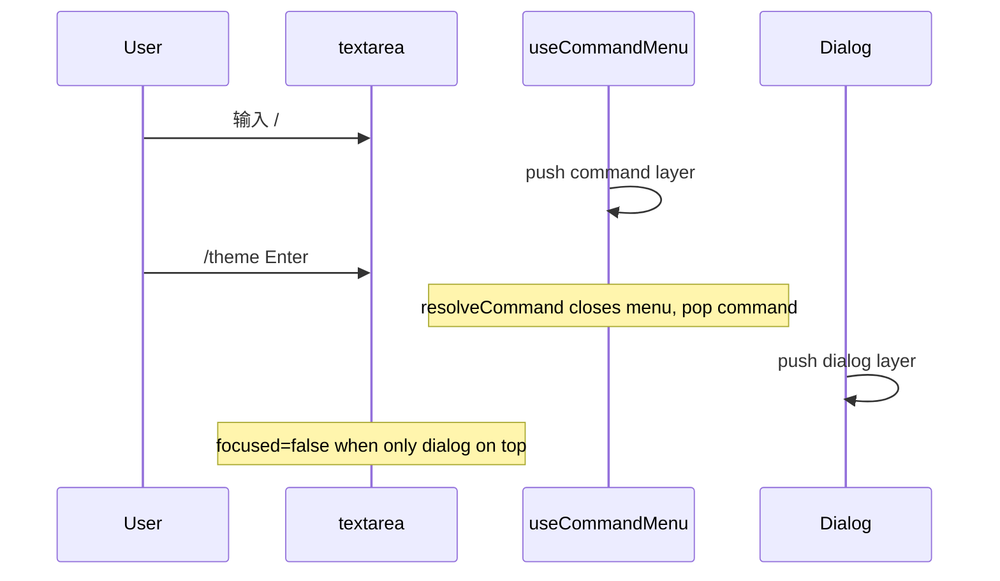

在 Phase 1 的输入框与 Slash 菜单之上，本阶段补齐 **可切换的 32 套配色主题**（持久化到 `~/.mocode/preferences.json`），并引入四层 **React Context Provider** 管理 **键盘焦点栈、模态对话框、Toast 通知**。Slash 命令通过统一的 `CommandContext` 调用 `toast` / `dialog` / `exit`；`/theme` 已实现带搜索、实时预览、取消回滚的主题选择器，其余命令以 Toast 或占位 Dialog 反馈。


---


## 目录

1. 背景与目标
2. 技术选型
3. 架构总览
4. 知识点思维导图
5. 模块与关键代码
6. 核心流程
7. 知识点详解（含官方文档与用法）
8. 文件索引
9. 开发与调试

---


## 1. 背景与目标


### 要做什么


| 能力                           | 状态 | 说明                                              |
| ---------------------------- | -- | ----------------------------------------------- |
| 主题 Token 与预设库                | ✅  | `theme.ts` 定义 32 套 `ThemeColors`，默认 Nightfox    |
| 主题持久化                        | ✅  | `ThemeProvider` 读写 `~/.mocode/preferences.json` |
| Provider 嵌套入口                | ✅  | `Theme → KeyboardLayer → Dialog → Toast`        |
| 键盘层栈（Ctrl+C 路由）              | ✅  | `base` / `command` / `dialog` 分层消费              |
| 模态 Dialog 壳层                 | ✅  | 半透明遮罩、Esc / 点击关闭、主题色 surface                    |
| Toast 通知                     | ✅  | success / error / info，3s 自动消失，同时仅一条            |
| Slash 命令上下文                  | ✅  | `CommandContext` 注入 `exit` / `toast` / `dialog` |
| `/theme` 主题选择器               | ✅  | 搜索、高亮预览、确认保存、Esc 回滚                             |
| 可复用 Dialog 列表                | ✅  | `DialogSearchList<T>` 泛型组件                      |
| UI 主题着色                      | ✅  | InputBar、CommandMenu、StatusBar、Dialog、Toast     |
| Agent / Model / Session 真实逻辑 | ⚠️ | Dialog 或 Toast 占位，未接后端                          |
| 消息提交与 AI 对话                  | ❌  | `onSubmit` 仍为空回调                                |


---


## 2. 技术选型


| 层级       | 选择                                   | 理由                                              |
| -------- | ------------------------------------ | ----------------------------------------------- |
| 全局 UI 状态 | **React Context + Provider 树**       | 与 OpenTUI/React 模型一致，overlay 可跨组件触发             |
| 主题数据     | **静态 TS 常量** **`THEMES[]`**          | 无运行时解析成本，类型安全                                   |
| 持久化      | **Node** **`fs`** **+ JSON**         | CLI 进程内同步读写，无需额外依赖                              |
| 键盘冲突     | **自研层栈** **`KeyboardLayerProvider`** | OpenTUI 无内置 modal focus；Ctrl+C 需按 overlay 优先级消费 |
| 对话框内容    | **组合式** **`DialogConfig.children`**  | 壳层与业务分离，`ThemeDialogContent` 可独立演进              |
| 列表 UI    | **泛型** **`DialogSearchList<T>`**     | Agent / Model 选择器可复用同一交互                        |


---


## 3. 架构总览


### 3.1 分层图





### 3.2 依赖方向（单向）


```plain text
theme.ts                    ← 纯数据，无 React 依赖

providers/theme             → theme.ts, node:fs
providers/keyboard-layer    → @opentui/react（useKeyboard, useRenderer）
providers/dialog            → keyboard-layer, theme, @opentui/react
providers/toast             → theme, @opentui/react

components/dialog-search-list → keyboard-layer, theme
components/dialogs/theme-dialog → dialog, theme, dialog-search-list, theme.ts
components/command-menu/*   → providers（经 types / input-bar 注入 context）
components/input-bar        → command-menu, 全部 providers
index.tsx                   → providers + components
```


**原则**：Provider 不 import 具体 Dialog 内容；Slash 命令注册表通过 `action(ctx)` 间接打开 Dialog，避免循环依赖。


---


## 4. 知识点思维导图





---


## 5. 模块与关键代码

> 
>
> Phase 2 像在聊天 App 里加了「设置主题」「弹窗选单」「右上角提示条」，并规定 **Ctrl+C 先关弹窗、再清输入、最后才退出**。
>
>

---


### 5.1 入口与 Provider 树 — `packages/cli/src/index.tsx`


**通俗说明**：启动时先套四层「全局服务」，最内层才是带主题背景色的主界面。


```typescript
// Provider 顺序：主题 token → 键盘栈 → 模态层 → Toast
function App() {
  return (
    <ThemeProvider>
      <KeyboardLayerProvider>
        <DialogProvider>
          <ToastProvider>
            <ThemeRoot />
          </ToastProvider>
        </DialogProvider>
      </KeyboardLayerProvider>
    </ThemeProvider>
  );
}

function ThemeRoot() {
  const { colors } = useTheme();
  return (
    <box backgroundColor={colors.background} /* ... */>
      <Header />
      <InputBar onSubmit={() => {}} />
    </box>
  );
}
```


| 关键点                      | 用人话说                                 |
| ------------------------ | ------------------------------------ |
| Theme 在最外层               | 所有子组件都能 `useTheme()`                 |
| KeyboardLayer 在 Dialog 外 | Dialog 打开时 push `dialog` 层，仍能访问栈 API |
| Toast 在最内层 Provider      | 渲染在 children 同级，盖在 UI 上方             |


---


### 5.2 主题 — `theme.ts` + `providers/theme/index.tsx`


**通俗说明**：32 套配色方案；用户选中的名字写入家目录配置文件，下次启动自动恢复。


```typescript
// theme.ts — 每套主题一组语义色
export type ThemeColors = {
  primary: string;
  background: string;
  surface: string;
  dialogSurface: string;
  selection: string;
  // ...
};

// ThemeProvider — 启动时读盘，切换时写盘
function getInitialTheme(): Theme {
  try {
    const preferences = JSON.parse(readFileSync(THEME_PREFERENCES_PATH, "utf8"));
    return THEMES.find((t) => t.name === preferences.themeName) ?? DEFAULT_THEME;
  } catch {
    return DEFAULT_THEME; // 首次运行或文件损坏 → Nightfox
  }
}

const setTheme = useCallback((theme: Theme) => {
  setCurrentTheme(theme);
  persistTheme(theme); // ~/.mocode/preferences.json
}, []);
```


| 关键点                        | 用人话说             |
| -------------------------- | ---------------- |
| `DEFAULT_THEME` = Nightfox | 无配置时的默认外观        |
| 只存 `themeName`             | 调色板仍以代码为准，改色只需发版 |
| `useTheme()` 抛错            | 防止在 Provider 外误用 |


---


### 5.3 键盘层栈 — `providers/keyboard-layer/index.tsx`


**通俗说明**：像一叠透明纸，最上面那层先处理 Ctrl+C；每层可登记「我处理完了，别退出程序」。


```typescript
// 栈初始为 ["base"]；command / dialog 打开时 push，关闭时 pop
useKeyboard((key) => {
  if (!key.ctrl || key.name !== "c") return;
  for (let i = stack.length - 1; i >= 0; i--) {
    const responder = responders.current.get(stack[i]!);
    if (responder?.()) return; // 返回 true = 已消费，不退出
  }
  renderer.destroy(); // 无人消费 → 退出应用
});
```


| 层 ID      | 谁 push     | Ctrl+C 行为               |
| --------- | ---------- | ----------------------- |
| `base`    | 常驻         | 输入框非空则清空                |
| `command` | Slash 菜单打开 | 关菜单（`use-command-menu`） |
| `dialog`  | Dialog 打开  | 关 Dialog                |


---


### 5.4 Dialog 壳层 — `providers/dialog/index.tsx`


**通俗说明**：全屏半透明遮罩 + 居中卡片；Esc 或点遮罩关闭。


```typescript
const open = useCallback((config: DialogConfig) => {
  setCurrentDialog(config);
  push("dialog", () => { close(); return true; }); // Ctrl+C 关弹窗
}, [close, push]);

// 仅顶层 dialog 层响应 Esc
useKeyboard((key) => {
  if (!currentDialog || !isTopLayer("dialog")) return;
  if (key.name === "escape") close();
});
```


---


### 5.5 Toast — `providers/toast/index.tsx`


**通俗说明**：右上角短提示；新 Toast 会替换旧的并重置计时器。


```typescript
const show = useCallback((options: ToastOptions) => {
  clearCurrentTimeout();
  setCurrentToast({ variant: options.variant ?? "info", ...options });
  timeoutHandleRef.current = setTimeout(() => setCurrentToast(null), duration).unref();
}, [clearCurrentTimeout]);
```


---


### 5.6 主题对话框 — `components/dialogs/theme-dialog.tsx`


**通俗说明**：打开时记住原主题；上下键预览配色；Enter 确认；Esc 关闭则恢复原主题。


```typescript
const originalThemeRef = useRef<Theme>(currentTheme);
const confirmedRef = useRef(false);

useEffect(() => {
  return () => {
    if (!confirmedRef.current) setTheme(originalThemeRef.current); // 取消回滚
  };
}, [setTheme]);

const handleSelect = (theme: Theme) => {
  setTheme(theme);
  confirmedRef.current = true;
  dialog.close();
};

const handleHighlight = (theme: Theme) => setTheme(theme); // 实时预览
```


---


### 5.7 可搜索列表 — `components/dialog-search-list.tsx`


**通俗说明**：Dialog 内的「搜索框 + 列表」；仅在 `dialog` 为顶层键盘层时响应方向键与 Enter。


```typescript
useKeyboard((key) => {
  if (!isTopLayer("dialog")) return;
  if (key.name === "return" || key.name === "enter") onSelect(filtered[selectedIndex]);
  else if (key.name === "up") { /* 滚动 + onHighlight */ }
  else if (key.name === "down") { /* ... */ }
});
```


---


### 5.8 Slash 命令 — `components/command-menu/commands.tsx`


**通俗说明**：命令不再只是插入文字；带 `action` 的可弹 Toast、开 Dialog 或退出。


```typescript
export type CommandContext = {
  exit: () => void;
  toast: ToastContextValue;
  dialog: DialogContextValue;
};

// /theme → 打开主题选择器
{
  name: "theme",
  action: (ctx) => {
    ctx.dialog.open({
      title: "Select Theme",
      children: <ThemeDialogContent />,
    });
  },
}
```


**InputBar 注入 context**：


```typescript
command.action({
  exit: () => renderer.destroy(),
  toast,
  dialog,
});
```


---


### 5.9 模块关系总览





| 模块                      | 一句话职责                 |
| ----------------------- | --------------------- |
| `theme.ts`              | 32 套预设配色与类型定义         |
| `ThemeProvider`         | 当前主题 state + 磁盘持久化    |
| `KeyboardLayerProvider` | overlay 键盘优先级与 Ctrl+C |
| `DialogProvider`        | 模态壳 + open/close API  |
| `ToastProvider`         | 临时通知 show API         |
| `DialogSearchList`      | Dialog 内搜索列表 UI       |
| `ThemeDialogContent`    | `/theme` 业务内容         |
| `commands.tsx`          | Slash 命令注册与 action    |


---


## 6. 核心流程


### 6.1 应用启动与 Provider 初始化





### 6.2 `/theme` 选择与预览





### 6.3 Ctrl+C 消费链





### 6.4 Slash 菜单与 Dialog 焦点





---


## 7. 知识点详解（含官方文档与用法）

> 每节含：**官方文档链接 · API/用法 · MoCode 落点**

### 7.1 React Context Provider 组合


| 概念          | 说明                          | 参考                                                                              |
| ----------- | --------------------------- | ------------------------------------------------------------------------------- |
| Context     | 跨层传递 state，避免 prop drilling | [React Context](https://react.dev/reference/react/createContext)                |
| Provider 嵌套 | 外层提供基础能力，内层消费               | [Passing data deeply](https://react.dev/learn/passing-data-deeply-with-context) |


多个 Provider 时，**顺序即依赖关系**：Theme 不依赖 Dialog；Dialog 依赖 KeyboardLayer 的 `push/pop`。


**MoCode 落点**：`packages/cli/src/index.tsx` — `App` 组件树


---


### 7.2 OpenTUI `useKeyboard` 与焦点


| 概念                     | 说明                       | 参考                                                    |
| ---------------------- | ------------------------ | ----------------------------------------------------- |
| `useKeyboard`          | 组件内注册按键回调                | [OpenTUI React](https://github.com/anomalyco/opentui) |
| `key.preventDefault()` | 阻止默认行为（如 Esc 冒泡）         | 同库文档                                                  |
| `focused` prop         | 控制 textarea/input 是否接收输入 | Textarea / Input renderable                           |


**MoCode 落点**：

- `providers/keyboard-layer/index.tsx` — 全局 Ctrl+C
- `use-command-menu.ts` — 菜单 Esc/↑/↓
- `dialog-search-list.tsx` — 列表导航
- `input-bar.tsx` — `focused={isTopLayer("base") || isTopLayer("command")}`

---


### 7.3 绝对定位 Overlay


| 概念                      | 说明        | 参考                         |
| ----------------------- | --------- | -------------------------- |
| `position="absolute"`   | 相对父容器叠层   | OpenTUI layout props       |
| `zIndex`                | 控制绘制顺序    | CommandMenu=10, Dialog=100 |
| `RGBA.fromInts`         | 半透明遮罩     | `@opentui/core`            |
| `useTerminalDimensions` | 随终端尺寸全屏遮罩 | `@opentui/react`           |


**MoCode 落点**：`providers/dialog/index.tsx`、`providers/toast/index.tsx`、`input-bar.tsx`（CommandMenu 浮层）


---


### 7.4 Node.js 同步文件 IO


| 概念                               | 说明                | 参考                                           |
| -------------------------------- | ----------------- | -------------------------------------------- |
| `readFileSync` / `writeFileSync` | 启动时读配置、切换主题时写配置   | [Node.js fs](https://nodejs.org/api/fs.html) |
| `mkdirSync({ recursive: true })` | 确保 `~/.mocode` 存在 | 同上                                           |


**MoCode 落点**：`providers/theme/index.tsx` — `getInitialTheme` / `persistTheme`


---


### 7.5 泛型列表组件模式


| 概念                                | 说明           | 参考                  |
| --------------------------------- | ------------ | ------------------- |
| `<T>` + `filterFn` / `renderItem` | 数据与展示分离      | TypeScript Generics |
| 受控 `selectedIndex`                | 键盘与鼠标共用同一选中态 | React 受控组件          |


**MoCode 落点**：`components/dialog-search-list.tsx` — 未来 `/agents`、`/models` 可传入不同 `T`


---


### 7.6 知识点 ↔︎ 源码 ↔︎ 文档 速查表


| #   | 知识点              | 文件                                                         | 官方文档                                                                        |
| --- | ---------------- | ---------------------------------------------------------- | --------------------------------------------------------------------------- |
| 7.1 | Context Provider | `index.tsx`, `providers/*`                                 | [react.dev Context](https://react.dev/reference/react/createContext)        |
| 7.2 | useKeyboard      | `keyboard-layer`, `use-command-menu`, `dialog-search-list` | [OpenTUI](https://github.com/anomalyco/opentui)                             |
| 7.3 | Overlay 布局       | `dialog/index.tsx`, `toast/index.tsx`                      | OpenTUI layout                                                              |
| 7.4 | 配置持久化            | `providers/theme/index.tsx`                                | [Node fs](https://nodejs.org/api/fs.html)                                   |
| 7.5 | 泛型 Dialog 列表     | `dialog-search-list.tsx`                                   | [TS Generics](https://www.typescriptlang.org/docs/handbook/2/generics.html) |


---


## 8. 文件索引


| 文件                                            | 层级       | 一句话                          |
| --------------------------------------------- | -------- | ---------------------------- |
| `packages/cli/src/index.tsx`                  | 入口       | Provider 树 + ThemeRoot 布局    |
| `packages/cli/src/theme.ts`                   | 数据       | 32 套 Theme 预设与 DEFAULT_THEME |
| `providers/theme/index.tsx`                   | Provider | 主题 state、持久化、useTheme        |
| `providers/keyboard-layer/index.tsx`          | Provider | 键盘层栈与 Ctrl+C 链               |
| `providers/dialog/index.tsx`                  | Provider | 模态壳层 open/close              |
| `providers/dialog/types.ts`                   | 类型       | DialogConfig                 |
| `providers/toast/index.tsx`                   | Provider | Toast 展示与 auto-dismiss       |
| `providers/toast/type.ts`                     | 类型       | ToastOptions、ToastVariant    |
| `components/dialog-search-list.tsx`           | UI       | 可搜索、可键盘导航的 Dialog 列表         |
| `components/dialogs/theme-dialog.tsx`         | UI       | /theme 内容与预览回滚逻辑             |
| `components/dialogs/index.tsx`                | UI       | dialogs 导出入口                 |
| `components/command-menu/commands.tsx`        | 逻辑       | Slash 命令注册表与 action          |
| `components/command-menu/types.ts`            | 类型       | Command、CommandContext       |
| `components/command-menu/use-command-menu.ts` | Hook     | 菜单 + command 键盘层             |
| `components/command-menu/index.tsx`           | UI       | 菜单渲染（主题 selection 色）         |
| `components/input-bar.tsx`                    | UI       | 注入 CommandContext、主题边框色      |
| `components/status-bar.tsx`                   | UI       | 状态栏主题色                       |


---


## 9. 开发与调试


### 启动


```bash
# 仓库根目录
bun install
bun run dev:cli
```


### 环境/配置


| 路径                           | 说明                                        |
| ---------------------------- | ----------------------------------------- |
| `~/.mocode/preferences.json` | `{"themeName":"Nightfox"}` 等形式；删文件可恢复默认主题 |


### 手动验证清单


| 操作                      | 期望结果                                  |
| ----------------------- | ------------------------------------- |
| 输入 `/theme` + Enter     | 打开主题 Dialog，背景变暗                      |
| Dialog 内 ↑/↓            | 界面配色实时变化                              |
| Enter 选中                | 关闭 Dialog，重启 CLI 仍为新主题                |
| Esc 关闭 Dialog           | 配色恢复打开前主题                             |
| `/new`                  | 右上角 Toast「Starting new conversation…」 |
| `/exit`                 | 退出 CLI                                |
| 输入 `/` 打开菜单后 Ctrl+C     | 菜单关闭，应用不退出                            |
| Dialog 打开时 Ctrl+C       | Dialog 关闭，应用不退出                       |
| 输入文字后 Ctrl+C（无 overlay） | 文字清空                                  |
| 空输入 Ctrl+C              | 应用退出                                  |


### 调试 checklist


| 现象                                           | 排查                                                    |
| -------------------------------------------- | ----------------------------------------------------- |
| `useTheme must be used within ThemeProvider` | 组件是否在 `ThemeProvider` 外渲染                             |
| Dialog 内方向键无效                                | `isTopLayer("dialog")` 是否为 true；是否有多层 overlay         |
| 主题未持久化                                       | 检查 `~/.mocode` 写权限与 `preferences.json`                |
| Ctrl+C 直接退出                                  | 对应层是否 `push` 了 responder；输入框是否为空                      |
| Toast 不消失                                    | `setTimeout` 是否被进程阻塞；检查 `duration`                    |
| 取消主题仍被改掉                                     | `ThemeDialogContent` unmount 回滚是否触发（勿在 DevTools 强杀进程） |