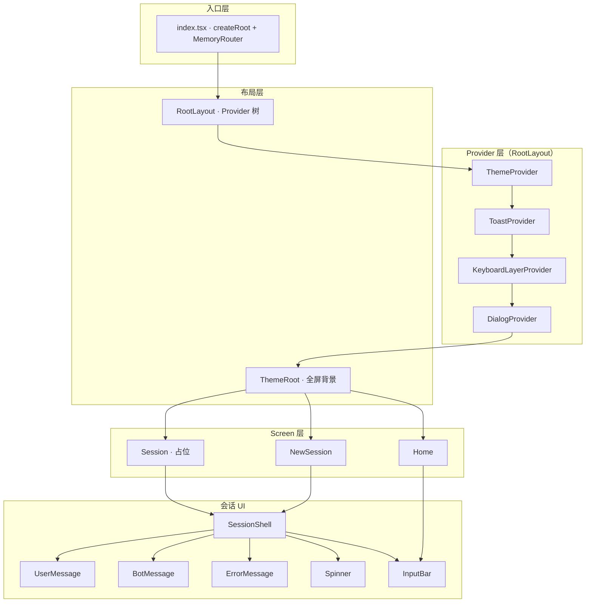
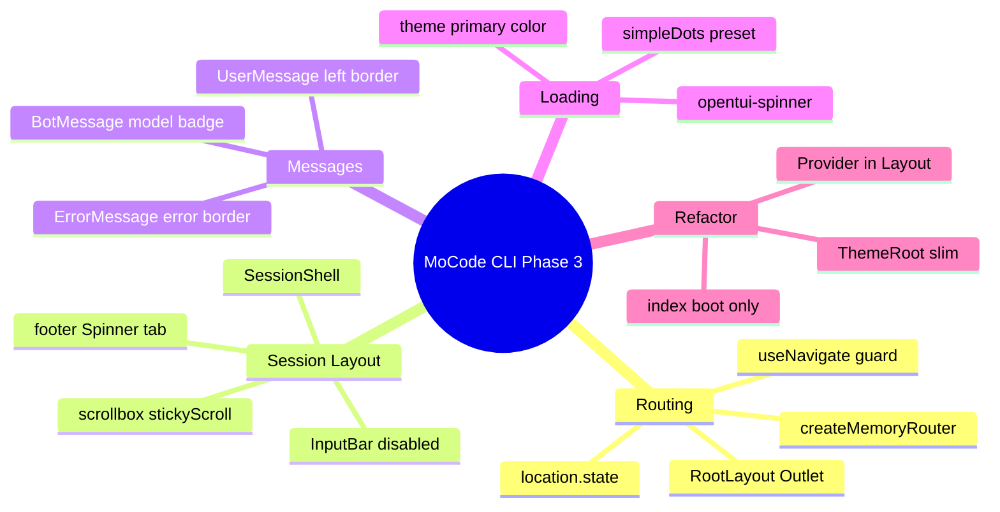
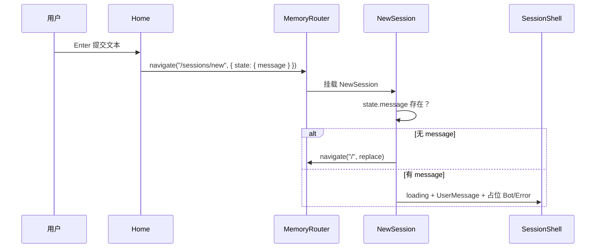
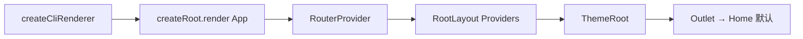

在 Phase 2 的单页 Provider 壳层之上，本阶段引入 **React Router Memory Router**，将 CLI 拆为 **Home / NewSession / Session** 三个 Screen，并把 Provider 树迁入 **`RootLayout`**。新增可复用的 **`SessionShell`**（消息区 `scrollbox` + 底部 `InputBar` + 状态栏占位），以及 **`UserMessage`** **/** **`BotMessage`** **/** **`ErrorMessage`** 三类消息组件与 **`opentui-spinner`** 加载动画。Home 输入提交后会携带 `location.state` 导航到 `/sessions/new` 展示「创建会话中」的占位 UI；真实 Session API、Slash 命令与路由联动尚未完成。


---


## 目录

1. 背景与目标
2. 技术选型
3. 架构总览
4. 知识点思维导图
5. 模块与关键代码
6. 核心流程
7. 知识点详解（含官方文档与用法）
8. 文件索引
9. 开发与调试

---


## 1. 背景与目标


### 要做什么


| 能力                      | 状态 | 说明                                            |
| ----------------------- | -- | --------------------------------------------- |
| Memory Router 路由表       | ✅  | `/`、`/sessions/new`、`/sessions/:id`           |
| Provider 树迁入 Layout     | ✅  | `RootLayout` 包裹 `Outlet`，`index.tsx` 只负责 boot |
| `ThemeRoot` 抽离          | ✅  | 仅负责全屏背景色，不再内嵌 Header / InputBar               |
| Home 屏                  | ✅  | 居中 Header + InputBar，提交后导航到 NewSession        |
| `SessionShell` 会话壳      | ✅  | 消息滚动区 + InputBar + 底部 loading / tab 占位        |
| 消息组件 User / Bot / Error | ✅  | 主题色边框与 surface 背景                             |
| 加载 Spinner              | ✅  | `opentui-spinner` · `simpleDots`              |
| NewSession 占位流          | ⚠️ | 展示 User + Bot + Error 静态组合，无真实 API            |
| Session 详情屏             | ⚠️ | `session.tsx` 仍为占位，待接消息列表                     |
| Slash `/new` 与路由联动      | ❌  | 命令仍 Toast，未 `navigate`                        |
| 真实 Session 创建 / 存储      | ❌  | 无后端调用                                         |


### 非目标（本阶段不做）

- Session 持久化、列表 API、`/sessions` 真实数据
- 流式 Bot 回复、工具调用消息类型
- Tab / Agent 切换交互（底部仅文案占位）
- 单元测试与 E2E

---


## 2. 技术选型


| 层级          | 选择                                                   | 理由                                             |
| ----------- | ---------------------------------------------------- | ---------------------------------------------- |
| 路由          | **React Router 7 ·** **`createMemoryRouter`**        | TUI 无 URL 栏；内存路由足够，且与 React 19 生态一致            |
| 跨屏传参        | **`location.state`**                                 | Home 首条用户消息无需写入 URL；刷新即丢符合 CLI 会话语义            |
| 布局复用        | **`SessionShell`** **组合组件**                          | NewSession / Session 共用同一聊天区 + 输入区结构           |
| 消息区滚动       | **OpenTUI** **`scrollbox`** **+** **`stickyScroll`** | 新消息追加时贴底，符合聊天 UX                               |
| 加载指示        | **`opentui-spinner`**                                | 与 OpenTUI 原生 `<spinner>` 元素集成，主题色可配            |
| Provider 位置 | **`RootLayout`** **单点挂载**                            | 所有 Screen 共享 Theme / Toast / Keyboard / Dialog |


### Provider 顺序变更（相对 Phase 2）


Phase 2 入口顺序：`Theme → Keyboard → Dialog → Toast`


Phase 3 `RootLayout` 顺序：`Theme → Toast → Keyboard → Dialog`


Toast 提前到 Keyboard 外层，Dialog 最内。当前 Screen 未暴露顺序相关 bug；若 Dialog 与 Toast 同时出现，需回归 Ctrl+C / Esc 行为。


---


## 3. 架构总览


### 3.1 分层图





### 3.2 依赖方向（单向）


```plain text
index.tsx              → react-router, layouts, screens, terminal-*

layouts/root-layout    → providers/*, theme-root, react-router Outlet
layouts/theme-root     → providers/theme

screens/home           → input-bar, header, react-router
screens/new-session    → session-shell, messages/*, react-router, theme
screens/session        → session-shell（占位）

components/session-shell → input-bar, spinner
components/messages/*  → theme, border
components/spinner     → opentui-spinner/react, theme

components/input-bar   → command-menu, providers（Phase 1/2 不变）
```


**原则**：Screen 只组合布局与消息组件，不直接操作 Provider 注册；Slash 命令仍经 `InputBar` 注入的 `CommandContext` 工作。


---


## 4. 知识点思维导图





---


## 5. 模块与关键代码

> 
>
> Phase 3 把「一个固定首页」拆成「首页 → 创建会话页 → 会话详情页」三条路，并搭好聊天窗口的架子（消息区、输入框、加载动画），但 AI 回复和存会话还没接上。
>
>

---


### 5.1 入口 — `packages/cli/src/index.tsx`


**通俗说明**：只负责启动终端渲染器和注册路由，不再内嵌 Provider 与页面 UI。


```typescript
const router = createMemoryRouter([
  {
    path: "/",
    element: <RootLayout />,
    children: [
      { index: true, element: <Home /> },
      { path: "sessions/new", element: <NewSession /> },
      { path: "sessions/:id", element: <Session /> },
    ],
  },
]);

function App() {
  return <RouterProvider router={router} />;
}
```


| 关键点                   | 用人话说                     |
| --------------------- | ------------------------ |
| Memory Router         | 路由在内存里变，不依赖浏览器地址栏        |
| `RootLayout` 作 parent | 所有页面共享同一套主题 / 弹窗 / Toast |


---


### 5.2 根布局 — `layouts/root-layout.tsx` + `layouts/theme-root.tsx`


**通俗说明**：外层套全局服务，内层 `ThemeRoot` 铺背景色，中间 `Outlet` 换页面。


```typescript
// root-layout.tsx
export function RootLayout() {
  return (
    <ThemeProvider>
      <ToastProvider>
        <KeyboardLayerProvider>
          <DialogProvider>
            <ThemeRoot>
              <Outlet />
            </ThemeRoot>
          </DialogProvider>
        </KeyboardLayerProvider>
      </ToastProvider>
    </ThemeProvider>
  );
}

// theme-root.tsx — Phase 3 瘦身：仅 background + 100% 尺寸
export function ThemeRoot({ children }: Props) {
  const { colors } = useTheme();
  return (
    <box backgroundColor={colors.background} width="100%" height="100%" flexGrow={1}>
      {children}
    </box>
  );
}
```


---


### 5.3 Home — `screens/home.tsx`


**通俗说明**：与 Phase 1/2 视觉类似（居中 Logo + 输入框），但提交后会「跳转」而不是空回调。


```typescript
const handleSubmit = useCallback((text: string) => {
  navigate("/sessions/new", { state: { message: text } });
}, [navigate]);
```


---


### 5.4 NewSession — `screens/new-session.tsx`


**通俗说明**：没有携带首条消息就回首页；有消息则进入 SessionShell，输入禁用并显示 loading。


```typescript
useEffect(() => {
  if (!state?.message) {
    navigate("/", { replace: true });
  }
}, [state, navigate]);

return (
  <SessionShell onSubmit={() => {}} inputDisabled loading>
    <UserMessage message={state.message} />
    <BotMessage content="Creating session..." model="system" />
    <ErrorMessage message="Error creating session" />
  </SessionShell>
);
```


| 关键点                         | 说明                                        |
| --------------------------- | ----------------------------------------- |
| `replace: true` 回退          | 防止空 state 时用户 Back 卡在无效页                  |
| 同时渲染 Error                  | **仅为 UI 预览**；接 API 后应按 success/error 分支渲染 |
| `loading` + `inputDisabled` | 创建过程中禁止重复提交                               |


---


### 5.5 SessionShell — `components/session-shell.tsx`


**通俗说明**：聊天 App 的标准三区——上面滚消息，中间输入，下面状态条。


```typescript
<scrollbox flexGrow={1} width="100%" stickyScroll stickyStart="bottom">
  <box gap={1}>{children}</box>
</scrollbox>
<box flexShrink={0}>
  <InputBar onSubmit={onSubmit} disabled={inputDisabled} />
</box>
<box flexShrink={0} flexDirection="row" justifyContent="space-between" /* ... */>
  {loading ? <Spinner /> : null}
  {/* TODO: tab navigation */}
  <text>tab</text>
  <text attributes={TextAttributes.DIM}>agent</text>
</box>
```


| Prop            | 作用                     |
| --------------- | ---------------------- |
| `loading`       | 左下角显示 Spinner          |
| `inputDisabled` | 传给 InputBar `disabled` |
| `children`      | 消息列表内容                 |


---


### 5.6 消息组件 — `components/messages/*`


**通俗说明**：三种气泡样式，均使用主题 token 与 `EmptyBorder` 左侧竖线。


| 组件             | 视觉                           | 用途   |
| -------------- | ---------------------------- | ---- |
| `UserMessage`  | 左 `primary` 竖线 + `surface` 底 | 用户输入 |
| `BotMessage`   | 左对齐正文 + `◉ model` 行          | 助手回复 |
| `ErrorMessage` | 左 `error` 竖线 + DIM 文案        | 错误提示 |


```typescript
// user-message.tsx — 左侧强调线
<box border={["left"]} borderColor={colors.primary} customBorderChars={{ ...EmptyBorder, vertical: "┃" }}>
  <box backgroundColor={colors.surface} paddingX={2} paddingY={1}>
    <text>{message}</text>
  </box>
</box>
```


---


### 5.7 Spinner — `components/spinner.tsx`


```typescript
import "opentui-spinner/react";

export function Spinner() {
  const { colors } = useTheme();
  return <spinner name="simpleDots" color={colors.primary} />;
}
```


Side-effect import 注册 OpenTUI 自定义元素；`name` 对应 `cli-spinners` 预设（当前使用 `simpleDots`，非 `bluePulse` / `layer` / `hearts`）。


---


## 6. 核心流程


### 6.1 Home 首条消息 → NewSession





### 6.2 应用启动





### 6.3 Session 详情（目标态，未实现）


```plain text
/sessions/:id → 拉取 session → SessionShell(children=消息列表) → InputBar 可提交
```


当前 `Session` Screen 仍为占位，见 §10。


---


## 7. 知识点详解（含官方文档与用法）


### 7.1 React Router Memory Router


| 概念                   | 说明                                   | 参考                                                                                         |
| -------------------- | ------------------------------------ | ------------------------------------------------------------------------------------------ |
| `createMemoryRouter` | 内存 history，适合 Electron / TUI / 测试    | [React Router Memory Router](https://reactrouter.com/en/main/routers/create-memory-router) |
| `RouterProvider`     | 将 router 注入 React 树                  | 同上                                                                                         |
| Nested routes        | parent `element` + `Outlet` 渲染 child | [Routing 嵌套路由](https://reactrouter.com/en/main/start/tutorial)                             |
| `location.state`     | 导航时附带非 URL 数据                        | [useLocation](https://reactrouter.com/en/main/hooks/use-location)                          |


**MoCode 落点**：`index.tsx` 路由表；`home.tsx` / `new-session.tsx` 的 `navigate` / `useLocation`


**注意**：Memory Router 刷新进程后 state 丢失；CLI 重启应重新从 Home 开始，符合预期。


---


### 7.2 OpenTUI scrollbox 贴底滚动


| 概念                     | 说明                |
| ---------------------- | ----------------- |
| `stickyScroll`         | 内容增高时保持滚动位置策略     |
| `stickyStart="bottom"` | 新内容从底部追加时跟随（聊天场景） |


**MoCode 落点**：`session-shell.tsx` 消息区


**参考**：[OpenTUI](https://github.com/anomalyco/opentui) layout / scrollbox 文档


---


### 7.3 opentui-spinner


| 概念                               | 说明                      |
| -------------------------------- | ----------------------- |
| `import "opentui-spinner/react"` | 注册 `<spinner>` 自定义元素    |
| `name`                           | 映射 `cli-spinners` 动画名   |
| `color`                          | 帧颜色，绑定 `colors.primary` |


**MoCode 落点**：`components/spinner.tsx` · `SessionShell` loading 区


**可选预设**（`cli-spinners`）：`simpleDots`（当前）、`bluePulse`、`layer`、`hearts` 等，改 `name` 即可切换。


---


### 7.4 组合式会话壳（Session Shell Pattern）


| 概念                          | 说明                      |
| --------------------------- | ----------------------- |
| Shell + children            | 布局固定，内容页只填 messages     |
| `inputDisabled` / `loading` | 同一壳层表达「创建中 / 只读 / 可聊」状态 |


**MoCode 落点**：`SessionShell` — 后续 Session 详情、重试流共用


---


### 7.5 知识点 ↔︎ 源码 ↔︎ 文档 速查表


| #   | 知识点           | 文件                       | 官方文档                                                                     |
| --- | ------------- | ------------------------ | ------------------------------------------------------------------------ |
| 7.1 | Memory Router | `index.tsx`, `screens/*` | [React Router](https://reactrouter.com/)                                 |
| 7.2 | scrollbox 贴底  | `session-shell.tsx`      | [OpenTUI](https://github.com/anomalyco/opentui)                          |
| 7.3 | Spinner 元素    | `spinner.tsx`            | opentui-spinner / cli-spinners                                           |
| 7.4 | 消息气泡布局        | `messages/*`             | OpenTUI box / border                                                     |
| 7.5 | Layout Outlet | `root-layout.tsx`        | [React Router Outlet](https://reactrouter.com/en/main/components/outlet) |


---


## 8. 文件索引


| 文件                                      | 层级     | 一句话                                 |
| --------------------------------------- | ------ | ----------------------------------- |
| `packages/cli/src/index.tsx`            | 入口     | Renderer 启动 + Memory Router         |
| `layouts/root-layout.tsx`               | 布局     | Provider 树 + Outlet                 |
| `layouts/theme-root.tsx`                | 布局     | 全屏主题背景容器                            |
| `screens/home.tsx`                      | Screen | 首页 Header + InputBar，提交导航           |
| `screens/new-session.tsx`               | Screen | 创建会话占位 UI + state 守卫                |
| `screens/session.tsx`                   | Screen | 会话详情占位（待实现）                         |
| `components/session-shell.tsx`          | UI     | 会话三区布局壳                             |
| `components/spinner.tsx`                | UI     | opentui-spinner 封装                  |
| `components/messages/user-message.tsx`  | UI     | 用户消息气泡                              |
| `components/messages/bot-message.tsx`   | UI     | Bot 消息 + model 标记                   |
| `components/messages/error-message.tsx` | UI     | 错误消息气泡                              |
| `components/messages/index.tsx`         | UI     | messages barrel export              |
| `packages/cli/package.json`             | 配置     | 新增 `react-router`、`opentui-spinner` |


---


## 9. 开发与调试


### 启动


```bash
# 仓库根目录
bun install
bun run dev:cli
```


### 分支


```bash
git checkout moyunzero/feat/cli-phase3-session-ui
```


### 手动验证清单


| 操作                            | 期望结果                                          |
| ----------------------------- | --------------------------------------------- |
| 启动 CLI                        | 显示 Home（居中 Header + 输入框）                      |
| Home 输入文字 Enter               | 进入 NewSession，见 UserMessage 与 loading Spinner |
| 直接访问 `/sessions/new`（无 state） | 被 `replace` 回 Home                            |
| NewSession 界面                 | InputBar 禁用；左下 Spinner 转动                     |
| `/theme` 等 Slash 命令           | 仍可用（InputBar 未移除 CommandMenu）                 |
| `/new` Slash                  | 仍 Toast，**不会**导航（已知限制）                        |


### 调试 checklist


| 现象                 | 排查                                                        |
| ------------------ | --------------------------------------------------------- |
| 提交后闪回 Home         | `location.state.message` 是否丢失；检查 `navigate` 第二个参数         |
| Spinner 不显示        | `loading` prop 是否为 true；`opentui-spinner/react` 是否 import |
| 消息区不贴底             | `scrollbox` 是否设 `stickyScroll` + `stickyStart="bottom"`   |
| Provider hook 报错   | Screen 是否在 `RootLayout` 的 `Outlet` 下渲染                    |
| Dialog / Ctrl+C 异常 | 对比 Phase 2 Provider 顺序变更是否影响键盘层                           |


---


---


## 附录：路由一览


| 路径              | Screen       | 说明                         |
| --------------- | ------------ | -------------------------- |
| `/`             | `Home`       | 默认入口                       |
| `/sessions/new` | `NewSession` | 需 `location.state.message` |
| `/sessions/:id` | `Session`    | 占位，待接详情                    |


## 附录：新增依赖


| 包                 | 版本      | 用途                      |
| ----------------- | ------- | ----------------------- |
| `react-router`    | ^7.17.0 | Memory Router、Screen 导航 |
| `opentui-spinner` | ^0.0.7  | TUI `<spinner>` 动画      |


---