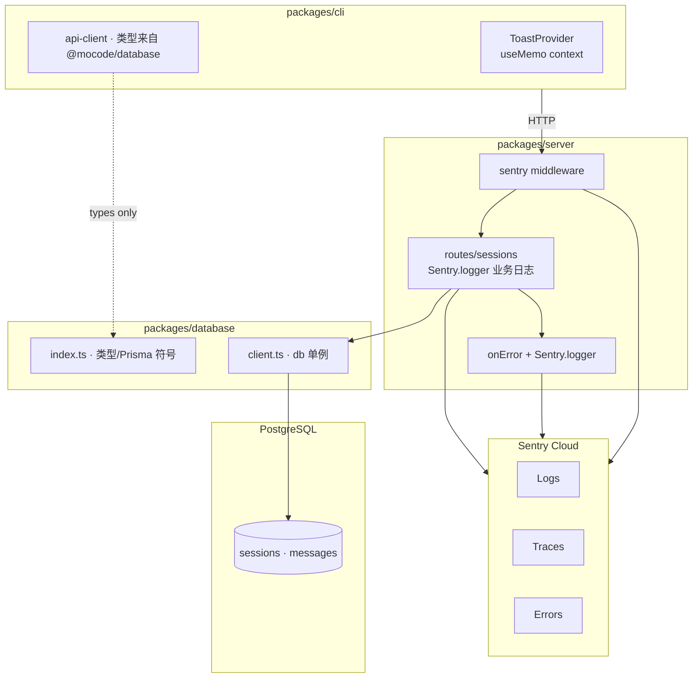
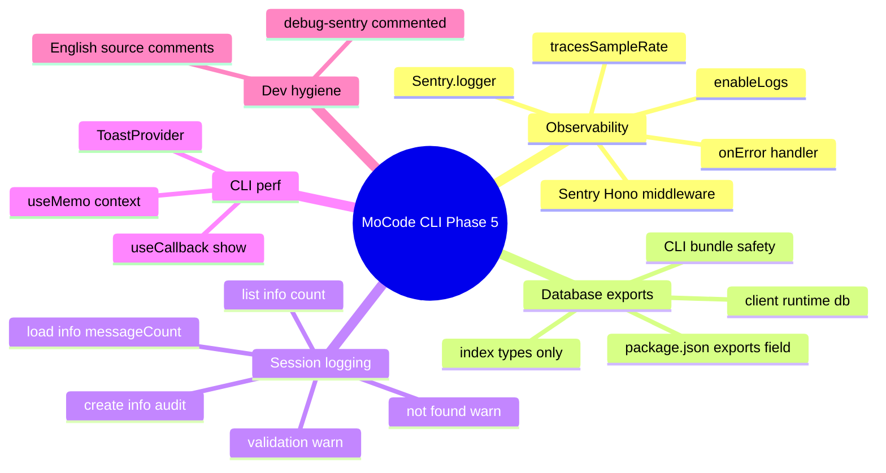
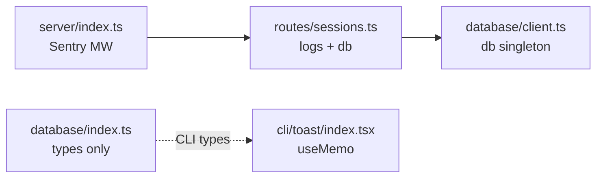
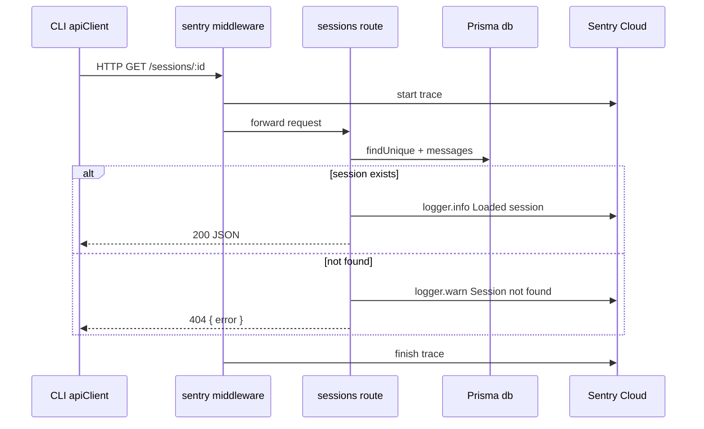
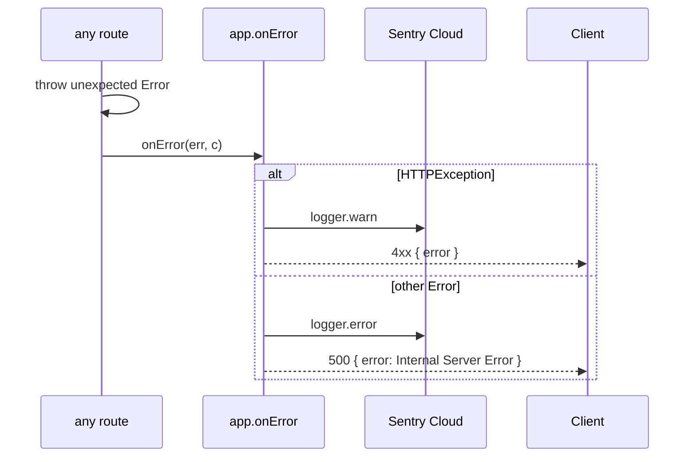
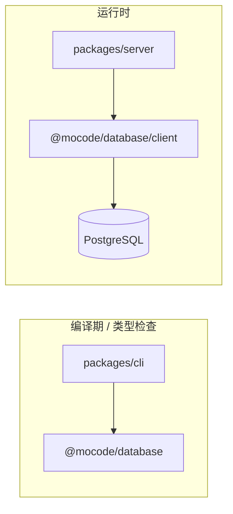

Phase 4 的 Session API 在本阶段补上 **生产可观测性**：Server 接入 **Sentry 中间件**（请求追踪、错误上报、结构化日志），Session 路由在列表 / 加载 / 创建 / 校验失败等关键路径写入 **`Sentry.logger`**。同时将 **`@mocode/database`** **拆成类型入口与运行时 Client 两个 export**，避免 CLI 为 Hono RPC 类型而误拉 Prisma 运行时。CLI 侧仅 **`ToastProvider`** **用** **`useMemo`** **稳定 Context 引用**，减少无关重渲染。流式 Chat、认证、Session 列表 UI 仍未实现。


---


## 目录

1. 背景与目标
2. 技术选型
3. 架构总览
4. 知识点思维导图
5. 模块与关键代码
6. 核心流程
7. 知识点详解（含官方文档与用法）
8. 文件索引
9. 开发与调试

---


## 1. 背景与目标


### 要做什么


| 能力                           | 状态 | 说明                                     |
| ---------------------------- | -- | -------------------------------------- |
| Sentry 中间件接入 Hono            | ✅  | `sentry()` 注册于所有路由之前                   |
| 全局 `onError` 结构化日志           | ✅  | 4xx → `warn`；未捕获异常 → `error`           |
| Session API 业务日志             | ✅  | list / get / create / validation / 404 |
| `@mocode/database/client` 分包 | ✅  | 运行时 `db` 与类型入口分离                       |
| `@mocode/database` 主入口仅类型    | ✅  | 不再 re-export `db`                      |
| Toast Context `useMemo`      | ✅  | 稳定 `{ show }` 引用                       |
| Sentry 依赖安装                  | ✅  | `@sentry/bun` · `@sentry/hono`         |
| DSN 环境变量化                    | ❌  | 当前硬编码于 `index.ts`                      |
| 生产采样率调优                      | ❌  | `tracesSampleRate: 1.0` 仅适合开发          |
| 流式 Chat / 新消息 API            | ❌  | 非本 Phase 范围                            |
| 用户认证                         | ❌  | 日志仍带 `mock-user`                       |


### 非目标（本阶段不做）

- LLM 调用与 SSE 流式回复
- Session 列表 UI 或 Slash 历史入口
- OAuth / JWT / 用户表
- 将 Sentry DSN 迁入 CI / 密钥管理（仅记录待办）
- 为 CLI 增加 Sentry SDK（仅 Server 侧观测）
- 修改 Session API 契约或 Prisma Schema

---


## 2. 技术选型


| 层级            | 选择                                               | 理由                                       |
| ------------- | ------------------------------------------------ | ---------------------------------------- |
| 错误与追踪         | **Sentry 10 +** **`@sentry/hono/bun`**           | 官方 Bun/Hono 集成；与现有 Hono 栈一致              |
| 结构化日志         | **`Sentry.logger`** **+** **`enableLogs: true`** | 与 Trace / Error 同一项目；Session 路由可打业务字段    |
| 数据库 Client 导出 | **`@mocode/database/client`** **子路径**            | CLI 用 `@mocode/database` 仅取类型，不打包 Prisma |
| CLI 渲染优化      | **React** **`useMemo`** **on Context value**     | 改动最小；`show` 已由 `useCallback` 稳定          |
| 调试路由          | **注释保留** **`/debug-sentry`**                     | 初次接入验证后可注释，避免生产误暴露                       |


---


## 3. 架构总览


### 3.1 分层图





### 3.2 依赖方向（单向）


```plain text
packages/cli
  → @mocode/database（类型 / 枚举，运行时无 db）
  → @mocode/server（devDependency，AppType）

packages/server
  → @mocode/database/client（运行时 db）
  → @mocode/database/enums
  → @sentry/hono, @sentry/bun

packages/database
  index.ts    → generated/prisma（类型）
  client.ts   → PrismaClient + adapter-pg（运行时）
```


**原则**：CLI 永不 import `@mocode/database/client`；Server 是唯一持有 `db` 的进程。


---


## 4. 知识点思维导图





---


## 5. 模块与关键代码

> 
>
> Phase 4 搭好了「存聊天记录的后台」。Phase 5 给后台装了「黑匣子」：谁在什么时候创建了会话、查不到会话、或服务器出错，都会记到 Sentry，方便排查。同时把数据库连接代码和「类型说明书」分开打包，避免终端界面误带上整个数据库驱动。
>
>

---


### 5.1 Sentry 中间件 — `packages/server/src/index.ts`


**通俗说明**：每个 HTTP 请求进 Server 时，先经过 Sentry 记录轨迹；出错时统一写日志并返回 JSON 错误。


```typescript
// Capture request traces, errors, and structured logs for the Bun server.
app.use(
    sentry(app, {
      dsn: "...",
      tracesSampleRate: 1.0,  // 开发全采样；生产应调低
      enableLogs: true,       // 开启 Sentry.logger
    }),
);

app.onError((err, c) => {
    if (err instanceof HTTPException) {
        // 4xx 预期错误 → warn，避免污染 Error 面板
        Sentry.logger.warn("Handle HTTP error", { status, path, method, ... });
        return c.json({ error: err.message || "Request failed" }, err.status);
    }
    // 未捕获异常 → error + 500
    Sentry.logger.error("Unhandled error", { message, path, method });
    return c.json({ error: "Internal Server Error" }, 500);
});
```


| 关键点                     | 用人话说                       |
| ----------------------- | -------------------------- |
| `sentry(app, …)` 必须在路由前 | 否则 Trace 覆盖不全              |
| `enableLogs: true`      | 否则 `Sentry.logger.*` 不上报   |
| 替换 `console.error`      | 未捕获错误进 Sentry 而非仅终端 stdout |
| `/debug-sentry` 已注释     | 故意抛错的路由仅用于初次验证，勿在生产启用      |


---


### 5.2 Session 路由日志 — `packages/server/src/routes/sessions.ts`


**通俗说明**：在「列会话、读会话、建会话、参数不对」四个节点打结构化日志，便于在 Sentry 里按字段筛选。


```typescript
import { db } from "@mocode/database/client";  // 运行时 Client，非主入口
import * as Sentry from "@sentry/hono/bun";

// 校验失败
Sentry.logger.warn("Session creation validation failed", {
    path: c.req.path,
    issues: result.error.issues.length,
});

// 列表
Sentry.logger.info("Listed sessions", { count: sessions.length });

// 404
Sentry.logger.warn("Session not found", { sessionId: id, userId: "mock-user" });

// 加载成功
Sentry.logger.info("Loaded session", { sessionId, messageCount: session.messages.length });

// 创建成功
Sentry.logger.info("Created session", { sessionId, title, cwd });
```


| 事件   | 级别   | 主要字段                        | 设计意图                      |
| ---- | ---- | --------------------------- | ------------------------- |
| 校验失败 | warn | `path`, `issues`            | 可观测但不向客户端暴露 Zod 细节        |
| 列表   | info | `count`                     | 监控列表流量与结果规模               |
| 404  | warn | `sessionId`, `userId`       | 过期 ID 可见但不当作 server fault |
| 加载   | info | `sessionId`, `messageCount` | 发现异常大 payload             |
| 创建   | info | `sessionId`, `title`, `cwd` | 审计新建会话                    |


---


### 5.3 Database 分包 — `packages/database`


**通俗说明**：「类型说明书」和「真正连数据库的钥匙」分成两个 import 路径。


**`package.json`** **exports：**


```json
{
  "exports": {
    ".": "./src/index.ts",
    "./enums": "./src/enums.ts",
    "./client": "./src/client.ts"
  }
}
```


**`src/index.ts`****：**


```typescript
// Types and generated Prisma client symbols only.
// Import `@mocode/database/client` when you need the runtime `db` singleton.
export * from "../generated/prisma/client.ts";
```


| import 路径                 | 适用场景                        | 包含 `db` 单例 |
| ------------------------- | --------------------------- | ---------- |
| `@mocode/database`        | CLI 类型、Prisma 模型类型          | ❌          |
| `@mocode/database/enums`  | Role / Mode / MessageStatus | ❌          |
| `@mocode/database/client` | Server、脚本、迁移工具              | ✅          |


**类比**：主入口是产品说明书；`/client` 是只有仓库管理员才能拿的钥匙。


---


### 5.4 Toast Context 稳定 — `packages/cli/src/providers/toast/index.tsx`


**通俗说明**：Toast 弹出/消失会改 Provider 内部 state；若 Context value 每次是新对象，所有 `useToast()` 的组件都会跟着重渲染。


```typescript
const show = useCallback((options: ToastOptions) => {
  // ... 替换当前 toast、重置定时器
}, [clearCurrentTimeout]);

// Memoize context value so consumers do not re-render when unrelated provider state changes.
const value: ToastContextValue = useMemo(() => ({ show }), [show]);
```


| 关键点                   | 用人话说                        |
| --------------------- | --------------------------- |
| `currentToast` 变化     | 只应刷新 Toast overlay，不应刷新整棵子树 |
| `useMemo` 依赖 `[show]` | `show` 引用稳定时 Context 引用也稳定  |


---


### 5.5 模块关系总览





| 模块                   | 职责                           |
| -------------------- | ---------------------------- |
| `server/index.ts`    | Sentry 全局中间件 + 错误处理器         |
| `routes/sessions.ts` | Session CRUD + 业务级 Sentry 日志 |
| `database/index.ts`  | 类型与 generated client 符号      |
| `database/client.ts` | Prisma + pg adapter 单例       |
| `toast/index.tsx`    | 稳定 Toast Context，减少重渲染       |


---


## 6. 核心流程


### 6.1 请求经 Sentry 中间件到 Session 路由





### 6.2 未捕获异常路径





### 6.3 CLI 类型 import 与 Server 运行时 import 分离





---


## 7. 知识点详解（含官方文档与用法）

> 每节含：**官方文档链接 · API/用法 · MoCode 落点**

### 7.1 Sentry Hono / Bun 集成


| 概念                              | 说明                           | 参考                                                                                               |
| ------------------------------- | ---------------------------- | ------------------------------------------------------------------------------------------------ |
| `sentry(app, options)`          | Hono 中间件，自动捕获请求与异常           | [Sentry Hono](https://docs.sentry.io/platforms/javascript/guides/hono/)                          |
| `tracesSampleRate`              | 性能追踪采样率，0–1                  | [Tracing](https://docs.sentry.io/platforms/javascript/configuration/options/#traces-sample-rate) |
| `enableLogs`                    | 启用 Logs 产品接收 `Sentry.logger` | [Sentry Logs](https://docs.sentry.io/platforms/javascript/logs/)                                 |
| `Sentry.logger.info/warn/error` | 结构化日志，第二参数为 attributes       | 同上                                                                                               |


**MoCode 落点**：`packages/server/src/index.ts` · `packages/server/src/routes/sessions.ts`


**注意**：

- Bun 项目需同时安装 `@sentry/bun` 与 `@sentry/hono`，并从 `@sentry/hono/bun` 导入。
- DSN 当前写死在源码；上线前应改为 `process.env.SENTRY_DSN`。
- `/debug-sentry` 已注释；本地验证 Sentry 时可临时取消注释，验证后务必再注释。

---


### 7.2 Package exports 与子路径


| 概念             | 说明                                                       | 参考                                                                       |
| -------------- | -------------------------------------------------------- | ------------------------------------------------------------------------ |
| `"exports"` 字段 | 显式声明可 import 的子路径                                        | [Node.js packages exports](https://nodejs.org/api/packages.html#exports) |
| 条件导出           | 可按 `import` / `require` 分流                               | 同上                                                                       |
| workspace 包    | monorepo 内 `@mocode/database/client` 解析到 `src/client.ts` | [Bun workspaces](https://bun.sh/docs/install/workspaces)                 |


**MoCode 落点**：`packages/database/package.json` · `packages/database/src/index.ts`


**用法示例：**


```typescript
// Server — 需要连库
import { db } from "@mocode/database/client";

// CLI — 只要类型
import type { Session } from "@mocode/database";
import { Role } from "@mocode/database/enums";
```


---


### 7.3 React Context 性能


| 概念                  | 说明                                  | 参考                                                            |
| ------------------- | ----------------------------------- | ------------------------------------------------------------- |
| Context value 引用相等性 | 新对象 `{}` 每次 render 都会触发 consumer 更新 | [React Context](https://react.dev/reference/react/useContext) |
| `useMemo`           | 缓存 value 对象，依赖不变则引用不变               | [useMemo](https://react.dev/reference/react/useMemo)          |
| `useCallback`       | 稳定函数引用，常作为 `useMemo` 的依赖            | [useCallback](https://react.dev/reference/react/useCallback)  |


**MoCode 落点**：`packages/cli/src/providers/toast/index.tsx`


---


### 7.4 知识点 ↔︎ 源码 ↔︎ 文档 速查表


| #   | 知识点                       | 文件                              | 官方文档                                                                    |
| --- | ------------------------- | ------------------------------- | ----------------------------------------------------------------------- |
| 7.1 | Sentry Hono middleware    | `server/src/index.ts`           | [Sentry Hono](https://docs.sentry.io/platforms/javascript/guides/hono/) |
| 7.2 | Sentry.logger             | `server/src/routes/sessions.ts` | [Sentry Logs](https://docs.sentry.io/platforms/javascript/logs/)        |
| 7.3 | Package exports `/client` | `database/package.json`         | [Node exports](https://nodejs.org/api/packages.html#exports)            |
| 7.4 | Context useMemo           | `cli/.../toast/index.tsx`       | [useMemo](https://react.dev/reference/react/useMemo)                    |


---


## 8. 文件索引


| 文件                                           | 层级  | 一句话                               |
| -------------------------------------------- | --- | --------------------------------- |
| `packages/server/package.json`               | 配置  | 新增 `@sentry/bun` · `@sentry/hono` |
| `packages/server/src/index.ts`               | API | Sentry 中间件、全局 onError、AppType     |
| `packages/server/src/routes/sessions.ts`     | API | Session CRUD + Sentry 业务日志        |
| `packages/database/package.json`             | 配置  | 新增 `./client` export              |
| `packages/database/src/index.ts`             | 数据  | 仅导出 generated Prisma 类型/符号        |
| `packages/database/src/client.ts`            | 数据  | Prisma 单例（未改逻辑，import 路径变更）       |
| `packages/cli/src/providers/toast/index.tsx` | CLI | ToastProvider Context `useMemo`   |
| `bun.lock`                                   | 配置  | Sentry 及 OpenTelemetry 传递依赖锁定     |


---


## 9. 开发与调试


### 环境配置


与 Phase 4 相同；本 Phase **未新增**环境变量（Sentry DSN 暂硬编码）。


```bash
cp .env.example .env
# DATABASE_URL · API_URL — 见 Phase 4 附录
```


### 启动


```bash
# 终端 1 — API（Sentry 随 Server 启动）
bun run dev:server

# 终端 2 — CLI
bun run dev:cli
```


### Sentry 验证


| 操作                                    | 期望结果                                         |
| ------------------------------------- | -------------------------------------------- |
| 创建 Session（CLI Home → Enter）          | Sentry Logs 出现 `Created session`             |
| `curl localhost:3000/sessions`        | Logs 出现 `Listed sessions`，`count` 正确         |
| `curl localhost:3000/sessions/bad-id` | Logs 出现 `Session not found`（warn）            |
| POST 非法 body                          | Logs 出现 `Session creation validation failed` |
| 临时取消注释 `/debug-sentry` 并访问            | Error + Log + Metric 出现在 Sentry；**验证后重新注释**  |


### 调试 checklist


| 现象                                           | 排查                                                     |
| -------------------------------------------- | ------------------------------------------------------ |
| Sentry 无任何事件                                 | DSN 是否正确；Server 是否重启；网络是否可达 sentry.io                  |
| 有 Trace 无 Log                                | `enableLogs: true` 是否开启；项目是否启用 Logs 功能                 |
| `Cannot find module @mocode/database/client` | `database/package.json` exports；执行 `bun install`       |
| Server 启动报 Prisma 错                          | 与 Phase 4 相同：`db:generate` · `DATABASE_URL`            |
| CLI bundle 体积异常增大                            | 检查是否误 `import { db } from "@mocode/database"`（应只用类型入口） |


---


## 附录：Session API Sentry 日志字段


| 日志 message                           | 级别    | 字段                                    |
| ------------------------------------ | ----- | ------------------------------------- |
| `Session creation validation failed` | warn  | `path`, `issues`                      |
| `Listed sessions`                    | info  | `count`                               |
| `Session not found`                  | warn  | `sessionId`, `userId`                 |
| `Loaded session`                     | info  | `sessionId`, `messageCount`           |
| `Created session`                    | info  | `sessionId`, `title`, `cwd`           |
| `Handle HTTP error`                  | warn  | `status`, `message`, `path`, `method` |
| `Unhandled error`                    | error | `message`, `path`, `method`           |


## 附录：`@mocode/database` import 约定


| 消费者               | 推荐 import                                                      |
| ----------------- | -------------------------------------------------------------- |
| `packages/server` | `db` ← `@mocode/database/client`；枚举 ← `@mocode/database/enums` |
| `packages/cli`    | 类型 ← `@mocode/database`；枚举 ← `@mocode/database/enums`          |
| 脚本 / 迁移           | `db` ← `@mocode/database/client`                               |