Phase 5 之后 Session 只能「创建 + 只读展示」。本阶段接通 **端到端流式对话**：Server 新增 **`POST /chat/:sessionId`**（写 USER 行 + SSE 流 Assistant）与 **`POST /chat/:sessionId/resume`**（对未回复的 USER 行续写），通过 **Vercel AI SDK** **`streamText`** 对接 Anthropic / OpenAI / Google / Groq / Cerebras / OpenRouter。CLI 新增 **`useChat`** **hook**，用 **`EventSourceParserStream`** 解析 SSE，在 **`SessionShell`** 内实时渲染 token，**Esc 中断**并保留 partial 文本。Shared 层扩充 **模型目录** 与 **`chatStreamEventSchema`** 协议。Session 列表 UI、模型选择器、Tool/Reasoning 流式 UI、Chat 路由 Sentry 日志仍未完成。


---


## 目录

1. 背景与目标
2. 技术选型
3. 架构总览
4. 知识点思维导图
5. 模块与关键代码
6. 核心流程
7. 知识点详解（含官方文档与用法）
8. 文件索引
9. 开发与调试

---


## 1. 背景与目标


### 要做什么


| 能力                                                       | 状态 | 说明                                                           |
| -------------------------------------------------------- | -- | ------------------------------------------------------------ |
| `POST /chat/:sessionId` 发消息 + SSE 流式回复                   | ✅  | 持久化 USER → `streamText` → `text-delta` / `done` / `error` 事件 |
| `POST /chat/:sessionId/resume` 续写未回复 USER                | ✅  | 最后一条为 USER 时可恢复生成                                            |
| 多 Provider 模型解析（`resolveChatModel`）                      | ✅  | 6 家 provider，catalog 驱动                                      |
| Shared 模型白名单 + 定价元数据                                     | ✅  | `SUPPORTED_CHAT_MODELS` · `DEFAULT_CHAT_MODEL_ID`            |
| SSE 事件 Zod Schema（`chatStreamEventSchema`）               | ✅  | 含预留的 reasoning / tool 事件                                     |
| CLI `useChat`：submit / abort / interrupt / resume        | ✅  | `requestId` 防竞态；`AbortController` 绑 fetch                    |
| Session 屏接入真实对话（非占位）                                     | ✅  | `mapDbMessages` + 流式临时 `BotMessage` 行                        |
| Esc 中断（保留 partial）                                       | ✅  | `keyboard-layer` base 层 + `interrupt()`                      |
| 卸载 Session 时 abort 进行中的 SSE                              | ✅  | `useEffect` cleanup                                          |
| 崩溃后 auto-resume（末条 USER）                                 | ✅  | `useChat` mount 时调 `resume`                                  |
| 中断持久化（`MessageStatus.INTERRUPTED`）                       | ✅  | Server `persistInterruptedMessage`                           |
| Provider 错误写 `ERROR` 行                                   | ✅  | DB + SSE `error` 事件                                          |
| `BotMessage` 元数据脚（mode / model / duration / interrupted） | ✅  | 中断态 DIM 样式                                                   |
| `SessionShell` 流式 loading + 「esc to interrupt」           | ✅  | `loading` · `interruptible` props                            |
| Provider 连通性脚本 `test:providers`                          | ✅  | basic + tool 检查，缺 key 则 skip                                 |
| `.env.example` 各 Provider API Key                        | ✅  | Google / Groq / Cerebras / OpenRouter 等                      |
| 关键路径英文源码注释                                               | ✅  | `use-chat` · `chat` · `session` · `model` · `schemas` 等      |
| 模型选择 UI（Slash `/model` 等）                                | ❌  | 硬编码 `DEFAULT_CHAT_MODEL_ID`                                  |
| Mode 切换（Plan / Build）                                    | ❌  | 硬编码 `BUILD`                                                  |
| Client 处理 reasoning / tool SSE                           | ❌  | Schema 已定义，switch 未实现                                        |
| `Message.parts` JSON 持久化到 DB                             | ❌  | 仅 `content` 字符串入库                                            |
| Chat 路由 Sentry 业务日志                                      | ❌  | 仅全局 middleware / onError                                     |
| Session 列表 Screen                                        | ❌  | 仍无 UI                                                        |
| 用户认证                                                     | ❌  | 仍 `mock-user`                                                |
| `activeResumeSessionIds` 加锁                              | ⚠️ | 有 `has`/`delete`，**未见** **`add`**，防重复 resume 未生效             |


### 非目标（本阶段不做）

- Agent 工具调用与终端内 tool UI
- Reasoning token 展示
- 流式 Markdown 渲染 / 代码高亮
- 多模态（图片）输入
- 按 token 计费展示与预算熔断
- Chat 内容 Sentry 脱敏策略
- 将 `doc/` 纳入 git（仍被 `.gitignore` 忽略）

---


## 2. 技术选型


| 层级            | 选择                                                     | 理由                                             |
| ------------- | ------------------------------------------------------ | ---------------------------------------------- |
| LLM 抽象        | **Vercel AI SDK 6** **`streamText`**                   | 统一多 provider 流式 API；与后续 tool/reasoning 扩展一致    |
| Provider 包    | **`@ai-sdk/anthropic`** **等 + OpenRouter provider**    | 官方维护；catalog 映射到 `LanguageModel`               |
| 服务端 SSE       | **Hono** **`streamSSE`**                               | 与现有 Hono 栈一致；`stream.onAbort` 可绑 `AbortSignal` |
| 客户端 SSE 解析    | **`eventsource-parser`** **`EventSourceParserStream`** | 标准 SSE 帧解析；可 pipe `ReadableStream`             |
| 客户端状态         | **React hook +** **`useRef`** **竞态守卫**                 | 单 in-flight 流；`requestId` 丢弃过期异步结果             |
| 协议校验          | **Zod** **`chatStreamEventSchema`****（shared）**        | 前后端共用 discriminated union                      |
| 模型目录          | **`@mocode/shared/models.ts`** **单源**                  | Server Zod refine + `resolveChatModel` 同源      |
| 耗时展示          | **`pretty-ms`**                                        | `done.durationMs` 与 DB 秒级 duration 人性化         |
| Provider 冒烟测试 | **`bun run test:providers`** **脚本**                    | 不依赖 CLI；CI 可复用                                 |

> **依赖说明**：`packages/server/package.json` 列出 `@ai-sdk/gateway`，但本 Phase **`model.ts`** **未使用**；实际 provider 走各 `@ai-sdk/*` 包与 OpenRouter。

---


## 3. 架构总览


### 3.1 分层图


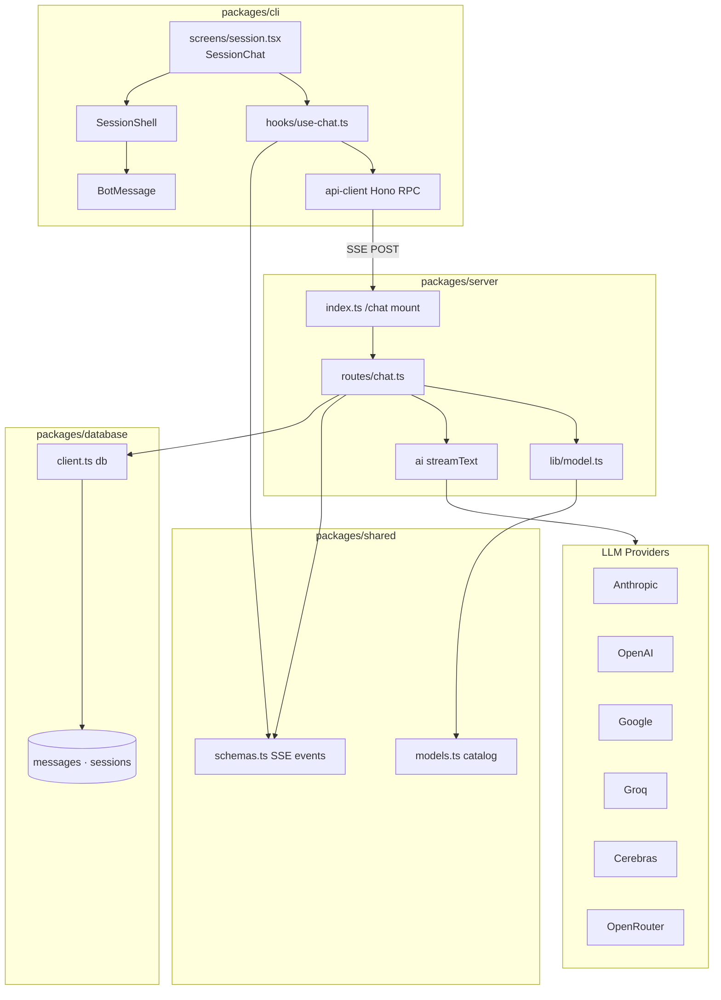


### 3.2 依赖方向（单向）


```plain text
packages/cli
  → @mocode/shared（chatStreamEventSchema · 模型 id 类型）
  → @mocode/database/enums（Mode · MessageStatus）
  → @mocode/server（devDependency，AppType → apiClient）
  → eventsource-parser · pretty-ms

packages/server
  → @mocode/shared · @mocode/database/client
  → ai · @ai-sdk/* · @openrouter/ai-sdk-provider
  → hono/streaming

packages/shared
  → zod（无反向依赖）
```


**原则**：协议与模型目录只在 `shared`；CLI 不 import `db`；Server 是唯一调用 LLM 的进程。


**RPC 类型继承**：`packages/cli/src/lib/api-client.ts` 使用 `hc<AppType>`；Server `index.ts` 挂载 `.route("/chat", chat)` 后，**无需改 api-client 源码** 即可获得 `apiClient.chat[":sessionId"]` 的类型推断。


### 3.3 Phase 4 Session API 与 Phase 6 Chat API 边界


| 用户动作                   | HTTP                           | 包 / 文件               | 持久化                                     |
| ---------------------- | ------------------------------ | -------------------- | --------------------------------------- |
| Home 首条消息              | `POST /sessions`               | `routes/sessions.ts` | Session + **首条 USER**（`initialMessage`） |
| Session 内后续消息          | `POST /chat/:sessionId`        | `routes/chat.ts`     | 新 USER + 流式 ASSISTANT                   |
| 末条 USER 未回复时进入 Session | `POST /chat/:sessionId/resume` | `routes/chat.ts`     | 仅 ASSISTANT（不新建 USER）                   |
| 只读历史                   | `GET /sessions/:id`            | `routes/sessions.ts` | 无写                                      |


| 校验入口         | 函数                                    | 位置                                  |
| ------------ | ------------------------------------- | ----------------------------------- |
| 创建会话时的 model | `findSupportedChatModel` + Zod refine | `sessions.ts` `createSessionSchema` |
| 发消息时的 model  | `isSupportedChatModel` + Zod refine   | `chat.ts` `submitSchema`            |


两者都查 `SUPPORTED_CHAT_MODELS`，**语义等价**，只是 Server 侧封装函数名不同。


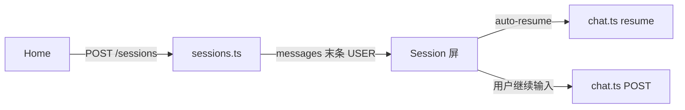


---


## 4. 知识点思维导图


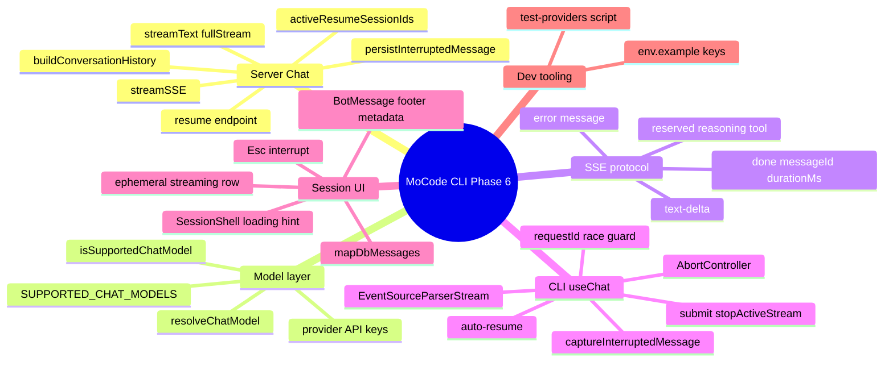


---


## 5. 模块与关键代码

> 
>
> 以前打开会话只能看到「说过什么」。现在你在输入框回车，话会存进数据库，AI 的回答会像打字一样一行行冒出来；按 Esc 可以打断，下次打开若 AI 没回完还会自动接着生成。
>
>

---


### 5.1 Chat 路由 — `packages/server/src/routes/chat.ts`


**通俗说明**：后台「聊天接线员」——收用户话、叫 AI 流式回答、把结果写回数据库，断线时保存已打出的半截回复。


**类比**：餐厅点单：先记菜单（USER 行），厨房边做边传菜（SSE），做完上账单（ASSISTANT COMPLETE），火急关火（INTERRUPTED）。


```typescript
// 请求体验证：model 必须落在 shared catalog
const submitSchema = z.object({
  content: z.string(),
  mode: z.enum(Mode),
  model: z.string().refine(isSupportedChatModel, "Invalid model"),
});

// 提交：先写 USER，再 SSE
.post("/:sessionId", submitValidator, async (c) => {
  await db.message.create({ role: "USER", content, model, mode, status: COMPLETE });
  const history = buildConversationHistory([...session.messages, newUserRow]);
  return streamSSE(
    c,
    async (stream) => {
      stream.onAbort(() => abortController.abort());
      await streamAIResponse(stream, { ... });
    },
    // 第二层：streamSSE 框架级异常（连接已开但回调抛错）
    async (err, stream) => {
      await stream.writeSSE({ event: "error", data: JSON.stringify({ type: "error", message }) });
    },
  );
});

// 续写：末条必须是 USER，不新建 USER 行
.post("/:sessionId/resume", async (c) => {
  const resumable = getResumableUserMessage(session.messages);
  // 409: 无待回复 USER / 模型不支持 / 已在 resume
});
```


| 关键点                                              | 用人话说                                                |
| ------------------------------------------------ | --------------------------------------------------- |
| `submitValidator` + `isSupportedChatModel`       | 非法 model 在进 LLM 前 400                               |
| `buildConversationHistory` 跳过 ERROR 与空 ASSISTANT | 别让废行污染 LLM 上下文                                      |
| `streamAIResponse` 循环 `fullStream`               | 每个 `text-delta` chunk 立刻 SSE 推给 CLI                 |
| `streamAIResponse` 的 `catch`                     | Provider 失败：写 ERROR 行 + SSE `error`（与第二层回调分工见 §6.6） |
| `done` 带 `messageId` + `durationMs`              | CLI 用服务端 id 落盘；耗时毫秒级                                |
| DB `duration` 存**秒**                             | 与 SSE `durationMs` 单位不同，映射时注意 ×1000                 |
| `persistInterruptedMessage`                      | 有字才写 INTERRUPTED 行                                  |
| `stream.onAbort`                                 | 客户端断连 → `abortController.abort()` → 停 `streamText`  |


---


### 5.2 模型解析 — `packages/server/src/lib/model.ts`


**通俗说明**：把配置里的模型名字翻译成「能直接调 API 的 SDK 对象」。


```typescript
export function resolveChatModel(modelId: string): ResolvedModel {
  const model = findSupportedChatModel(modelId); // shared 目录
  switch (model.provider) {
    case "anthropic": return { model: anthropic(model.id), ... };
    case "openrouter":
      return { model: createOpenRouter({ apiKey: process.env.OPENROUTER_API_KEY })(model.id), ... };
    // ...
  }
}
```


| Provider   | 环境变量                           | 默认免费测试模型                    |
| ---------- | ------------------------------ | --------------------------- |
| google     | `GOOGLE_GENERATIVE_AI_API_KEY` | `gemini-2.5-flash`（DEFAULT） |
| groq       | `GROQ_API_KEY`                 | `llama-3.3-70b-versatile`   |
| cerebras   | `CEREBRAS_API_KEY`             | `gpt-oss-120b`              |
| openrouter | `OPENROUTER_API_KEY`           | `openai/gpt-oss-120b:free`  |
| anthropic  | `ANTHROPIC_API_KEY`            | claude-* 系列                 |
| openai     | `OPENAI_API_KEY`               | gpt-5.4* 系列                 |


---


### 5.3 Shared 协议与目录 — `packages/shared`


**通俗说明**：全仓库共用的「模型电话簿」和「SSE 电报格式」。


```typescript
// models.ts — 单源 catalog
export const DEFAULT_CHAT_MODEL_ID = "gemini-2.5-flash";

// schemas.ts — SSE 事件（client 目前只处理 text-delta / done / error）
export const chatStreamEventSchema = z.discriminatedUnion("type", [ /* ... */ ]);

// messagePartSchema — DB Message.parts 的目标形态（本 Phase 未写入 DB）
export const messagePartSchema = z.discriminatedUnion("type", [
  z.object({ type: z.literal("text"), text: z.string() }),
  z.object({ type: z.literal("reasoning"), text: z.string() }),
  z.object({ type: z.literal("tool_call"), id, name, args, result? }),
]);
```


| 文件                      | 本 Phase 实际用途                                          |
| ----------------------- | ----------------------------------------------------- |
| `models.ts`             | Server Zod refine + `resolveChatModel` + CLI 默认 model |
| `chatStreamEventSchema` | Server 写 SSE · Client `handleStream` 解析               |
| `messagePartSchema`     | **仅类型/契约预留**；流式 part 存在内存，不落库                         |


**相对 Phase 4 的** **`models.ts`** **变更**：


| 变更                         | 说明                                                                       |
| -------------------------- | ------------------------------------------------------------------------ |
| 扩充 `SUPPORTED_CHAT_MODELS` | 新增 Groq / Cerebras / OpenRouter 等条目                                      |
| 引入 `ModelPricing`          | 每条模型带 `inputUsdPerMillionTokens` / `outputUsdPerMillionTokens`（供后续计费 UI） |
| 明确 `DEFAULT_CHAT_MODEL_ID` | 定为 `gemini-2.5-flash`（免费 tier 友好）                                        |
| `SupportedProvider` 联合类型   | 与 `model.ts` provider 分支一一对应                                             |


---


### 5.4 `useChat` — `packages/cli/src/hooks/use-chat.ts`


**通俗说明**：会话页的「聊天大脑」——维护消息列表、接 SSE、处理打断和重连。


**类比**：单线程电话接线员：同时只接一通流式电话（`activeStreamRef`），每通电话有工号（`requestId`），换人接新电话时旧电话的杂音一律挂断不听。


### 内部状态机（`runstream` 生命周期）


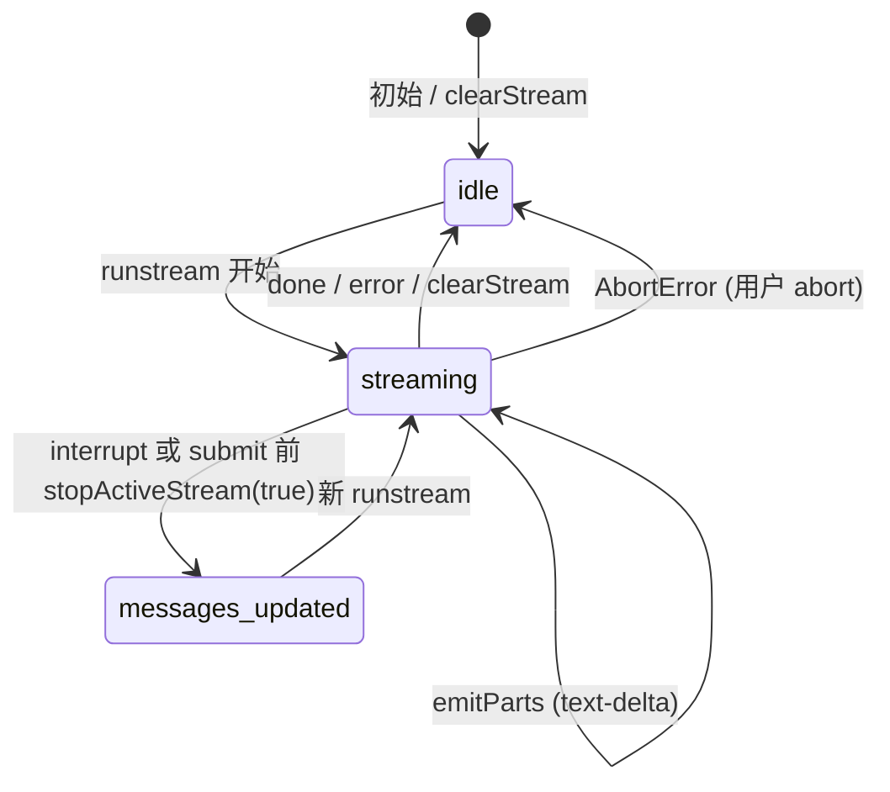


| 阶段 | 函数                    | 作用                                                           |
| -- | --------------------- | ------------------------------------------------------------ |
| 注册 | `runstream`           | 新建 `requestId` + `AbortController`；`activeStreamRef` 指向当前流   |
| 请求 | `request(controller)` | `submit` → `POST /chat`；`resume` → `POST /chat/.../resume`   |
| 解析 | `handleStream`        | `!response.ok` 走 HTTP 错误；否则 pipe SSE → Zod → switch          |
| 增量 | `emitParts`           | 更新 `activeStream.parts` + `streaming` state（驱动临时 BotMessage） |
| 结束 | `clearStream`         | `finally` 里清空 ref + `streaming: idle`                        |
| 打断 | `stopActiveStream`    | 可选 `captureInterruptedMessage` → `abort()`                   |


### 关键代码摘录


```typescript
// ref 做同步竞态判断；streaming state 只驱动 UI
const activeStreamRef = useRef<ActiveStream | null>(null);

// HTTP 层失败：未进入 SSE（404 / 400 / 409 等）
if (!response.ok) {
  const message = await getErrorMessage(response);
  updateMessage(/* append role: "error" */);
  return;
}

// SSE 解析：byte stream → 文本 → data 帧 → Zod
const stream = response.body!
  .pipeThrough(new TextDecoderStream())
  .pipeThrough(new EventSourceParserStream());

// 主动 abort 不算错误
catch (err) {
  if (err instanceof DOMException && err.name === "AbortError") return;
  /* 其他网络错误 → error 气泡 */
}

// submit：先打断旧流，再乐观 USER
stopActiveStream(true);
updateMessage(/* USER with crypto.randomUUID() — 与 DB cuid 不一致，见下表 */);
```


| 公开 API      | 行为                                                          |
| ----------- | ----------------------------------------------------------- |
| `submit`    | `stopActiveStream(true)` → 乐观 USER → `POST /chat/:id`       |
| `interrupt` | `stopActiveStream(true)`：保留 partial assistant，`abort` fetch |
| `abort`     | `stopActiveStream(false)`：卸载清理，不保留 partial                  |
| `resume`    | `POST /chat/:id/resume`，无新 USER 行                           |


### SSE `switch` 未覆盖的事件（静默丢弃）


`chatStreamEventSchema` 含 `reasoning-delta` / `tool-call` / `tool-result`，但 `handleStream` 的 `switch` **仅有** `text-delta` · `done` · `error` 三个分支。Zod 解析通过后，若 `event.type` 不在 switch 内，**不会报错、不会更新 UI**——与「Schema 已定义」≠「功能已实现」需区分（见 §10）。


```typescript
switch (event.type) {
  case "text-delta": /* ... */ break;
  case "done":       /* ... */ break;
  case "error":      /* ... */ break;
  // reasoning-delta / tool-call / tool-result：无 default，静默跳过
}
```


### 客户端 id 与 DB id 不一致（必读）


| 场景                            | 客户端临时 id              | 服务端权威 id                  | 刷新后                       |
| ----------------------------- | --------------------- | ------------------------- | ------------------------- |
| `submit` 乐观 USER              | `crypto.randomUUID()` | Prisma `cuid`             | 以 DB 为准（`mapDbMessages`）  |
| `interrupt` partial assistant | `crypto.randomUUID()` | INTERRUPTED 行 `cuid`（断连后） | 以 DB 为准                   |
| 正常 `done` assistant           | —                     | SSE `messageId`           | 一致，直接采用 `event.messageId` |
| SSE `error` 事件                | `crypto.randomUUID()` | ERROR 行 `cuid`            | 以 DB 为准                   |

> 同一会话内不刷新时，乐观 USER 行 id 与 DB 不同**不影响功能**；测试或对接外部系统时不要依赖客户端生成的 message id。

---


### 5.5 Session 屏 — `packages/cli/src/screens/session.tsx`


**通俗说明**：把数据库历史画出来，并接上 `useChat` 的实时流。


**类比**：剧场节目单（`messages`）+ 舞台侧幕实时字幕（`streaming.parts` 临时行）。


```typescript
// 仅挂载时快照 DB；之后以 useChat 内存状态为准
const [initialMessages] = useState(() => mapDbMessages(session.messages));

// 从 new-session 导航带来的 session，跳过 GET 拉取
const prefetched = sessionLocationSchema.safeParse(location.state);

// 流式行条件：parts 非空才渲染 BotMessage（见 §5.6 空窗期）
{streaming.status === "streaming" && streaming.parts.length > 0 && (
  <BotMessage parts={streaming.parts} streaming />
)}

// Footer 在 parts 仍为空时也会 loading（Spinner 已显示）
loading={streaming.status === "streaming"}

// 切换 session 重置 hook 状态
return <SessionChat key={session.id} session={session} />;
```


| 关键点                                  | 用人话说                                                                        |
| ------------------------------------ | --------------------------------------------------------------------------- |
| `mapDbMessages`                      | ERROR / USER / ASSISTANT 三分；`duration * 1000`；`INTERRUPTED` → `interrupted` |
| `prefetched` + `location.state`      | 创建会话后免一次 `GET /sessions/:id`                                                |
| `useKeyboard` + `isTopLayer("base")` | Esc 仅在无模态时中断，不抢 Dialog                                                      |
| `useEffect` cleanup `abort()`        | 离开页面取消进行中的 SSE                                                              |
| **空窗期 UX**                           | `streaming` 已开始但 `parts` 仍 `[]` 时：有 Spinner、无 Assistant 文字（见 §5.7）          |
| `ChatMessage`                        | 按 `role` 分发 `UserMessage` / `ErrorMessage` / `BotMessage`；流式行在列表外单独渲染       |


---


### 5.5b 创建会话屏 — `packages/cli/src/screens/new-session.tsx`


**通俗说明**：Home 提交后中间的「创建中」过渡页；负责 `POST /sessions` 并带着结果跳进 Session。


**类比**：取票 kiosk——显示你刚输入的话，后台建档，打好票后送进聊天室。


```typescript
// Strict Mode 下 effect 会跑两次；ref 保证只 POST 一次
const hasStartedRef = useRef(false);
if (!state || hasStartedRef.current) return;
hasStartedRef.current = true;

await apiClient.sessions.$post({
  json: {
    title: state.message.slice(0, 100),
    cwd: process.cwd(),
    initialMessage: {
      role: "USER",
      content: state.message,
      model: DEFAULT_CHAT_MODEL_ID,
      mode: "BUILD",
    },
  },
});

navigate(`/sessions/${session.id}`, { replace: true, state: { session } });
```


| 关键点              | 用人话说                                                                      |
| ---------------- | ------------------------------------------------------------------------- |
| 两条发消息入口          | **首条**：`new-session` → `POST /sessions`；**后续**：Session → `POST /chat/:id` |
| 首条 Assistant     | 本文件不请求 Chat；Session 屏 `useChat` **auto-resume** 负责                        |
| `hasStartedRef`  | 防 React Strict Mode 双 POST                                                |
| `ignore` cleanup | 卸载时放弃过期 navigate，避免竞态                                                     |
| UI               | `UserMessage` 占位 + `SessionShell loading`；输入禁用                            |


---


### 5.6 `BotMessage` — `packages/cli/src/components/messages/bot-message.tsx`


**通俗说明**：展示 Assistant 正文，并在底部显示模式、模型、耗时或「被中断」。


**类比**：新闻正文下方的新闻来源栏。


```typescript
// parts 目前仅 text；由 useChat 合并 text-delta
const text = parts.filter((p) => p.type === "text").map((p) => p.text).join("");

// streaming prop 已传入，但组件内尚未使用（无「打字光标」等差异化样式）
export function BotMessage({ parts, model, mode, duration, streaming = false, interrupted = false }) {
  // interrupted → TextAttributes.DIM + 脚标文案 "interrupted"
  // 正常 → mode 色点 ◉ + "Plan"|"Build" > model > duration
}
```


| Prop             | 来源                                             | 本 Phase 行为     |
| ---------------- | ---------------------------------------------- | -------------- |
| `parts`          | `useChat` / `mapDbMessages`                    | 渲染正文           |
| `mode` / `model` | 消息或 streaming 状态                               | 脚标元数据          |
| `duration`       | `done` 后 `prettyMs` 或 DB                       | 完成耗时           |
| `interrupted`    | DB `INTERRUPTED` 或 `captureInterruptedMessage` | DIM + 文案       |
| `streaming`      | SessionChat 临时行传 `streaming`                   | ⚠️ **未消费**，仅占位 |


---


### 5.7 `SessionShell` — `packages/cli/src/components/session-shell.tsx`


**通俗说明**：会话页固定布局——上方滚动消息区、中间输入框、底部状态栏。


```typescript
<scrollbox stickyScroll stickyStart="bottom">  {/* 新消息贴底 */}
  {children}
</scrollbox>
<InputBar onSubmit={onSubmit} disabled={inputDisabled} />
{loading && <Spinner />}
{loading && interruptible && <text>esc to interrupt</text>}
```


| Prop            | 何时为 true                           | UI 效果                         |
| --------------- | ---------------------------------- | ----------------------------- |
| `loading`       | `streaming.status === "streaming"` | 显示 Spinner（**含首 token 前空窗期**） |
| `interruptible` | 同上                                 | 显示 `esc to interrupt` 提示      |
| `inputDisabled` | Session 加载中占位                      | 禁止输入                          |


| 空窗期       | `loading` | 临时 `BotMessage`        | 用户所见                  |
| --------- | --------- | ---------------------- | --------------------- |
| 首 token 前 | ✅ Spinner | ❌ `parts.length === 0` | 只有底部转圈，无 Assistant 气泡 |
| 有 token 后 | ✅         | ✅                      | 字幕 + Spinner 并存       |
| 完成后       | ❌         | ❌                      | 消息进入 `messages` 列表    |


---


### 5.8 Provider 测试脚本 — `packages/server/scripts/test-providers.ts`


**通俗说明**：一键检查 `.env` 里配的免费模型能不能连通、能不能调 tool。


```bash
cd packages/server && bun run test:providers
```


| 检查    | 说明                                                |
| ----- | ------------------------------------------------- |
| basic | `generateText` 固定 prompt `Reply with exactly: OK` |
| tool  | `toolChoice: required` 天气 tool；basic 失败则 skip     |
| 缺 env | status `skip`，不 fail 整个脚本                         |


---


### 5.9 Hono RPC Client — `packages/cli/src/lib/api-client.ts`


**通俗说明**：CLI 访问后端的「类型安全遥控器」；Server 增路由后类型自动跟上。


```typescript
import { hc } from "hono/client";
import type { AppType } from "@mocode/server";

export const apiClient = hc<AppType>(process.env.API_URL ?? "http://localhost:3000");

// Phase 6 起可用（由 AppType 推断，无需改本文件）：
// apiClient.chat[":sessionId"].$post({ param, json }, { init: { signal } })
// apiClient.chat[":sessionId"].resume.$post({ param }, { init: { signal } })
```


| 关键点                       | 用人话说                                       |
| ------------------------- | ------------------------------------------ |
| `AppType = typeof routes` | `index.ts` 里 `.route("/chat", chat)` 即注入类型 |
| `init.signal`             | 把 `AbortController` 传给 fetch，支持中断          |
| `API_URL`                 | 默认 `localhost:3000`，CLI 进程环境变量             |


---


### 5.10 模块关系总览


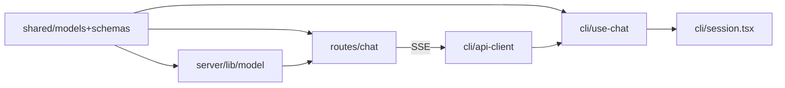


| 模块                         | 职责                              |
| -------------------------- | ------------------------------- |
| `routes/chat.ts`           | HTTP + SSE + DB 持久化 + AI 调用     |
| `lib/model.ts`             | catalog → `LanguageModel`       |
| `use-chat.ts`              | 客户端流状态机                         |
| `session.tsx`              | DB 映射 + 键盘 + 布局组装               |
| `api-client.ts`            | 类型安全 HTTP；Chat 路径由 `AppType` 推断 |
| `models.ts` / `schemas.ts` | 跨端契约                            |


---


## 6. 核心流程


### 6.1 会话内发送消息（主路径）


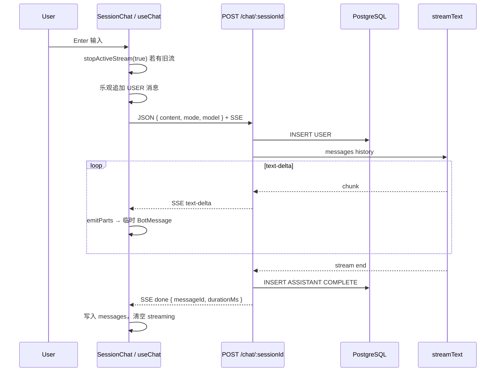


### 6.2 Esc 中断（客户端 + 服务端双写）


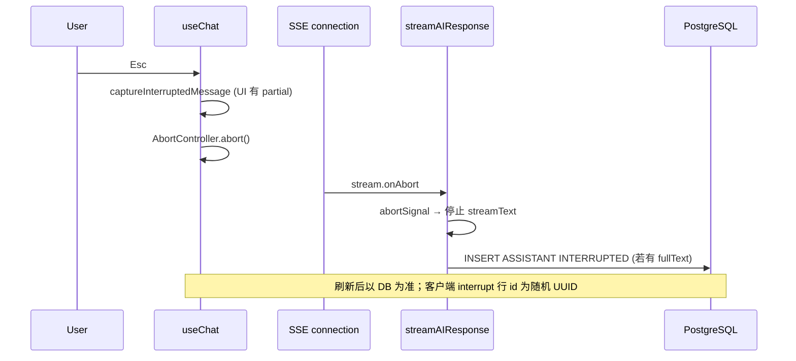


### 6.3 崩溃后 Auto-Resume


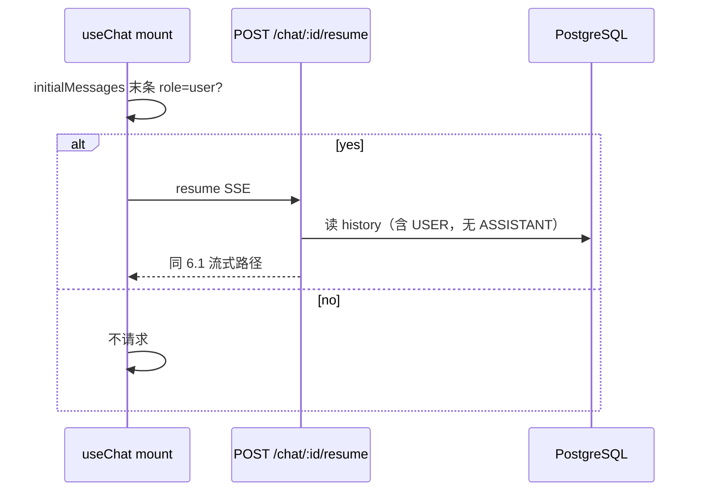


### 6.4 Home 创建会话 → 首条消息（与 Phase 4 衔接）


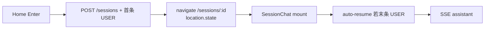

> Phase 4 创建 Session 时已写入首条 USER；进入 Session 后 **auto-resume** 触发 assistant 生成，无需在 Session 内再次 submit。

### 6.4.1 `new-session` 时序（补充）


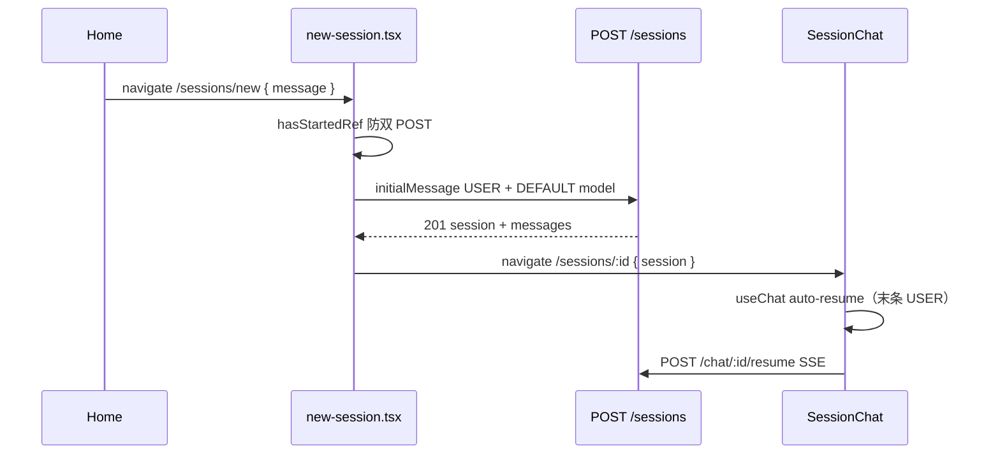


### 6.5 HTTP 失败（未进入 SSE）


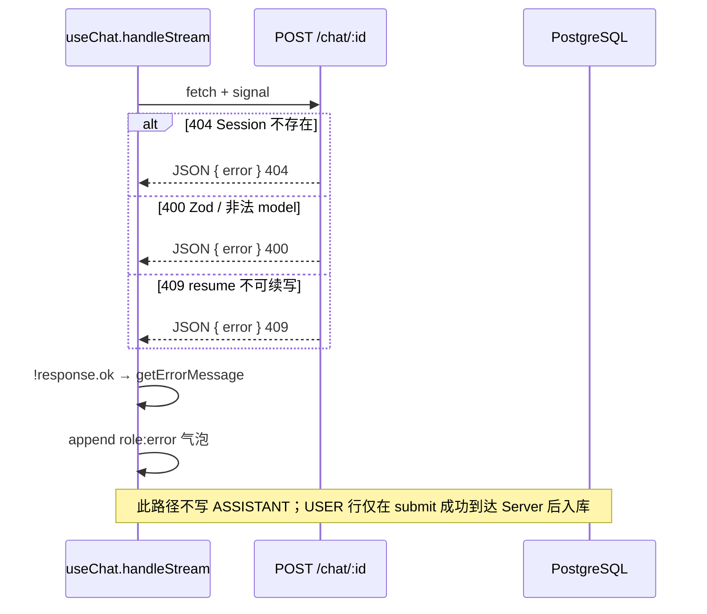


### 6.6 Provider / 流内错误


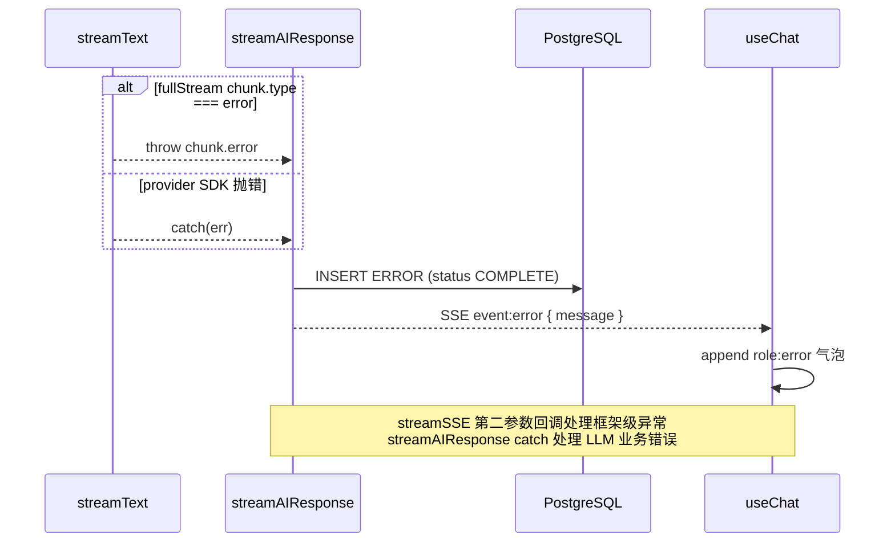


---


## 7. 知识点详解（含官方文档与用法）

> 每节含：**官方文档链接 · API/用法 · MoCode 落点**

### 7.1 Vercel AI SDK `streamText`


| 概念                                             | 说明                               | 参考                                                                             |
| ---------------------------------------------- | -------------------------------- | ------------------------------------------------------------------------------ |
| `streamText({ model, messages, abortSignal })` | 多轮 messages 流式补全                 | [AI SDK streamText](https://ai-sdk.dev/docs/reference/ai-sdk-core/stream-text) |
| `result.fullStream`                            | 统一 chunk 流（含 text-delta / error） | 同上                                                                             |
| `abortSignal`                                  | 与 `AbortController` 联动取消         | 同上                                                                             |


**MoCode 落点**：`packages/server/src/routes/chat.ts` — `streamAIResponse`


---


### 7.2 Hono SSE `streamSSE`


| 概念                                 | 说明                     | 参考                                                        |
| ---------------------------------- | ---------------------- | --------------------------------------------------------- |
| `streamSSE(c, callback)`           | 返回 `text/event-stream` | [Hono Streaming](https://hono.dev/docs/helpers/streaming) |
| `stream.writeSSE({ event, data })` | `data` 为字符串，通常 JSON    | 同上                                                        |
| `stream.onAbort(fn)`               | 客户端断开时回调               | 同上                                                        |


**MoCode 落点**：`packages/server/src/routes/chat.ts` — 两个 POST 处理器


**`streamSSE`** **三参数签名**：


```typescript
streamSSE(c, async (stream) => { /* 主流 */ }, async (err, stream) => { /* 框架错误 → SSE error */ });
```


| 错误来源                               | 处理位置                  | 是否写 DB  |
| ---------------------------------- | --------------------- | ------- |
| 路由前 Zod / 404 / 409                | 普通 `return c.json`    | ❌       |
| `streamAIResponse` catch（Provider） | ERROR 行 + SSE `error` | ✅ ERROR |
| `streamSSE` 第二回调                   | SSE `error` only      | 视情况     |
| `handleStream` 解析失败                | Client error 气泡       | ❌       |


---


### 7.3 eventsource-parser（客户端）


| 概念                                     | 说明                    | 参考                                                                  |
| -------------------------------------- | --------------------- | ------------------------------------------------------------------- |
| `EventSourceParserStream`              | Web Streams 版 SSE 解析器 | [eventsource-parser](https://github.com/rexxars/eventsource-parser) |
| `for await (const { data } of stream)` | 逐帧读取 `data:` 字段       | 同上                                                                  |


**MoCode 落点**：`packages/cli/src/hooks/use-chat.ts` — `handleStream`


**用法**：Hono client 的 `response.body` 是 `ReadableStream<Uint8Array>`，需先 `TextDecoderStream` 再 SSE 解析。


---


### 7.4 Hono RPC Client + SSE


| 概念                                                              | 说明                  | 参考                                           |
| --------------------------------------------------------------- | ------------------- | -------------------------------------------- |
| `apiClient.chat[":sessionId"].$post(..., { init: { signal } })` | 类型安全路径 + fetch init | [Hono RPC](https://hono.dev/docs/guides/rpc) |
| `ClientResponse.body`                                           | 流式响应体               | 同上                                           |


**MoCode 落点**：`packages/cli/src/hooks/use-chat.ts` — `submit` / `resume`


---


### 7.5 AbortController 与竞态 `requestId`


| 概念                       | 说明                  | 参考                                                                                      |
| ------------------------ | ------------------- | --------------------------------------------------------------------------------------- |
| `AbortController.signal` | 传给 fetch 取消请求       | [MDN AbortController](https://developer.mozilla.org/en-US/docs/Web/API/AbortController) |
| `AbortError`             | 主动 abort 不应显示为聊天错误  | 同上                                                                                      |
| ref 存 `requestId`        | 快速连发 submit 时丢弃旧流回调 | React 模式                                                                                |


**MoCode 落点**：`packages/cli/src/hooks/use-chat.ts` — `isActiveRequest` · `runstream`


---


### 7.6 Zod 校验与 `@hono/zod-validator`


| 概念                                 | 说明                          | 参考                                                                           |
| ---------------------------------- | --------------------------- | ---------------------------------------------------------------------------- |
| `zValidator("json", schema, hook)` | 校验失败时自定义 400 响应             | [Hono Zod Validator](https://hono.dev/docs/middleware/builtin/zod-validator) |
| `.refine(isSupportedChatModel)`    | 字符串 model id 收窄为 catalog 成员 | [Zod refine](https://zod.dev/api?id=refinements)                             |
| `chatStreamEventSchema.parse`      | 客户端 SSE 帧运行时校验              | [Zod discriminatedUnion](https://zod.dev/api?id=discriminated-unions)        |


**MoCode 落点**：

- `packages/server/src/routes/chat.ts` — `submitSchema` / `submitValidator`
- `packages/cli/src/hooks/use-chat.ts` — `handleStream` 内 `chatStreamEventSchema.parse`

---


### 7.7 `messagePartSchema`（预留）


| 概念                  | 说明                                                                |
| ------------------- | ----------------------------------------------------------------- |
| `messagePartSchema` | 未来 DB `Message.parts` JSON 结构（text / reasoning / tool_call）       |
| 本 Phase             | CLI `ClientMessagePart` 仅 `{ type: "text" }`；Server 不落 `parts` 字段 |


**MoCode 落点**：`packages/shared/src/schemas.ts` — 与 Prisma `Message.parts Json?` 字段对齐，待后续 Phase 写入。


---


### 7.8 Hono RPC `AppType` 继承


| 概念                                    | 说明                           | 参考                                           |
| ------------------------------------- | ---------------------------- | -------------------------------------------- |
| `export type AppType = typeof routes` | Server 路由树即 Client 类型源       | [Hono RPC](https://hono.dev/docs/guides/rpc) |
| `hc<AppType>(baseUrl)`                | 新增 `/chat` 路由后 Client 自动获得类型 | 同上                                           |


**MoCode 落点**：`packages/server/src/index.ts` · `packages/cli/src/lib/api-client.ts`


---


### 7.9 知识点 ↔︎ 源码 ↔︎ 文档 速查表


| #    | 知识点                     | 文件                                              | 官方文档                                                                    |
| ---- | ----------------------- | ----------------------------------------------- | ----------------------------------------------------------------------- |
| 7.1  | streamText              | `server/src/routes/chat.ts`                     | [streamText](https://ai-sdk.dev/docs/reference/ai-sdk-core/stream-text) |
| 7.2  | streamSSE + onAbort     | `server/src/routes/chat.ts`                     | [Hono Streaming](https://hono.dev/docs/helpers/streaming)               |
| 7.3  | EventSourceParserStream | `cli/src/hooks/use-chat.ts`                     | [eventsource-parser](https://github.com/rexxars/eventsource-parser)     |
| 7.4  | Hono RPC + signal       | `cli/src/hooks/use-chat.ts`                     | [Hono RPC](https://hono.dev/docs/guides/rpc)                            |
| 7.5  | 多 Provider 模型           | `server/src/lib/model.ts`                       | [AI SDK Providers](https://ai-sdk.dev/providers)                        |
| 7.6  | Zod validator / refine  | `server/src/routes/chat.ts`                     | [Zod Validator](https://hono.dev/docs/middleware/builtin/zod-validator) |
| 7.7  | messagePartSchema（预留）   | `shared/src/schemas.ts`                         | —                                                                       |
| 7.8  | AppType RPC             | `server/src/index.ts` · `cli/.../api-client.ts` | [Hono RPC](https://hono.dev/docs/guides/rpc)                            |
| 7.9  | SSE Zod 协议              | `shared/src/schemas.ts`                         | —                                                                       |
| 7.10 | 模型目录                    | `shared/src/models.ts`                          | —                                                                       |


---


## 8. 文件索引


| 文件                                                     | 层级  | 一句话                                           |
| ------------------------------------------------------ | --- | --------------------------------------------- |
| `packages/server/src/routes/chat.ts`                   | API | Chat SSE 路由、历史构建、中断/错误持久化                     |
| `packages/server/src/lib/model.ts`                     | API | `resolveChatModel` 多 provider 工厂              |
| `packages/server/src/index.ts`                         | API | 挂载 `/chat` 路由                                 |
| `packages/server/scripts/test-providers.ts`            | 工具  | Provider 连通性冒烟测试                              |
| `packages/server/package.json`                         | 配置  | `ai` · `@ai-sdk/*` · `test:providers` 脚本      |
| `packages/shared/src/models.ts`                        | 共享  | 模型 catalog · DEFAULT · 定价类型                   |
| `packages/shared/src/schemas.ts`                       | 共享  | `chatStreamEventSchema` · `messagePartSchema` |
| `packages/shared/src/index.ts`                         | 共享  | re-export models + schemas                    |
| `packages/cli/src/hooks/use-chat.ts`                   | CLI | 流式聊天状态 hook                                   |
| `packages/cli/src/screens/session.tsx`                 | CLI | Session 数据加载 + `useChat` 集成                   |
| `packages/cli/src/screens/new-session.tsx`             | CLI | 首条消息 `POST /sessions` + router state 跳转       |
| `packages/cli/src/components/messages/bot-message.tsx` | CLI | Assistant 气泡 + 元数据脚                           |
| `packages/cli/src/components/session-shell.tsx`        | CLI | 贴底滚动 + loading/interrupt 脚                    |
| `packages/cli/src/lib/api-client.ts`                   | CLI | `hc<AppType>`；Chat 路由类型自动继承                   |
| `packages/cli/package.json`                            | 配置  | `eventsource-parser` · `pretty-ms`            |
| `.env.example`                                         | 配置  | 各 LLM Provider API Key 占位                     |
| `bun.lock`                                             | 配置  | AI SDK 传递依赖锁定                                 |


---


## 9. 开发与调试


### 环境配置


```bash
cp .env.example .env
```


| 变量                                                         | 用途                                       |
| ---------------------------------------------------------- | ---------------------------------------- |
| `DATABASE_URL`                                             | Postgres（Phase 4）                        |
| `API_URL`                                                  | CLI 指向 Server，默认 `http://localhost:3000` |
| `GOOGLE_GENERATIVE_AI_API_KEY`                             | 默认模型 `gemini-2.5-flash`                  |
| `GROQ_API_KEY` / `CEREBRAS_API_KEY` / `OPENROUTER_API_KEY` | 免费 tier 测试                               |
| `ANTHROPIC_API_KEY` / `OPENAI_API_KEY`                     | 付费 catalog 模型                            |
| `SENTRY_DSN`                                               | 可选（Phase 5）                              |


### 启动


```bash
bun install

# 终端 1 — API
bun run dev:server

# 终端 2 — CLI
bun run dev:cli
```


**长连接注意**：`packages/server/src/index.ts` 设置 `idleTimeout: 255`（秒）。Bun 默认空闲超时较短；**慢 Provider + 长 SSE** 时不宜随意调低，否则流式连接可能被服务端提前断开。注释虽写 DB，但对 Chat 流同样适用。


### Provider 冒烟测试


```bash
cd packages/server && bun run test:providers
```


期望：已配置 key 的模型 `basic` ✓；`tool` 在 basic 通过后 ✓；缺 key 显示 `○ skip`。


### curl 验证 Chat SSE（可选）


```bash
# 先创建 session 拿到 SESSION_ID（或从 CLI 日志/DB 取）
export API_URL=http://localhost:3000
export SESSION_ID=your_session_cuid

# 发消息并观察 SSE（-N 禁用缓冲）
curl -N -X POST "$API_URL/chat/$SESSION_ID" \
  -H "Content-Type: application/json" \
  -d '{"content":"Say hi in one word","mode":"BUILD","model":"gemini-2.5-flash"}'

# 续写（末条必须是 USER）
curl -N -X POST "$API_URL/chat/$SESSION_ID/resume"
```


期望输出含 `event: text-delta` 与 `event: done`；`data:` 行为 JSON，可用 `chatStreamEventSchema` 对照。


### 手动 E2E checklist


| 步骤                         | 期望                                                 |
| -------------------------- | -------------------------------------------------- |
| Home 输入首条消息                | 创建 Session → 进入 `/sessions/:id` → auto-resume 流式回复 |
| Session 内再发一条              | USER 立即出现 → Assistant 逐字流式 → 脚标显示 model 与耗时        |
| 首 token 延迟                 | 仅底部 Spinner，**无** Assistant 气泡（空窗期，见 §5.7）         |
| 流式中按 Esc                   | 停止生成；partial 保留；脚标 `interrupted`                   |
| 刷新页面                       | DB 历史正确；INTERRUPTED 行 DIM                          |
| 末条 USER 后杀 CLI 再打开         | auto-resume 继续生成                                   |
| 断 API Key                  | ERROR 气泡；DB 有 ERROR 行                              |
| `curl -N` POST `/chat/:id` | 可见 `event: text-delta` 与 `event: done`             |


### 调试 checklist


| 现象                  | 排查                                                              |
| ------------------- | --------------------------------------------------------------- |
| 无流式、一直 Spinner      | 空窗期 vs 真卡住：等 5–10s；仍无 `text-delta` 查 API Key / `test:providers` |
| 有 Spinner 无文字       | 正常：`parts.length === 0` 时不渲染临时 BotMessage（§5.7）                 |
| `Invalid model` 400 | `model` 是否在 `SUPPORTED_CHAT_MODELS`；Zod refine                  |
| Provider 401/403    | 对应 `*_API_KEY`；跑 `test:providers`                               |
| 重复 assistant / 乱序   | 是否多 tab；`requestId` 是否被旧流污染                                     |
| Resume 409          | 末条非 USER；或 `activeResumeSessionIds` 逻辑异常                        |
| 耗时显示不对              | DB 秒 vs `prettyMs` 需 `* 1000`                                   |
| SSE 解析失败            | `chatStreamEventSchema` 与 server 事件是否一致                         |
| 收到 reasoning 无 UI   | 预期行为：switch 无分支，静默丢弃（§5.4）                                      |
| 创建 Session 后无回复     | 检查 auto-resume effect；末条是否 USER                                 |


---


## 附录：Chat API 契约


### `POST /chat/:sessionId`


**Request JSON**


| 字段        | 类型               | 说明                         |
| --------- | ---------------- | -------------------------- |
| `content` | string           | 用户消息正文                     |
| `mode`    | `BUILD` | `PLAN` | 枚举 `Mode`                  |
| `model`   | string           | 须在 `SUPPORTED_CHAT_MODELS` |


**Response**：`text/event-stream`


### `POST /chat/:sessionId/resume`


**Request**：无 body（sessionId 在路径）


**前置**：末条 message `role === USER`


**Response**：同上 SSE


### SSE 事件（`data` 为 JSON）


| event        | type 字段                     | 客户端处理          |
| ------------ | --------------------------- | -------------- |
| `text-delta` | `text-delta`                | ✅ 合并进 parts    |
| `done`       | `done`                      | ✅ 落盘 assistant |
| `error`      | `error`                     | ✅ error 气泡     |
| —            | `reasoning-delta`           | ❌ 预留           |
| —            | `tool-call` / `tool-result` | ❌ 预留           |


### HTTP 错误


| 状态  | 场景                                   |
| --- | ------------------------------------ |
| 404 | Session 不存在                          |
| 400 | Zod 校验失败（含非法 model）                  |
| 409 | resume：无待回复 USER / 不支持模型 / 已在 resume |


---


## 附录：支持模型一览（Phase 6 catalog）


| id                                             | provider   | 备注                    |
| ---------------------------------------------- | ---------- | --------------------- |
| `gemini-2.5-flash`                             | google     | **DEFAULT**           |
| `llama-3.3-70b-versatile`                      | groq       | 免费 tier 测试            |
| `gpt-oss-120b`                                 | cerebras   | 免费 tier 测试            |
| `openai/gpt-oss-120b:free`                     | openrouter | 免费 tier 测试            |
| `claude-sonnet-4-6` / `haiku-4-5` / `opus-4-6` | anthropic  | 需 `ANTHROPIC_API_KEY` |
| `gpt-5.4` / `mini` / `nano`                    | openai     | 需 `OPENAI_API_KEY`    |


---


## 附录：CLI `useChat` 公开 API


| 成员          | 类型                                                    | 说明             |
| ----------- | ----------------------------------------------------- | -------------- |
| `messages`  | `Message[]`                                           | 已落盘 transcript |
| `streaming` | `idle` | `{ status:"streaming", parts, mode, model }` | ephemeral 缓冲   |
| `submit`    | `( { userText, mode, model } ) => Promise<void>`      | 新发一轮           |
| `interrupt` | `() => void`                                          | Esc：保留 partial |
| `abort`     | `() => void`                                          | 不保留 partial    |


---


## 附录：`useChat` 内部函数速查


| 函数                          | 触发时机                         | 副作用                                       |
| --------------------------- | ---------------------------- | ----------------------------------------- |
| `runstream`                 | submit / resume              | 注册 activeStream；`finally` → `clearStream` |
| `handleStream`              | fetch 返回后                    | 解析 SSE；更新 messages 或 error                |
| `emitParts`                 | 每个 text-delta                | 更新 `streaming.parts`                      |
| `captureInterruptedMessage` | interrupt / submit 前         | 追加 `interrupted: true` assistant          |
| `stopActiveStream`          | interrupt / abort / submit 前 | 可选 capture + abort fetch                  |
| `clearStream`               | runstream finally            | ref=null；streaming idle                   |
| `isActiveRequest`           | 各 async 回调                   | 丢弃过期 requestId                            |


---


## 附录：`Message` 类型契约（`useChat`）


CLI 内存中的 `Message` 为 discriminated union，与 DB `Role` 映射关系如下：


| `Message.role` | 来源                                           | 必填字段                                      | 可选字段                      |
| -------------- | -------------------------------------------- | ----------------------------------------- | ------------------------- |
| `"user"`       | `submit` 乐观 / `mapDbMessages`                | `id`, `content`, `mode`, `model`          | —                         |
| `"assistant"`  | `done` / interrupt capture / `mapDbMessages` | `id`, `content`, `mode`, `model`, `parts` | `duration`, `interrupted` |
| `"error"`      | HTTP 失败 / SSE `error` / 解析异常                 | `id`, `content`                           | —                         |


```typescript
type ClientMessagePart = { type: "text"; text: string }; // 本 Phase 仅 text

type Message =
  | { id: string; role: "user"; content: string; mode: Mode; model: SupportedChatModelId }
  | {
      id: string; role: "assistant"; content: string; mode: Mode; model: SupportedChatModelId;
      parts: ClientMessagePart[]; duration?: string; interrupted?: boolean;
    }
  | { id: string; role: "error"; content: string };
```


| DB → CLI 映射（`mapDbMessages`） | 规则                                                                            |
| ---------------------------- | ----------------------------------------------------------------------------- |
| `USER`                       | `role: "user"`                                                                |
| `ASSISTANT`                  | `parts: [{ type:"text", text: content }]`；`INTERRUPTED` → `interrupted: true` |
| `ERROR`                      | `role: "error"`；**不**带 mode/model                                             |
| `duration`                   | DB 秒 × 1000 → `prettyMs` 字符串                                                  |


**流式期**：token 缓冲在 `streaming.parts`，**不在** `messages`，直到 `done` 或 `captureInterruptedMessage`。

## 延伸阅读

- [LangChain JS Tutorial: Build AI With LangChain In JavaScript – Full Crash Course ](/blog/2026-04-25-langchain-js-tutorial-build-ai-with-lang/)
- [MoCode Phase 1 开发笔记 ](/blog/2026-06-14-mocode-phase-1/)
- [MoCode Phase 4 开发笔记](/blog/2026-06-15-mocode-phase-4/)
- [HTML基础](/blog/2023-03-12-html/)

## 相关推荐

- [JavaScript](/blog/2023-04-02-javascript/)
- [TypeScript](/blog/2023-04-20-typescript/)
- [Node](/blog/2023-05-10-node/)
- [10 个每个开发者都应该了解的 TypeScript 高级概念](/blog/2024-11-22-10-typescript/)
- [探索开源 AI 模型：LLMs 和 Transformer 架构](/blog/2024-12-20-ai-llms-transformer/)
- [CSS Tricks: Top 10 Mind-Blowing Front-End Hacks That will Blow Your Mind! ](/blog/2025-01-12-css-tricks-top-10-mind-blowing-front-end/)
- [JavaScript 解构指南](/blog/2025-01-26-javascript/)
- [Full Stack App Build | Travel Log w/ Nuxt, Vue, Better Auth, Drizzle, Tailwind, DaisyUI, MapLibre](/blog/2026-04-04-full-stack-app-build-travel-log-w-nuxt-v/)
- [探索 JavaScript  Symbols ](/blog/2026-05-27-javascript-symbols/)
- [MoCode Phase 2 开发笔记](/blog/2026-06-15-mocode-phase-2/)
- [MoCode Phase 3 开发笔记](/blog/2026-06-15-mocode-phase-3/)
- [MoCode Phase 5 开发笔记](/blog/2026-06-17-mocode-phase-5/)
- [MoCode Phase 7 开发笔记](/blog/2026-06-19-mocode-phase-7/)
- [MoCode Phase 8 开发笔记](/blog/2026-06-20-mocode-phase-8/)
- [使用 Tailwind CSS 进行响应式设计](/blog/2024-10-12-tailwind-css/)
