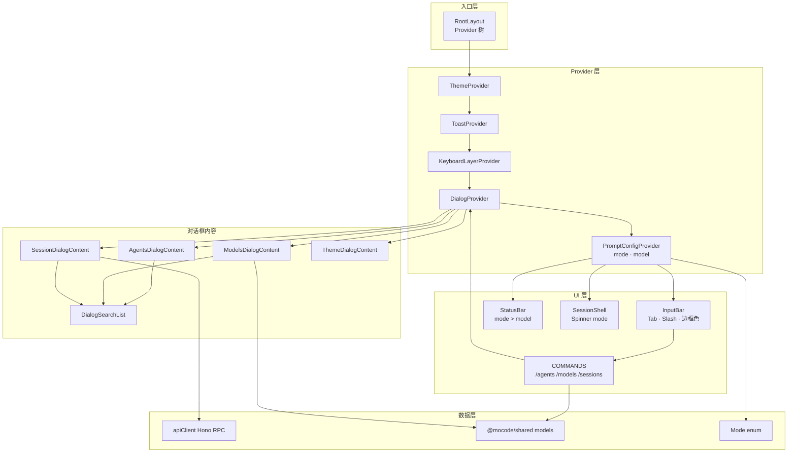
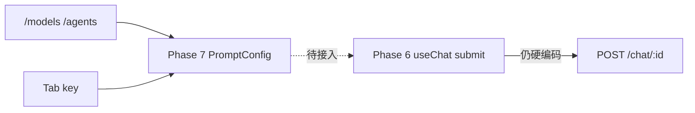
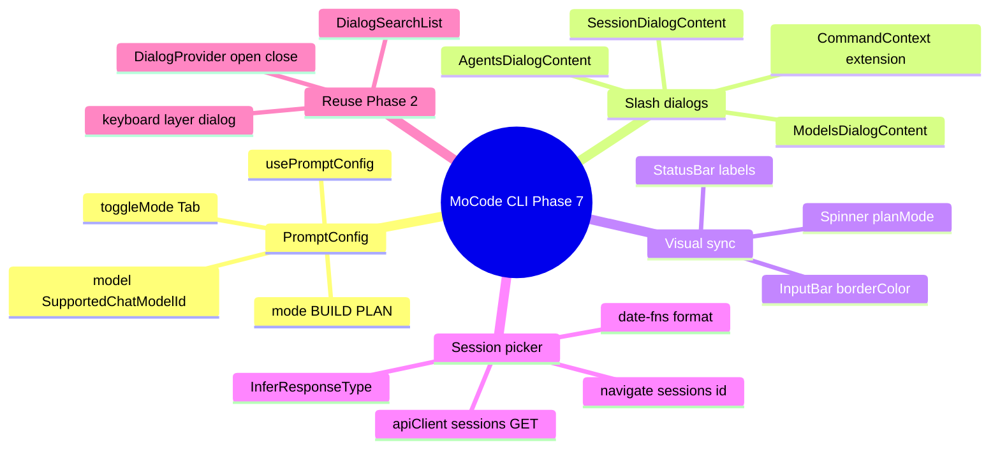
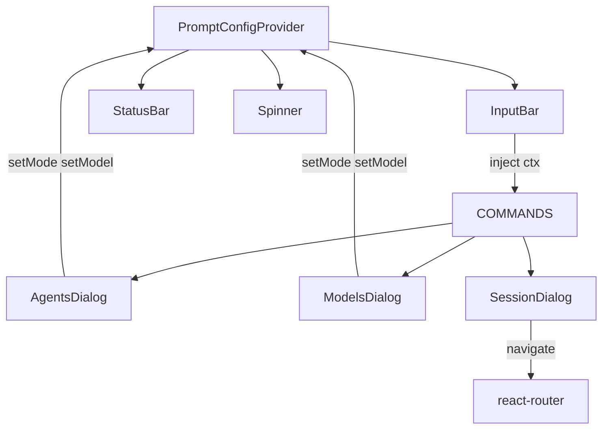
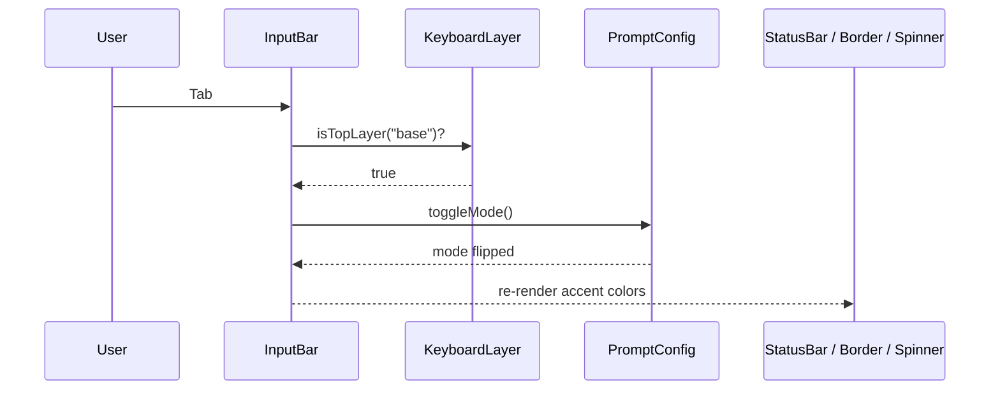
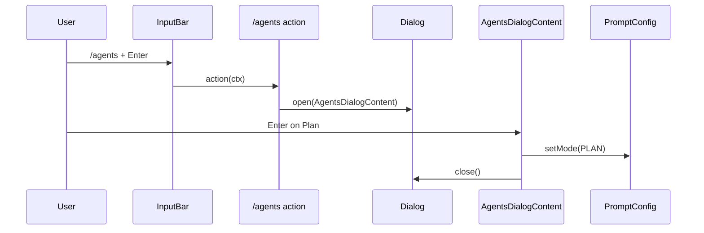
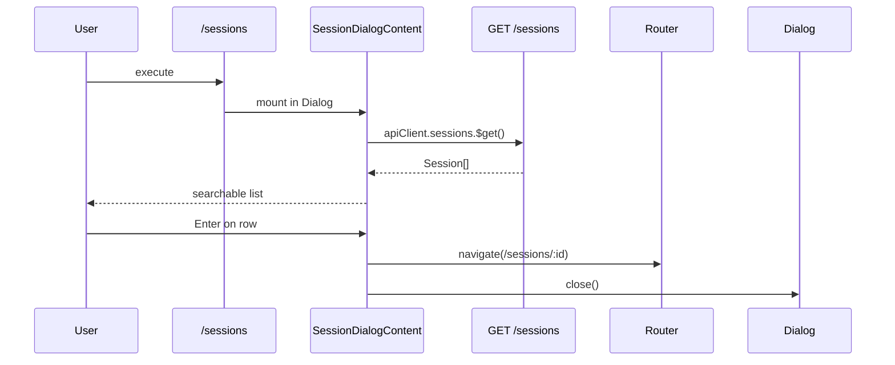
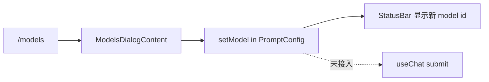

Phase 6 流式对话已通，但 **模型与 Agent 模式仍硬编码**（`DEFAULT_CHAT_MODEL_ID` · `BUILD`），`/agents` · `/models` · `/sessions` 仅为 Toast 或占位文案。本阶段新增 **`PromptConfigProvider`** 统一管理 `mode` 与 `model`，扩展 **`CommandContext`** 注入 `setMode` / `setModel` / `navigate`；实现三个基于 **`DialogSearchList`** 的选择器，其中 **`/sessions`** **拉取 Session API 并跳转路由**。**Tab** 在输入框内切换 Build ↔︎ Plan，**输入框左边框、StatusBar、Spinner** 随 mode 变色。`session.tsx` 发消息时尚未读取 PromptConfig，属已知缺口。


---


## 目录

1. 背景与目标
2. 技术选型
3. 架构总览
4. 知识点思维导图
5. 模块与关键代码
6. 核心流程
7. 知识点详解（含官方文档与用法）
8. 文件索引
9. 开发与调试

---


## 1. 背景与目标


### 要做什么


| 能力                                        | 状态 | 说明                                                       |
| ----------------------------------------- | -- | -------------------------------------------------------- |
| `PromptConfigProvider`（mode + model 全局状态） | ✅  | `usePromptConfig` · 默认 `BUILD` + `DEFAULT_CHAT_MODEL_ID` |
| Tab 快捷键切换 Build / Plan                    | ✅  | `InputBar` · `useKeyboard` · `toggleMode`                |
| `/agents` 对话框                             | ✅  | `AgentsDialogContent` · 当前 mode 子弹标记                     |
| `/models` 对话框                             | ✅  | 列表来自 `SUPPORTED_CHAT_MODELS`                             |
| `/sessions` 对话框 + API 拉取                  | ✅  | `GET /sessions` · 选中后 `navigate(/sessions/:id)`          |
| `/new` 真正跳转首页                             | ✅  | `ctx.navigate("/")` 替代 Toast                             |
| `CommandContext` 扩展                       | ✅  | `mode` · `setMode` · `setModel` · `navigate`             |
| StatusBar 显示真实 mode + model               | ✅  | 替代硬编码 `Build` / `opus-4-6`                               |
| 输入框左边框随 mode 变色                           | ✅  | `primary` vs `planMode`                                  |
| Spinner 随 mode 变色                         | ✅  | `SessionShell` footer 传入 `mode`                          |
| `date-fns` 格式化 Session 创建时间               | ✅  | `sessions-dialog` 右侧 `hh:mm a`                           |
| 关键路径英文源码注释                                | ✅  | prompt-config · dialogs · commands 等                     |
| **发消息时读取 PromptConfig**                   | ❌  | `session.tsx` 仍 `mode:"BUILD"` + `DEFAULT_CHAT_MODEL_ID` |
| **新建 Session 时读取 PromptConfig**           | ❌  | `new-session.tsx` 仍硬编码                                   |
| Models 对话框当前模型高亮                          | ❌  | 无 bullet，与 `/agents` 不一致                                 |
| Prompt 配置持久化（localStorage / 文件）           | ❌  | 进程内 state，重启恢复默认                                         |
| Session 列表 loading 态                      | ⚠️ | `loading` 初始 `false` 且 fetch 前未置 `true`，Loading UI 基本不显示 |
| Footer「tab agent」动态展示当前 mode              | ❌  | 静态文案，未绑定 `usePromptConfig`                               |
| `/login` · `/logout` 等账户命令                | ❌  | 仍为 Toast 占位                                              |


### 非目标（本阶段不做）

- 将 `mode` / `model` 写入 `~/.mocode/preferences.json`（主题已有持久化，Prompt 未接）
- 修改 Server Chat / Session API 契约
- 新增 Agent 类型（仅 BUILD / PLAN 两种 `Mode`）
- 模型定价、额度展示
- Session 删除 / 重命名
- Dialog 堆叠或多选
- 用户认证

---


## 2. 技术选型


| 层级           | 选择                                               | 理由                                                        |
| ------------ | ------------------------------------------------ | --------------------------------------------------------- |
| Prompt 全局状态  | **React Context** **`PromptConfigProvider`**     | 与 Phase 2 Theme/Dialog 模式一致；InputBar、StatusBar、Slash 命令同源 |
| 对话框列表 UI     | **复用** **`DialogSearchList<T>`**（Phase 2）        | `/theme` 已验证搜索 + 键盘导航；三个新 picker 零重复交互代码                  |
| Slash 命令副作用  | **扩展** **`CommandContext`**                      | 命令 action 不直接 `usePromptConfig`，由 `InputBar` 注入，便于测试与单点组装 |
| Session 列表类型 | **Hono** **`InferResponseType`**                 | 与 `apiClient.sessions.$get` 响应自动同步，无手写 DTO                |
| 时间展示         | **date-fns** **`format`**                        | 轻量、与项目其余日期处理一致；仅对话框用一条 format                             |
| Mode 枚举      | **`@mocode/database/enums`** **`Mode`**          | 与 Prisma Schema、Chat API `submitSchema` 同源                |
| 模型白名单        | **`@mocode/shared`** **`SUPPORTED_CHAT_MODELS`** | Server Zod refine 与 CLI 选择器同一 catalog                     |


---


## 3. 架构总览


### 3.1 分层图





### 3.2 依赖方向（单向）


```plain text
packages/cli
  → @mocode/shared（SUPPORTED_CHAT_MODELS · SupportedChatModelId）
  → @mocode/database/enums（Mode）
  → @mocode/server（devDependency，AppType → apiClient）
  → date-fns · react-router

PromptConfigProvider
  → 被 InputBar · StatusBar · SessionShell ·（间接）COMMANDS 读取
  → 不依赖 Dialog / Toast（无循环）

SessionDialogContent
  → apiClient.sessions.$get
  → react-router navigate
```


**原则**：Prompt 配置只在 CLI 内存；Server 仍按每次 Chat 请求体中的 `mode` / `model` 校验，不读 CLI 全局状态。


### 3.3 相对 Phase 6 的边界


| 用户动作         | Phase 6          | Phase 7 变化                                             |
| ------------ | ---------------- | ------------------------------------------------------ |
| 选模型          | 无 UI，硬编码 default | `/models` 写入 `PromptConfig.model`，**submit 尚未读取**      |
| 选 Agent 模式   | 无 UI，硬编码 BUILD   | Tab + `/agents` 写入 `PromptConfig.mode`，**submit 尚未读取** |
| 浏览历史 Session | Toast「Loading…」  | `/sessions` 真对话框 + API + 路由跳转                          |
| 新建对话         | Toast            | `/new` → `navigate("/")`                               |





---


## 4. 知识点思维导图





---


## 5. 模块与关键代码

> 
>
> 现在可以在输入框用 **`/models`** 选 AI 模型、**`/agents`** 选 Build/Plan 模式、**`/sessions`** 打开历史对话列表；按 **Tab** 也能快速切换模式。底部状态栏和输入框左边的颜色会跟着模式变。注意：你选好的模型和模式**还没接到真正发消息的那一步**，下一小步会把它们连上。
>
>

---


### 5.1 PromptConfigProvider — `providers/prompt-config/index.tsx`


**通俗说明**：全应用的「当前用什么 Agent 模式、什么模型」记事本，任何组件都能读。


**类比**：IDE 右下角的语言/模型切换器，但还没保存到磁盘。


```typescript
type PromptConfigContextValue = {
    mode: Mode;                    // BUILD | PLAN
    toggleMode: () => void;        // Tab 绑定
    setMode: (mode: Mode) => void; // /agents 对话框
    model: SupportedChatModelId;
    setModel: (model: SupportedChatModelId) => void; // /models 对话框
};

export function PromptConfigProvider({ children }) {
    const [mode, setMode] = useState<Mode>(Mode.BUILD);
    const [model, setModel] = useState(DEFAULT_CHAT_MODEL_ID);

    // deps 含 mode，保证连续 Tab 每次基于最新值翻转
    const toggleMode = useCallback(() => {
        setMode(mode === Mode.BUILD ? Mode.PLAN : Mode.BUILD);
    }, [mode]);

    return (
        <PromptConfigContext.Provider value={{ mode, toggleMode, setMode, model, setModel }}>
            {children}
        </PromptConfigContext.Provider>
    );
}
```


| 关键点                    | 用人话说                                        |
| ---------------------- | ------------------------------------------- |
| 挂在 `DialogProvider` 内层 | Slash 命令打开对话框时既能 `dialog.open` 又能 `setMode` |
| 无 `useMemo` on value   | Sonar 会提示每次 render 新对象；当前子树不重，可后续优化         |
| 无持久化                   | 退出 CLI 后恢复默认 model / BUILD                  |


---


### 5.2 CommandContext 与 COMMANDS — `command-menu/types.ts` · `commands.tsx`


**通俗说明**：Slash 命令的「工具箱」里多了改模式、改模型、跳转路由的把手。


```typescript
export type CommandContext = {
    exit: () => void;
    toast: ToastContextValue;
    dialog: DialogContextValue;
    navigate: (path: string) => void;   // Phase 7 新增
    mode: Mode;                         // 当前值，传给 AgentsDialog
    setMode: (mode: Mode) => void;
    setModel: (model: SupportedChatModelId) => void;
};

// /agents — 打开对话框，选中后 setMode + close
action: (ctx) => {
    ctx.dialog.open({
        title: "Select Agent",
        children: (
            <AgentsDialogContent
                currentMode={ctx.mode}
                onSelectMode={(m) => ctx.setMode(m)}
            />
        ),
    });
},

// /models — catalog 来自 shared
action: (ctx) => {
    ctx.dialog.open({
        title: "Select Model",
        children: (
            <ModelsDialogContent
                models={SUPPORTED_CHAT_MODELS.map((m) => m.id)}
                onSelectModel={ctx.setModel}
            />
        ),
    });
},
```


| 命令          | Phase 6 行为  | Phase 7 行为                   |
| ----------- | ----------- | ---------------------------- |
| `/new`      | Toast       | `navigate("/")`              |
| `/agents`   | 占位 `<text>` | `AgentsDialogContent`        |
| `/models`   | 占位 `<text>` | `ModelsDialogContent`        |
| `/sessions` | Toast       | `SessionDialogContent` + API |
| `/theme`    | 已有          | 无变化                          |


---


### 5.3 InputBar 集成 — `components/input-bar.tsx`


**通俗说明**：输入框负责把 Prompt 状态和 Slash 命令接在一起，Tab 切模式，左边框颜色跟着变。


```typescript
const { mode, toggleMode, setMode, setModel } = usePromptConfig();

// 执行 Slash 时注入完整 CommandContext
command.action({
    exit: () => renderer.destroy(),
    toast, dialog,
    navigate,
    mode, setMode, setModel,
});

// Tab：仅在 base 键盘层、非 disabled 时生效
useKeyboard((key) => {
    if (disabled || !isTopLayer("base")) return;
    if (key.name === "tab") {
        key.preventDefault();
        toggleMode();
    }
});

// 左边框 accent 与 StatusBar / Spinner 一致
borderColor={mode === Mode.PLAN ? colors.planMode : colors.primary}
```


| 关键点                           | 用人话说                           |
| ----------------------------- | ------------------------------ |
| `isTopLayer("base")`          | 对话框打开时 Tab 不会误切模式              |
| `handleCommand` deps 含 `mode` | `/agents` 列表里的 bullet 随 Tab 更新 |


---


### 5.4 AgentsDialogContent — `dialogs/agents-dialog.tsx`


**通俗说明**：两个选项（Build / Plan）的可搜索列表；当前项前有圆点。


```typescript
const AVAILABLE_MODES: Mode[] = [Mode.BUILD, Mode.PLAN];

<DialogSearchList
    items={AVAILABLE_MODES}
    onSelect={(next) => { onSelectMode(next); dialog.close(); }}
    filterFn={(item, q) => getModeLabel(item).toLowerCase().includes(q.toLowerCase())}
    renderItem={(item, selected) => (
        <text fg={selected ? "black" : "white"}>
            {item === currentMode ? " • " : "   "}
            {getModeLabel(item)}
        </text>
    )}
/>
```


| 与 Theme 对话框差异          | 说明                |
| ---------------------- | ----------------- |
| 无 `onHighlight` 预览     | 模式切换即时生效，无需「悬停预览」 |
| 有 `currentMode` bullet | Theme 对话框同类模式     |


---


### 5.5 ModelsDialogContent — `dialogs/models-dialog.tsx`


**通俗说明**：展示 shared catalog 里所有模型 id，选中后更新全局 model。


```typescript
<DialogSearchList
    items={models}
    onSelect={(id) => { onSelectModel(id); dialog.close(); }}
    filterFn={(id, q) => id.toLowerCase().includes(q.toLowerCase())}
    renderItem={(id, selected) => (
        <text fg={selected ? "black" : "white"}>{id}</text>
    )}
/>
```


| 待改进          | 说明                                             |
| ------------ | ---------------------------------------------- |
| 无当前 model 标记 | 应传入 `currentModel` 并显示 bullet                  |
| 仅显示 id       | 未展示 provider / 定价等 `SUPPORTED_CHAT_MODELS` 元数据 |


---


### 5.6 SessionDialogContent — `dialogs/sessions-dialog.tsx`


**通俗说明**：打开时从后端拉会话列表，回车进入对应聊天页。


```typescript
type Session = InferResponseType<(typeof apiClient.sessions)["$get"], 200>[number];

useEffect(() => {
    let ignore = false;
    (async () => {
        const response = await apiClient.sessions.$get();
        if (!response.ok) throw new Error(await getErrorMessage(response));
        const data = await response.json();
        if (!ignore) setSessions(data);
    })().catch(() => {
        show({ variant: "error", message: "..." });
        close(); // 失败时关掉对话框，避免空白卡住
    });
    return () => { ignore = true; };
}, [close, show]);

const handleSelect = (session: Session) => {
    close();
    navigate(`/sessions/${session.id}`);
};
```


| 关键点                            | 用人话说                           |
| ------------------------------ | ------------------------------ |
| `InferResponseType`            | 后端改 Session 列表字段时 TS 会报错提醒     |
| `format(createdAt, "hh:mm a")` | 列表右侧显示创建时刻                     |
| `ignore` flag                  | 快速关对话框不会 setState on unmounted |


---


### 5.7 视觉联动 — StatusBar · Spinner · SessionShell


**通俗说明**：同一套「Build 用主色、Plan 用紫色 planMode」规则贯穿底部提示、加载动画、输入边框。


```typescript
// status-bar.tsx
const { mode, model } = usePromptConfig();
<text fg={mode === Mode.PLAN ? colors.planMode : colors.primary}>
    {mode === Mode.PLAN ? "Plan" : "Build"}
</text>
<text>{model}</text>

// spinner.tsx
const activeColor = mode === Mode.PLAN ? colors.planMode : colors.primary;
<spinner name="simpleDots" color={activeColor} />

// session-shell.tsx — footer 流式加载时
<Spinner mode={mode} />
```


---


### 5.8 RootLayout Provider 顺序 — `layouts/root-layout.tsx`


```typescript
<ThemeProvider>
  <ToastProvider>
    <KeyboardLayerProvider>
      <DialogProvider>
        <PromptConfigProvider>   {/* Phase 7：在 Dialog 内，Slash 可读写 mode/model */}
          <ThemeRoot>
            <Outlet />
          </ThemeRoot>
        </PromptConfigProvider>
      </DialogProvider>
    </KeyboardLayerProvider>
  </ToastProvider>
</ThemeProvider>
```


### 5.9 模块关系总览





| 模块                     | 一句话职责                                    |
| ---------------------- | ---------------------------------------- |
| `PromptConfigProvider` | 内存中的 mode + model 单源                     |
| `InputBar`             | Tab 切换、Slash 注入、边框色                      |
| `COMMANDS`             | 注册 `/agents` `/models` `/sessions` 打开对话框 |
| `*DialogContent`       | 各 picker 业务 UI                           |
| `StatusBar`            | 展示当前 mode > model + 快捷键提示                |
| `SessionDialogContent` | 列表拉取 + 路由跳转                              |


---


## 6. 核心流程


### 6.1 Tab 切换 Agent 模式





### 6.2 `/agents` 对话框选择模式





### 6.3 `/sessions` 浏览并打开历史会话





### 6.4 `/models` 选择模型（仅更新 UI 状态）





---


## 7. 知识点详解（含官方文档与用法）

> 每节含：**官方文档链接 · API/用法 · MoCode 落点**

### 7.1 React Context 作为 Prompt 状态容器


| 概念               | 说明                                          | 参考                                                               |
| ---------------- | ------------------------------------------- | ---------------------------------------------------------------- |
| `createContext`  | 创建带默认 `null` 的上下文                           | [React useContext](https://react.dev/reference/react/useContext) |
| Provider `value` | 每次 render 新对象会触发所有消费者重渲染                    | 同上                                                               |
| 自定义 hook         | `usePromptConfig` 在 Provider 外 throw，快速定位误用 | 项目内惯例                                                            |


**用法示例**：


```typescript
const { mode, model, setModel } = usePromptConfig();
```


**MoCode 落点**：`packages/cli/src/providers/prompt-config/index.tsx`


---


### 7.2 OpenTUI `useKeyboard` 与层栈协作


| 概念                     | 说明                     | 参考                       |
| ---------------------- | ---------------------- | ------------------------ |
| `useKeyboard`          | 注册全局按键回调               | OpenTUI React 文档         |
| `key.preventDefault()` | 阻止 Tab 焦点跳出 textarea   | —                        |
| `isTopLayer("base")`   | 对话框在 `dialog` 层时忽略 Tab | `keyboard-layer` Phase 2 |


**MoCode 落点**：`packages/cli/src/components/input-bar.tsx` — Tab → `toggleMode`


---


### 7.3 泛型对话框列表 `DialogSearchList`


| 概念            | 说明                             | 参考                               |
| ------------- | ------------------------------ | -------------------------------- |
| `items: T[]`  | 任意行类型                          | Phase 2 `dialog-search-list.tsx` |
| `filterFn`    | 搜索框过滤                          |                                  |
| `onSelect`    | Enter 确认                       |                                  |
| `onHighlight` | 可选；Theme 用于预览，Agents/Models 未用 |                                  |


**MoCode 落点**：`packages/cli/src/components/dialog-search-list.tsx` — 被四个 DialogContent 复用


---


### 7.4 Hono RPC 类型推断 `InferResponseType`


| 概念                                 | 说明                      | 参考                                           |
| ---------------------------------- | ----------------------- | -------------------------------------------- |
| `hc<AppType>`                      | 客户端 RPC 类型来自 Server 路由  | [Hono RPC](https://hono.dev/docs/guides/rpc) |
| `InferResponseType<Route, Status>` | 从 `$get` 推断 JSON 数组元素类型 | `hono/client`                                |


```typescript
type Session = InferResponseType<(typeof apiClient.sessions)["$get"], 200>[number];
```


**MoCode 落点**：`packages/cli/src/components/dialogs/sessions-dialog.tsx`


---


### 7.5 date-fns 格式化


| 概念                      | 说明                                 | 参考                                                  |
| ----------------------- | ---------------------------------- | --------------------------------------------------- |
| `format(date, pattern)` | `hh:mm a` → 12 小时制 + AM/PM         | [date-fns format](https://date-fns.org/docs/format) |
| `new Date(isoString)`   | Session `createdAt` 来自 API ISO 字符串 | —                                                   |


**MoCode 落点**：`sessions-dialog.tsx` — 列表行右侧时间戳


---


### 7.6 Mode 枚举与 Chat API


| 值       | 含义             | Server 校验                        |
| ------- | -------------- | -------------------------------- |
| `BUILD` | 默认实现/构建型 Agent | `z.enum(Mode)` in `submitSchema` |
| `PLAN`  | 规划型 Agent      | 同上                               |


**MoCode 落点**：

- 枚举：`packages/database/prisma/schema.prisma`
- CLI 读取：`@mocode/database/enums`
- **待接**：`session.tsx` `submit({ mode, model })` 应读 `usePromptConfig()`

---


### 7.7 Shared 模型目录


```typescript
// packages/shared/src/models.ts
export const SUPPORTED_CHAT_MODELS = [ /* id, provider, pricing... */ ];
export const DEFAULT_CHAT_MODEL_ID = "gemini-2.5-flash";
export type SupportedChatModelId = (typeof SUPPORTED_CHAT_MODELS)[number]["id"];
```


**MoCode 落点**：

- `/models` 列表：`commands.tsx` → `ModelsDialogContent`
- Prompt 默认值：`PromptConfigProvider` 初始 `model`
- Server 校验：Phase 6 `isSupportedChatModel`

---


### 7.8 知识点 ↔︎ 源码 ↔︎ 文档 速查表


| #   | 知识点               | 文件                                  | 官方文档                                                       |
| --- | ----------------- | ----------------------------------- | ---------------------------------------------------------- |
| 7.1 | React Context     | `providers/prompt-config/index.tsx` | [useContext](https://react.dev/reference/react/useContext) |
| 7.2 | useKeyboard + 层栈  | `components/input-bar.tsx`          | OpenTUI                                                    |
| 7.3 | DialogSearchList  | `components/dialog-search-list.tsx` | 项目 Phase 2 笔记                                              |
| 7.4 | InferResponseType | `dialogs/sessions-dialog.tsx`       | [Hono RPC](https://hono.dev/docs/guides/rpc)               |
| 7.5 | date-fns          | `dialogs/sessions-dialog.tsx`       | [format](https://date-fns.org/docs/format)                 |
| 7.6 | Mode enum         | `database/enums` · dialogs          | Prisma schema                                              |
| 7.7 | Model catalog     | `@mocode/shared/models.ts`          | —                                                          |


---


## 8. 文件索引


| 文件                                       | 层级          | 一句话                                       |
| ---------------------------------------- | ----------- | ----------------------------------------- |
| `providers/prompt-config/index.tsx`      | Provider    | mode/model 全局状态与 Tab 切换                   |
| `layouts/root-layout.tsx`                | 入口          | 挂载 `PromptConfigProvider`                 |
| `components/command-menu/types.ts`       | 类型          | 扩展 `CommandContext`                       |
| `components/command-menu/commands.tsx`   | 逻辑          | `/agents` `/models` `/sessions` `/new` 实现 |
| `components/input-bar.tsx`               | UI          | Tab、Slash 注入、mode 边框色                     |
| `components/status-bar.tsx`              | UI          | 展示 mode > model                           |
| `components/spinner.tsx`                 | UI          | mode 着色加载动画                               |
| `components/session-shell.tsx`           | UI          | footer Spinner 传 mode                     |
| `components/dialogs/agents-dialog.tsx`   | UI          | Build/Plan 选择器                            |
| `components/dialogs/models-dialog.tsx`   | UI          | 模型 id 选择器                                 |
| `components/dialogs/sessions-dialog.tsx` | UI          | Session 列表 + 跳转                           |
| `components/dialogs/index.tsx`           | 导出          | 四个 DialogContent barrel                   |
| `components/dialog-search-list.tsx`      | UI（Phase 2） | 可搜索列表基座                                   |
| `package.json`                           | 配置          | 新增 `date-fns` 依赖                          |


**本 Phase 未改但相关**：


| 文件                         | 说明                                   |
| -------------------------- | ------------------------------------ |
| `screens/session.tsx`      | `submit` 仍硬编码 mode/model — **下一接入点** |
| `screens/new-session.tsx`  | 创建 Session `initialMessage` 仍硬编码     |
| `dialogs/theme-dialog.tsx` | Phase 2 已有，本 Phase 无改动               |


---


## 9. 开发与调试


### 启动


```bash
# 仓库根目录
bun install

# 终端 1：API（Phase 4+ 需要 Postgres）
bun run dev:server

# 终端 2：CLI
bun run dev:cli
```


### 环境/配置


| 项                       | 说明                                                        |
| ----------------------- | --------------------------------------------------------- |
| Postgres                | Session 列表依赖 `GET /sessions`；无 DB 时 `/sessions` 报错并 Toast |
| `DEFAULT_CHAT_MODEL_ID` | 首次启动 PromptConfig 默认模型                                    |
| 主题 `planMode`           | 各主题 `theme.ts` 中定义 Plan 模式 accent 色                       |


### 手动验证清单


| 操作                | 预期                                      |
| ----------------- | --------------------------------------- |
| 输入 `/agents` 回车   | 对话框列出 Build / Plan，当前项有 `•`             |
| 选 Plan            | StatusBar 左侧变 Plan，输入框左边框变 `planMode` 色 |
| 按 Tab             | Build ↔︎ Plan 切换，与 `/agents` 一致         |
| 输入 `/models` 回车   | 列出 `SUPPORTED_CHAT_MODELS` 全部 id        |
| 选非默认模型            | StatusBar 中间显示新 id                      |
| 输入 `/sessions` 回车 | 拉取列表；回车跳转 `/sessions/:id`               |
| 输入 `/new` 回车      | 回到首页 `/`                                |
| 流式回复中             | Footer Spinner 颜色与当前 mode 一致            |


### 调试 checklist


| 现象                                 | 排查                                             |
| ---------------------------------- | ---------------------------------------------- |
| Tab 无反应                            | 是否有 Dialog 打开（需 `base` 层）？`disabled` 是否为 true？ |
| `/sessions` 立刻报错关窗                 | Server 是否启动？Postgres 连接？看 Toast 文案             |
| 选了模型但回复仍用 default                  | **已知**：`session.tsx` 未读 PromptConfig           |
| StatusBar 变了但 API 请求 mode 仍是 BUILD | 同上，检查 Network / Server 日志                      |
| Loading sessions 从不显示              | `loading` 未在 fetch 前置 `true`（已知 bug）           |
| `usePromptConfig` throw            | 组件是否在 `RootLayout` 树外                          |


---


## 附录：Slash 命令与快捷键（Phase 7 相关）


| 名称       | 命令          | 类型  | 当前行为                              |
| -------- | ----------- | --- | --------------------------------- |
| new      | `/new`      | 导航  | 跳转 `/`                            |
| agents   | `/agents`   | 对话框 | 选择 Build / Plan → `setMode`       |
| models   | `/models`   | 对话框 | 选择模型 id → `setModel`              |
| sessions | `/sessions` | 对话框 | API 列表 → 打开会话                     |
| theme    | `/theme`    | 对话框 | Phase 2 主题选择（无改动）                 |
| Tab      | —           | 快捷键 | 切换 Build ↔︎ Plan（输入框聚焦、无 overlay） |


| StatusBar 段 | 示例                 | 数据源                     |
| ----------- | ------------------ | ----------------------- |
| Mode        | `Build` / `Plan`   | `PromptConfig.mode`     |
| Model       | `gemini-2.5-flash` | `PromptConfig.model`    |
| 提交          | `Enter 提交`         | `terminal-capabilities` |
| 换行          | `Shift+Enter 换行` 等 | 同上                      |

## 延伸阅读

- [LangChain JS Tutorial: Build AI With LangChain In JavaScript – Full Crash Course ](/blog/2026-04-25-langchain-js-tutorial-build-ai-with-lang/)
- [MoCode Phase 1 开发笔记 ](/blog/2026-06-14-mocode-phase-1/)
- [MoCode Phase 4 开发笔记](/blog/2026-06-15-mocode-phase-4/)
- [MoCode Phase 6 开发笔记](/blog/2026-06-18-mocode-phase-6/)
