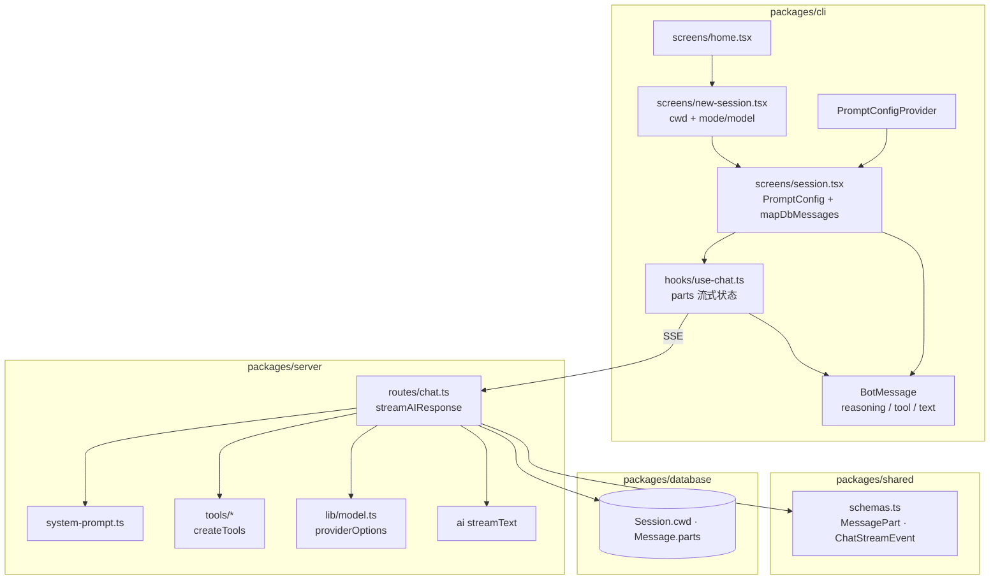
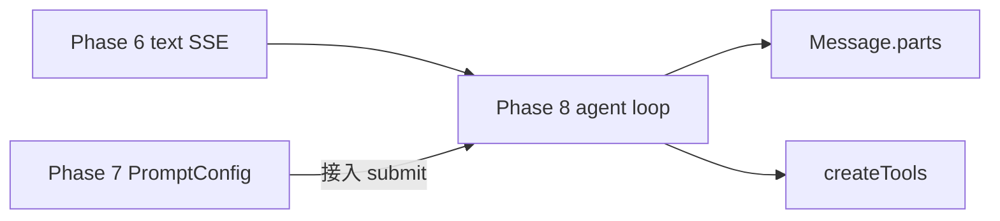
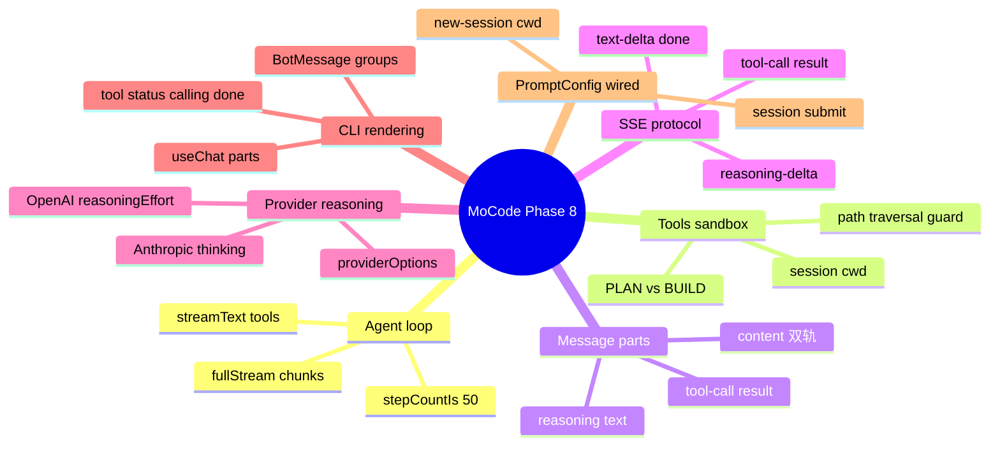
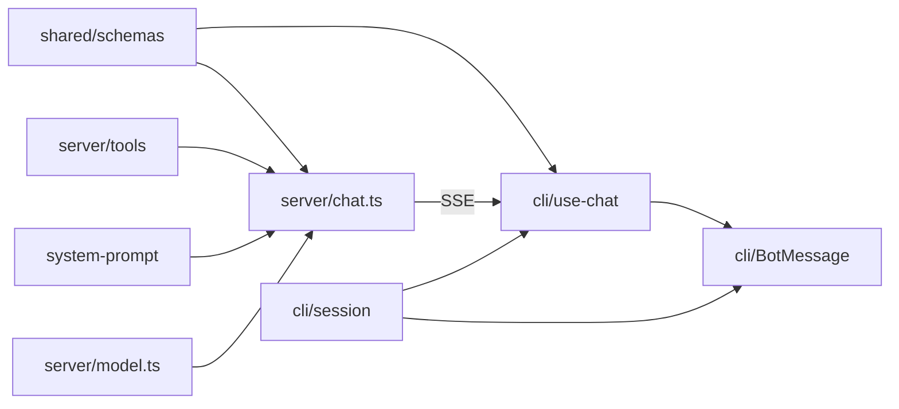
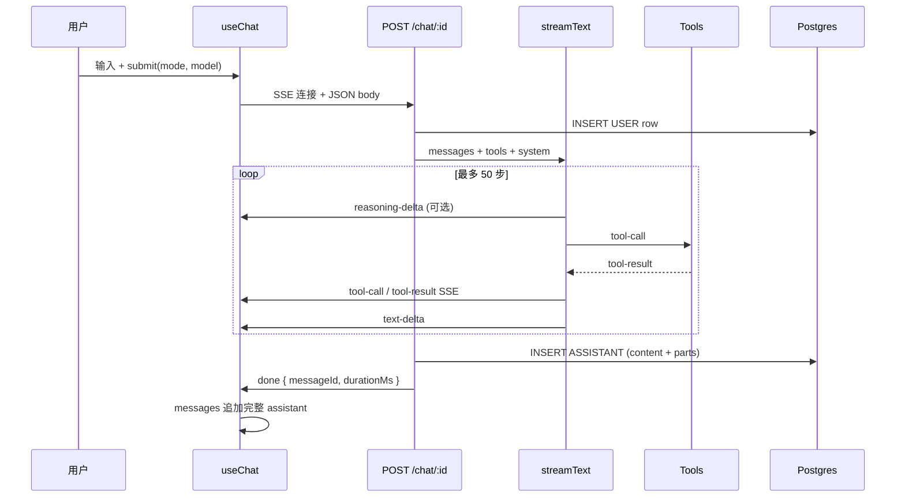
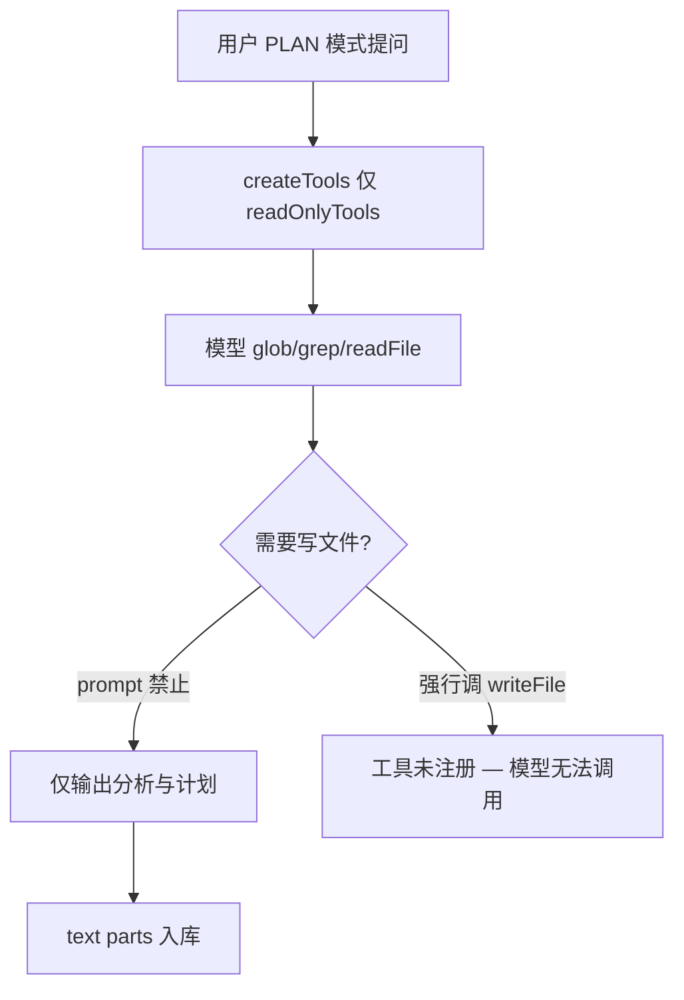
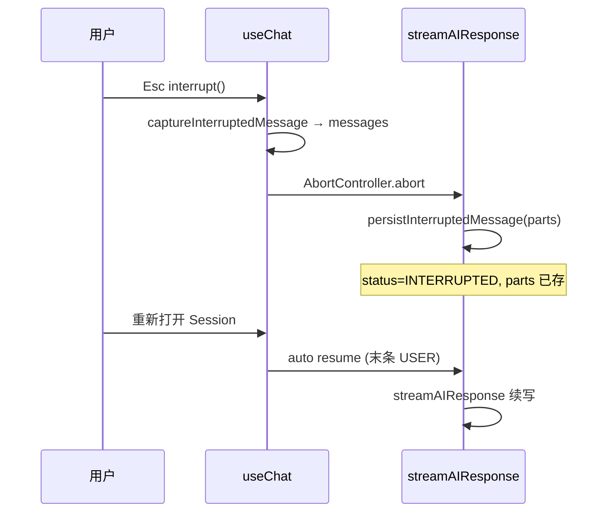
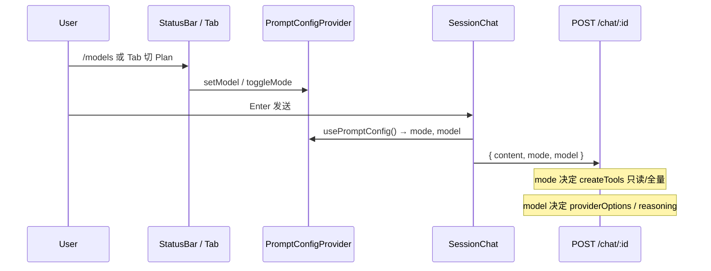
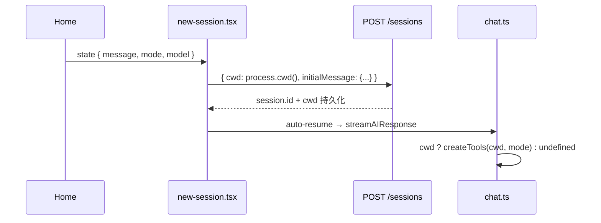
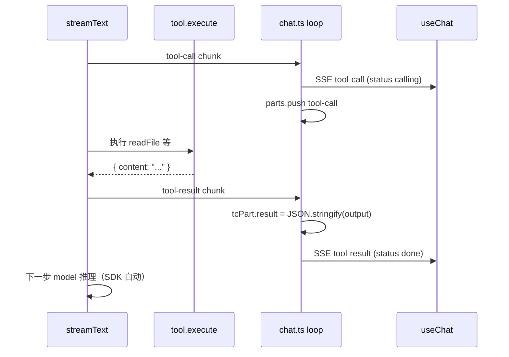

Phase 6 只有纯文本 SSE，Phase 7 的 PromptConfig 也未接到 submit。本阶段将 MoCode 升级为 **终端 Agent**：Server 在 `session.cwd` 下注册 **7 个 Vercel AI SDK tools**（PLAN 只读 / BUILD 可写 + bash），`streamText` 多步循环（最多 50 步），并把 **reasoning / tool-call / text** 写入 `Message.parts` JSON 同时推送 SSE。CLI **`useChat`** 解析新事件类型，**`BotMessage`** 展示 Thinking 与工具调用行；**`session.tsx`** **/** **`new-session.tsx`** finally 读取 PromptConfig 并在建会话时写入 **`cwd: process.cwd()`**。各 Provider 在 **`model.ts`** 配置 **`providerOptions`** 以启用 reasoning 流。


---


## 目录

1. 背景与目标
2. 技术选型
3. 架构总览
4. 知识点思维导图
5. 模块与关键代码
6. 核心流程
7. 知识点详解（含官方文档与用法）
8. 文件索引
9. 开发与调试

---


## 1. 背景与目标


### 要做什么


| 能力                                                  | 状态 | 说明                                                                      |
| --------------------------------------------------- | -- | ----------------------------------------------------------------------- |
| Agent 工具注册 `createTools(cwd, mode)`                 | ✅  | PLAN 4 只读；BUILD + writeFile / editFile / bash                           |
| System Prompt `buildSystemPrompt`                   | ✅  | 按 Mode 注入角色、工具规则、响应格式                                                   |
| `streamText` 多步工具循环                                 | ✅  | `stopWhen: stepCountIs(50)`，仅 cwd 存在时启用 tools                           |
| `Message.parts` 持久化                                 | ✅  | reasoning · tool-call · text 有序数组                                       |
| SSE：`reasoning-delta` / `tool-call` / `tool-result` | ✅  | Server 推送 + Shared Zod 校验                                               |
| CLI 流式渲染 reasoning / tool                           | ✅  | `useChat` switch + `BotMessage` 分组 UI                                   |
| Provider reasoning 配置                               | ✅  | Anthropic / OpenAI / Google / Cerebras / OpenRouter                     |
| 会话 `cwd` 绑定工具沙箱                                     | ✅  | `new-session` 写入 `process.cwd()`                                        |
| PromptConfig 接入 submit                              | ✅  | `session.tsx` 读 `usePromptConfig()`                                     |
| 新建 Session 传 mode/model                             | ✅  | `home` → `new-session` router state                                     |
| 中断时保存 parts                                         | ✅  | Server `persistInterruptedMessage` + Client `captureInterruptedMessage` |
| 关键路径英文源码注释                                          | ✅  | tools · chat · model · use-chat · schemas 等                             |
| LLM 历史含 tool 消息                                     | ❌  | `buildConversationHistory` 仍只用 `content` 字符串                            |
| System prompt 注入 cwd 路径                             | ❌  | 参数预留，prompt 未展示实际目录                                                     |
| bash 命令白名单 / 用户确认                                   | ❌  | 任意 shell 命令                                                             |
| grep 走 ripgrep / 尊重 .gitignore                      | ❌  | Bun.Glob 自研扫描                                                           |
| editFile 唯一匹配校验                                     | ⚠️ | 全局 replace，0 匹配才报错                                                      |
| `activeResumeSessionIds.add`                        | ❌  | Phase 6 起仅有 `has`/`delete`，防重复 resume 未生效                               |
| Groq 模型 reasoning 配置                                | ❌  | 无 `providerOptions` 条目                                                  |


### 非目标（本阶段不做）

- 将 tool-call/result 序列化进 LLM `messages` 历史（多轮 tool 上下文）
- MCP 外部工具集成
- Tool 执行权限分级 / 用户逐条 approve
- 流式 Markdown 渲染、diff 预览
- Agent 子进程（Task tool）
- 修改 Prisma Schema（`parts` / `cwd` 字段 Phase 4 已存在）

---


## 2. 技术选型


| 层级            | 选择                                                      | 理由                                                  |
| ------------- | ------------------------------------------------------- | --------------------------------------------------- |
| Agent 抽象      | **Vercel AI SDK 6** **`streamText`** **+** **`tool()`** | 与 Phase 6 同一栈；原生 multi-step、`fullStream` 多 chunk 类型 |
| 步数上限          | **`stepCountIs(50)`**                                   | 防止 tool 死循环；仅在有 tools 时启用                           |
| 工具实现          | **Bun 原生 API**（`Bun.spawn` · `Bun.Glob`）                | 无额外依赖；与 Server 运行时一致                                |
| 路径沙箱          | **`resolve(cwd, path)`** **+** **`startsWith(cwd)`**    | 简单前缀校验；所有 file tools 统一规则                           |
| 结构化存储         | **Prisma** **`Message.parts Json?`**                    | 已有字段；Zod `messagePartsSchema` 入库前校验                 |
| 双轨 content    | **`content`** **= text parts 拼接**                       | 兼容 Phase 6 LLM 历史构建；UI 读 `parts`                    |
| Reasoning     | **各 Provider** **`providerOptions`**                    | SDK 统一 `reasoning-delta`；无需自解析 raw API              |
| System Prompt | **字符串拼接** **`buildSystemPrompt`**                       | 轻量；Mode 分支与 `createTools` 工具列表对齐                    |
| CLI part 状态   | **`ClientToolCallPart.status`**                         | 流式 UI 专用；DB 加载时补 `done`                             |


---


## 3. 架构总览


### 3.1 分层图





### 3.2 依赖方向（单向）


```plain text
packages/cli
  → @mocode/shared（schemas · models）
  → @mocode/database/enums（Mode · MessageStatus）
  → Hono RPC apiClient

packages/server/routes/chat.ts
  → ../tools（createTools）
  → ../system-prompt（buildSystemPrompt）
  → ../lib/model（resolveChatModel）
  → @mocode/shared（MessagePart · chatStreamEventSchema）
  → @mocode/database

tools/*
  → ai（tool）
  → zod（inputSchema）
  → 不依赖 chat 路由（无循环）
```


**原则**：工具沙箱以 **`Session.cwd`** 为根；**无 cwd 则 tools = undefined**，退化为 Phase 6 纯文本聊天。


### 3.3 相对 Phase 6 / Phase 7 的边界


| 用户动作           | Phase 6      | Phase 7                     | Phase 8                        |
| -------------- | ------------ | --------------------------- | ------------------------------ |
| 发消息 mode/model | 硬编码          | PromptConfig 有 UI，submit 未读 | ✅ `session.tsx` 读 PromptConfig |
| 流式 UI          | 仅 text-delta | 同左                          | ✅ reasoning + tool 行           |
| DB 存储          | 仅 `content`  | 同左                          | ✅ `parts` JSON                 |
| Agent 改代码      | ❌            | ❌                           | ✅ BUILD + tools                |
| PLAN 只读分析      | ❌            | Mode 可选                     | ✅ 只读 tool 集                    |





### 3.4 本 Phase 依赖与契约变更


| 变更项                           | 前（Phase 6/7）                 | 后（Phase 8）                            | 说明                                        |
| ----------------------------- | ---------------------------- | ------------------------------------- | ----------------------------------------- |
| `@openrouter/ai-sdk-provider` | ^1.x（AI SDK v2 兼容模式）         | **^2.9.1**                            | 消除 `specificationVersion` 警告；对齐 AI SDK v6 |
| `chatStreamEventSchema`       | 含 reasoning/tool，**CLI 未处理** | CLI **全处理**                           | Phase 6 预留 → Phase 8 落地                   |
| `Message.parts`               | Schema 有字段，**未写入**           | **stream 结束/中断时写入**                   | JSON 数组                                   |
| `streamText` 参数               | 无 `tools` / `system`         | 有                                     | Agent 循环                                  |
| `Session.cwd`                 | API 可选，CLI 未传                | **new-session 传** **`process.cwd()`** | 工具沙箱前提                                    |
| submit body                   | 硬编码 mode/model               | **PromptConfig**                      | 闭合 Phase 7 缺口                             |
| `.env.example`                | 部分 Provider                  | 补全 Google/Groq/Cerebras/OpenRouter 说明 | 与 test:providers 对齐                       |


**新增 Server 源文件**（7 工具 + index + system-prompt）见 §8 文件索引。


---


## 4. 知识点思维导图





---


## 5. 模块与关键代码

> 
>
> 现在 MoCode 不只会「聊天」，还能在 **Build 模式**下读文件、改代码、跑命令；**Plan 模式**只能看不能改。模型思考过程和「正在调用某某工具」会在终端里实时显示，刷新页面后也能从历史记录里看到。发消息时会用你在底部状态栏选的 **模型和模式**。
>
>

---


### 5.1 工具注册 — `packages/server/src/tools/index.ts`


**通俗说明**：根据 Agent 模式，决定 AI 能用的「工具箱」里有哪些工具。


**类比**：Plan 模式像只读模式的文件管理器；Build 模式像完整 IDE + 终端。


```typescript
export function createTools(cwd: string, mode: Mode) {
  const readOnlyTools = {
    readFile: createReadFileTool(cwd),
    listDirectory: createListDirectoryTool(cwd),
    grep: createGrepTool(cwd),
    glob: createGlobTool(cwd),
  };

  if (mode === "PLAN") {
    return readOnlyTools;  // 规划模式：禁止写盘和 shell
  }

  return {
    ...readOnlyTools,
    writeFile: createWriteFileTool(cwd),
    editFile: createEditFileTool(cwd),
    bash: createBashTool(cwd),
  };
}
```


| 关键点              | 用人话说                              |
| ---------------- | --------------------------------- |
| `cwd` 来自 Session | 创建会话时 CLI 写入 `process.cwd()`      |
| 工具名 camelCase    | 与 system prompt 中列名一致（readFile 等） |
| 工厂模式             | 每个 tool 闭包绑定 cwd，execute 内做路径校验   |


---


### 5.2 文件类工具沙箱 — 以 `read-file.ts` 为例


**通俗说明**：所有读写都限制在当前项目文件夹里，防止 AI 读到系统敏感路径。


```typescript
const resolved = resolve(cwd, path);
const rel = relative(cwd, resolved);

// 拒绝 ../ 穿越
if (rel.startsWith("..") || ...) {
  return { error: "Path is outside the project directory" };
}
// 二次前缀校验
if (!resolved.startsWith(cwd)) {
  return { error: "Path is outside the project directory" };
}
```


| 工具            | 限制       | 说明                                   |
| ------------- | -------- | ------------------------------------ |
| readFile      | 10KB 截断  | 返回 `truncated: true` + `totalLength` |
| glob          | 200 文件   | 跳过 `node_modules`                    |
| grep          | 50 匹配    | 可选 `glob` 过滤；跳过 `node_modules`       |
| listDirectory | 隐藏项      | 跳过 `.` 开头与 `node_modules`            |
| writeFile     | mkdir -p | 自动创建父目录                              |
| editFile      | 0 匹配报错   | 全局 replace 所有 `oldString`            |
| bash          | 30s 默认超时 | stdout/stderr 各截断 20KB               |


---


### 5.3 System Prompt — `packages/server/src/system-prompt.ts`


**通俗说明**：每次请求前塞给模型的「岗位说明书」——该怎么想、能用哪些工具、回复格式。


**类比**：员工手册 + 工具清单 + 汇报模板，三者必须和 `createTools` 注册表一致。


**完整段落结构**（按拼接顺序）：


| 序号 | 段落标题                             | PLAN | BUILD | 说明                                            |
| -- | -------------------------------- | ---- | ----- | --------------------------------------------- |
| 1  | `# Role`                         | ✅    | ✅     | 终端环境里的资深工程师角色                                 |
| 2  | `# Mode: PLAN` / `# Mode: BUILD` | 二选一  | 二选一   | 核心行为约束（PLAN 禁止写盘）                             |
| 3  | `# Thinking Process`             | ✅    | ✅     | Understand → Explore → Analyze → Plan/Execute |
| 4  | `# Available Tools`              | 4 工具 | 7 工具  | **必须与** **`createTools`** **名称一致**            |
| 5  | `# Code Style & Best Practices`  | ✅    | ✅     | 最小改动、不滥加依赖                                    |
| 6  | `# Response Format`              | 5 段式 | 4 段式  | 强制 Markdown 结构                                |
| 7  | `# Final Reminders`              | ✅    | ✅     | 简洁、追问、生产质量                                    |


```typescript
export function buildSystemPrompt({ mode }: SystemPromptParams): string {
  const parts: string[] = [];

  // 1. 角色 + 双模式说明
  parts.push(`# Role ... PLAN / BUILD ...`);

  // 2. Mode 分支 — 行为约束
  if (mode === "PLAN") {
    parts.push(`# Mode: PLAN ... Do NOT make any file modifications`);
  } else {
    parts.push(`# Mode: BUILD ... read before edit ... verify when appropriate`);
  }

  // 3. 共享思考流程
  parts.push(`# Thinking Process ... Explore → Analyze → Plan/Execute`);

  // 4. 工具列表 — PLAN 仅 readFile/listDirectory/glob/grep
  if (mode === "PLAN") { /* 4 tools */ } else { /* + writeFile/editFile/bash */ }

  // 5–7. 代码规范、响应格式、Final Reminders
  ...
  return parts.join("\n");
}
```


| 关键点        | 用人话说                                   |
| ---------- | -------------------------------------- |
| `cwd` 参数预留 | 尚未写入 prompt 正文；模型不知道绝对路径字符串            |
| 与 tools 对齐 | PLAN 段不列 bash/writeFile，否则模型会「幻觉」调用    |
| 响应模板       | PLAN 五段式 / BUILD 四段式，影响最终 text part 结构 |
| 维护成本       | 增删工具时需同时改 `tools/index.ts` 与本文件        |


---


### 5.4 Chat 路由 Agent 循环 — `packages/server/src/routes/chat.ts`


**通俗说明**：收到用户消息后，启动 AI 生成；AI 可以多次调工具，每次调工具的结果再喂回模型，直到说出最终答案。


**类比**：项目经理（`streamText`）可以反复派实习生（tools）去查资料、改文件，汇总后再回复你。


```typescript
const parts: MessagePart[] = [];
const tools = cwd ? createTools(cwd, mode) : undefined;

const result = aiStreamText({
  model: resolvedModel.model,
  messages: history,
  abortSignal: abortController.signal,
  providerOptions: resolvedModel.providerOptions,
  tools,
  system: buildSystemPrompt({ cwd, mode }),
  stopWhen: tools ? stepCountIs(50) : undefined,
});

for await (const chunk of result.fullStream) {
  if (stream.aborted) break;

  // reasoning-delta：合并到 parts 末尾 reasoning 段，并推 SSE
  if (chunk.type === "reasoning-delta") {
    const last = parts[parts.length - 1];
    if (last && last.type === "reasoning") last.text += chunk.text;
    else parts.push({ type: "reasoning", text: chunk.text });
    await stream.writeSSE({ event: "reasoning-delta", data: JSON.stringify({ type: "reasoning-delta", text: chunk.text }) });
  }

  // text-delta：同上，合并 text 段
  if (chunk.type === "text-delta") { /* ... */ }

  // tool-call：Zod 校验 args，push 新 part（result 稍后填充）
  if (chunk.type === "tool-call") {
    const args = toolCallArgsSchema.parse(chunk.input);
    parts.push({ type: "tool-call", id: chunk.toolCallId, name: chunk.toolName, args });
    await stream.writeSSE({ event: "tool-call", data: ... });
  }

  // tool-result：按 toolCallId 找到 part，写入 result 字符串
  if (chunk.type === "tool-result") {
    const resultStr = typeof chunk.output === "string" ? chunk.output : JSON.stringify(chunk.output);
    const tcPart = parts.find(p => p.type === "tool-call" && p.id === chunk.toolCallId);
    if (tcPart) tcPart.result = resultStr;
    await stream.writeSSE({ event: "tool-result", data: ... });
  }
}

// 正常结束：content = 所有 text part 拼接；parts = 完整 JSON
const fullText = parts.filter(p => p.type === "text").map(p => p.text).join("");
const validateParts = parts.length > 0 ? messagePartsSchema.parse(parts) : undefined;
await db.message.create({ data: { content: fullText, parts: validateParts, status: COMPLETE, ... } });
```


| 关键点                         | 用人话说                                                     |
| --------------------------- | -------------------------------------------------------- |
| `fullStream` 非 `textStream` | 才能收到 reasoning / tool 事件                                 |
| 相邻 delta 合并                 | 减少 parts 数组长度与 CLI re-render                             |
| `messagePartsSchema.parse`  | 入库前 Zod 校验 JSON 形状                                       |
| 无 cwd                       | 不传 tools，等同 Phase 6 纯聊天                                  |
| `content` 双轨                | LLM 历史仍读 content；UI 读 parts                              |
| AI SDK 自动 loop              | tool 执行完后 SDK 把 result 塞回 messages，进入下一步直到无 tool 或达 50 步 |


### 5.4.1 中断持久化 — `persistInterruptedMessage`


**通俗说明**：用户 Esc 或断网时，把已经流出来的 thinking / tool / text 存进 DB，避免全丢。


```typescript
const persistInterruptedMessage = async () => {
  // content 列只存 text parts（reasoning/tool 不进 LLM 历史字符串）
  const fullText = parts
    .filter((p) => p.type === "text")
    .map((p) => p.text)
    .join("");

  if (fullText.length === 0 && parts.length === 0) return;

  const validateParts = parts.length > 0 ? messagePartsSchema.parse(parts) : undefined;

  await db.message.create({
    data: {
      sessionId,
      role: "ASSISTANT",
      status: MessageStatus.INTERRUPTED,
      content: fullText,
      parts: validateParts,  // 含 reasoning + tool-call（含 partial result）
      model,
      mode,
      duration: Math.round((Date.now() - startTime) / 1000),
    },
  });
};
```


| 触发路径                                       | 说明                                                  |
| ------------------------------------------ | --------------------------------------------------- |
| `stream.aborted` / `abortSignal`           | 客户端 AbortController                                 |
| `catch` 中 `abortController.signal.aborted` | 同上                                                  |
| 与 CLI 关系                                   | Client `captureInterruptedMessage` 镜像 UI；刷新后以 DB 为准 |


---


### 5.5 Provider Reasoning — `packages/server/src/lib/model.ts`


**通俗说明**：让支持「思考过程」的模型把推理 token 也流式吐出来，终端里显示为 Thinking 块。


```typescript
const ANTHROPIC_PROVIDER_OPTIONS = {
  "claude-sonnet-4-6": {
    anthropic: { thinking: { type: "adaptive", display: "summarized" } },
  },
  // Haiku 仍用 budgetTokens；OpenAI 用 reasoningEffort；Gemini 用 includeThoughts ...
};

export type ResolvedModel = {
  model: LanguageModel;
  providerOptions?: ProviderOptions;  // 传给 streamText
  ...
};
```


| Provider   | 代表模型              | 配置要点                                           |
| ---------- | ----------------- | ---------------------------------------------- |
| Anthropic  | Sonnet/Opus 4.6   | `adaptive` + `display: "summarized"`           |
| Anthropic  | Haiku 4.5         | `enabled` + `budgetTokens: 10000`              |
| OpenAI     | gpt-5.4 系列        | `reasoningEffort` + `reasoningSummary: "auto"` |
| Google     | gemini-2.5-flash  | `thinkingConfig.includeThoughts`               |
| Cerebras   | gpt-oss-120b      | `reasoningEffort: "medium"`                    |
| OpenRouter | gpt-oss-120b:free | `reasoning.enabled`                            |


---


### 5.6 Shared 协议 — `packages/shared/src/schemas.ts`


**通俗说明**：前后端共用的「流式消息格式合同」。


```typescript
export const messagePartSchema = z.discriminatedUnion("type", [
  z.object({ type: z.literal("reasoning"), text: z.string() }),
  z.object({ type: z.literal("tool-call"), id, name, args, result: z.string().optional() }),
  z.object({ type: z.literal("text"), text: z.string() }),
]);

export const chatStreamEventSchema = z.discriminatedUnion("type", [
  z.object({ type: z.literal("text-delta"), text: z.string() }),
  z.object({ type: z.literal("reasoning-delta"), text: z.string() }),
  z.object({ type: z.literal("tool-call"), toolCallId, toolName, args }),
  z.object({ type: z.literal("tool-result"), toolCallId, result: z.string() }),
  z.object({ type: z.literal("done"), messageId, durationMs }),
  z.object({ type: z.literal("error"), message: z.string() }),
]);
```


| 字段                | Server          | CLI                                 |
| ----------------- | --------------- | ----------------------------------- |
| `MessagePart`     | 持久化到 DB         | 加载时 tool-call 补 `status: "done"`    |
| `ChatStreamEvent` | SSE `data` JSON | `useChat` parse 后更新 streaming.parts |


---


### 5.7 CLI `useChat` — `packages/cli/src/hooks/use-chat.ts`


**通俗说明**：客户端 SSE 解码器，把各类事件拼成 `ClientMessagePart[]` 给 BotMessage 渲染。


**类比**：直播字幕员——把服务器发来的多种「字幕轨」（思考、工具、正文）拼成一条时间线。


```typescript
// SSE 管道：bytes → UTF-8 → EventSource 帧 → JSON → Zod
const stream = response
  .body!.pipeThrough(new TextDecoderStream())
  .pipeThrough(new EventSourceParserStream());

for await (const { data } of stream) {
  const event = chatStreamEventSchema.parse(JSON.parse(data));

  switch (event.type) {
    case "reasoning-delta": {
      const last = parts[parts.length - 1];
      if (last && last.type === "reasoning") last.text += event.text;
      else parts.push({ type: "reasoning", text: event.text });
      emitParts(requestId, parts);
      break;
    }
    case "tool-call": {
      parts.push({
        type: "tool-call",
        id: event.toolCallId,
        name: event.toolName,
        args: event.args,
        status: "calling",  // 客户端专用字段，不入 DB
      });
      emitParts(requestId, parts);
      break;
    }
    case "tool-result": {
      const tcPart = parts.find(
        (p): p is ClientToolCallPart => p.type === "tool-call" && p.id === event.toolCallId
      );
      if (tcPart) {
        tcPart.result = event.result;
        tcPart.status = "done";
      }
      emitParts(requestId, parts);
      break;
    }
    case "text-delta": { /* 合并 text part */ break; }
    case "done": {
      updateMessage(/* 用 event.messageId 写入 messages，parts 快照 */);
      return;
    }
  }
}
```


| 关键点                         | 用人话说                                                 |
| --------------------------- | ---------------------------------------------------- |
| `streaming.parts`           | 流式行；`done` 前不在 `messages` 里                          |
| `emitParts`                 | 同步写 ref + setStreaming，驱动临时 BotMessage               |
| `captureInterruptedMessage` | Esc 时客户端也保留 parts（见 5.12）                            |
| `requestId`                 | Phase 6 竞态守卫；abort 后旧 SSE 帧丢弃                        |
| `parts.length === 0` 时      | 临时 BotMessage 不渲染，仅 SessionShell Spinner（Phase 6 行为） |


---


### 5.8 CLI `BotMessage` — `packages/cli/src/components/messages/bot-message.tsx`


**通俗说明**：助手消息不再是一坨纯文本，而是分段展示：思考、工具、正文。


```typescript
/** camelCase 工具名 → 「Read File」便于终端阅读 */
function formatToolName(name: string): string {
  return name
    .replace(/([a-z0-9])([A-Z])/g, "$1 $2")
    .replace(/^./, (m) => m.toUpperCase());
}

/** 参数值拼成一行：path / pattern / command */
function formatToolArgs(toolCall: ClientToolCallPart): string {
  return Object.values(toolCall.args).map(String).join(" ");
}

/** 相邻同 type 的 part 合成一组，共享外层 padding */
function groupConsecutiveParts(parts: ClientMessagePart[]): PartGroup[] {
  const groups: PartGroup[] = [];
  for (const [i, part] of parts.entries()) {
    const lastGroup = groups[groups.length - 1];
    if (lastGroup && lastGroup.type === part.type) {
      lastGroup.parts.push(part);
    } else {
      // tool-call 用 id 作 key，避免 React reconciliation 错乱
      const key = part.type === "tool-call" ? `group-tc-${part.id}` : `group-${part.type}-${i}`;
      groups.push({ type: part.type, parts: [part], key });
    }
  }
  return groups;
}
```


| UI 元素    | 样式                                | 行为                                                 |
| -------- | --------------------------------- | -------------------------------------------------- |
| Thinking | `colors.thinkingBorder` 左边框 + DIM | `Thinking:` + reasoning text                       |
| Tool     | 同左边框 + `colors.info` 工具名          | `Read File: packages/foo.ts ...`；calling 时后缀 `...` |
| Text     | 正常 padding                        | 最终用户可见回复                                           |
| Footer   | mode · model · duration           | interrupted 时 DIM + 文案 `interrupted`               |


| 渲染时机 | `parts` 来源                | `streaming` prop          |
| ---- | ------------------------- | ------------------------- |
| 历史消息 | `messages[].parts`（DB 加载） | `false`                   |
| 流式行  | `streaming.parts`         | `true`（footer 无 duration） |


---


### 5.9 bash 工具 — `packages/server/src/tools/bash.ts`


**通俗说明**：在 project 目录里跑 shell 命令，用于 test / build / git 等。


**类比**：BUILD 模式下的「远程终端」，但没有交互式 TTY。


```typescript
export function createBashTool(cwd: string) {
  return tool({
    inputSchema: z.object({
      command: z.string(),
      timeout: z.number().default(30_000),
    }),
    execute: async ({ command, timeout }) => {
      const proc = Bun.spawn(["bash", "-c", command], {
        cwd,
        stdout: "pipe",
        stderr: "pipe",
        env: { ...process.env, TERM: "dumb" },  // 减少 ANSI 噪声
      });
      const timer = setTimeout(() => proc.kill(), timeout);
      const [stdout, stderr] = await Promise.all([
        new Response(proc.stdout).text(),
        new Response(proc.stderr).text(),
      ]);
      const exitCode = await proc.exited;
      clearTimeout(timer);
      return {
        stdout: truncate(stdout, 20_000),
        stderr: truncate(stderr, 20_000),
        exitCode,
      };
    },
  });
}
```


| 返回值字段               | 说明                                         |
| ------------------- | ------------------------------------------ |
| `stdout` / `stderr` | 超 20KB 截断，附 `...(truncated,N total chars)` |
| `exitCode`          | 模型可据此判断命令成败                                |
| `error`             | spawn 失败时返回，非 exitCode 非零                  |


| 风险   | 现状                                   |
| ---- | ------------------------------------ |
| 任意命令 | 无白名单；依赖 BUILD mode + prompt 约束       |
| 超时后  | `proc.kill()`，无 graceful shutdown 保证 |


---


### 5.10 editFile 工具 — `packages/server/src/tools/edit-file.ts`


**通俗说明**：用「找旧字符串 → 换新字符串」的方式改文件，适合小改动。


```typescript
execute: async ({ path, oldString, newString }) => {
  const content = await readFile(resolved, "utf-8");
  const occurrences = content.split(oldString).length - 1;
  if (occurrences === 0) {
    return { error: `No occurrences of "${oldString}" found in${path}` };
  }
  // ⚠️ 全局 replace；oldString 含正则特殊字符可能误匹配
  const updated = content.replace(new RegExp(oldString, "g"), newString);
  await writeFile(resolved, updated, "utf-8");
  return { success: true, path: relative(cwd, resolved) };
}
```


| 关键点                 | 用人话说                                         |
| ------------------- | -------------------------------------------- |
| 0 匹配                | 返回 error，不会 silent no-op                     |
| 多匹配                 | **全部**替换，无「仅第一处」模式                           |
| `RegExp(oldString)` | `$` `(` 等字符需模型转义，否则行为异常                      |
| 首选场景                | system prompt 要求小改动优先 editFile，大改才 writeFile |


---


### 5.11 grep 工具 — `packages/server/src/tools/grep.ts`


**通俗说明**：在项目里用正则搜代码，类似简化版 ripgrep。


```typescript
inputSchema: z.object({
  pattern: z.string(),           // 正则，如 "createTools"
  path: z.string().default("."), // 搜索根，相对 cwd
  glob: z.string().optional(),   // 如 "**/*.ts"
}),

execute: async ({ pattern, path, glob: fileGlob }) => {
  const regex = new RegExp(pattern);
  const searchGlob = new Bun.Glob(fileGlob ?? "**/*");
  // 逐文件读入，逐行 test；跳过 node_modules；最多 50 条
  return { matches: [{ file, line, content }], truncated?: true };
}
```


| 限制           | 值                 | 影响                    |
| ------------ | ----------------- | --------------------- |
| MAX_RESULTS  | 50                | 超出设 `truncated: true` |
| node_modules | 硬跳过               | 可能漏掉 monorepo 边缘依赖    |
| .gitignore   | 未读                | 会搜到 dist / build 产物   |
| 二进制文件        | readFile 失败则 skip | 静默 continue           |


---


### 5.12 中断双写 — Server + Client


**通俗说明**：Esc 时 UI 立刻有 partial 消息；Server 也写 INTERRUPTED 行，刷新后以 DB 为准。


```typescript
// Client — use-chat.ts
const captureInterruptedMessage = (activeStream: ActiveStream) => {
  if (activeStream.interruptedCaptured || activeStream.parts.length === 0) return;
  activeStream.interruptedCaptured = true;
  const parts = [...activeStream.parts];
  const fullText = parts.filter(p => p.type === "text").map(p => p.text).join("");
  updateMessage(prev => [...prev, {
    id: crypto.randomUUID(),  // ⚠️ 与 DB id 不同，刷新后被替换
    role: "assistant",
    content: fullText,
    parts,
    interrupted: true,
    mode: activeStream.mode,
    model: activeStream.model,
  }]);
};
```


| 场景            | Client 行 id  | DB 行 id                   | 用户刷新后   |
| ------------- | ------------ | ------------------------- | ------- |
| Esc interrupt | 随机 UUID      | Server 写入新 UUID           | 仅见 DB 行 |
| 断网            | 可能无 Client 行 | Server persistInterrupted | DB 为准   |


---


### 5.13 mapDbMessages — `packages/cli/src/screens/session.tsx`


**通俗说明**：打开历史 Session 时，把 Postgres 里的 JSON 转成 UI 能画的 parts。


```typescript
function mapDbMessages(dbMessages: SessionData["messages"]): Message[] {
  return dbMessages.map((msg) => {
    if (msg.role === "ASSISTANT") {
      const parsedParts = msg.parts === null ? null : messagePartsSchema.safeParse(msg.parts);
      const parts: ClientMessagePart[] = parsedParts?.success
        ? parsedParts.data.map((p) =>
            p.type === "tool-call" ? { ...p, status: "done" as const } : p
          )
        : [];  // parse 失败 → 空 parts，但 content 字符串仍在

      return {
        id: msg.id,
        role: "assistant",
        content: msg.content,
        parts,
        duration: msg.duration != null ? prettyMs(msg.duration * 1000) : undefined,
        interrupted: msg.status === MessageStatus.INTERRUPTED,
        mode: msg.mode,
        model: msg.model as SupportedChatModelId,
      };
    }
    // USER / ERROR 分支略
  });
}
```


| 关键点                          | 用人话说                                     |
| ---------------------------- | ---------------------------------------- |
| `safeParse` 失败               | 不 crash；assistant 退化为仅 content 文本        |
| tool-call 补 `status: "done"` | DB 无此字段；历史消息不显示 `...`                    |
| `duration * 1000`            | DB 存秒，prettyMs 要毫秒                       |
| `initialMessages` 只算一次       | 后续 turns 由 useChat 追加，不 re-fetch session |


---


### 5.14 PromptConfig 接入 — `session.tsx` · `new-session.tsx` · `home.tsx`


**通俗说明**：Phase 7 选好的模式和模型，Phase 8 终于接到「真正发消息」和「建会话」上了。


```typescript
// session.tsx
const { mode, model } = usePromptConfig();
submit({ userText: text, mode, model });

// new-session.tsx — 创建时绑定工作目录，启用 agent tools
json: {
  cwd: process.cwd(),
  initialMessage: { content, model: state.model, mode: state.mode },
}

// home.tsx — 把 PromptConfig 带进新建会话路由
navigate("/sessions/new", { state: { message: text, mode, model } });
```


---


### 5.15 模块关系总览





| 模块                  | 一句话职责                     |
| ------------------- | ------------------------- |
| `createTools`       | cwd 沙箱 + Mode 分流          |
| `streamAIResponse`  | Agent 循环 + parts 累积 + SSE |
| `buildSystemPrompt` | Mode 行为约束                 |
| `resolveChatModel`  | SDK 模型 + reasoning 配置     |
| `useChat`           | SSE → ClientMessagePart[] |
| `BotMessage`        | parts → 终端 UI             |
| `mapDbMessages`     | DB parts → 客户端 shape      |


---


## 6. 核心流程


### 6.1 BUILD 模式：用户提问 → 工具循环 → 持久化





### 6.2 PLAN 模式：只读探索





### 6.3 中断与恢复





### 6.4 带 PromptConfig 的 submit（闭合 Phase 7）





### 6.5 新建 Session 写入 cwd（工具启用条件）




> **注意**：若 CLI 在 `$HOME` 启动而项目在 `/path/to/repo`，`cwd` 会是 HOME 而非 repo——应在目标项目目录下启动 CLI。

### 6.6 tool-result 回填时序（单步）





---


## 7. 知识点详解（含官方文档与用法）

> 每节含：**官方文档链接 · API/用法 · MoCode 落点**

### 7.1 Vercel AI SDK — `tool()` 与 multi-step


| 概念                                            | 说明                               | 参考                                                                                         |
| --------------------------------------------- | -------------------------------- | ------------------------------------------------------------------------------------------ |
| `tool({ description, inputSchema, execute })` | 定义模型可调函数                         | [AI SDK Tools](https://ai-sdk.dev/docs/ai-sdk-core/tools-and-tool-calling)                 |
| `streamText({ tools, stopWhen })`             | 自动 tool 循环                       | [stepCountIs](https://ai-sdk.dev/docs/ai-sdk-core/tools-and-tool-calling#multi-step-calls) |
| `fullStream`                                  | 含 reasoning / tool / text chunks | [Stream Protocol](https://ai-sdk.dev/docs/ai-sdk-core/streaming)                           |


**MoCode 落点**：`packages/server/src/tools/*.ts` — 各 tool 工厂；`chat.ts` — `stepCountIs(50)`


---


### 7.2 Provider Options — Reasoning / Thinking


| Provider  | 选项                                     | 参考                                                                                    |
| --------- | -------------------------------------- | ------------------------------------------------------------------------------------- |
| Anthropic | `thinking.type` · `display`            | [Anthropic Provider](https://ai-sdk.dev/providers/ai-sdk-providers/anthropic)         |
| OpenAI    | `reasoningEffort` · `reasoningSummary` | [OpenAI Provider](https://ai-sdk.dev/providers/ai-sdk-providers/openai)               |
| Google    | `thinkingConfig.includeThoughts`       | [Google Provider](https://ai-sdk.dev/providers/ai-sdk-providers/google-generative-ai) |


**MoCode 落点**：`packages/server/src/lib/model.ts` — `*_PROVIDER_OPTIONS` 常量表


---


### 7.3 Zod Discriminated Union — 协议校验


```typescript
z.discriminatedUnion("type", [ /* 各 type literal */ ])
```


**MoCode 落点**：

- `messagePartSchema` — DB 写入前校验
- `chatStreamEventSchema` — CLI SSE parse

参考：[Zod discriminatedUnion](https://zod.dev/?id=discriminated-unions)


---


### 7.4 Bun.spawn / Bun.Glob


| API                                      | 用途             | MoCode 落点                         |
| ---------------------------------------- | -------------- | --------------------------------- |
| `Bun.spawn(["bash","-c", cmd], { cwd })` | bash tool      | `tools/bash.ts`                   |
| `new Bun.Glob(pattern).scan({ cwd })`    | glob / grep 扫描 | `tools/glob.ts` · `tools/grep.ts` |


参考：[Bun Shell](https://bun.sh/docs/runtime/shell) · [Bun Glob](https://bun.sh/docs/runtime/glob)


---


### 7.5 OpenTUI — 分段消息 UI


| 概念                                  | 说明                  | 参考                         |
| ----------------------------------- | ------------------- | -------------------------- |
| `customBorderChars` + `EmptyBorder` | 仅左边框 `┃`            | 项目 `components/border.tsx` |
| `TextAttributes.DIM`                | Thinking / Tool 行降权 | OpenTUI core               |
| `colors.thinking` / `colors.info`   | 思考 vs 工具 accent     | ThemeProvider Phase 2      |


**MoCode 落点**：`bot-message.tsx` — `groupConsecutiveParts` 避免连续 tool 行重复大段 padding


---


### 7.6 EventSourceParserStream — 客户端 SSE 解析


Phase 6 引入，Phase 8 事件类型增多，解析逻辑不变：


```typescript
const stream = response
  .body!.pipeThrough(new TextDecoderStream())
  .pipeThrough(new EventSourceParserStream());

for await (const { data } of stream) {
  const event = chatStreamEventSchema.parse(JSON.parse(data));
  // switch event.type — 共 6 种
}
```


| 步骤                            | 作用                  |
| ----------------------------- | ------------------- |
| `TextDecoderStream`           | Uint8Array → string |
| `EventSourceParserStream`     | 按 SSE 规范拆 `data:` 帧 |
| `chatStreamEventSchema.parse` | 防止畸形帧污染 UI 状态       |


**MoCode 落点**：`packages/cli/src/hooks/use-chat.ts` — `handleStream`


参考：[eventsource-parser](https://github.com/rexxars/eventsource-parser)


---


### 7.7 `fullStream` chunk 类型速查


| chunk.type        | 何时出现                            | Server 动作           | SSE 事件            |
| ----------------- | ------------------------------- | ------------------- | ----------------- |
| `reasoning-delta` | 模型配置了 providerOptions reasoning | 合并 reasoning part   | `reasoning-delta` |
| `text-delta`      | 最终回复 token                      | 合并 text part        | `text-delta`      |
| `tool-call`       | 模型决定调工具                         | push tool-call part | `tool-call`       |
| `tool-result`     | tool.execute 返回                 | 写 `tcPart.result`   | `tool-result`     |
| `error`           | Provider/SDK 错误                 | throw → ERROR 行     | `error`           |
| （流结束）             | 正常完成                            | INSERT ASSISTANT    | `done`            |

> 未监听 `textStream`；必须用 `fullStream` 才能收 reasoning/tool。

---


### 7.8 协议 JSON 样例


### Message.parts（DB 存 `messages.parts` 列）


```json
[
  { "type": "reasoning", "text": "Let me search for createTools first..." },
  {
    "type": "tool-call",
    "id": "call_abc123",
    "name": "grep",
    "args": { "pattern": "createTools", "path": "packages/server" },
    "result": "{\"matches\":[{\"file\":\"packages/server/src/tools/index.ts\",\"line\":18,\"content\":\"export function createTools\"}],\"truncated\":false}"
  },
  { "type": "text", "text": "## Summary\n\nFound createTools in tools/index.ts..." }
]
```


### SSE `data` 帧示例


```plain text
event: tool-call
data: {"type":"tool-call","toolCallId":"call_abc123","toolName":"readFile","args":{"path":"README.md"}}

event: tool-result
data: {"type":"tool-result","toolCallId":"call_abc123","result":"{\"content\":\"# MoCode\\n\"}"}

event: done
data: {"type":"done","messageId":"clxyz...","durationMs":8420}
```


| 字段                   | 注意                                 |
| -------------------- | ---------------------------------- |
| `tool-result.result` | **字符串**；object 会被 `JSON.stringify` |
| `done.messageId`     | Client 必须用此 id 写入 messages，保证刷新一致  |
| `durationMs`         | 毫秒；DB `duration` 为秒                |


---


### 7.9 知识点 ↔︎ 源码 ↔︎ 文档 速查表


| #   | 知识点                     | 文件                              | 官方文档                                                                                                   |
| --- | ----------------------- | ------------------------------- | ------------------------------------------------------------------------------------------------------ |
| 7.1 | AI SDK tools            | `server/tools/*` · `chat.ts`    | [Tool Calling](https://ai-sdk.dev/docs/ai-sdk-core/tools-and-tool-calling)                             |
| 7.2 | providerOptions         | `server/lib/model.ts`           | [Provider Options](https://ai-sdk.dev/docs/ai-sdk-core/provider-options)                               |
| 7.3 | Zod union               | `shared/schemas.ts`             | [zod.dev](https://zod.dev/)                                                                            |
| 7.4 | Bun.spawn/Glob          | `tools/bash.ts` · `glob.ts`     | [bun.sh](https://bun.sh/)                                                                              |
| 7.5 | OpenTUI 分段 UI           | `cli/.../bot-message.tsx`       | OpenTUI                                                                                                |
| 7.6 | EventSourceParserStream | `cli/hooks/use-chat.ts`         | [eventsource-parser](https://github.com/rexxars/eventsource-parser)                                    |
| 7.7 | fullStream chunks       | `server/routes/chat.ts`         | [AI SDK Streaming](https://ai-sdk.dev/docs/ai-sdk-core/streaming)                                      |
| 7.8 | JSON 协议样例               | `shared/schemas.ts`             | 本文 §7.8                                                                                                |
| 7.9 | Message.parts 字段        | `database/prisma/schema.prisma` | [Prisma Json](https://www.prisma.io/docs/orm/prisma-client/special-fields-and-types#working-with-json) |


---


## 8. 文件索引


| 文件                                                     | 层级        | 一句话                                        |
| ------------------------------------------------------ | --------- | ------------------------------------------ |
| `packages/server/src/routes/chat.ts`                   | Server 路由 | Agent 循环、parts 累积、SSE 推送、DB 持久化            |
| `packages/server/src/system-prompt.ts`                 | Server    | Mode 分支 system prompt                      |
| `packages/server/src/tools/index.ts`                   | Server    | 工具注册工厂                                     |
| `packages/server/src/tools/read-file.ts`               | Server    | 读文件 + 10KB 截断                              |
| `packages/server/src/tools/write-file.ts`              | Server    | 写文件 + mkdir                                |
| `packages/server/src/tools/edit-file.ts`               | Server    | 字符串替换编辑                                    |
| `packages/server/src/tools/list-directory.ts`          | Server    | 列目录                                        |
| `packages/server/src/tools/glob.ts`                    | Server    | Glob 找文件                                   |
| `packages/server/src/tools/grep.ts`                    | Server    | 正则搜索                                       |
| `packages/server/src/tools/bash.ts`                    | Server    | Shell 执行                                   |
| `packages/server/src/lib/model.ts`                     | Server    | 多 Provider + providerOptions               |
| `packages/shared/src/schemas.ts`                       | Shared    | MessagePart · ChatStreamEvent Zod          |
| `packages/cli/src/hooks/use-chat.ts`                   | CLI       | 多类型 SSE → parts 状态                         |
| `packages/cli/src/components/messages/bot-message.tsx` | CLI       | reasoning/tool/text UI                     |
| `packages/cli/src/screens/session.tsx`                 | CLI       | mapDbMessages(parts) · PromptConfig submit |
| `packages/cli/src/screens/new-session.tsx`             | CLI       | cwd + mode/model 建会话                       |
| `packages/cli/src/screens/home.tsx`                    | CLI       | 传递 PromptConfig 到 new-session              |
| `packages/server/package.json`                         | 配置        | `@openrouter/ai-sdk-provider` ^2.9.1       |


---


## 9. 开发与调试


### 启动


```bash
# 仓库根目录
bun install

# 终端 1：API（需 Postgres + .env Provider keys）
bun run dev:server

# 终端 2：CLI（在项目目录下启动，cwd 才是有意义的）
cd /path/to/your/project
bun run dev:cli
```


### 环境/配置


| 变量                    | 用途                                      |
| --------------------- | --------------------------------------- |
| `DATABASE_URL`        | Postgres（建议 `sslmode=verify-full`）      |
| `ANTHROPIC_API_KEY` 等 | 各 Provider；见 `.env.example`             |
| `API_URL`             | CLI 连 Server，默认 `http://localhost:3000` |


```bash
# 可选：Provider 连通性
cd packages/server && bun run test:providers
```


### 调试 checklist


| 现象                                 | 排查                                                                      |
| ---------------------------------- | ----------------------------------------------------------------------- |
| 模型不调工具                             | 检查 Session 是否有 `cwd`；是否在 PLAN 且任务需要写                                    |
| 无 Thinking 块                       | 当前 model 是否在 `model.ts` 配了 `providerOptions`                            |
| 工具报 Path outside                   | 路径是否相对项目根；是否含 `..`                                                      |
| bash 无输出                           | 看 `exitCode`；stderr 是否被截断                                               |
| 刷新后 tool 行消失                       | 查 DB `messages.parts` 是否为 null；Zod parse 是否失败                           |
| Esc 后无 interrupted                 | Client `captureInterruptedMessage` + Server `persistInterruptedMessage` |
| 发消息仍用旧 model                       | 确认 `session.tsx` 使用 `usePromptConfig()`                                 |
| OpenRouter 警告 specificationVersion | 确认 `@openrouter/ai-sdk-provider` ≥ 2.9.1                                |
| editFile 改错多处                      | 检查 oldString 是否在文件中出现多次                                                 |
| grep 无结果                           | pattern 是否合法正则；path 是否在 cwd 内                                           |


### 手动测试脚本（建议按序执行）


### 测试 A — cwd 与工具启用

1. 在 **项目根目录** 启动 CLI：`bun run dev:cli`
2. Home 输入：「列出 packages/server/src/tools 目录有什么文件」
3. **预期**：出现 `List Directory` 或 `Glob` 工具行，随后 text 回复
4. SQL 检查：`sessions.cwd` 非 null

### 测试 B — BUILD vs PLAN

1. Tab 切到 **Plan**，问：「帮我在 README 里加一行说明」
2. **预期**：仅有 read/grep 类工具；不应出现 writeFile/bash
3. Tab 切 **Build**，重复类似请求
4. **预期**：可能出现 readFile → editFile 或 bash

### 测试 C — parts 持久化

1. BUILD 模式下触发至少一次 tool-call
2. 等 `done` 完成
3. 退出 Session 再进入同一 `sessionId`
4. **预期**：历史 BotMessage 仍显示 tool 行（无 `...` 后缀）

### 测试 D — Reasoning（需支持的 model）

1. `/models` 选 `claude-sonnet-4-6` 或 `gemini-2.5-flash`
2. 发送需要推理的问题
3. **预期**：流式出现 `Thinking:` 左边框块
4. 刷新后 Thinking 块仍在（在 parts JSON 里）

### 测试 E — 中断

1. 发送会触发多 tool 的长任务
2. 第一个 tool 完成后按 **Esc**
3. **预期**：Footer 显示 `interrupted`；刷新后 DB 行 `status=INTERRUPTED` 且 parts 非空

### 测试 F — PromptConfig 接入

1. `/models` 换成与 default 不同的模型
2. 发一条消息，看 Footer 与 Network 请求体 `model` 字段
3. **预期**：与 StatusBar 一致，非 `DEFAULT_CHAT_MODEL_ID` 硬编码

### 测试 G — 无 cwd 退化（边界）

1. 手动 DB 将某 session 的 `cwd` 置 NULL（或 API 创建时不传 cwd）
2. resume / chat
3. **预期**：仍有 text 流式回复，但 **无 tool-call 事件**

---


## 附录：Agent 工具一览


| 工具名           | PLAN | BUILD | 主要参数                             |
| ------------- | ---- | ----- | -------------------------------- |
| readFile      | ✅    | ✅     | `path`                           |
| listDirectory | ✅    | ✅     | `path`（默认 `.`）                   |
| glob          | ✅    | ✅     | `pattern`, `path`                |
| grep          | ✅    | ✅     | `pattern`, `path`, `glob?`       |
| writeFile     | ❌    | ✅     | `path`, `content`                |
| editFile      | ❌    | ✅     | `path`, `oldString`, `newString` |
| bash          | ❌    | ✅     | `command`, `timeout?`            |


## 附录：SSE 事件一览


| 事件                | payload 要点                       | CLI 行为                    |
| ----------------- | -------------------------------- | ------------------------- |
| `reasoning-delta` | `text`                           | 合并 reasoning part         |
| `text-delta`      | `text`                           | 合并 text part              |
| `tool-call`       | `toolCallId`, `toolName`, `args` | 新增 part，`status: calling` |
| `tool-result`     | `toolCallId`, `result`           | 更新 part，`status: done`    |
| `done`            | `messageId`, `durationMs`        | 写入 messages               |
| `error`           | `message`                        | 写入 error 行                |


## 附录：工具返回值 shape 速查


| 工具            | 成功返回                                                  | 失败返回                |
| ------------- | ----------------------------------------------------- | ------------------- |
| readFile      | `{ content }` 或 `{ content, truncated, totalLength }` | `{ error }`         |
| writeFile     | `{ success: true, path, bytesWritten }`               | `{ error }`         |
| editFile      | `{ success: true, path }`                             | `{ error }`（含 0 匹配） |
| listDirectory | `{ path, entries: [{ name, type }] }`                 | `{ error }`         |
| glob          | `{ files: string[], truncated? }`                     | `{ error }`         |
| grep          | `{ matches: [{ file, line, content }], truncated? }`  | `{ error }`         |
| bash          | `{ stdout, stderr, exitCode }`                        | `{ error }`         |

> tool-result SSE 中 `result` 为上述对象的 `JSON.stringify` 字符串。

## 延伸阅读

- [LangChain JS Tutorial: Build AI With LangChain In JavaScript – Full Crash Course ](/blog/2026-04-25-langchain-js-tutorial-build-ai-with-lang/)
- [MoCode Phase 1 开发笔记 ](/blog/2026-06-14-mocode-phase-1/)
- [MoCode Phase 4 开发笔记](/blog/2026-06-15-mocode-phase-4/)
- [MoCode Phase 6 开发笔记](/blog/2026-06-18-mocode-phase-6/)
