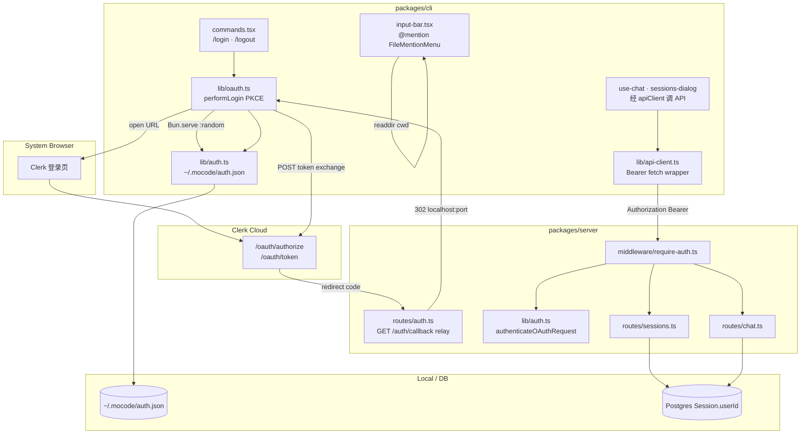
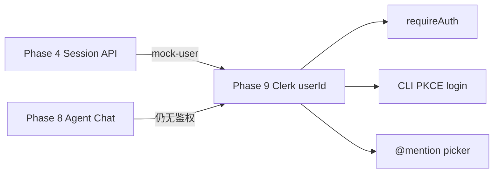
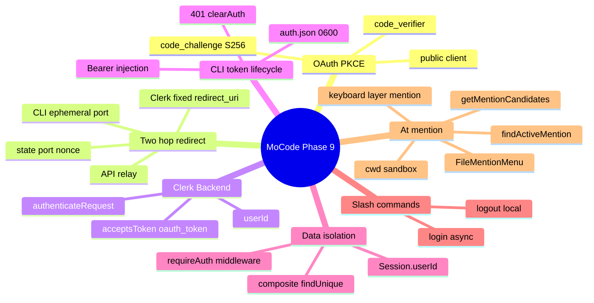
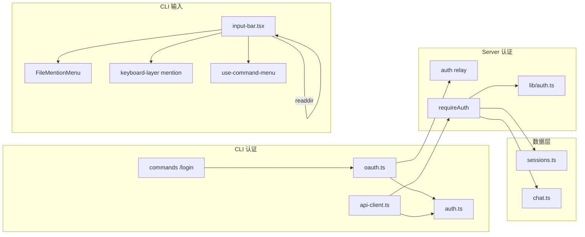
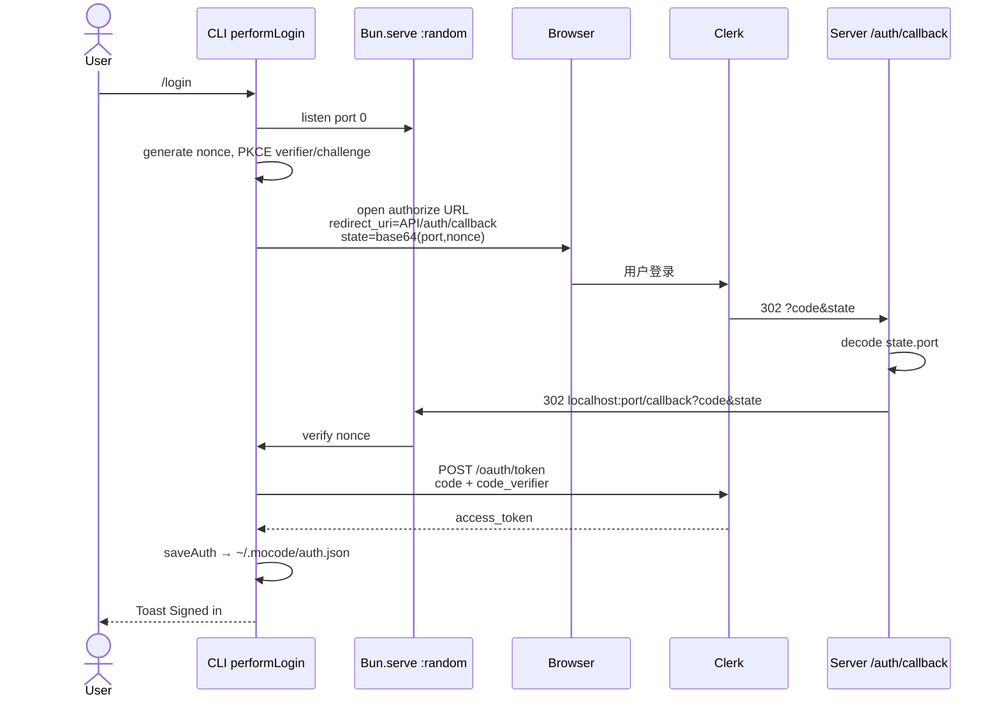
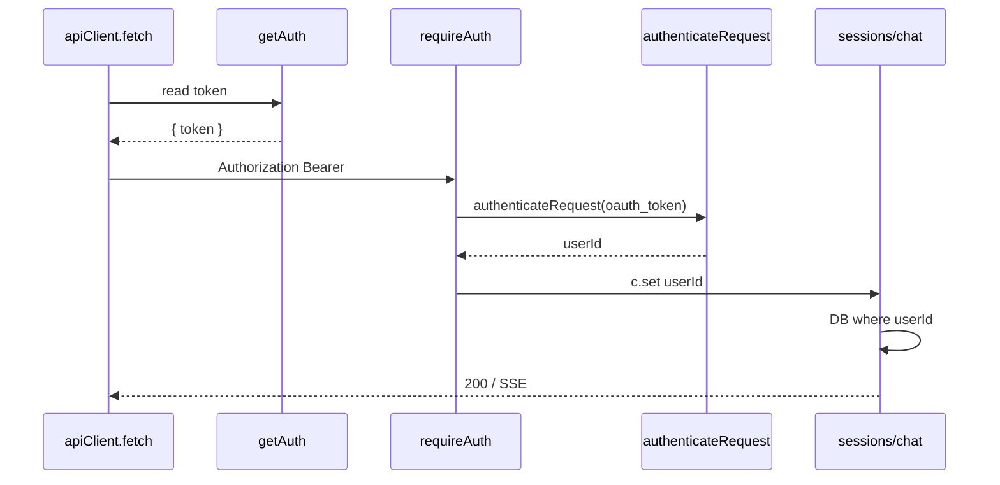
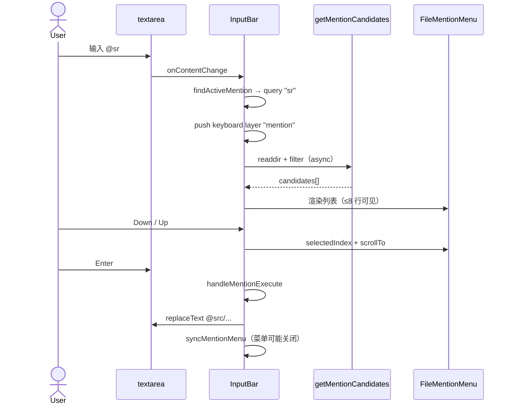

Phase 4 起 Session API 用硬编码 **`userId: "mock-user"`**，任何人都能读写全部会话。本阶段接入 **Clerk OAuth**：CLI 执行 **`/login`** 走浏览器 **PKCE** 授权，token 存 **`~/.mocode/auth.json`**；Hono **`requireAuth`** 用 **`@clerk/backend`** 校验 Bearer token，并把 **`userId`** 注入 **`/sessions`**、**`/chat`** 路由做数据隔离。因 Clerk 只允许预注册固定 **`redirect_uri`**，采用 **API relay 两跳 redirect**（Clerk → Server `/auth/callback` → CLI 临时 localhost 端口）。CLI 输入框新增 **`@`** **mention 文件选择器**：在 **`process.cwd()`** 下异步扫描路径，弹出与 Slash 命令菜单互斥的 **`FileMentionMenu`**，支持键盘上下选择与 Enter 插入。


---


## 目录

1. 背景与目标
2. 技术选型
3. 架构总览
4. 知识点思维导图
5. 模块与关键代码
6. 核心流程
7. 知识点详解（含官方文档与用法）
8. 文件索引
9. 开发与调试

---


## 1. 背景与目标


### 要做什么


| 能力                             | 状态 | 说明                                                                       |
| ------------------------------ | -- | ------------------------------------------------------------------------ |
| CLI 浏览器 OAuth 登录 `/login`      | ✅  | `performLogin()`：PKCE + 临时 `Bun.serve` 回调                                |
| 本地 token 持久化                   | ✅  | `~/.mocode/auth.json`，目录 `0700`、文件 `0600`                                |
| CLI 自动 Bearer 注入               | ✅  | `apiClient` 自定义 `fetch` 读 token 写 Header                                 |
| 401 自动清 token                  | ✅  | 过期/撤销时删本地文件，避免静默失败                                                       |
| `/logout` 本地登出                 | ✅  | `clearAuth()`，无服务端 revoke                                                |
| Server Clerk token 校验          | ✅  | `authenticateRequest({ acceptsToken: "oauth_token" })`                   |
| `requireAuth` 中间件              | ✅  | 401 + 提示 `Run /login to continue.`                                       |
| OAuth redirect relay           | ✅  | `GET /auth/callback` 转发到 CLI localhost                                   |
| Session CRUD 按 userId 隔离       | ✅  | 列表/详情/创建均绑定 Clerk `userId`                                               |
| Chat submit/resume 按 userId 隔离 | ✅  | `findUnique({ id, userId })` 防跨用户访问                                      |
| `.env.example` Clerk 变量说明      | ✅  | 区分 Server / CLI 所需 key                                                   |
| 关键路径英文源码注释                     | ✅  | auth · oauth · middleware · routes                                       |
| 输入框 `@` 文件/目录 mention 补全       | ✅  | `findActiveMention` + `getMentionCandidates` + `FileMentionMenu`         |
| mention 键盘层 `mention`          | ✅  | 与 Phase 2 `keyboard-layer` 栈集成；Esc 关闭                                    |
| mention 与 Slash 菜单互斥           | ✅  | `!showCommandMenu && showMentionMenu`；Enter 优先级：Slash > mention > submit |
| mention 路径沙箱（cwd 内）            | ✅  | `isWithinCurrentDirectory` 拒绝 `..` 逃逸                                    |
| mention 递归 fallback 搜索         | ✅  | 当前目录无直接匹配时 DFS，跳过 `node_modules`，上限 32 条                                 |
| mention 结果仅插入文本                | ✅  | 写入 `@path` 字符串；**未**解析为 Server 附件或 tool 上下文                              |
| 启动时强制登录 / 未登录引导                | ❌  | 未登录仍可进 CLI，API 调用才 401                                                   |
| Token refresh / 过期续期           | ❌  | 仅存 `access_token`，无 refresh 逻辑                                           |
| 服务端 logout / token revoke      | ❌  | `/logout` 仅删本地文件                                                         |
| `/upgrade` · `/usage` 真实跳转     | ❌  | 仍为 Toast 占位（Phase 7 起）                                                   |
| 迁移历史 `mock-user` 会话            | ❌  | 旧数据不会自动归属新 Clerk 用户                                                      |


### 非目标（本阶段不做）

- Clerk Session Cookie / Web 端登录 UI
- 多账户切换、组织 (Organization) 权限
- API Key 等 machine-to-machine 认证方式
- 修改 Prisma Schema（`Session.userId` Phase 4 已存在）
- 在 CLI 内嵌 WebView 代替系统浏览器
- 生产环境 HTTPS redirect URI 部署文档（仅 `.env.example` 提示）
- `@mention` 服务端解析 / 随消息发给 LLM（本阶段仅 UI 插入纯文本）
- ripgrep / `.gitignore` 感知的文件索引（mention 用 `readdir` 直接扫盘）
- mention 鼠标点击以外的完整无障碍审计

---


## 2. 技术选型


| 层级                   | 选择                                                              | 理由                                                                                         |
| -------------------- | --------------------------------------------------------------- | ------------------------------------------------------------------------------------------ |
| 身份提供商                | **Clerk OAuth 2.0 Application**                                 | 已有 Frontend API；支持 native/CLI PKCE 公客户端                                                    |
| 授权模式                 | **Authorization Code + PKCE (S256)**                            | CLI 无法安全保存 client secret；OAuth 2.1 推荐公客户端做法                                                |
| 浏览器唤起                | **`open`** **包**                                                | 跨平台打开系统默认浏览器，一行集成                                                                          |
| CLI 回调接收             | **`Bun.serve({ port: 0 })`**                                    | 随机端口、零配置；与 CLI 运行时一致                                                                       |
| Redirect 策略          | **Server relay 两跳**                                             | Clerk Dashboard 只能注册固定 URI（如 `http://localhost:3000/auth/callback`），无法 per-login 注册 CLI 端口 |
| Server 验 token       | **`@clerk/backend`** **`authenticateRequest`**                  | 官方 SDK；`acceptsToken: "oauth_token"` 对齐 CLI 拿到的 access token                               |
| 路由保护                 | **Hono** **`createMiddleware`** **+ path prefix** **`app.use`** | `/sessions`、`/chat` 统一拦截；`/auth` 保持公开                                                      |
| Token 存储             | **本地 JSON 文件**                                                  | TUI 无 secure enclave 抽象前的最简方案；权限位限制其他 Unix 用户读取                                            |
| RPC 鉴权传递             | **Hono Client 自定义** **`fetch`**                                 | 不改每个 call site；与 Phase 4 `hc<AppType>` 类型安全兼容                                              |
| State 编码             | **base64url JSON** **`{ port, nonce }`**                        | relay 需知 CLI 端口；nonce 防 CSRF / 重放                                                          |
| Mention 触发检测         | **光标处 token 内** **`@`** **解析**                                  | 复用 Slash 的「当前 word token」思路；`findActiveMention`                                            |
| 候选集来源                | **`fs/promises.readdir`** **+** **`{ withFileTypes: true }`**   | 无新依赖；与 Agent `session.cwd` 无关，固定 **`process.cwd()`**                                       |
| Mention UI           | **内联** **`FileMentionMenu`** **+** **`scrollbox`**              | 与 `CommandMenu` 同位置（输入框上方 absolute）；样式对齐 Phase 7 列表                                        |
| Mention 键盘           | **`keyboard-layer`** **新层** **`mention`**                       | Phase 2 栈：`push("mention")` / `pop`；上下键滚动 `scrollbox`                                      |
| Slash vs mention 优先级 | **`onSubmitRef`** **分支**                                        | 同时只能展示一种 popup；Slash 优先                                                                    |


---


## 3. 架构总览


### 3.1 分层图





### 3.2 依赖方向（单向）


```plain text
packages/cli/lib/oauth.ts
  → ./auth（saveAuth）
  → open（浏览器）
  → Clerk Frontend API（fetch token，不经 MoCode Server）

packages/cli/lib/api-client.ts
  → ./auth（getAuth / clearAuth）
  → @mocode/server AppType（类型）

packages/server/middleware/require-auth.ts
  → ../lib/auth（authenticateOAuthRequest）
  → 不依赖 routes（无循环）

packages/server/routes/{sessions,chat}.ts
  → ../middleware/require-auth（AuthenticatedEnv 类型）
  → @mocode/database
  → 假设 c.get("userId") 已由 requireAuth 注入

packages/server/routes/auth.ts
  → 无 Clerk 依赖（纯 redirect relay）

packages/cli/src/components/input-bar.tsx
  → ../providers/keyboard-layer（mention 层）
  → ../command-menu/use-command-menu（Slash 检测，互斥）
  → node:fs/promises、node:path（候选扫描）
  → 不依赖 auth / oauth（mention 与登录正交）
```


**原则**：token **交换在 CLI 直连 Clerk** 完成；Server **只 relay redirect + 校验 Bearer**，不参与 code→token 交换。


### 3.3 相对 Phase 4 / Phase 8 的边界


| 维度               | Phase 4          | Phase 8       | Phase 9             |
| ---------------- | ---------------- | ------------- | ------------------- |
| `Session.userId` | 写死 `"mock-user"` | 同左            | ✅ Clerk `userId`    |
| API 鉴权           | 无                | 无             | ✅ `requireAuth`     |
| `/login`         | Toast 占位         | Toast 占位      | ✅ 完整 OAuth          |
| Session 列表       | 全员可见             | 同左            | ✅ 仅本人               |
| Chat 访问          | 知 sessionId 即可   | + Agent tools | ✅ 需 token + 归属      |
| 输入框 `@` 路径补全     | ❌                | ❌             | ✅ `FileMentionMenu` |
| Prisma 迁移        | 已有 `userId` 字段   | 无变更           | 无变更                 |





### 3.4 环境变量分工


| 变量                           | 使用方    | 用途                                            |
| ---------------------------- | ------ | --------------------------------------------- |
| `CLERK_FRONTEND_API`         | CLI    | authorize / token endpoint 基址                 |
| `CLERK_OAUTH_CLIENT_ID`      | CLI    | OAuth 公客户端 ID                                 |
| `CLERK_SECRET_KEY`           | Server | `createClerkClient`                           |
| `CLERK_PUBLISHABLE_KEY`      | Server | `createClerkClient`                           |
| `API_URL`                    | CLI    | 拼 `redirect_uri` = `${API_URL}/auth/callback` |
| `CLERK_OAUTH_CLIENT_SECRECT` | —      | ⚠️ `.env.example` 拼写错误，代码未读取                  |


---


## 4. 知识点思维导图





---


## 5. 模块与关键代码

> 
>
> 第一次在终端里输入 **`/login`**，会弹出浏览器让你用 Clerk 账号登录；成功后 token 存在本机 **`~/.mocode/auth.json`**。之后发消息、看历史会话都会自动带上身份。输入 **`/logout`** 只删本机 token。在输入框里输入 **`@`** 可弹出当前项目目录下的文件/文件夹列表，用方向键选择、Enter 插入路径（例如 `@src/lib/auth.ts`）。若 token 过期，API 会返回 401，CLI 会自动清掉旧 token。
>
>

---


### 5.1 CLI Token 存储 — `packages/cli/src/lib/auth.ts`


**通俗说明**：登录成功后把「通行证」写在用户主目录下的隐藏文件夹里，并限制只有本人能读。


**类比**：把门禁卡放在上锁的抽屉，而不是贴在显示器上。


```typescript
const AUTH_DIR = join(homedir(), ".mocode");
const AUTH_FILE = join(AUTH_DIR, "auth.json");

export function getAuth(): AuthData | null {
  try {
    const data = readFileSync(AUTH_FILE, "utf-8");
    const parsed = JSON.parse(data) as Partial<AuthData>;
    // 文件损坏或字段缺失时视为未登录，不抛错
    return typeof parsed.token === "string" ? { token: parsed.token } : null;
  } catch {
    return null;
  }
}

export function saveAuth(data: AuthData) {
  if (!existsSync(AUTH_DIR)) {
    mkdirSync(AUTH_DIR, { mode: 0o700 }); // 目录仅 owner 可进入
  }
  writeFileSync(AUTH_FILE, JSON.stringify(data), { mode: 0o600 }); // 文件仅 owner 可读写
}

export function clearAuth() {
  try { unlinkSync(AUTH_FILE); } catch { /* 已删或无文件 */ }
}
```


| 关键点               | 用人话说                    |
| ----------------- | ----------------------- |
| `0o700` / `0o600` | 防止同机其他 Unix 用户读取 token  |
| `getAuth` 吞异常     | 首次启动无文件 = 未登录，不 crash   |
| 仅存 `access_token` | 无 refresh_token、无过期时间字段 |


---


### 5.2 OAuth 登录核心 — `packages/cli/src/lib/oauth.ts`


**通俗说明**：`/login` 的引擎——开临时小服务器、打开浏览器、收 authorization code、向 Clerk 换 token。


**类比**：快递先送到小区门卫（API Server），门卫再转交到你家临时门口（CLI 随机端口）。


```typescript
type OAuthState = {
  nonce: string;  // 绑定本次登录，防 CSRF
  port: number;   // CLI Bun.serve 监听的端口，供 relay 转发
};

export async function performLogin() {
  const nonce = crypto.randomUUID();
  const codeVerifier = toBase64Url(crypto.getRandomValues(new Uint8Array(32)));
  const codeChallenge = await createPkceChallenge(codeVerifier); // SHA-256 → base64url

  let settled = false;

  return new Promise<{ token: string }>((resolve, reject) => {
    const server = Bun.serve({
      port: 0, // OS 分配空闲端口
      async fetch(req) {
        const url = new URL(req.url);
        if (url.pathname !== "/callback") return new Response("Not found", { status: 404 });

        const code = url.searchParams.get("code");
        const state = url.searchParams.get("state");
        // ... error handling ...

        const payload = decodeState(state);
        if (payload.nonce !== nonce) throw new Error("State mismatch");

        // CLI 直连 Clerk token endpoint（不经 MoCode Server）
        const tokenRes = await fetch(`${clerkFrontendApi}/oauth/token`, {
          method: "POST",
          headers: { "Content-Type": "application/x-www-form-urlencoded" },
          body: new URLSearchParams({
            grant_type: "authorization_code",
            code,
            redirect_uri: `${apiUrl}/auth/callback`, // 必须与 authorize 时一致
            client_id: clientId,
            code_verifier: codeVerifier,
          }),
        });

        const tokenData = await tokenRes.json();
        saveAuth({ token: tokenData.access_token });
        resolve({ token: tokenData.access_token });
        setTimeout(() => server.stop(), 500);
        return new Response("Authenticated! You can close this tab.");
      },
    });

    const state = encodeState({ port: server.port!, nonce });
    const authorizeUrl = new URL(`${clerkFrontendApi}/oauth/authorize`);
    authorizeUrl.searchParams.set("redirect_uri", `${apiUrl}/auth/callback`);
    authorizeUrl.searchParams.set("state", state);
    authorizeUrl.searchParams.set("code_challenge", codeChallenge);
    authorizeUrl.searchParams.set("code_challenge_method", "S256");
    authorizeUrl.searchParams.set("prompt", "login");

    void open(authorizeUrl.toString());

    setTimeout(() => {
      if (!settled) { settled = true; server.stop(); reject(new Error("Login timed out")); }
    }, LOGIN_TIMEOUT_MS); // 5 分钟
  });
}
```


| 关键点                 | 用人话说                                                   |
| ------------------- | ------------------------------------------------------ |
| `port: 0`           | 每次 login 端口不同，所以不能直接注册到 Clerk                          |
| `settled` 标志        | 避免 timeout 与 callback 竞态双重 reject                      |
| `redirect_uri` 两处一致 | authorize 与 token exchange 必须相同，且已在 Clerk Dashboard 注册 |
| `prompt=login`      | 强制展示登录页，减少静默复用旧会话的困惑                                   |
| token 交换在 CLI       | Server relay 只转发 code，见不到 code_verifier                |


**PKCE 数据流（ASCII）**


```plain text
CLI                          Clerk
 |  code_verifier (内存)        |
 |  code_challenge ──────────► | authorize URL
 |                             |
 | ◄──────── code ──────────── | (经 Server relay)
 |  code + code_verifier ────► | /oauth/token
 | ◄──── access_token ──────── |
```


---


### 5.3 API Relay — `packages/server/src/routes/auth.ts`


**通俗说明**：Clerk 登录完成后访问的「中转站」，把浏览器重定向到 CLI 正在监听的 localhost 端口。


```typescript
const app = new Hono().get("/callback", (c) => {
  const code = c.req.query("code");
  const state = c.req.query("state");

  const [encoded] = state.split(".");
  const payload = JSON.parse(Buffer.from(encoded, "base64url").toString());
  const port = payload.port;

  // 302 到 CLI 临时服务器；code/state 原样透传
  const redirectUrl =
    `http://localhost:${port}/callback?code=${encodeURIComponent(code)}&state=${encodeURIComponent(state)}`;

  return c.redirect(redirectUrl);
});
```


| 关键点                | 用人话说                              |
| ------------------ | --------------------------------- |
| 不验 nonce           | 安全校验在 CLI callback 完成（持有原始 nonce） |
| 不调用 Clerk          | 纯 HTTP redirect，无 secret          |
| `state.split(".")` | 预留扩展位；当前仅使用第一段 base64url JSON     |
| 必须公开路由             | 不能被 `requireAuth` 拦截              |


---


### 5.4 Server Token 校验 — `packages/server/src/lib/auth.ts`


**通俗说明**：每个受保护 API 请求检查 Header 里的 Bearer token 是否有效，并解析出 Clerk 用户 ID。


```typescript
const clerkClient = createClerkClient({
  secretKey: process.env.CLERK_SECRET_KEY,
  publishableKey: process.env.CLERK_PUBLISHABLE_KEY,
});

export async function authenticateOAuthRequest(request: Request) {
  const requestState = await clerkClient.authenticateRequest(request, {
    acceptsToken: "oauth_token", // 只接受 OAuth access token，非 session cookie
  });

  if (!requestState.isAuthenticated) return null;

  const auth = requestState.toAuth();
  if (auth.tokenType !== "oauth_token" || !auth.userId) return null;

  return { userId: auth.userId };
}
```


| 关键点           | 用人话说                                          |
| ------------- | --------------------------------------------- |
| 启动时校验 env     | 缺 `CLERK_SECRET_KEY` 直接 throw，Server 起不来      |
| `oauth_token` | 与 CLI `/oauth/token` 返回的 access_token 类型对齐    |
| 返回 `userId`   | 对应 Prisma `Session.userId` 外键语义（字符串 Clerk ID） |


---


### 5.5 鉴权中间件 — `packages/server/src/middleware/require-auth.ts`


**通俗说明**：Session / Chat 路由门口的保安——没 token 或 token 无效就 401。


```typescript
export type AuthenticatedEnv = {
  Variables: { userId: string };
};

export const requireAuth = createMiddleware<AuthenticatedEnv>(async (c, next) => {
  try {
    const auth = await authenticateOAuthRequest(c.req.raw);
    if (!auth) {
      return c.json({ error: "Unauthorized. Run /login to continue." }, 401);
    }
    c.set("userId", auth.userId);
    await next();
  } catch {
    return c.json({ error: "Unauthorized. Run /login to continue." }, 401);
  }
});
```


| 关键点                | 用人话说                                              |
| ------------------ | ------------------------------------------------- |
| `c.req.raw`        | 传原始 `Request` 给 Clerk SDK（含 Authorization header） |
| 统一错误文案             | CLI 用户看到后可执行 `/login`                             |
| `AuthenticatedEnv` | 下游 `c.get("userId")` 有类型提示                        |


---


### 5.6 路由挂载 — `packages/server/src/index.ts`


**通俗说明**：规定哪些 URL 需要登录、哪些不用。


```typescript
// /sessions、/chat 整棵子树需要 Bearer token
app.use("/sessions", requireAuth);
app.use("/chat", requireAuth);

const routes = app
  .route("/auth", auth)       // 公开：OAuth relay
  .route("/sessions", sessions)
  .route("/chat", chat);
```


| 路径                             | 鉴权 | 说明                |
| ------------------------------ | -- | ----------------- |
| `GET /auth/callback`           | ❌  | Clerk redirect 入口 |
| `GET/POST /sessions/*`         | ✅  | Session CRUD      |
| `POST /chat/:sessionId`        | ✅  | 发消息 SSE           |
| `POST /chat/:sessionId/resume` | ✅  | 恢复流               |


---


### 5.7 RPC 客户端 — `packages/cli/src/lib/api-client.ts`


**通俗说明**：所有 CLI → Server 请求自动带上登录 token；Server 说「过期了」就删掉本地 token。


```typescript
export const apiClient = hc<AppType>(process.env.API_URL ?? "http://localhost:3000", {
  fetch: async (input, init) => {
    const headers = new Headers(init?.headers);
    const auth = getAuth();

    if (auth) {
      headers.set("Authorization", `Bearer${auth.token}`);
    }

    const response = await fetch(input, { ...init, headers });

    if (response.status === 401) {
      clearAuth(); // 本地 token 失效，避免反复用坏 token
    }

    return response;
  },
});
```


| 关键点          | 用人话说                                        |
| ------------ | ------------------------------------------- |
| 包装全局 `fetch` | `use-chat`、`sessions-dialog` 等无需改 call site |
| 无 token 仍发请求 | 未登录时 Server 返回 401（尚未做启动拦截）                 |
| 401 清 token  | 下次操作等价于未登录状态                                |


---


### 5.8 Slash 命令 — `packages/cli/src/components/command-menu/commands.tsx`


```typescript
// --- Authentication (phase 9) ---
{
  name: "login",
  value: "/login",
  action: async (ctx) => {
    ctx.toast.show({ message: "Opening browser to sign in..." });
    try {
      await performLogin();
      ctx.toast.show({ variant: "success", message: "Signed in" });
    } catch (error) {
      ctx.toast.show({ variant: "error", message: /* ... */ });
    }
  },
},
{
  name: "logout",
  value: "/logout",
  action: (ctx) => {
    clearAuth();
    ctx.toast.show({ variant: "success", message: "Signed out" });
  },
},
```


| 命令        | Phase 7/8                  | Phase 9                  |
| --------- | -------------------------- | ------------------------ |
| `/login`  | Toast「Opening login page…」 | ✅ 完整 OAuth + 成功/失败 Toast |
| `/logout` | Toast「Logging out…」        | ✅ 删 `auth.json`          |


---


### 5.9 Session 用户隔离 — `packages/server/src/routes/sessions.ts`


**通俗说明**：每人只能看到、创建自己的会话列表。


```typescript
const app = new Hono<AuthenticatedEnv>()
  .get("/", async (c) => {
    const userId = c.get("userId");
    const sessions = await db.session.findMany({
      where: { userId },
      orderBy: { createdAt: "desc" },
    });
    return c.json(sessions);
  })
  .get("/:id", async (c) => {
    const userId = c.get("userId");
    const session = await db.session.findUnique({
      where: { id: c.req.param("id"), userId }, // 复合条件：防 id 枚举
    });
    // ...
  })
  .post("/", async (c) => {
    const userId = c.get("userId");
    const session = await db.session.create({
      data: { ...data, userId, messages: { create: { ...initialMessage } } },
    });
  });
```


| 变更 | Phase 4               | Phase 9             |
| -- | --------------------- | ------------------- |
| 列表 | 全员                    | `where: { userId }` |
| 详情 | 仅 `id`                | `id + userId`       |
| 创建 | `userId: "mock-user"` | `c.get("userId")`   |


---


### 5.10 Chat 用户隔离 — `packages/server/src/routes/chat.ts`


**通俗说明**：即使猜到别人的 `sessionId`，没有对应用户的 token 也读不了、聊不了。


```typescript
const app = new Hono<AuthenticatedEnv>()
  .post("/:sessionId/resume", async (c) => {
    const userId = c.get("userId");
    const session = await db.session.findUnique({
      where: { id: sessionId, userId },
      include: { messages: true },
    });
    if (!session) return c.json({ error: "Session not found" }, 404);
    // ... streamAIResponse ...
  })
  .post("/:sessionId", submitValidator, async (c) => {
    const userId = c.get("userId");
    const session = await db.session.findUnique({
      where: { id: sessionId, userId },
      include: { messages: true },
    });
    // ...
  });
```


| 关键点                | 用人话说                                      |
| ------------------ | ----------------------------------------- |
| 404 不区分「不存在」与「非本人」 | 避免泄露 session 是否存在                         |
| Agent 逻辑不变         | Phase 8 tools / SSE 仍走 `streamAIResponse` |


---


### 5.11 Mention 检测与候选扫描 — `input-bar.tsx`（纯函数）


**通俗说明**：判断光标是否正在输入 `@something`，并在项目目录里搜匹配的文件名。


**类比**：像 IDE 里输入 `@` 引用文件，但范围限定在你启动 CLI 时的当前文件夹。


```typescript
const CURRENT_DIRECTORY = process.cwd(); // 固定为 CLI 启动 cwd，非 Session.cwd
const MAX_VISIBLE_MENTIONS = 8;
const MAX_FALLBACK_MENTION_CANDIDATES = 32;
const RECURSIVE_MENTION_IGNORED_DIRECTORIES = new Set(["node_modules"]);

function findActiveMention(text: string, cursorOffset: number): MentionMatch | null {
  // 1. 向前后扩展到空白，得到「当前 token」
  // 2. 在 token 内找光标前的最后一个 @
  // 3. @ 前若是路径字符则忽略（避免 email@domain 误触）
  // 4. 从 @+1 到 token 末尾为 query；光标须在 [@, mentionEnd] 内
  const mentionStart = token.lastIndexOf("@", relativeCursor);
  // ...
  return { start, end, query: token.slice(mentionStart + 1, mentionEnd) };
}

async function getMentionCandidates(query: string): Promise<MentionCandidate[]> {
  // query 解析：directoryPart + namePrefix（支持 foo/bar 与 trailing slash）
  const absoluteDirectory = resolve(CURRENT_DIRECTORY, directoryPart || ".");
  if (!isWithinCurrentDirectory(absoluteDirectory)) return []; // 禁止 .. 逃逸

  const entries = await readdir(absoluteDirectory, { withFileTypes: true });
  // 直接匹配：前缀过滤 + 目录优先排序 + 目录 path 带尾部 /
  // fallback：当前层无结果且 query 像文件名时，DFS 子树（跳过 node_modules）
}
```


| 关键点                        | 用人话说                                |
| -------------------------- | ----------------------------------- |
| `isWithinCurrentDirectory` | `relative(cwd, target)` 不能以 `..` 开头 |
| 隐藏文件                       | 仅当 query 以 `.` 开头才显示 dotfiles       |
| 目录项 path                   | 目录带 `/` 后缀，方便继续输入子路径                |
| 绝对路径 query                 | 以 `/` 开头直接返回空（不支持系统绝对路径）            |
| `MENTION_QUERY_CHARACTER`  | 允许字母数字 `.` `_` `/` `-`；             |


**query 解析示意**


```plain text
query          directoryPart   namePrefix   扫描目录
─────────────────────────────────────────────────────
""             ""              ""           cwd 顶层
src            ""              "src"        cwd 顶层（fallback DFS）
src/           "src"           ""           ./src/
src/lib        "src"           "lib"        ./src/
```


---


### 5.12 FileMentionMenu — `input-bar.tsx`


**通俗说明**：输入框上方弹出的文件列表，外观与 Slash `CommandMenu` 一致。


```typescript
function FileMentionMenu({ candidates, selectedIndex, scrollRef, onSelect, onExecute }) {
  const visibleHeight = Math.min(candidates.length, MAX_VISIBLE_MENTIONS); // 最多显示 8 行

  if (candidates.length === 0) {
    return <text attributes={TextAttributes.DIM}>No matching files or folders</text>;
  }

  return (
    <scrollbox ref={scrollRef} height={visibleHeight}>
      {candidates.map((candidate, index) => (
        <box
          backgroundColor={isSelected ? colors.selection : undefined}
          onMouseMove={() => onSelect(index)}
          onMouseDown={() => onExecute(index)}
        >
          <text>{candidate.path}</text>
          <text>{candidate.kind === "directory" ? "Folder" : "File"}</text>
        </box>
      ))}
    </scrollbox>
  );
}
```


| 关键点                   | 用人话说                                |
| --------------------- | ----------------------------------- |
| 复用 `colors.selection` | 与 CommandMenu / Theme 列表选中态一致       |
| 支持鼠标                  | `onMouseMove` 高亮 + `onMouseDown` 选中 |
| 空态文案                  | 英文；与 CommandMenu 空态风格对齐             |


---


### 5.13 InputBar 集成 — `@mention` 与 Slash 共存


**通俗说明**：输入时同时监听 `/` 和 `@`，但同一时间只显示一种菜单；Enter 键行为随当前菜单变化。


```typescript
const showMentionMenu = activeMention !== null;

const syncMentionMenu = useCallback((text, cursorOffset) => {
  const nextMention = findActiveMention(text, cursorOffset);
  if (!nextMention) { closeMentionMenu(); return; }

  activeMentionRef.current = nextMention;
  setActiveMention(nextMention);
  push("mention", () => { closeMentionMenu(); return true; }); // Esc 回调

  if (mentionChanged) {
    setMentionSelectedIndex(0);
    mentionScrollRef.current?.scrollTo(0);
  }
}, []);

// 内容变化：Slash 检测 + mention 检测
const handleTextareaContentChange = useCallback(() => {
  handleContentChange(textarea.plainText);      // Phase 1 Slash
  syncMentionMenu(text, textarea.cursorOffset); // Phase 9 @
}, []);

// Enter 优先级（onSubmitRef 每 render 更新）
onSubmitRef.current = () => {
  if (showCommandMenu) { handleCommand(...); return; }
  if (showMentionMenu) { handleMentionExecute(...); return; }
  handleSubmit();
};

// mention 层键盘：Esc / Up / Down（仅 isTopLayer("mention")）
useKeyboard((key) => {
  if (showMentionMenu && isTopLayer("mention")) {
    if (key.name === "escape") closeMentionMenu();
    // up/down 更新 selectedIndex 并 scrollbox.scrollTo
    return;
  }
  // base 层 Tab 仍 toggleMode（Phase 7）
});
```


**渲染互斥**


```typescript
{showCommandMenu && <CommandMenu ... />}
{!showCommandMenu && showMentionMenu && (
  <FileMentionMenu ... />
)}
```


**选中插入逻辑**


```typescript
const handleMentionExecute = (index: number) => {
  const insertion = candidate.kind === "directory"
    ? candidate.path           // 目录保留尾部 /，便于继续输入
    : `${candidate.path} `;    // 文件后加空格

  const nextText =
    `${text.slice(0, mention.start)}@${insertion}${text.slice(mention.end)}`;
  textarea.replaceText(nextText);
  textarea.cursorOffset = mention.start + insertion.length + 1;
  syncMentionMenu(nextText, textarea.cursorOffset); // 可能关闭菜单（路径已完成）
};
```


| 关键点                          | 用人话说                                                        |
| ---------------------------- | ----------------------------------------------------------- |
| `activeMentionRef` + state   | ref 供同步回调读最新 mention；state 驱动 UI                            |
| `useEffect([activeMention])` | query 变化时异步 `getMentionCandidates`；⚠️ **当前重复写了两段相同 effect** |
| Slash 优先                     | 输入 `/models` 时不会同时弹 mention                                 |
| `handleTextareaCursorChange` | 已定义但 **未挂到 textarea**；仅靠 `onContentChange` 更新 mention       |
| 提交内容                         | `@path` 作为普通字符串进 `onSubmit`；Server 未解析                      |


**与 Phase 1 / 7 输入框能力对照**


| 能力               | Phase 1 | Phase 7 | Phase 9                     |
| ---------------- | ------- | ------- | --------------------------- |
| `/` Slash 菜单     | ✅       | + 对话框命令 | 不变                          |
| Tab 切 Build/Plan | ❌       | ✅       | 不变（mention 层时 Tab 不穿透）      |
| `@` 文件 mention   | ❌       | ❌       | ✅                           |
| Enter 提交         | ✅       | ✅       | 三态：Slash / mention / submit |


---


### 5.14 模块关系总览





| 模块                                  | 一句话职责                               |
| ----------------------------------- | ----------------------------------- |
| `cli/lib/auth.ts`                   | 读写 `~/.mocode/auth.json`            |
| `cli/lib/oauth.ts`                  | PKCE 登录 + 临时 callback server        |
| `cli/lib/api-client.ts`             | Bearer 注入 + 401 清 token             |
| `cli/components/input-bar.tsx`      | Slash + `@mention` 双 popup、Enter 三态 |
| `server/routes/auth.ts`             | Clerk → CLI redirect relay          |
| `server/lib/auth.ts`                | Clerk `authenticateRequest`         |
| `server/middleware/require-auth.ts` | 401 网关 + 注入 `userId`                |
| `server/routes/sessions.ts`         | 按 userId CRUD                       |
| `server/routes/chat.ts`             | 按 userId 流式聊天                       |


---


## 6. 核心流程


### 6.1 完整 `/login` 时序（Happy Path）





### 6.2 已登录 API 请求





### 6.3 401 与 `/logout`


```mermaid
flowchart TD
  A[API 返回 401] --> B[apiClient clearAuth]
  B --> C[删除 auth.json]
  C --> D[用户需 /login]

  E[/logout 命令] --> F[clearAuth]
  F --> G[Toast Signed out]
  G --> H[Clerk 浏览器会话仍在]
```


### 6.4 `@mention` 输入与选中（Happy Path）





---


## 7. 知识点详解（含官方文档与用法）

> 每节含：**官方文档链接 · API/用法 · MoCode 落点**

### 7.1 OAuth 2.0 PKCE（公客户端）


| 概念               | 说明                                  | 参考                                                        |
| ---------------- | ----------------------------------- | --------------------------------------------------------- |
| `code_verifier`  | 43–128 字符随机串，仅客户端持有                 | [RFC 7636](https://datatracker.ietf.org/doc/html/rfc7636) |
| `code_challenge` | `BASE64URL(SHA256(verifier))`       | method `S256`                                             |
| 为何需要             | 防止 intercept authorization code 的攻击 | OAuth 2.1 对 native app 推荐                                 |


**用法要点**：authorize 请求带 `code_challenge` + `code_challenge_method=S256`；token 请求带原始 `code_verifier`。MoCode **不使用 client_secret**。


**MoCode 落点**：`packages/cli/src/lib/oauth.ts` — `createPkceChallenge`、`performLogin`


---


### 7.2 Clerk OAuth for CLI / Native


| 概念                | 说明                                 | 参考                                                                                             |
| ----------------- | ---------------------------------- | ---------------------------------------------------------------------------------------------- |
| OAuth Application | Dashboard 创建，得 `client_id`         | [Clerk OAuth overview](https://clerk.com/docs/guides/configure/auth-strategies/oauth/overview) |
| Redirect URIs     | **精确匹配**，含 scheme/host/path        | [Issue 记录](./cli-tui-issue-oauth-redirect-uri.md)                                              |
| Frontend API      | `{instance}.clerk.accounts.dev` 基址 | `.env` `CLERK_FRONTEND_API`                                                                    |
| Token endpoint    | `POST {frontend}/oauth/token`      | CLI 直连                                                                                         |


**MoCode 落点**：`oauth.ts` authorize + token；`.env.example` Redirect URI 说明


---


### 7.3 `@clerk/backend` authenticateRequest


| 概念                            | 说明                               | 参考                                                                                    |
| ----------------------------- | -------------------------------- | ------------------------------------------------------------------------------------- |
| `createClerkClient`           | 需 `secretKey` + `publishableKey` | [@clerk/backend](https://clerk.com/docs/references/backend/overview)                  |
| `authenticateRequest`         | 从 Request 解析 session / token     | [authenticateRequest](https://clerk.com/docs/references/backend/authenticate-request) |
| `acceptsToken: "oauth_token"` | 显式接受 OAuth access token          | 与 CLI Bearer 对齐                                                                       |


```typescript
const requestState = await clerkClient.authenticateRequest(request, {
  acceptsToken: "oauth_token",
});
const auth = requestState.toAuth();
// auth.userId, auth.tokenType === "oauth_token"
```


**MoCode 落点**：`packages/server/src/lib/auth.ts`


---


### 7.4 Bun.serve 临时回调服务器


| 概念              | 说明             | 参考                                         |
| --------------- | -------------- | ------------------------------------------ |
| `port: 0`       | 绑定任意可用端口       | [Bun Server](https://bun.sh/docs/api/http) |
| `server.stop()` | login 完成或超时后释放 | callback 里 delay 500ms 再 stop，让浏览器收完响应     |
| 仅处理 `/callback` | 其他 path 404    | 减小攻击面                                      |


**MoCode 落点**：`packages/cli/src/lib/oauth.ts`


---


### 7.5 Hono Client 自定义 fetch


| 概念                            | 说明                         | 参考                                           |
| ----------------------------- | -------------------------- | -------------------------------------------- |
| `hc<AppType>(url, { fetch })` | 替换底层 fetch                 | [Hono RPC](https://hono.dev/docs/guides/rpc) |
| 类型安全                          | `AppType` 仍从 server export | Phase 4 延续                                   |


**MoCode 落点**：`packages/cli/src/lib/api-client.ts`


---


### 7.6 Unix 文件权限与本地 Secret


| 模式         | 含义        |
| ---------- | --------- |
| `0o700` 目录 | owner rwx |
| `0o600` 文件 | owner rw  |


**MoCode 落点**：`packages/cli/src/lib/auth.ts` — `saveAuth`


---


### 7.7 Node.js `fs/promises.readdir` 与路径沙箱


| 概念                                       | 说明                    | 参考                                                              |
| ---------------------------------------- | --------------------- | --------------------------------------------------------------- |
| `readdir(path, { withFileTypes: true })` | 返回 `Dirent`，区分文件/目录   | [Node fs](https://nodejs.org/api/fs.html#fsreaddirpath-options) |
| `path.resolve` + `relative`              | 判断目标是否在 cwd 内         | [Node path](https://nodejs.org/api/path.html)                   |
| 异步扫描                                     | mention 每次 query 变更触发 | 大仓库 fallback DFS 可能卡顿                                           |


**MoCode 落点**：`input-bar.tsx` — `getMentionCandidates`、`isWithinCurrentDirectory`


---


### 7.8 OpenTUI 键盘层栈（Phase 2 延续）


| 概念                          | 说明                               | 参考                       |
| --------------------------- | -------------------------------- | ------------------------ |
| `push("mention", onEscape)` | 注册 mention 层；Esc 回调关闭菜单          | Phase 2 `keyboard-layer` |
| `isTopLayer("mention")`     | Up/Down 仅在该层消费                   | 避免与 base Tab 冲突          |
| `onSubmitRef` 模式            | Phase 1 起用于 Slash；Phase 9 扩展第三分支 | `input-bar.tsx`          |


**MoCode 落点**：`input-bar.tsx` — `syncMentionMenu`、`useKeyboard`


---


### 7.9 Mention popup 与 Slash 菜单互斥


| 规则    | 实现                                               |
| ----- | ------------------------------------------------ |
| 视觉    | `showCommandMenu` 为 true 时不渲染 `FileMentionMenu`  |
| Enter | `onSubmitRef`：Slash → mention → 普通 submit        |
| 触发    | `/` 走 `useCommandMenu`；`@` 走 `findActiveMention` |
| 数据源   | Slash 读 `COMMANDS` 常量；mention 读磁盘 cwd            |


**MoCode 落点**：`input-bar.tsx` JSX + `onSubmitRef.current`


---


### 7.10 知识点 ↔︎ 源码 ↔︎ 文档 速查表


| #   | 知识点                 | 文件                      | 官方文档                                                                                  |
| --- | ------------------- | ----------------------- | ------------------------------------------------------------------------------------- |
| 7.1 | PKCE S256           | `cli/lib/oauth.ts`      | [RFC 7636](https://datatracker.ietf.org/doc/html/rfc7636)                             |
| 7.2 | Clerk OAuth App     | `cli/lib/oauth.ts`      | [Clerk OAuth](https://clerk.com/docs/guides/configure/auth-strategies/oauth/overview) |
| 7.3 | authenticateRequest | `server/lib/auth.ts`    | [Backend SDK](https://clerk.com/docs/references/backend/authenticate-request)         |
| 7.4 | Bun.serve           | `cli/lib/oauth.ts`      | [Bun HTTP](https://bun.sh/docs/api/http)                                              |
| 7.5 | Hono RPC fetch      | `cli/lib/api-client.ts` | [Hono RPC](https://hono.dev/docs/guides/rpc)                                          |
| 7.6 | 文件权限                | `cli/lib/auth.ts`       | [Node fs chmod](https://nodejs.org/api/fs.html)                                       |
| 7.7 | readdir mention     | `cli/.../input-bar.tsx` | [Node fs readdir](https://nodejs.org/api/fs.html#fsreaddirpath-options)               |
| 7.8 | keyboard-layer      | `cli/.../input-bar.tsx` | Phase 2 笔记                                                                            |
| 7.9 | Slash vs @ 互斥       | `cli/.../input-bar.tsx` | —                                                                                     |


---


## 8. 文件索引


| 文件                                                      | 层级           | 一句话                                         |
| ------------------------------------------------------- | ------------ | ------------------------------------------- |
| `packages/cli/src/lib/auth.ts`                          | CLI · 存储     | `~/.mocode/auth.json` 读写删                   |
| `packages/cli/src/lib/oauth.ts`                         | CLI · 认证     | PKCE 登录 + 临时 callback server                |
| `packages/cli/src/lib/api-client.ts`                    | CLI · 网络     | Bearer 注入 + 401 清 token                     |
| `packages/cli/src/components/command-menu/commands.tsx` | CLI · UI     | `/login` `/logout` 实现                       |
| `packages/cli/src/components/input-bar.tsx`             | CLI · UI     | `@mention` 检测、候选扫描、FileMentionMenu、Enter 三态 |
| `packages/cli/package.json`                             | CLI · 依赖     | 新增 `open@^11`                               |
| `packages/server/src/routes/auth.ts`                    | Server · 路由  | OAuth redirect relay                        |
| `packages/server/src/lib/auth.ts`                       | Server · 认证  | Clerk token 校验                              |
| `packages/server/src/middleware/require-auth.ts`        | Server · 中间件 | 401 网关 + `userId`                           |
| `packages/server/src/index.ts`                          | Server · 入口  | 挂载 auth / 应用 requireAuth                    |
| `packages/server/src/routes/sessions.ts`                | Server · 数据  | Session 按 userId 隔离                         |
| `packages/server/src/routes/chat.ts`                    | Server · 数据  | Chat 按 userId 隔离                            |
| `packages/server/package.json`                          | Server · 依赖  | 新增 `@clerk/backend@^3.8.2`                  |
| `.env.example`                                          | 配置           | Clerk 变量与 Redirect URI 说明                   |
| `doc/cli-tui-issue-oauth-redirect-uri.md`               | 文档           | redirect_uri 未注册问题                          |


---


## 9. 开发与调试


### 启动


```bash
# 仓库根目录
bun install

# 终端 1 — API（需 DATABASE_URL + Clerk Server keys）
bun run dev:server

# 终端 2 — CLI（需 Clerk OAuth Client keys + API_URL）
bun run dev:cli
```


### 环境 / 配置


**1. Clerk Dashboard — OAuth Application**

- 创建 OAuth Application，记下 **Client ID**
- **Redirect URIs** 添加：`http://localhost:3000/auth/callback`（与 `API_URL` 一致）
- 详见 [cli-tui-issue-oauth-redirect-uri.md](./cli-tui-issue-oauth-redirect-uri.md)

**2. 根目录** **`.env`** **示例**


```bash
API_URL=http://localhost:3000
DATABASE_URL=postgresql://...

# Server
CLERK_SECRET_KEY=sk_test_...
CLERK_PUBLISHABLE_KEY=pk_test_...

# CLI
CLERK_FRONTEND_API=https://YOUR_INSTANCE.clerk.accounts.dev
CLERK_OAUTH_CLIENT_ID=...
```


**3. 验证登录成功**


```bash
cat ~/.mocode/auth.json   # 应含 {"token":"..."}
ls -la ~/.mocode          # 目录 drwx------，文件 -rw-------
```


### 调试 checklist


| 现象                                 | 排查                                                   |
| ---------------------------------- | ---------------------------------------------------- |
| Clerk 页 `redirect_uri` 不匹配         | Dashboard 是否添加 `${API_URL}/auth/callback`；见 issue 文档 |
| Toast `CLERK_FRONTEND_API not set` | CLI `.env` 缺变量；重启 CLI                                |
| Server 启动 throw `CLERK_SECRET_KEY` | Server `.env` 缺 Clerk keys                           |
| `/login` 后 `Login timed out`       | 5 分钟内未完成；检查 relay 是否可达 localhost                     |
| API 401 `Run /login`               | 未登录或 token 过期；执行 `/login`                            |
| `/sessions` 空列表                    | 新 Clerk 用户无历史；旧 `mock-user` 数据不可见（预期）                |
| 401 后仍「感觉已登录」                      | `apiClient` 应已 `clearAuth`；查 `auth.json` 是否删除        |
| Browser 显示 Authenticated 但 CLI 报错  | 看 CLI 终端 token exchange 响应；`redirect_uri` 不一致常见      |
| `State mismatch`                   | 多次 `/login` 交叉；关闭旧浏览器 tab 重试                         |
| 输入 `@` 无菜单                         | 是否在 word 中间；`@` 前是否有路径字符                             |
| mention 列表空                        | cwd 下无匹配；是否误输入 `/` 绝对路径                              |
| mention 候选很慢                       | fallback DFS 大仓库；暂只跳过 `node_modules`                 |
| Enter 提交了而非选中                      | 是否 Slash 菜单同时打开（Slash 优先）                            |
| `@` 插入后 Agent 未读文件                 | 预期：本阶段仅文本，Server 未解析 mention                         |


### 手动测试清单

- [ ] 未登录调用 `/sessions` → 401
- [ ] `/login` → 浏览器 Clerk 登录 → Toast `Signed in`
- [ ] 新建会话 → DB `userId` 为 Clerk ID（非 `mock-user`）
- [ ] `/logout` → `auth.json` 删除 → API 再 401
- [ ] 用户 A token 访问用户 B `sessionId` → 404
- [ ] Chat 流式 / resume 在登录态正常（Phase 8 回归）
- [ ] 输入 `@` → 弹出文件列表；Esc 关闭
- [ ] `@` + 前缀过滤（如 `@src`）→ 列表缩小
- [ ] 上下键 + Enter 插入路径；文件项后自动空格
- [ ] 目录项带 `/`，可继续输入子路径
- [ ] 输入 `/login` 时只出现 Slash 菜单，不出现 mention
- [ ] 尝试 `@../../../etc` → 无候选（沙箱）

---


## 附录：Slash 命令、@mention 与配置速查


### 认证相关 Slash 命令


| 命令        | 类型 | 当前行为                      |
| --------- | -- | ------------------------- |
| `/login`  | 异步 | 浏览器 OAuth → 写 `auth.json` |
| `/logout` | 同步 | 删 `auth.json`             |


### `@mention` 交互速查


| 操作        | 行为                                |
| --------- | --------------------------------- |
| 输入 `@`    | 打开 `FileMentionMenu`（若无 Slash 菜单） |
| `@` + 字符  | 按 cwd 相对路径过滤；支持 `dir/sub` 分段      |
| `↑` / `↓` | 移动选中项；滚动列表（最多可见 8 行）              |
| `Enter`   | 插入 `@path`；文件后带空格，目录带 `/`         |
| `Esc`     | 关闭 mention 菜单并 `pop` 键盘层          |
| 鼠标悬停 / 点击 | 同键盘选中 / 执行                        |
| 与 `/` 同时  | Slash 菜单优先显示；mention 隐藏           |


### Clerk 环境变量


| 变量                      | 必填方    | 用途              |
| ----------------------- | ------ | --------------- |
| `CLERK_SECRET_KEY`      | Server | 校验 Bearer       |
| `CLERK_PUBLISHABLE_KEY` | Server | Clerk client    |
| `CLERK_FRONTEND_API`    | CLI    | OAuth endpoints |
| `CLERK_OAUTH_CLIENT_ID` | CLI    | OAuth client_id |
| `API_URL`               | CLI    | 拼 redirect_uri  |


### OAuth 参与方 URL 一览


| 步骤             | URL                                           |
| -------------- | --------------------------------------------- |
| Authorize      | `{CLERK_FRONTEND_API}/oauth/authorize?...`    |
| Clerk → Server | `{API_URL}/auth/callback?code&state`          |
| Server → CLI   | `http://localhost:{port}/callback?code&state` |
| Token          | `{CLERK_FRONTEND_API}/oauth/token`            |