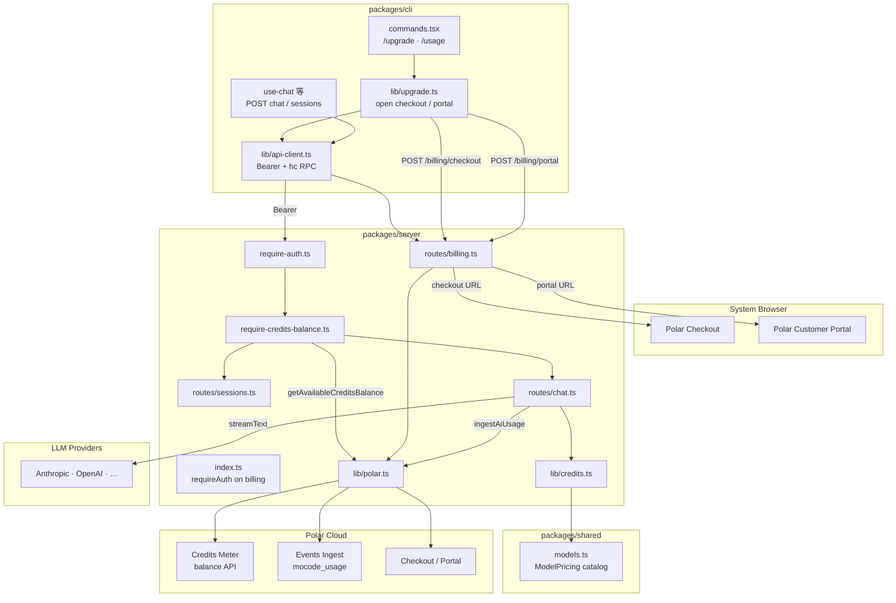
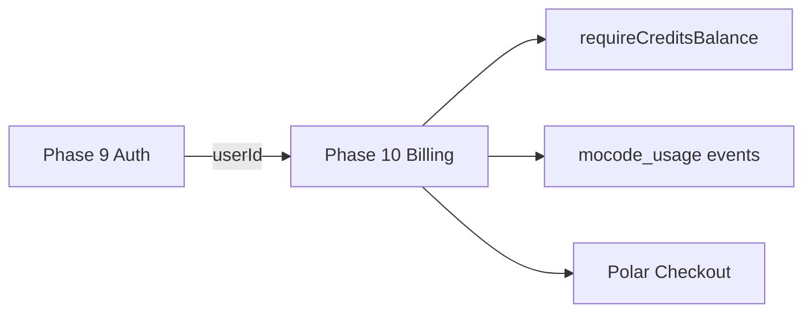
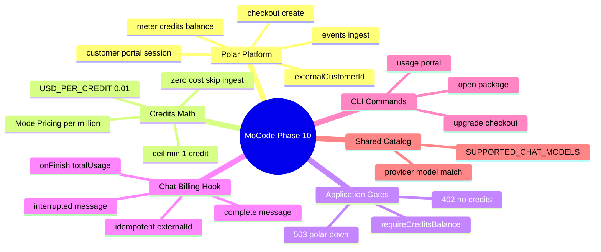
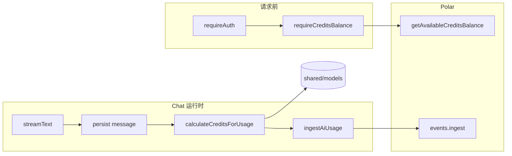
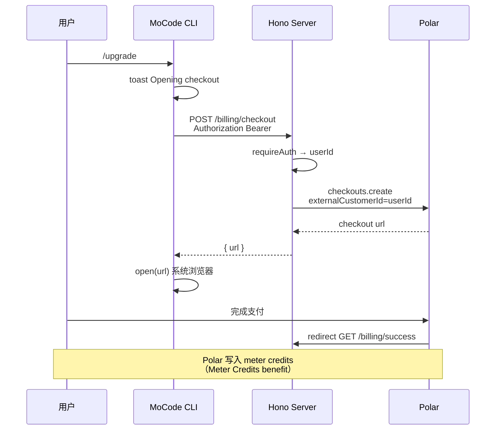
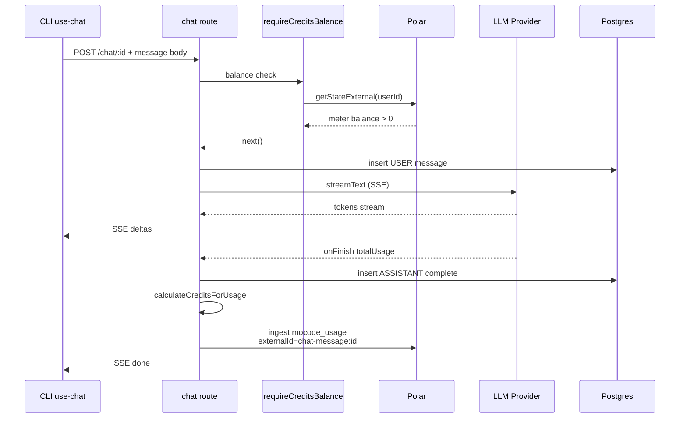
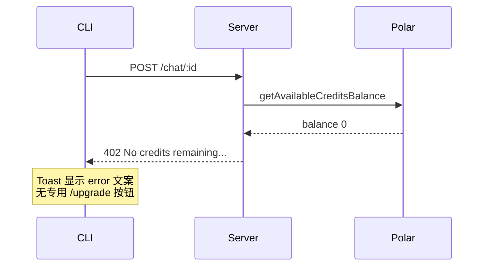
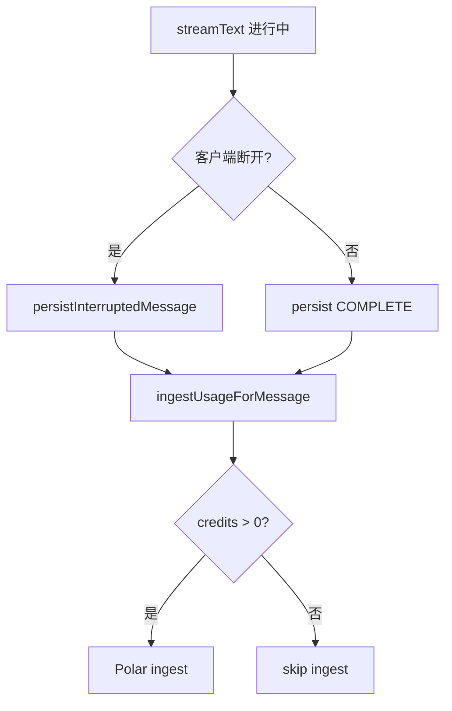

Phase 9 解决了「是谁在调用 API」，Phase 10 解决「有没有额度继续用」。接入 **Polar.sh** 作为 credits 计费后端：Clerk **`userId`** 直接映射 Polar **`externalCustomerId`**，无需单独同步客户表。Server 在 **创建会话、提交消息、resume 流** 前用 **`requireCreditsBalance`** 查 Polar meter 余额，**≤0 返回 402**；Chat 流结束后从 AI SDK **`onFinish.totalUsage`** 按 **`@mocode/shared`** **模型目录价** 换算 credits（**$0.01/credit，非零成本至少 1 credit**），以 **`mocode_usage`** 事件 ingest 到 Polar，**`externalId = chat-message:{messageId}`** 保证幂等。CLI **`/upgrade`**、**`/usage`** 分别打开 Polar checkout 与客户 portal。


---


## 目录

1. 背景与目标
2. 技术选型
3. 架构总览
4. 知识点思维导图
5. 模块与关键代码
6. 核心流程
7. 知识点详解（含官方文档与用法）
8. 文件索引
9. 开发与调试

---


## 1. 背景与目标


### 要做什么


| 能力                           | 状态 | 说明                                                     |
| ---------------------------- | -- | ------------------------------------------------------ |
| Polar SDK 集成                 | ✅  | `@polar-sh/sdk`，singleton client，sandbox/production 切换 |
| 环境变量与 `.env.example`         | ✅  | `POLAR_*` 四项 + 注释                                      |
| Credits 换算逻辑                 | ✅  | `calculateCreditsForUsage`：token × 目录价 → USD → credits |
| 模型目录定价                       | ✅  | `packages/shared/src/models.ts` 每模型 `ModelPricing`     |
| 余额预检中间件                      | ✅  | `requireCreditsBalance` → 402 / 503                    |
| Chat 用量上报                    | ✅  | complete / interrupted assistant 消息均 ingest            |
| 幂等 event id                  | ✅  | `chat-message:{messageId}`                             |
| Billing HTTP 路由              | ✅  | checkout / portal / success                            |
| CLI `/upgrade`               | ✅  | `openUpgradeCheckout()` → 系统浏览器                        |
| CLI `/usage`                 | ✅  | `openBillingPortal()` → 客户 portal                      |
| Hono RPC 类型                  | ✅  | `AppType` 挂载 `/billing`，CLI `hc` 自动推断                  |
| 创建 session 前扣费门禁             | ✅  | `POST /sessions` 加 `requireCreditsBalance`             |
| Chat submit/resume 门禁        | ✅  | 两 POST 路由加中间件                                          |
| ingest 失败不阻断 Chat            | ✅  | `console.error`，用户仍看到回复                                |
| 新用户无 Polar 客户                | ✅  | `getStateExternal` 404 → balance 0                     |
| 零成本模型跳过 ingest               | ✅  | `credits <= 0` 时 `ingestAiUsage` no-op                 |
| CLI 402 专用 UX（引导 `/upgrade`） | ❌  | 与普通 API 错误相同 Toast                                     |
| CLI 余额展示 / 低余额警告             | ❌  | 无 status bar 或 `/balance`                              |
| Polar webhook 同步             | ❌  | 未监听 checkout.paid 等事件                                  |
| 开发环境赠送 credits 脚本            | ❌  | 需 Polar Dashboard 或 API 手动 grant                       |
| 单元测试 credits 换算              | ❌  | 无 `credits.test.ts`                                    |
| 多 meter / 多产品套餐              | ❌  | 单一 `POLAR_PRODUCT_ID` + 单一 meter                       |


### 非目标（本阶段不做）

- Stripe 直连、自建账单表、本地 credits ledger（Polar 为唯一余额源）
- 按 subscription 周期 rollover、overage 发票（交给 Polar 产品配置，应用不实现）
- Chat **前** 预扣 credits（reserve）或 **后** 异步队列重试 ingest
- 工具调用次数单独计价（仅按 LLM token usage 计费）
- Reasoning token 与 output token 分开定价（统一走 AI SDK `inputTokens` / `outputTokens`）
- Admin 赠送 credits 的 Server API
- 未登录用户试用额度（必须先 Phase 9 `/login`）
- 修改 Prisma Schema 存 billing 字段

---


## 2. 技术选型


| 层级                  | 选择                                                       | 理由                                                              |
| ------------------- | -------------------------------------------------------- | --------------------------------------------------------------- |
| 计费平台                | **Polar.sh**                                             | Usage-based billing + meter credits 一体化；checkout/portal SDK 齐全  |
| 客户标识                | **Clerk** **`userId`** **→** **`externalCustomerId`**    | Phase 9 已有稳定用户 id；Polar 支持 external id，免 customer 同步表           |
| SDK                 | **`@polar-sh/sdk`** **^0.48**                            | 官方 TypeScript；events / checkouts / customerSessions / customers |
| 用量来源                | **AI SDK** **`LanguageModelUsage`**                      | `streamText` `onFinish.totalUsage` 与 Provider 无关的统一字段           |
| 价目表                 | **`@mocode/shared`** **`SUPPORTED_CHAT_MODELS.pricing`** | CLI 校验与 Server 计费同一 catalog，避免 drift                            |
| Credits 单位          | **1 credit = $0.01 USD**                                 | 整数 credits 便于 meter Sum；与 Polar product 配置对齐                    |
| 取整策略                | **`ceil`** **+** **`max(1, …)`**                         | 任意非零成本至少 1 credit；避免大量微请求零计费                                    |
| 余额门禁                | **应用层 middleware**                                       | Polar 文档明确：ingest **不会**因余额不足拒绝事件，须应用自查                         |
| 失败策略（ingest）        | **log and continue**                                     | 用户已消耗 LLM 成本；上报失败不应抹掉 assistant 消息                              |
| 失败策略（balance check） | **503 fail closed**                                      | Polar 不可用时拒绝新开 billable 请求，避免「免费无限用」                            |
| CLI 支付 UX           | **`open`** **+ 浏览器**                                     | 与 Phase 9 `/login` 一致；TUI 不嵌 checkout iframe                    |
| RPC                 | **Hono** **`hc<AppType>`**                               | billing 路由挂载后 CLI 零额外类型定义                                       |


---


## 3. 架构总览


### 3.1 分层图





### 3.2 依赖方向（单向）


```plain text
packages/shared/models.ts
  → 无 server/cli 依赖（纯 catalog）

packages/server/lib/credits.ts
  → @mocode/shared（pricing）
  → ai（LanguageModelUsage 类型）
  → 不依赖 polar（换算与上报解耦）

packages/server/lib/polar.ts
  → @polar-sh/sdk
  → process.env（启动时读 token）
  → 不依赖 credits.ts

packages/server/middleware/require-credits-balance.ts
  → polar.getAvailableCreditsBalance
  → 不依赖 chat routes

packages/server/routes/chat.ts
  → credits + polar + require-credits-balance
  → 假设 requireAuth 已注入 userId

packages/cli/lib/upgrade.ts
  → api-client（billing RPC）
  → open（浏览器）
  → 不直接依赖 Polar SDK
```


**原则**：**换算**（credits.ts）与 **Polar I/O**（polar.ts）分离；Chat 路由编排「流式 + 持久化 + 计费」，但不把 Polar SDK 泄漏到 CLI。


### 3.3 相对 Phase 9 的边界


| 维度                   | Phase 9                     | Phase 10                              |
| -------------------- | --------------------------- | ------------------------------------- |
| 身份                   | Clerk OAuth + `requireAuth` | 同左；`userId` 兼 Polar 外部客户 id           |
| Session/Chat 访问      | 需 token + userId 归属         | 同左 + **credits > 0** 才能 billable POST |
| `/upgrade` `/usage`  | Toast 占位                    | ✅ Polar checkout / portal             |
| 模型目录 `pricing`       | 注释写「cost display」           | ✅ 参与 **`calculateCreditsForUsage`**   |
| Chat 流结束             | 仅持久化 message                | ✅ + **`ingestAiUsage`**               |
| 402 Payment Required | 未使用                         | ✅ 余额不足                                |
| Polar env            | 无                           | ✅ Server 启动依赖（模块 load 时校验 token）      |





### 3.4 Billable vs 非 Billable 路由


| 方法   | 路径                        | requireAuth | requireCreditsBalance | 说明                        |
| ---- | ------------------------- | ----------- | --------------------- | ------------------------- |
| POST | `/sessions`               | ✅           | ✅                     | 创建会话含首条 USER 消息，后续会走 Chat |
| GET  | `/sessions`               | ✅           | ❌                     | 列表只读                      |
| GET  | `/sessions/:id`           | ✅           | ❌                     | 详情只读                      |
| POST | `/chat/:sessionId`        | ✅           | ✅                     | 提交 + 流式生成                 |
| POST | `/chat/:sessionId/resume` | ✅           | ✅                     | 恢复未完成 assistant           |
| POST | `/billing/checkout`       | ✅           | ❌                     | 买 credits（余额为 0 时仍需可达）    |
| POST | `/billing/portal`         | ✅           | ❌                     | 查看账单                      |
| GET  | `/billing/success`        | ❌           | ❌                     | 浏览器 redirect 落地页          |


---


## 4. 知识点思维导图





---


## 5. 模块与关键代码

> 
>
> 使用前要先 **登录**（Phase 9）并在 Polar **购买 credits**（`/upgrade` 打开浏览器付款）。每次让 AI 回复消息会按实际 token 用量扣 credits；余额用完再发消息会提示 **No credits remaining**，需要再 `/upgrade`。`/usage` 可查看消费与付款方式。看历史会话、打开旧对话不扣费。
>
>

---


### 5.1 Credits 换算 — `packages/server/src/lib/credits.ts`


**通俗说明**：把 AI 用了多少 token 换成「要扣几个 credits」，像水电表读数 × 单价。


**类比**：出租车计价——起步价（至少 1 credit）+ 按里程（token）向上取整到整元（credit）。


```typescript
const TOKENS_PER_MILLION = 1_000_000;
const USD_PER_CREDIT = 0.01; // 必须与 Polar 产品里「1 credit 值多少钱」一致

function estimateCostUsd({ inputTokens, outputTokens }: TokenCounts, pricing: ModelPricing) {
  // 目录价是「每百万 token 多少美元」，usage 是单次请求的 token 数
  return (
    (inputTokens * pricing.inputUsdPerMillionTokens +
      outputTokens * pricing.outputUsdPerMillionTokens) /
    TOKENS_PER_MILLION
  );
}

function convertUsdToCredits(estimatedCostUsd: number) {
  if (estimatedCostUsd <= 0) return 0; // 免费模型：不 ingest
  // 非零成本：至少 1 credit，且向上取整（0.015 USD → 2 credits）
  return Math.max(1, Math.ceil(estimatedCostUsd / USD_PER_CREDIT));
}

export function calculateCreditsForUsage({ provider, model, usage }) {
  const tokenCounts = getTokenCounts(usage); // 缺字段则 throw，避免 silent 少扣
  const pricing = getModelPricing(provider, model); // provider+model 必须匹配 catalog
  const estimatedCostUsd = estimateCostUsd(tokenCounts, pricing);
  return { credits: convertUsdToCredits(estimatedCostUsd) };
}
```


| 关键点                             | 用人话说                              |
| ------------------------------- | --------------------------------- |
| `getTokenCounts` 严格校验           | 没有 token 数就不计费/不 silently 免费      |
| `provider !== catalog.provider` | 防 model id 串 provider 导致错价        |
| `max(1, ceil(...))`             | 极短回复也至少 1 credit                  |
| pricing 全 0                     | 如部分 Groq 模型 → 0 credits，不上报 Polar |


**心算示例**（Claude Sonnet 4.6：input $3/M，output $15/M）


| input | output | USD 估算  | credits         |
| ----- | ------ | ------- | --------------- |
| 1,000 | 500    | 0.0105  | **2**（ceil）     |
| 100   | 50     | 0.00105 | **1**（min 1）    |
| 0     | 0      | 0       | **0**（不 ingest） |


---


### 5.2 Polar 集成 — `packages/server/src/lib/polar.ts`


**通俗说明**：和 Polar 云通信的三件事——查余额、打开付款页、上报用量。


**类比**：预付费手机卡——`/upgrade` 充值，middleware 查剩余流量，Chat 结束记一笔通话详单。


```typescript
const polar = new Polar({
  accessToken: getPolarAccessToken(),
  server: getPolarServer(), // 默认 sandbox
});

export async function getAvailableCreditsBalance(customerExternalId: string) {
  try {
    const customerState = await polar.customers.getStateExternal({
      externalId: customerExternalId, // = Clerk userId
    });
    const matchingMeters = customerState.activeMeters.filter(
      (meter) => meter.meterId === getPolarCreditsMeterId(),
    );
    return matchingMeters[0]?.balance ?? 0;
  } catch (error) {
    if (hasStatusCode(error) && error.statusCode === 404) return 0; // 从未 checkout 的新用户
    throw error;
  }
}

export async function ingestAiUsage({ externalCustomerId, eventId, credits }) {
  if (credits <= 0) return;
  await polar.events.ingest({
    events: [{
      name: "mocode_usage",           // Dashboard meter 过滤器必须匹配
      externalId: eventId,            // 幂等：同一 message 重复 ingest 不双扣
      externalCustomerId,
      metadata: { credits },          // meter 应对 metadata.credits 做 Sum
    }],
  });
}
```


| 关键点                             | 用人话说                                      |
| ------------------------------- | ----------------------------------------- |
| `externalCustomerId` = Clerk id | 买完 credits 和登录用户自动关联                      |
| 404 → 0                         | 没买过包的用户 balance 视为 0                      |
| `externalId`                    | 中断后重试 ingest 不会重复扣同一消息                    |
| 模块加载读 env                       | 缺 `POLAR_ACCESS_TOKEN` 时 **Server 启动即失败** |


**Polar Dashboard 侧必要配置（概念）**

1. **Product**：含 Meter Credits benefit（购买后 credits 进 meter）
2. **Meter**：过滤 `name = mocode_usage`，聚合 `metadata.credits`（Sum）
3. 复制 **Product ID**、**Meter ID** 到 `.env`

---


### 5.3 余额门禁 — `packages/server/src/middleware/require-credits-balance.ts`


**通俗说明**：发 AI 请求前的「余额够不够」检查。


```typescript
export const requireCreditsBalance = createMiddleware<AuthenticatedEnv>(async (c, next) => {
  try {
    const userId = c.get("userId");
    const creditsBalance = await getAvailableCreditsBalance(userId);

    if (creditsBalance <= 0) {
      return c.json(
        { error: "No credits remaining. Run /upgrade to buy more credits." },
        402,
      );
    }
    await next();
  } catch {
    return c.json({ error: "Unable to verify credits balance right now." }, 503);
  }
});
```


| HTTP    | 含义           | CLI 现状                       |
| ------- | ------------ | ---------------------------- |
| **402** | 余额 ≤ 0       | 通用错误 Toast，文案含 `/upgrade` 提示 |
| **503** | Polar API 失败 | 同上，无法区分「没网」与「没余额」            |


**设计取舍**：Polar 官方说明 ingest 不会因余额拒绝，因此 **必须在请求前 gate**；503 fail closed 避免 Polar 宕机时无限 LLM 成本。


---


### 5.4 Billing 路由 — `packages/server/src/routes/billing.ts`


**通俗说明**：给 CLI 两个 URL——一个付钱，一个看账单。


```typescript
const app = new Hono<AuthenticatedEnv>()
  .post("/checkout", async (c) => {
    const userId = c.get("userId");
    return c.json({
      url: await createCheckoutUrl({
        customerExternalId: userId,
        requestUrl: c.req.url, // 用于拼 successUrl 同源
      }),
    });
  })
  .post("/portal", async (c) => {
    const userId = c.get("userId");
    return c.json({
      url: await createCustomerPortalUrl({ customerExternalId: userId, requestUrl: c.req.url }),
    });
  })
  .get("/success", (c) => c.text("Done. You can close this tab and return to Nightcode."));
```


| 路由                       | 鉴权                 | 返回                        |
| ------------------------ | ------------------ | ------------------------- |
| `POST /billing/checkout` | requireAuth（index） | `{ url }` Polar checkout  |
| `POST /billing/portal`   | requireAuth        | `{ url }` customer portal |
| `GET /billing/success`   | 公开                 | 纯文本提示关 tab                |


`successUrl` / `returnUrl` 基于 **`c.req.url`** **的 origin** 解析为 `/billing/success`——本地即 `http://localhost:3000/billing/success`。


---


### 5.5 Chat 计费挂钩 — `packages/server/src/routes/chat.ts`


**通俗说明**：AI 回完（或中途被打断）后，按用量记一笔账。


**类比**：餐厅结账——菜已经上了（assistant 消息已存 DB），小票尽量送给收银台（Polar）；送失败记日志但不把菜收回去。


```typescript
let completedUsage: LanguageModelUsage | null = null;

const ingestUsageForMessage = async ({ messageId, status }) => {
  if (!completedUsage) return;
  try {
    const billableUsage = calculateCreditsForUsage({
      provider: resolvedModel.provider,
      model: resolvedModel.modelId,
      usage: completedUsage,
    });
    await ingestAiUsage({
      externalCustomerId: userId,
      eventId: `chat-message:${messageId}`,
      credits: billableUsage.credits,
    });
  } catch (error) {
    console.error("Failed to ingest Polar AI usage for chat message", { ... });
    // 不 throw：用户已看到/将看到 assistant 内容
  }
};

// streamText 配置
onFinish(event) {
  completedUsage = event.totalUsage; // Phase 10：多 step agent 也是累计 totalUsage
}

// 正常完成
const assistantMessage = await db.message.create({ status: COMPLETE, ... });
await ingestUsageForMessage({ messageId: assistantMessage.id, status: "complete" });

// 客户端断开 / abort
await persistInterruptedMessageAndUsage(); // 仍扣已产生的 token
```


| 路径                | 是否 ingest | 说明                                                        |
| ----------------- | --------- | --------------------------------------------------------- |
| 流正常 `done`        | ✅         | 有 messageId                                               |
| `stream.aborted`  | ✅         | INTERRUPTED 行 + usage                                     |
| `abortController` | ✅         | 同 interrupted                                             |
| Provider ERROR 行  | ❌         | 无 assistant message id；`completedUsage` 可能非空但未挂钩 ERROR 路径 |
| 门禁 402            | —         | 未进入 `streamAIResponse`                                    |


**注意**：`requireCreditsBalance` 只在 **请求开始时** 查余额；长跑流式过程中余额被其他设备耗尽 **不会** 中途切断（Polar 也不拦 ingest）。


---


### 5.6 CLI Upgrade — `packages/cli/src/lib/upgrade.ts` + `commands.tsx`


**通俗说明**：终端里输入命令，自动打开浏览器完成支付或查看账单。


```typescript
export async function openUpgradeCheckout() {
  const response = await apiClient.billing.checkout.$post(); // Bearer 自动注入
  if (response.ok) {
    const data = await response.json();
    await open(data.url);
    return;
  }
  throw new Error(await getErrorMessage(response));
}
```


| 命令         | API                      | 浏览器                   |
| ---------- | ------------------------ | --------------------- |
| `/upgrade` | `POST /billing/checkout` | Polar 购买 credits      |
| `/usage`   | `POST /billing/portal`   | 发票 / 支付方式 / Polar 用量页 |


未登录时 checkout 返回 **401**（requireAuth），Toast 显示错误信息；**不会**自动引导 `/login`（与 Phase 9 其他 API 行为一致）。


---


### 5.7 共享价目表 — `packages/shared/src/models.ts`


**通俗说明**：所有模型「每百万 token 多少钱」写在一处，Server 计费与 CLI 校验共用。


Phase 10 变更要点：

- 注释明确 **`ModelPricing`** **用于 Polar credit conversion**
- **`openai/gpt-oss-120b:free`** 从 0/0 改为 **0.1/0.1** — 避免默认模型永远 `credits=0` 绕过计费演示

---


### 5.8 模块关系总览





| 模块                           | 一句话                     |
| ---------------------------- | ----------------------- |
| `credits.ts`                 | token × 价目 → credits 整数 |
| `polar.ts`                   | Polar SDK 封装            |
| `require-credits-balance.ts` | 402/503 网关              |
| `billing.ts`                 | checkout / portal HTTP  |
| `chat.ts`                    | 流式 + ingest 编排          |
| `sessions.ts`                | 创建 session 前 gate       |
| `upgrade.ts`                 | CLI 打开浏览器               |
| `models.ts`                  | 价目单一数据源                 |


---


## 6. 核心流程


### 6.1 `/upgrade` 购买 credits





### 6.2 发消息 + 扣 credits 全链路





### 6.3 余额不足（402）





### 6.4 中断流仍计费





---


## 7. 知识点详解（含官方文档与用法）

> 每节含：**官方文档链接 · API/用法 · MoCode 落点**

### 7.1 Polar Usage-Based Billing 总览


| 概念            | 说明                             | 参考                                                                                    |
| ------------- | ------------------------------ | ------------------------------------------------------------------------------------- |
| Event         | 应用上报的一条用量记录                    | [Introduction](https://polar.sh/docs/features/usage-based-billing/introduction)       |
| Meter         | 过滤 + 聚合 events，得到用量            | 同上                                                                                    |
| Meter Credits | 预付费余额，消费递减                     | [Credits](https://polar.sh/docs/features/usage-based-billing/credits)                 |
| 余额责任          | **应用**必须自己查余额，Polar ingest 不拒绝 | [Event Ingestion](https://polar.sh/docs/features/usage-based-billing/event-ingestion) |


**MoCode 落点**：`polar.ts` — `mocode_usage` 事件 + `getAvailableCreditsBalance`；`require-credits-balance.ts` — 应用层 gate。


---


### 7.2 Events Ingest API


| 字段                   | MoCode 用法                |
| -------------------- | ------------------------ |
| `name`               | `"mocode_usage"`         |
| `externalCustomerId` | Clerk `userId`           |
| `externalId`         | `chat-message:{uuid}` 幂等 |
| `metadata.credits`   | 正整数，meter Sum 扣减         |


```typescript
await polar.events.ingest({
  events: [{
    name: "mocode_usage",
    externalCustomerId: "user_2abc...",
    externalId: "chat-message:cm123",
    metadata: { credits: 3 },
  }],
});
```


**MoCode 落点**：`packages/server/src/lib/polar.ts` — `ingestAiUsage`


官方：[Event Ingestion](https://polar.sh/docs/features/usage-based-billing/event-ingestion) · [API Reference](https://polar.sh/docs/api-reference/events/ingest)


---


### 7.3 Customer State & Meter Balance


| API                                          | 用途                      |
| -------------------------------------------- | ----------------------- |
| `customers.getStateExternal({ externalId })` | 用 Clerk id 查 Polar 客户状态 |
| `activeMeters[].balance`                     | 当前 meter credits 余额     |


MoCode 过滤 **`meterId === POLAR_CREDITS_METER_ID`**；多个匹配则 throw（配置错误）。


**MoCode 落点**：`getAvailableCreditsBalance`


---


### 7.4 Checkout & Customer Portal


| API                       | MoCode 封装                 |
| ------------------------- | ------------------------- |
| `checkouts.create`        | `createCheckoutUrl`       |
| `customerSessions.create` | `createCustomerPortalUrl` |


参数要点：

- `products: [POLAR_PRODUCT_ID]`
- `externalCustomerId: userId` — 支付后与 Clerk 用户绑定
- `successUrl` / `returnUrl` → `/billing/success`

**MoCode 落点**：`polar.ts` · `billing.ts` · `upgrade.ts`


官方：[Polar Docs](https://polar.sh/docs) · SDK README `@polar-sh/sdk`


---


### 7.5 AI SDK `LanguageModelUsage`


| 字段             | 计费用途                          |
| -------------- | ----------------------------- |
| `inputTokens`  | 输入 token 数                    |
| `outputTokens` | 输出 token 数（含 agent 多 step 累计） |


来源：`streamText` → `onFinish({ totalUsage })`。


**MoCode 落点**：`chat.ts` `completedUsage` · `credits.ts` `getTokenCounts`


官方：[AI SDK Core](https://sdk.vercel.ai/docs/reference/ai-sdk-core/stream-text)


---


### 7.6 Hono Middleware 组合


Billable 路由栈：


```plain text
requireAuth（index path prefix）
  → requireCreditsBalance（route level）
  → handler
```


`AuthenticatedEnv` 提供 `c.get("userId")`。


**MoCode 落点**：`index.ts` · `require-credits-balance.ts` · `chat.ts` · `sessions.ts`


官方：[Hono Middleware](https://hono.dev/docs/guides/middleware)


---


### 7.7 Hono RPC `hc<AppType>`


挂载 `.route("/billing", billing)` 后，CLI 自动获得：


```typescript
apiClient.billing.checkout.$post();
apiClient.billing.portal.$post();
```


无需手写 URL 或重复类型。


**MoCode 落点**：`packages/server/src/index.ts` `AppType` · `packages/cli/src/lib/api-client.ts`


---


### 7.8 HTTP 402 Payment Required


Semantically：「身份 OK，但未付款 / 额度不足」。MoCode 用于 credits 耗尽，body 固定 `{ error: string }` 便于 CLI 解析。


**MoCode 落点**：`require-credits-balance.ts`


参考：[RFC 9110 §15.5.2](https://www.rfc-editor.org/rfc/rfc9110.html#section-15.5.2)


---


### 7.9 知识点 ↔︎ 源码 ↔︎ 文档 速查表


| #   | 知识点                   | 文件                                      | 官方文档                                                                                  |
| --- | --------------------- | --------------------------------------- | ------------------------------------------------------------------------------------- |
| 7.1 | Usage-based billing   | `lib/polar.ts`                          | [Polar UBB Intro](https://polar.sh/docs/features/usage-based-billing/introduction)    |
| 7.2 | Events ingest         | `lib/polar.ts`                          | [Event Ingestion](https://polar.sh/docs/features/usage-based-billing/event-ingestion) |
| 7.3 | Meter balance         | `lib/polar.ts`                          | [Credits](https://polar.sh/docs/features/usage-based-billing/credits)                 |
| 7.4 | Checkout / Portal     | `lib/polar.ts`, `routes/billing.ts`     | [Polar Docs](https://polar.sh/docs)                                                   |
| 7.5 | LanguageModelUsage    | `routes/chat.ts`, `lib/credits.ts`      | [AI SDK streamText](https://sdk.vercel.ai/docs/reference/ai-sdk-core/stream-text)     |
| 7.6 | Middleware gate       | `middleware/require-credits-balance.ts` | [Hono Middleware](https://hono.dev/docs/guides/middleware)                            |
| 7.7 | RPC billing client    | `cli/lib/upgrade.ts`                    | [Hono RPC](https://hono.dev/docs/guides/rpc)                                          |
| 7.8 | Model pricing catalog | `shared/models.ts`                      | —                                                                                     |
| 7.9 | 402 semantics         | `middleware/require-credits-balance.ts` | [RFC 9110](https://www.rfc-editor.org/rfc/rfc9110.html#section-15.5.2)                |


---


## 8. 文件索引


| 文件                                                          | 层级          | 一句话                                            |
| ----------------------------------------------------------- | ----------- | ---------------------------------------------- |
| `packages/server/src/lib/credits.ts`                        | Server · 计费 | token usage → credits 换算                       |
| `packages/server/src/lib/polar.ts`                          | Server · 计费 | Polar SDK：balance / checkout / portal / ingest |
| `packages/server/src/middleware/require-credits-balance.ts` | Server · 网关 | 402/503 credits 预检                             |
| `packages/server/src/routes/billing.ts`                     | Server · 路由 | checkout / portal / success                    |
| `packages/server/src/routes/chat.ts`                        | Server · 路由 | 流式 Chat + onFinish ingest                      |
| `packages/server/src/routes/sessions.ts`                    | Server · 路由 | 创建 session 前 credits gate                      |
| `packages/server/src/index.ts`                              | Server · 入口 | 挂载 billing + auth 前缀                           |
| `packages/shared/src/models.ts`                             | Shared · 目录 | 每模型 `ModelPricing`                             |
| `packages/cli/src/lib/upgrade.ts`                           | CLI · 计费    | 打开 checkout / portal                           |
| `packages/cli/src/components/command-menu/commands.tsx`     | CLI · UI    | `/upgrade` `/usage`                            |
| `packages/cli/src/lib/api-client.ts`                        | CLI · 网络    | Bearer + `hc<AppType>`（billing 类型推断）           |
| `packages/server/package.json`                              | Server · 依赖 | `@polar-sh/sdk@^0.48.1`                        |
| `.env.example`                                              | 配置          | `POLAR_*` 变量说明                                 |


---


## 9. 开发与调试


### 启动


```bash
# 仓库根目录
bun install

# 终端 1 — API（DATABASE_URL + Clerk + Polar）
bun run dev:server

# 终端 2 — CLI（API_URL + Clerk OAuth）
bun run dev:cli
```


### 环境 / 配置


**1. Polar Dashboard（建议 sandbox）**

1. 创建 **Meter**：event name `mocode_usage`，聚合 `metadata.credits`（Sum）
2. 创建 **Product** + **Meter Credits benefit** 指向该 meter
3. 创建 **Organization Access Token** → `POLAR_ACCESS_TOKEN`
4. 复制 **Product ID** → `POLAR_PRODUCT_ID`
5. 复制 **Meter ID** → `POLAR_CREDITS_METER_ID`
6. `POLAR_SERVER=sandbox`（本地默认）

**2. 根目录** **`.env`** **追加**


```bash
POLAR_ACCESS_TOKEN=polar_oat_...
POLAR_PRODUCT_ID=prod_...
POLAR_CREDITS_METER_ID=meter_...
POLAR_SERVER=sandbox
```


**3. 首次使用路径**

1. CLI `/login`（Phase 9）
2. `/upgrade` → 浏览器 sandbox 支付（测试卡）
3. 新建会话 / 发消息 → Polar Dashboard 应出现 `mocode_usage` events
4. 余额耗尽后再发消息 → **402**

**4. 开发时手动 grant credits（可选）**


Polar 支持 ingest **负值** metadata Grant credits（见官方 guide）。生产环境应通过 Product 购买；本地调试可用 Dashboard 或一次性 ingest 脚本。


参考：[Grant meter credits before purchase](https://polar.sh/docs/guides/grant-meter-credits-before-purchase)


### 调试 checklist


| 现象                                   | 排查                                                                  |
| ------------------------------------ | ------------------------------------------------------------------- |
| Server 启动 throw `POLAR_ACCESS_TOKEN` | `.env` 缺 Polar 变量；Polar client 在 import 时初始化                        |
| `/upgrade` 401                       | 未 `/login`；`auth.json` 是否存在                                         |
| `/upgrade` 500                       | Polar product id 错误；token 权限不足                                      |
| Checkout 成功但 balance 仍 0             | Meter ID 与 benefit 绑定的 meter 不一致；Product 未含 credits benefit         |
| Chat 正常但 Polar 无 events              | 模型 pricing 全 0 → credits=0 跳过；或 ingest throw 看 Server 日志            |
| 402 但刚买过 credits                     | `externalCustomerId` 是否与 Clerk userId 一致；是否 sandbox/production 环境混用 |
| 503 Unable to verify credits         | Polar API 网络/凭证；Server 日志                                           |
| ingest 重复扣费                          | 检查 `externalId` 是否稳定为 `chat-message:{id}`                           |
| 中断消息后仍扣费                             | **预期**：`persistInterruptedMessageAndUsage` 设计如此                     |
| success 页 404                        | `API_URL` 与 checkout `successUrl` host 是否一致                         |


### 手动测试清单

- [ ] 未登录 `/upgrade` → 401
- [ ] 已登录无 credits → `POST /chat` → 402
- [ ] `/upgrade` → 浏览器 checkout → success 页文案
- [ ] 有 credits → 发消息 → SSE 正常 → Polar 有 `mocode_usage`
- [ ] `/usage` → portal 打开
- [ ] 长流式中断（Ctrl+C / 关终端）→ DB `INTERRUPTED` + Polar 有对应 event
- [ ] 免费定价模型（如 gemini 0/0）→ ingest 跳过（Polar 无 event 或 credits=0）
- [ ] Phase 9 回归：`/login`、跨 user session 404、mention 仍可用

---


## 附录：Slash 命令、HTTP 状态与 Polar 配置速查


### 计费相关 Slash 命令


| 命令         | 类型 | 当前行为                                    |
| ---------- | -- | --------------------------------------- |
| `/upgrade` | 异步 | `POST /billing/checkout` → 打开 Polar 购买页 |
| `/usage`   | 异步 | `POST /billing/portal` → 打开客户 portal    |


### Billable API 与 HTTP 状态


| 状态      | 场景          | Response body 示例                                          |
| ------- | ----------- | --------------------------------------------------------- |
| **401** | 未登录         | `Unauthorized. Run /login to continue.`                   |
| **402** | credits ≤ 0 | `No credits remaining. Run /upgrade to buy more credits.` |
| **503** | Polar 不可用   | `Unable to verify credits balance right now.`             |


### Polar 环境变量


| 变量                       | 必填 | 用途                          |
| ------------------------ | -- | --------------------------- |
| `POLAR_ACCESS_TOKEN`     | ✅  | SDK Bearer token            |
| `POLAR_PRODUCT_ID`       | ✅  | Checkout 商品                 |
| `POLAR_CREDITS_METER_ID` | ✅  | 余额查询过滤                      |
| `POLAR_SERVER`           | ❌  | `sandbox`（默认）或 `production` |


### Credits 换算常数


| 常数               | 值                          | 说明                        |
| ---------------- | -------------------------- | ------------------------- |
| `USD_PER_CREDIT` | `0.01`                     | 1 credit = 1 美分           |
| 最小扣费             | `1` credit                 | 任意 `estimatedCostUsd > 0` |
| 取整               | `Math.ceil`                | 向上取整到整数 credit            |
| Event name       | `mocode_usage`             | 须与 Polar meter filter 一致  |
| Idempotency key  | `chat-message:{messageId}` | 同一 DB 消息只对应一条 event       |