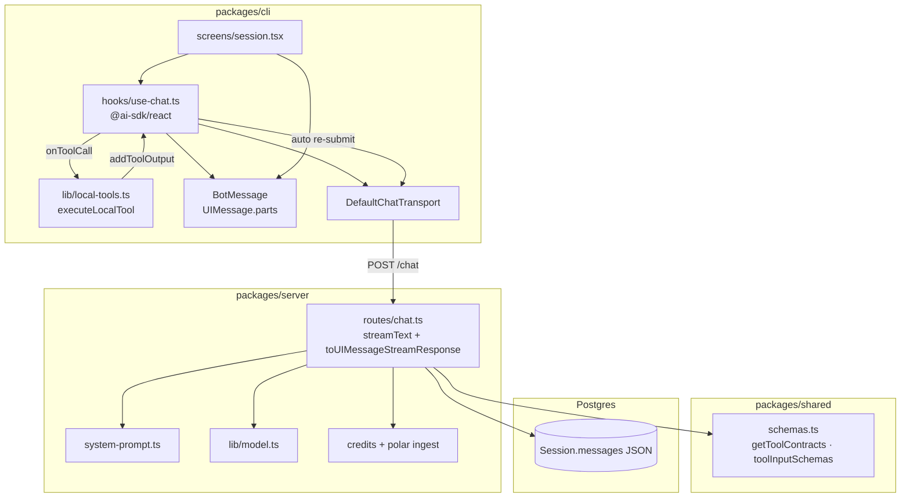
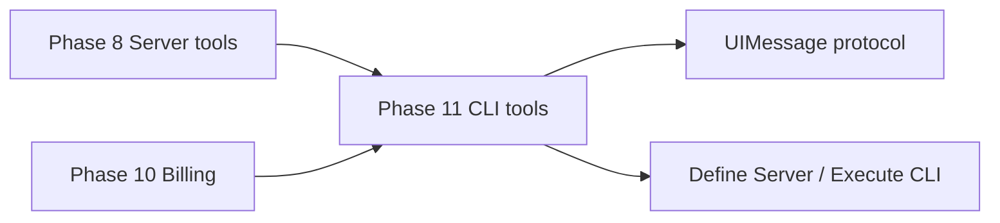
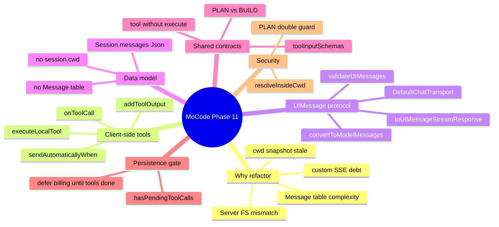
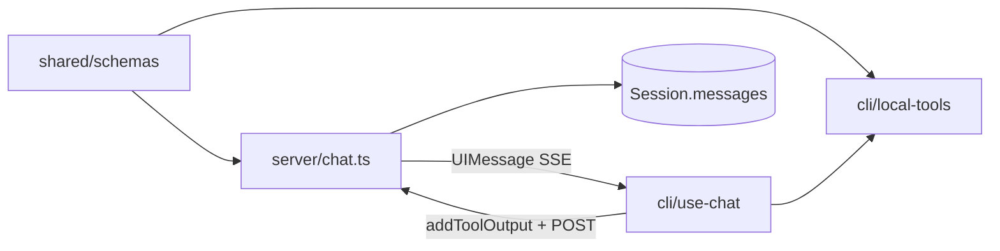
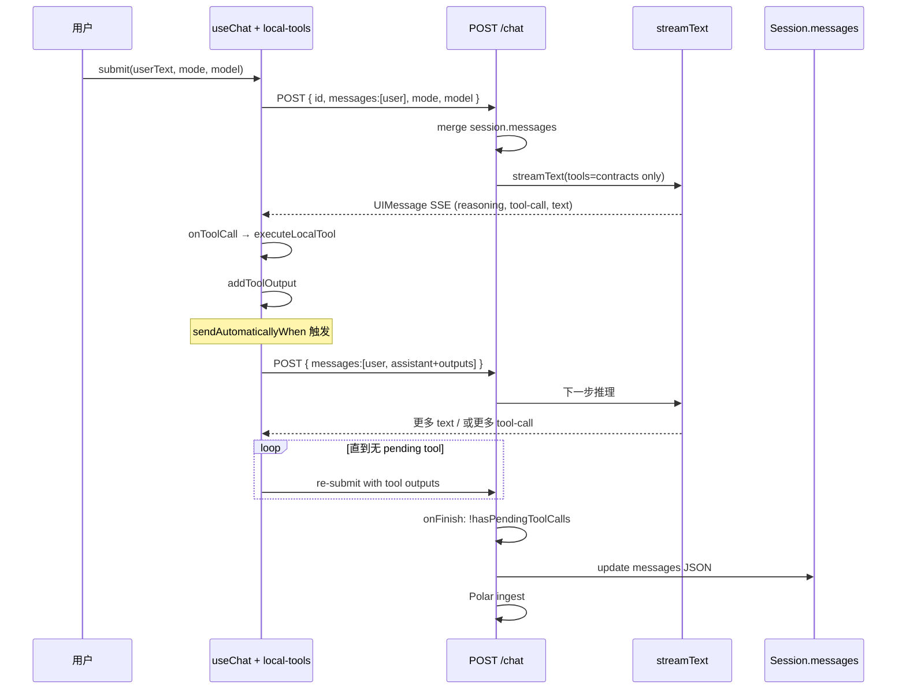
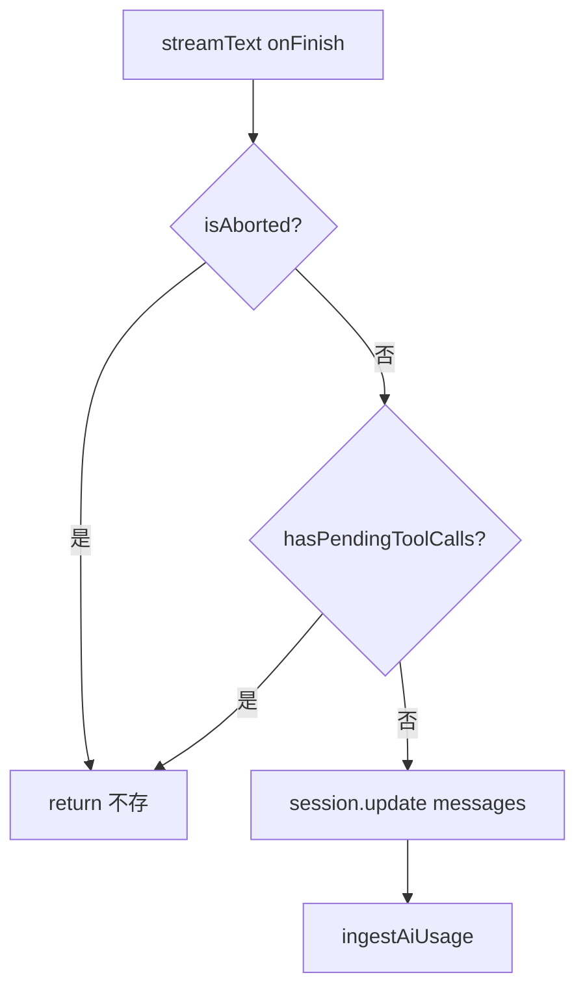
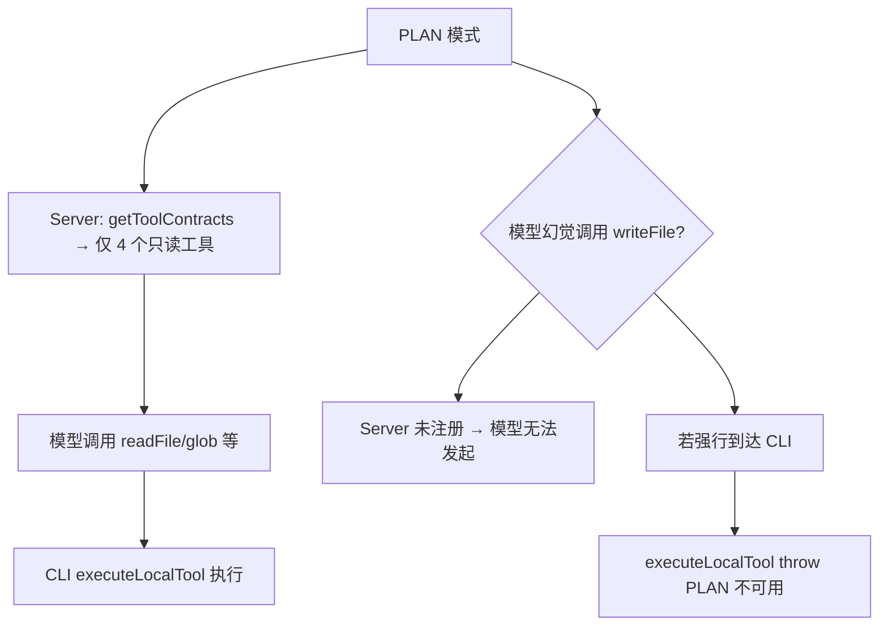
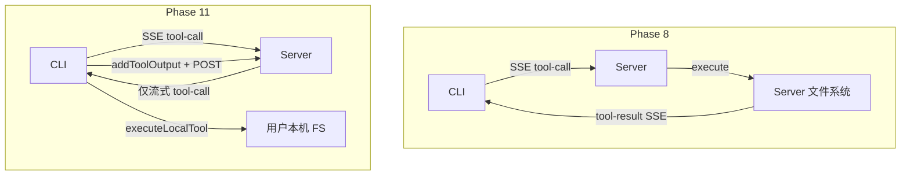

Phase 8–10 在 **Server 端** 用 `session.cwd` 执行 readFile / bash 等工具，但 MoCode 的真实使用场景是：**CLI 在开发者本机、Server 在云端**。Server 磁盘上没有用户项目，工具读写的永远是错误路径。Phase 11 将工具 **执行** 下沉到 CLI（`process.cwd()`），Server 只保留 **tool contracts**（给模型看的定义，无 `execute`），并通过 AI SDK 官方的 **client-side tool loop**（`onToolCall` → `executeLocalTool` → `addToolOutput` → 自动 re-submit）完成多步 Agent。同时用 **`UIMessage[]`** 替换独立的 `Message` 表与自研 SSE 协议（`chatStreamEventSchema`），大幅删减 Server/CLI 样板代码，并让 **tool 结果进入 LLM 历史**（`validateUIMessages` + `convertToModelMessages`）。


---


## 目录

1. 背景与目标
2. 为什么要重构（问题与动机）
3. 重构带来的好处
4. 技术选型
5. 架构总览
6. 知识点思维导图
7. 模块与关键代码
8. 核心流程
9. Phase 8–10 → Phase 11 迁移对照
10. 知识点详解
11. 文件索引
12. 开发与调试

---


## 1. 背景与目标


### 要做什么


| 能力                                   | 状态 | 说明                                                                   |
| ------------------------------------ | -- | -------------------------------------------------------------------- |
| CLI 本地执行 7 个 Agent 工具                | ✅  | `packages/cli/src/lib/local-tools.ts`                                |
| Server 仅注册 tool contracts（无 execute） | ✅  | `getToolContracts(mode)` in `@mocode/shared`                         |
| 客户端 tool loop                        | ✅  | `@ai-sdk/react` `onToolCall` + `addToolOutput`                       |
| 工具完成后自动 re-submit                    | ✅  | `sendAutomaticallyWhen: lastAssistantMessageIsCompleteWithToolCalls` |
| AI SDK UIMessage 流式协议                | ✅  | `toUIMessageStreamResponse` 替代自研 SSE                                 |
| CLI `DefaultChatTransport`           | ✅  | 自定义 `prepareSendMessagesRequest` + Bearer                            |
| Session 存 `UIMessage[]` JSON         | ✅  | 删除 `Message` 表；`Session.messages Json`                               |
| 删除 `session.cwd`                     | ✅  | 沙箱根目录固定为 CLI `process.cwd()`                                         |
| 待执行 tool 时跳过持久化/计费                   | ✅  | `hasPendingToolCalls` 门控 `onFinish`                                  |
| PLAN 模式只读工具（双层校验）                    | ✅  | Server contracts + CLI `executeLocalTool`                            |
| `editFile` 唯一匹配                      | ✅  | 0 匹配 / 多匹配均 throw（Phase 8 为全局 replace）                               |
| `grep` 走系统 `grep -rn`                | ✅  | 替代 Phase 8 自研逐文件扫描                                                   |
| 删除 Server `tools/*` 全套               | ✅  | 含测试文件                                                                |
| 删除自研 `chatStreamEventSchema`         | ✅  | 协议由 AI SDK 维护                                                        |
| CLI 移除 `eventsource-parser`          | ✅  | Transport 内置解析                                                       |
| CLI 移除 `@mocode/database` 依赖         | ✅  | 不再读 `MessageStatus` 等 enum                                           |
| 关键路径中英文注释                            | ✅  | local-tools · use-chat · chat · schemas 等                            |
| 数据迁移脚本（旧 Message 行 → UIMessage）      | ❌  | 破坏性 schema 变更，需手动处理旧数据                                               |
| 工具执行用户逐条 approve                     | ❌  | 仍自动执行                                                                |
| 远程 Server 代理本地工具（Web 端）              | ❌  | 仅 CLI TUI                                                            |
| `stepCountIs(50)` 显式步数上限             | ❌  | 依赖 SDK 默认 multi-step 行为                                              |
| 中断流 partial 持久化                      | ❌  | `onFinish` 在 `isAborted` 时直接 return                                  |
| 独立 `/chat/:id/resume` 路由             | ❌  | 合并进 `POST /chat` 消息 merge 逻辑                                         |


### 非目标（本阶段不做）

- 在 Server 上保留工具执行的 fallback 模式
- MCP 外部工具、子 Agent（Task tool）
- 工具调用计费与 LLM token 分开计价
- 跨设备 session 同步本地文件状态
- bash 命令白名单 / 危险操作确认 UI
- 生产环境 DB migration 自动化（仅 schema 变更）

---


## 2. 为什么要重构（问题与动机）


### 2.1 根本矛盾：工具跑在 Server，代码在用户本机


Phase 8 的设计是：


```plain text
CLI 创建 Session → 写入 session.cwd = process.cwd()
Server streamText → createTools(session.cwd) → 在 Server 磁盘上读写
```


这在 **Server 与 CLI 同机**（本地 `bun run dev`）时可以工作。但一旦 Server 部署到云端：


| 场景                          | Phase 8 行为                  | 实际期望                  |
| --------------------------- | --------------------------- | --------------------- |
| 用户在本机 `~/code/my-app` 跑 CLI | `cwd` 字符串存入 DB              | 工具应读写 `~/code/my-app` |
| Server 在 Fly.io / Railway   | Server 上不存在 `~/code/my-app` | 工具应通过 CLI 访问用户文件系统    |
| `readFile("src/index.ts")`  | Server 读自己的文件系统             | 应读用户项目里的文件            |
| `bash("npm test")`          | 在 Server 容器里跑测试             | 应在用户项目目录跑测试           |


**结论**：终端 Agent 的产品语义是「AI 帮我改 **我电脑上的** 项目」，工具执行位置必须在 **CLI 进程所在环境**，而不是 API Server。


这与 Cursor、Claude Code、Windsurf 等产品的架构一致：**推理可以远程，文件系统操作必须本地**。


### 2.2 `session.cwd` 无法可靠同步真实工作目录


Phase 8 在 **建会话时** 快照 `process.cwd()`：

- 用户建会话后 `cd` 到子目录再聊天 → cwd 过期
- 用户在 monorepo 根目录启动 CLI，却在子 package 工作 → 路径错位
- cwd 是字符串，Server 无法验证该路径在 Server 机器上是否存在

Phase 11 删除 `session.cwd`，每次工具调用时以 **CLI 当前** **`process.cwd()`** 为沙箱根，与用户终端会话一致。


### 2.3 Phase 8 自研 SSE 协议维护成本高


Phase 6–8 维护了完整的双向协议层：


| 组件                            | 职责                            |
| ----------------------------- | ----------------------------- |
| `chatStreamEventSchema`       | 6 种 SSE 事件 Zod 校验             |
| `messagePartSchema`           | DB `parts` 形状                 |
| Server `fullStream` 手动 loop   | 合并 delta、推 SSE、写 parts        |
| CLI `EventSourceParserStream` | 解析 SSE、更新 `streaming.parts`   |
| `mapDbMessages`               | DB → `ClientMessagePart[]` 转换 |


AI SDK 6 已提供 **`toUIMessageStreamResponse`** + **`DefaultChatTransport`** + **`UIMessage.parts`** 标准结构，继续维护平行协议属于重复造轮子，且容易出现 Server/CLI 字段漂移。


### 2.4 `Message` 表 + 双轨 `content` / `parts` 的复杂度


Phase 8 数据模型：


```plain text
Session 1—N Message
Message: role, content, parts?, status, mode, model, duration
```


问题：

1. **`content`** **与** **`parts`** **双轨**：UI 读 `parts`，LLM 历史读 `content` 字符串 → tool 上下文丢失（Phase 8 文档已列为已知限制）
2. **`mapDbMessages`**：加载历史时要 `safeParse`、给 tool-call 补 `status: "done"`
3. **USER / ASSISTANT / ERROR 分行**：每次 turn 多次 `db.message.create`
4. **resume 路由**：需判断末条 USER、防并发 resume lock

Phase 11 将整个 transcript 存为 **`Session.messages: UIMessage[]`**，与 AI SDK 内存结构一致，一次 `session.update` 写回全量消息。


### 2.5 AI SDK 官方客户端工具体系已成熟


Vercel AI SDK 6 明确支持：

- Server：`tool({ description, inputSchema })` **不带** **`execute`**
- Client：`useChat({ onToolCall })` 本地执行后 `addToolOutput`
- Client：`sendAutomaticallyWhen` 在所有 tool output 就绪后自动 POST 续聊

不采用这套 API 意味着自行实现 tool 状态机、re-submit 时机、与 `convertToModelMessages` 的衔接——Phase 11 选择对齐官方路径。


---


## 3. 重构带来的好处


### 3.1 正确性：工具始终操作用户真实项目


```plain text
Phase 8:  Server FS ← session.cwd（可能不存在于 Server）
Phase 11: User FS  ← CLI process.cwd()（与终端一致）
```

- `readFile` / `writeFile` / `editFile` 直接作用开发者正在编辑的仓库
- `bash("npm test")` 使用用户本机 Node、环境变量、git 状态
- 支持远程 Server + 本地 CLI 的 **云推理 + 本地执行** 拓扑

### 3.2 架构清晰：职责分离


| 层级         | Phase 11 职责                                         |
| ---------- | --------------------------------------------------- |
| **Server** | 鉴权、计费、credits 门禁、LLM `streamText`、持久化 `UIMessage[]` |
| **CLI**    | TUI、本地工具 I/O、tool output 回传、Bearer token            |
| **Shared** | Mode、tool contracts、Zod input schemas、模型目录          |


Server 不再需要文件系统权限，缩小攻击面，简化容器镜像（无需挂载用户代码卷）。


### 3.3 代码量显著下降


本次重构净删减约 **1400+ 行**（含 Server `tools/*`、自研 SSE handler、resume 逻辑、`Message` CRUD）。


| 删除                             | 新增/替换                            |
| ------------------------------ | -------------------------------- |
| `server/tools/*`（~500 行）       | `cli/lib/local-tools.ts`（~210 行） |
| 自研 `use-chat` SSE loop（~400 行） | `@ai-sdk/react` useChat（~130 行）  |
| `chatStreamEventSchema` 等      | AI SDK 内置 UIMessage stream       |
| `mapDbMessages`、Message 表 ORM  | 直接 cast `session.messages`       |


### 3.4 多轮 Tool 上下文进入 LLM 历史


Phase 11 流程：


```typescript
validateUIMessages({ messages: mergedMessages, tools })
convertToModelMessages(nextMessages, { tools })
```


AI SDK 将 `tool-readFile` 等 part 的 `input` / `output` 转为 model messages，**模型在后续 step 能「记得」自己读过什么文件**，无需 Phase 8 计划的 `buildConversationHistory` 补丁。


### 3.5 类型安全的工具契约单点维护


`@mocode/shared`：

- `toolInputSchemas` — CLI `executeLocalTool` Zod 校验
- `readOnlyToolContracts` / `buildToolContracts` — Server `streamText` 注册
- `ToolContracts` — `InferUITools<ToolContracts>` 贯穿 Server/CLI 类型

增删工具时改一处，编译器检查 Server 与 CLI 对齐。


### 3.6 工具实现质量提升


| 工具         | Phase 8                  | Phase 11                             |
| ---------- | ------------------------ | ------------------------------------ |
| `editFile` | 全局 replace；多匹配 silent 全改 | **必须唯一匹配**，否则 error                  |
| `grep`     | Bun 逐文件 read + RegExp    | 系统 **`grep -rn`**，大仓库更快              |
| 沙箱         | `session.cwd` 前缀         | **`process.cwd()`** + `relative` 防穿越 |


### 3.7 为远程部署铺路


```plain text
┌─────────────┐     HTTPS/SSE      ┌─────────────┐
│  CLI (本地)  │ ◄──────────────► │ Server (云)  │
│  local-tools │   UIMessage 流    │  streamText  │
│  用户项目 FS │                   │  无用户 FS   │
└─────────────┘                    └─────────────┘
```


这是 MoCode 作为「终端编码 Agent」长期可扩展的基础架构。


---


## 4. 技术选型


| 层级       | 选择                                                | 理由                                                         |
| -------- | ------------------------------------------------- | ---------------------------------------------------------- |
| 工具执行位置   | **CLI** **`executeLocalTool`**                    | 用户代码在用户机器；与 Cursor 类产品一致                                   |
| 工具定义位置   | **Server** **`getToolContracts`**                 | 模型通过 `streamText({ tools })` 获得 schema；无 execute 则不远程执行    |
| 客户端 Chat | **`@ai-sdk/react`** **`useChat`**                 | 官方 tool loop、状态机、re-submit                                 |
| HTTP 传输  | **`DefaultChatTransport`**                        | 可定制 `headers` / `prepareSendMessagesRequest`               |
| 流式响应     | **`toUIMessageStreamResponse`**                   | 标准 UIMessage SSE；替代自研 6 事件协议                               |
| 消息持久化    | **`Session.messages: Json`****（UIMessage[]）**     | 与 SDK 结构一致；删除 Message 表                                    |
| 沙箱根      | **`process.cwd()`**                               | 与用户 shell 一致；删除 session.cwd                                |
| 路径校验     | **`resolve`** **+** **`relative`** **防** **`..`** | 从 Server tools 移植到 CLI                                     |
| 共享契约     | **`tool()`** **without execute in shared**        | `ai` 包加入 `@mocode/shared` dependencies                     |
| grep 实现  | **系统** **`grep -rn -E`**                          | 性能优于 Phase 8 自研扫描                                          |
| 计费挂钩点    | **Server** **`onFinish`****（无 pending tools 时）**  | 与 Phase 10 Polar ingest 兼容；event id 用 `responseMessage.id` |


---


## 5. 架构总览


### 5.1 分层图





### 5.2 依赖方向（单向）


```plain text
packages/shared/schemas.ts
  → ai（tool() 定义）
  → 被 server/chat、cli/local-tools 引用

packages/cli/lib/local-tools.ts
  → @mocode/shared（toolInputSchemas、Mode）
  → Node fs/promises、Bun.spawn/Glob
  → 不依赖 server

packages/cli/hooks/use-chat.ts
  → @ai-sdk/react、ai（DefaultChatTransport）
  → local-tools、api-client、auth
  → 不依赖 @mocode/database

packages/server/routes/chat.ts
  → getToolContracts（仅定义）
  → validateUIMessages、convertToModelMessages、streamText
  → 不 import tools/*（已删除）
```


**原则**：**定义在 Shared，执行在 CLI，推理在 Server**。


### 5.3 相对 Phase 10 的边界


| 维度                | Phase 10                            | Phase 11                       |
| ----------------- | ----------------------------------- | ------------------------------ |
| 工具执行              | Server `tools/*.execute`            | **CLI** **`executeLocalTool`** |
| Chat 协议           | 自研 SSE + Message 表                  | **UIMessage stream + JSON 数组** |
| session.cwd       | 建会话时写入                              | **删除**                         |
| LLM 历史含 tool      | ❌（仅 content 字符串）                    | ✅ `convertToModelMessages`     |
| 计费                | `chat-message:{messageId}`          | 同左；`messageId` = UIMessage.id  |
| 鉴权 / credits gate | requireAuth + requireCreditsBalance | **保留**                         |





---


## 6. 知识点思维导图





---


## 7. 模块与关键代码

> **给非技术读者的导读**
>
> 现在 AI 仍然能帮你读文件、改代码、跑命令，但这些操作都在 **你自己的项目文件夹**里完成，而不是在云端服务器上。聊天界面和以前一样显示「Thinking」「Read File」等行，只是背后改成：云端负责「想」，你的电脑负责「做」。
>
>

---


### 7.1 共享工具契约 — `packages/shared/src/schemas.ts`


**通俗说明**：一份「工具说明书」给模型看，Server 和 CLI 共用，但 **没有写「怎么执行」**。


```typescript
export const readOnlyToolContracts = {
  readFile: tool({
    description: "Read a file from the current project directory.",
    inputSchema: toolInputSchemas.readFile,
    // 注意：无 execute — Phase 11 在 CLI 执行
  }),
  // listDirectory, glob, grep ...
};

export function getToolContracts(mode: ModeType) {
  return mode === Mode.PLAN ? readOnlyToolContracts : buildToolContracts;
}
```


| 关键点                  | 用人话说                       |
| -------------------- | -------------------------- |
| `tool()` 无 `execute` | 告诉模型有哪些工具，Server 不会真的去跑    |
| `toolInputSchemas`   | CLI 执行前用同一套 Zod 校验参数       |
| PLAN / BUILD         | Server 注册不同工具集；CLI 二次拦截写操作 |


---


### 7.2 本地工具执行 — `packages/cli/src/lib/local-tools.ts`


**通俗说明**：收到「读某某文件」指令后，在你电脑的项目目录里真正去读。


```typescript
function resolveInsideCwd(path: string) {
  const cwd = process.cwd();
  const resolved = resolve(cwd, path);
  const rel = relative(cwd, resolved);
  if (rel.startsWith("..") || isAbsolute(rel)) {
    throw new Error("Path is outside the project directory");
  }
  return { cwd, resolved };
}

export async function executeLocalTool(toolName, input, mode) {
  if (mode === Mode.PLAN && !["readFile", "listDirectory", "glob", "grep"].includes(toolName)) {
    throw new Error(`Tool${toolName} is not available in PLAN mode`);
  }
  switch (toolName) {
    case "readFile": { /* Zod parse → readFile → 10KB 截断 */ }
    case "editFile": { /* 必须恰好 1 处 oldString 匹配 */ }
    case "bash": { /* Bun.spawn bash -c, TERM=dumb, 30s 超时 */ }
    // ...
  }
}
```


| 工具       | 限制                   | Phase 11 改进             |
| -------- | -------------------- | ----------------------- |
| readFile | 10KB 截断              | 同 Phase 8               |
| glob     | 200 文件               | 同 Phase 8               |
| grep     | 50 匹配                | **系统 grep**，非自研扫描       |
| editFile | 唯一匹配                 | **Phase 8 为全局 replace** |
| bash     | stdout/stderr 各 20KB | cwd = 项目根               |


---


### 7.3 CLI useChat — `packages/cli/src/hooks/use-chat.ts`


**通俗说明**：聊天「总控」——发消息、收流式回复、在本地跑工具、自动继续对话。


```typescript
const transport = new DefaultChatTransport<Message>({
  api: apiClient.chat.$url().toString(),
  headers() { /* Bearer from ~/.mocode/auth.json */ },
  prepareSendMessagesRequest({ messages }) {
    const message = messages[messages.length - 1];
    const previousMessage = messages[messages.length - 2];
    // 工具续聊：只发 [user, assistant含toolCalls]，Server 与 DB 历史 merge
    const requestMessages =
      message.role === "assistant" && previousMessage?.role === "user"
        ? [previousMessage, message]
        : [message];
    return { body: { id: sessionId, messages: requestMessages, mode, model } };
  },
});

const chat = useAiChat<Message>({
  transport,
  onToolCall({ toolCall }) {
    void executeLocalTool(toolCall.toolName, toolCall.input, mode)
      .then((output) => chat.addToolOutput({ tool, toolCallId, output }))
      .catch((error) => chat.addToolOutput({ ..., state: "output-error", errorText }));
  },
  sendAutomaticallyWhen: lastAssistantMessageIsCompleteWithToolCalls,
});
```


| 关键点                          | 用人话说                             |
| ---------------------------- | -------------------------------- |
| `onToolCall`                 | 模型说要调工具 → 本地执行                   |
| `addToolOutput`              | 把结果填回消息；UI 上 tool 行从 `…` 变完成     |
| `sendAutomaticallyWhen`      | 所有工具跑完后 **自动** 再请求 Server 让模型继续想 |
| `prepareSendMessagesRequest` | 避免每次 POST 全量历史；Server 负责 merge   |


---


### 7.4 Server Chat 路由 — `packages/server/src/routes/chat.ts`


**通俗说明**：只负责叫 LLM 思考和流式返回；**不碰用户硬盘**。


```typescript
const tools = getToolContracts(mode); // 无 execute

const result = streamText({
  model, system: buildSystemPrompt({ mode }), messages: modelMessages, tools,
});

return result.toUIMessageStreamResponse({
  originalMessages: nextMessages,
  async onFinish(event) {
    if (event.isAborted) return;
    if (hasPendingToolCalls(event.responseMessage)) return; // 等 CLI 跑完工具

    await db.session.update({
      data: { messages: event.messages },
    });
    await ingestAiUsage({ eventId: `chat-message:${event.responseMessage.id}`, ... });
  },
});
```


**消息 merge 逻辑**（替代旧 resume 路由）：


```typescript
const previousMessages = session.messages as UIMessage[];
const mergedMessages = [...previousMessages];
for (const message of incomingMessages) {
  const idx = mergedMessages.findIndex((m) => m.id === message.id);
  if (idx === -1) mergedMessages.push(message);
  else mergedMessages[idx] = message; // 同 id 更新（tool output 回填）
}
```


| 关键点                   | 用人话说                   |
| --------------------- | ---------------------- |
| `hasPendingToolCalls` | 工具还没跑完 → **不存 DB、不扣费** |
| `validateUIMessages`  | 入库前校验 parts 形状         |
| 单路由 `POST /chat`      | 用户消息与 tool 续聊走同一入口     |


---


### 7.5 BotMessage — `packages/cli/src/components/messages/bot-message.tsx`


**通俗说明**：展示助手回复；工具行状态来自 AI SDK part `state`。


| part.type                 | UI                                            |
| ------------------------- | --------------------------------------------- |
| `reasoning`               | `Thinking:` 左边框                               |
| `tool-*` / `dynamic-tool` | 工具名 + 参数；`state` 非 `output-available` 时显示 `…` |
| `text`                    | 正文                                            |


Phase 11 使用 SDK 原生 `ToolUIPart.state`（`input-streaming` → `output-available` / `output-error`），不再维护客户端专用 `status: "calling" | "done"`。


---


### 7.6 数据库 Schema — `packages/database/prisma/schema.prisma`


**Phase 8–10**：


```plain text
model Session {
  cwd String?
  messages Message[]
}
model Message {
  role Role; content String; parts Json?; status MessageStatus; ...
}
```


**Phase 11**：


```plain text
model Session {
  messages Json @default("[]")  // UIMessage[]
}
// Message 表、Role/Mode/MessageStatus enum 已删除
```


| 影响                          | 说明                           |
| --------------------------- | ---------------------------- |
| 破坏性迁移                       | 旧 `Message` 行不会自动转换          |
| CLI 不再依赖 `@mocode/database` | Mode 等改从 `@mocode/shared` 导入 |
| 单 session update            | 整段 transcript 原子替换           |


---


### 7.7 模块关系总览





| 模块                    | 一句话职责                     |
| --------------------- | ------------------------- |
| `getToolContracts`    | 给模型的工具目录（无 execute）       |
| `executeLocalTool`    | 用户本机 I/O + bash           |
| `useChat` + Transport | SDK tool loop + 鉴权 HTTP   |
| `chat.ts`             | LLM 流式 + merge + 持久化 + 计费 |
| `hasPendingToolCalls` | 工具未完成时 defer DB/billing   |


---


## 8. 核心流程


### 8.1 BUILD 模式：用户提问 → 本地工具循环 → 持久化





### 8.2 工具未完成时跳过持久化





**原因**：此时 assistant 消息里 tool part 尚无 `output`，存 DB 会导致刷新后工具链断裂；计费应在完整 turn 结束后进行。


### 8.3 PLAN 模式：双层只读保护





### 8.4 相对 Phase 8 的执行拓扑对比





---


## 9. Phase 8–10 → Phase 11 迁移对照


### 9.1 API 路由


| 能力         | Phase 8–10                     | Phase 11                                          |
| ---------- | ------------------------------ | ------------------------------------------------- |
| 提交消息       | `POST /chat/:sessionId`        | `POST /chat` body `{ id, messages, mode, model }` |
| 恢复生成       | `POST /chat/:sessionId/resume` | **删除**；merge + 再次 POST                            |
| 创建 Session | `{ cwd, initialMessage }`      | `{ title }` only                                  |
| SSE 事件     | `text-delta` `tool-call` 等 6 种 | **UIMessage stream**（AI SDK 标准）                   |


### 9.2 依赖变更


| 包                 | Phase 10             | Phase 11                      |
| ----------------- | -------------------- | ----------------------------- |
| `packages/cli`    | `eventsource-parser` | **移除**；加 `@ai-sdk/react` `ai` |
| `packages/cli`    | `@mocode/database`   | **移除**                        |
| `packages/shared` | 仅 zod                | 加 **`ai`**（`tool()` 定义）       |


### 9.3 删除的 Server 文件


```plain text
packages/server/src/tools/
  bash.ts bash-env.ts edit-file.ts glob.ts grep.ts
  index.ts list-directory.ts read-file.ts write-file.ts
  *.test.ts path-sandbox.ts
```


逻辑迁移至 `packages/cli/src/lib/local-tools.ts`（沙箱、限制常量保持一致）。


### 9.4 删除的 Shared 协议（概念）

- `chatStreamEventSchema`
- `messagePartSchema` / `MessagePart` 自定义 union
- `ClientToolCallPart.status` 客户端专用字段

由 AI SDK `UIMessage` / `UIMessagePart` 替代。


---


## 10. 知识点详解（含官方文档与用法）


### 10.1 Client-side Tool Execution


| 概念                      | 说明                | 参考                                                                            |
| ----------------------- | ----------------- | ----------------------------------------------------------------------------- |
| Tool without `execute`  | Server 只提供 schema | [Tool Calling](https://ai-sdk.dev/docs/ai-sdk-core/tools-and-tool-calling)    |
| `onToolCall`            | 客户端执行钩子           | [@ai-sdk/react useChat](https://ai-sdk.dev/docs/reference/ai-sdk-ui/use-chat) |
| `addToolOutput`         | 回填 tool result    | 同上                                                                            |
| `sendAutomaticallyWhen` | 自动续聊条件            | `lastAssistantMessageIsCompleteWithToolCalls`                                 |


**MoCode 落点**：`use-chat.ts` · `local-tools.ts` · `chat.ts`（无 execute 的 tools）


---


### 10.2 UIMessage Stream Protocol


| API                         | 用途                                         |
| --------------------------- | ------------------------------------------ |
| `toUIMessageStreamResponse` | Server SSE 编码                              |
| `DefaultChatTransport`      | Client 解码 + POST                           |
| `validateUIMessages`        | merge 后校验                                  |
| `convertToModelMessages`    | UIMessage → model messages（含 tool history） |


**MoCode 落点**：`chat.ts` · `use-chat.ts`


官方：[UIMessage Stream](https://ai-sdk.dev/docs/ai-sdk-ui/chatbot-message-metadata)


---


### 10.3 `prepareSendMessagesRequest` 裁剪策略


| 请求类型    | `messages` 载荷                              | 原因                                |
| ------- | ------------------------------------------ | --------------------------------- |
| 用户新消息   | `[userMessage]`                            | Server 与 `session.messages` merge |
| Tool 续聊 | `[previousUser, assistantWithToolOutputs]` | 避免重复传输完整历史；assistant 同 id 更新      |


**MoCode 落点**：`use-chat.ts` `DefaultChatTransport` 配置


---


### 10.4 路径沙箱 `resolveInsideCwd`


```typescript
const resolved = resolve(process.cwd(), path);
const rel = relative(process.cwd(), resolved);
if (rel.startsWith("..") || isAbsolute(rel)) throw ...
```


与 Phase 8 Server `read-file.ts` 相同算法；根目录从 `session.cwd` 改为 **`process.cwd()`**。


---


### 10.5 知识点 ↔︎ 源码 ↔︎ 文档 速查表


| #    | 知识点               | 文件                              | 官方文档                                                                 |
| ---- | ----------------- | ------------------------------- | -------------------------------------------------------------------- |
| 10.1 | Client-side tools | `use-chat.ts` `local-tools.ts`  | [AI SDK UI](https://ai-sdk.dev/docs/ai-sdk-ui)                       |
| 10.2 | UIMessage stream  | `chat.ts`                       | [Stream Protocol](https://ai-sdk.dev/docs/ai-sdk-ui/stream-protocol) |
| 10.3 | Message merge     | `chat.ts` `use-chat.ts`         | —                                                                    |
| 10.4 | Path sandbox      | `local-tools.ts`                | —                                                                    |
| 10.5 | Tool contracts    | `shared/schemas.ts`             | [tool()](https://ai-sdk.dev/docs/reference/ai-sdk-core/tool)         |
| 10.6 | Persistence gate  | `chat.ts` `hasPendingToolCalls` | —                                                                    |
| 10.7 | Polar billing     | `chat.ts` onFinish              | Phase 10 文档                                                          |


---


## 11. 文件索引


| 文件                                                     | 层级              | 一句话                                     |
| ------------------------------------------------------ | --------------- | --------------------------------------- |
| `packages/cli/src/lib/local-tools.ts`                  | CLI · **新增**    | 7 个工具本地执行 + 沙箱                          |
| `packages/cli/src/hooks/use-chat.ts`                   | CLI · **重写**    | `@ai-sdk/react` + Transport + tool loop |
| `packages/cli/src/screens/session.tsx`                 | CLI · 简化        | 直接加载 `session.messages` 为 `Message[]`   |
| `packages/cli/src/screens/new-session.tsx`             | CLI · 简化        | 仅 `title` 建会话                           |
| `packages/cli/src/components/messages/bot-message.tsx` | CLI · 适配        | SDK `ToolUIPart.state`                  |
| `packages/server/src/routes/chat.ts`                   | Server · **重写** | `toUIMessageStreamResponse` + merge     |
| `packages/server/src/routes/sessions.ts`               | Server · 简化     | 无 cwd / initialMessage                  |
| `packages/shared/src/schemas.ts`                       | Shared · **重写** | tool contracts + input schemas          |
| `packages/database/prisma/schema.prisma`               | DB · **破坏性**    | `Session.messages Json`；删 Message 表     |
| `packages/server/src/tools/*`                          | Server · **删除** | 迁移至 CLI                                 |
| `packages/database/src/enums.ts`                       | DB · **删除**     | Mode 改从 shared 导出                       |


---


## 12. 开发与调试


### 启动


```bash
# 仓库根目录
bun install

# 终端 1：API
bun run dev:server

# 终端 2：CLI — 必须在目标项目目录启动
cd /path/to/your/project
bun run dev:cli
```

> **重要**：Phase 11 工具沙箱是 **CLI 的** **`process.cwd()`**，不是 Server 目录。在错误目录启动 CLI 会导致工具读写错误路径。

### 数据库迁移


Schema 已破坏性变更（删 `Message` 表）。本地开发可 reset：


```bash
cd packages/database
bunx prisma migrate dev   # 或 db push，视团队流程而定
```


旧 Phase 8–10 的 `messages` 行 **不会** 自动转为 `UIMessage[]`，需另行脚本或清空数据。


### 调试 checklist


| 现象                   | 排查                                                 |
| -------------------- | -------------------------------------------------- |
| 工具读不到文件              | CLI 是否在正确项目目录启动；路径是否相对项目根                          |
| 工具行一直 `…`            | `onToolCall` 是否 throw；看 `output-error` 文案          |
| 模型不调工具               | mode 是否 PLAN 且任务需写入；检查 `getToolContracts`          |
| 对话不自动继续              | `addToolOutput` 是否被调用；`sendAutomaticallyWhen` 是否配置 |
| 刷新后 tool 无 output    | `hasPendingToolCalls` 时未持久化；等工具跑完                  |
| 402 / 401            | Phase 9 登录 + Phase 10 credits（与 Phase 11 正交）       |
| Path outside project | `..` 穿越或绝对路径；检查 `resolveInsideCwd`                 |
| editFile ambiguous   | oldString 在文件出现多次；需更多上下文                           |
| grep 失败 exit code    | 非 0/1 才是错误；1 表示无匹配                                 |


### 手动测试清单

- [ ] **测试 A — 本地 readFile**：在项目根启动 CLI，问「读取 package.json 前 5 行」→ 出现 Read File 行且内容正确
- [ ] **测试 B — BUILD writeFile**：Build 模式让 AI 创建临时文件 → 本机磁盘可见
- [ ] **测试 C — PLAN 只读**：Plan 模式要求改文件 → 不应成功 write；仅 read/grep
- [ ] **测试 D — 多步 tool loop**：触发 read → grep → 再回复 → 无需用户二次发送
- [ ] **测试 E — 刷新持久化**：工具全部完成后刷新 Session → 历史含 tool 行与 output
- [ ] **测试 F — 计费**：有 credits 时完成后 Polar 有 `chat-message:{id}` event
- [ ] **测试 G — bash**：`npm run build` 或 `ls` → 在用户项目 cwd 执行
- [ ] **测试 H — editFile 唯一性**：故意模糊 oldString → 应显示 output-error

---


## 附录 A：Agent 工具一览（执行均在 CLI）


| 工具名           | PLAN | BUILD | 执行位置         |
| ------------- | ---- | ----- | ------------ |
| readFile      | ✅    | ✅     | CLI          |
| listDirectory | ✅    | ✅     | CLI          |
| glob          | ✅    | ✅     | CLI          |
| grep          | ✅    | ✅     | CLI（系统 grep） |
| writeFile     | ❌    | ✅     | CLI          |
| editFile      | ❌    | ✅     | CLI          |
| bash          | ❌    | ✅     | CLI          |


## 附录 B：UIMessage part 类型（BotMessage 渲染）


| part.type      | 含义     | UI               |
| -------------- | ------ | ---------------- |
| `reasoning`    | 模型思考   | Thinking 左边框     |
| `tool-{name}`  | 静态注册工具 | 工具名 + 参数 + state |
| `dynamic-tool` | 动态工具名  | 同左               |
| `text`         | 用户可见回复 | 正文               |


## 附录 C：工具返回值 shape 速查


| 工具            | 成功返回                                                  | 失败               |
| ------------- | ----------------------------------------------------- | ---------------- |
| readFile      | `{ content }` 或 `{ content, truncated, totalLength }` | throw            |
| writeFile     | `{ success, path, bytesWritten }`                     | throw            |
| editFile      | `{ success, path }`                                   | throw（0 或多匹配）    |
| listDirectory | `{ path, entries[] }`                                 | throw            |
| glob          | `{ files[], truncated? }`                             | throw            |
| grep          | `{ matches[] }` 或 `{ matches:[], message }`           | throw（grep 异常退出） |
| bash          | `{ stdout, stderr, exitCode }`                        | throw（spawn 失败）  |


---


_文档随_ _`moyunzero/feat/cli-phase11-local-tools`_ _分支代码同步维护。_