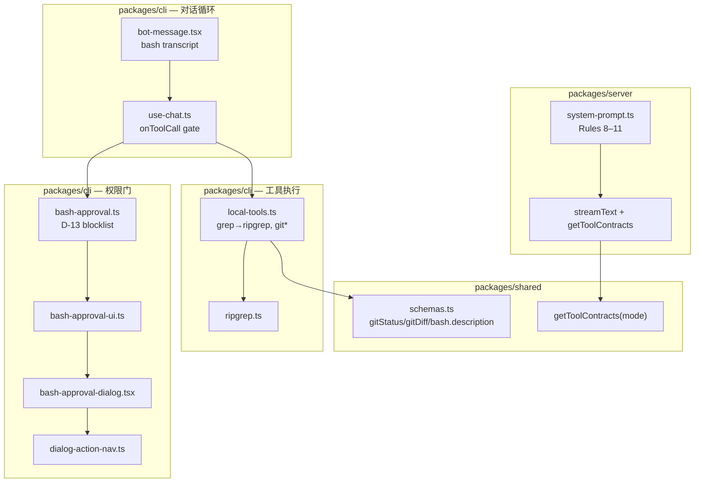
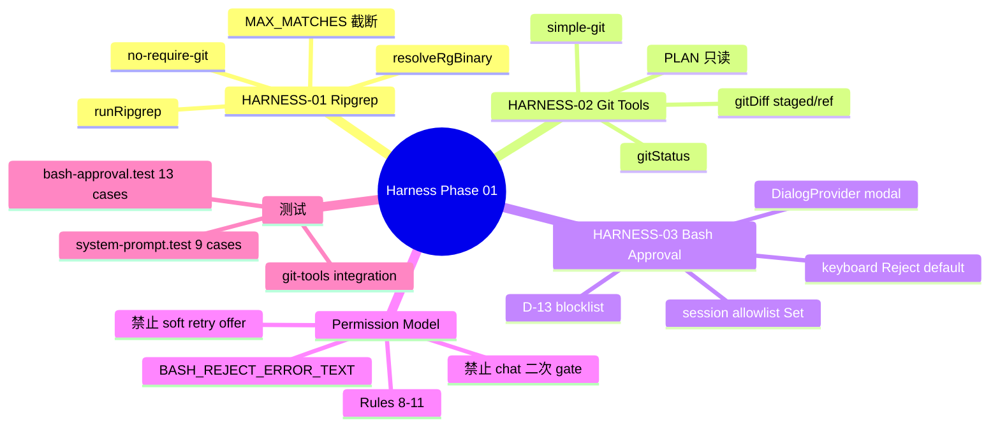
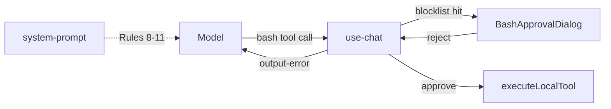
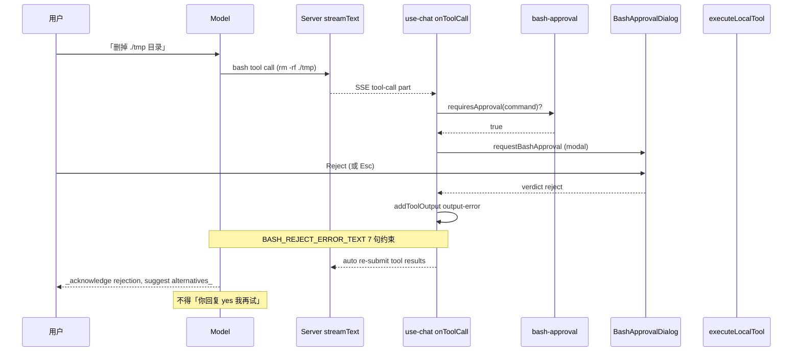
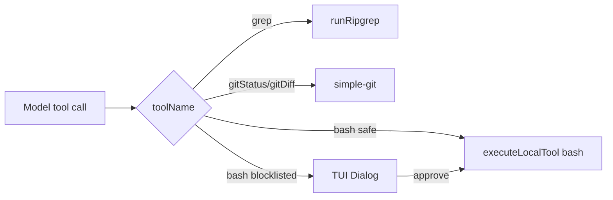

在 Phase 11「Server 流式 + CLI 本地执行工具」架构之上，补齐 **Harness 基础能力**：`grep` 内部换用 **ripgrep**（原生 `.gitignore`）、新增 **`gitStatus`** **/** **`gitDiff`** 只读工具（PLAN/BUILD 均可用）、Build 模式对 **危险 bash** 走 **TUI 审批弹窗**（blocklist + 会话 allowlist）。权限模型对齐 Claude Code：**TUI 是唯一确认门**，chat 不能成为二次权限 gate；Reject 后 model 不得用「你确认后我再试」类软重试。Prompt、CLI gate、`output-error` 三层约束 + 回归测试锁 wording。


---


## 目录

1. 背景与目标
2. 技术选型
3. 架构总览
4. 知识点思维导图
5. 模块与关键代码
6. 核心流程
7. 知识点详解（含官方文档与用法）
8. 文件索引
9. 开发与调试

---


## 1. 背景与目标


### 要做什么


| 能力                             | 状态 | 说明                                         |
| ------------------------------ | -- | ------------------------------------------ |
| HARNESS-01：ripgrep 搜索          | ✅  | `grep` 工具名/schema 不变，实现换 `@vscode/ripgrep` |
| HARNESS-02：gitStatus / gitDiff | ✅  | `simple-git` 只读工具，PLAN + BUILD             |
| HARNESS-03：bash blocklist 审批   | ✅  | Build 模式，`onToolCall` 前拦截                  |
| TUI 三选项弹窗                      | ✅  | Approve once / Reject / Allow for session  |
| 键盘导航（↑↓ Enter Esc）             | ✅  | 默认高亮 Reject（D-20）                          |
| System prompt Rules 8–11       | ✅  | TUI 唯一 gate、禁止 chat 二次确认                   |
| Reject `output-error` 富文本      | ✅  | 与 Rule 11 镜像，7 句约束                         |
| bash transcript 双行展示           | ✅  | command 主行 + description dim 行             |
| 回归测试锁 prompt wording           | ✅  | `system-prompt.test.ts` 9 条                |
| `docs/agent-permissions.md`    | ✅  | CLI vs Model 职责说明                          |
| UAT Test 1 人工复测                | ⚠️ | 自动化完成，人工仍 `result: issue` 待确认              |


### 非目标（本阶段不做）

- MCP、BYOK、子 Agent、LSP
- bash 白名单（approve-all）模式
- blocklist 绕过检测（env 变量混淆等）的完整 sandbox
- 数字键 1/2/3 快捷选审批项（deferred）
- 远程 Web 端代理本地工具

---


## 2. 技术选型


| 层级     | 选择                                                 | 理由                                        |
| ------ | -------------------------------------------------- | ----------------------------------------- |
| 代码搜索   | **`@vscode/ripgrep`**                              | 内置 `rg` 二进制，跨平台；原生 `.gitignore`           |
| rg 回退  | 系统 `rg`（`Bun.which`）                               | VS Code 包不可用时降级                           |
| Git 只读 | **`simple-git`**                                   | 结构化 status/diff，避免 `bash git *`           |
| 审批 UI  | 现有 **`DialogProvider`**                            | 复用 Esc/backdrop/onClose，不另造 inline prompt |
| 键盘层    | **`useKeyboard`** **+** **`isTopLayer("dialog")`** | 与 `DialogSearchList` 同模式（D-21）            |
| 权限约束   | **Prompt + CLI + errorText 三层**                    | 单靠 prompt 不可靠，CLI 硬拦截 + tool 输出反哺 model   |
| 测试     | **Bun test**                                       | 表驱动 blocklist、temp git repo、prompt 回归     |


---


## 3. 架构总览


### 3.1 分层图





### 3.2 依赖方向（单向）


```plain text
@mocode/shared/schemas
  → server/system-prompt（工具列表文案）
  → server/streamText（contracts）
  → cli/local-tools（Zod parse + dispatch）
  → cli/use-chat（bash input parse）

cli/bash-approval（纯函数，无 React）
  → cli/bash-approval-ui（Promise bridge）
  → cli/bash-approval-dialog（OpenTUI UI）
  → cli/use-chat（async gate）

cli/ripgrep（纯 spawn）
  → cli/local-tools grep case
```


**原则**：blocklist 与 ripgrep 保持纯模块可单测；审批 UI 不反向依赖 use-chat。


---


## 4. 知识点思维导图





---


## 5. 模块与关键代码

> **给非技术读者的导读**
>
> 本 Phase 给 Agent 装了三样「安全带和望远镜」：
>
> - **望远镜（搜索）**：用 ripgrep 找代码，自动跳过 `.gitignore` 里的垃圾目录
> - **仪表盘（Git）**：不用 shell 跑 `git status`，直接读结构化状态
> - **保险丝（bash 审批）**：删库、强推等危险命令必须先过终端弹窗，聊天里打字不算「批准」
>

---


### 5.1 Ripgrep 搜索 — `packages/cli/src/lib/ripgrep.ts`


**通俗说明**：Agent 的「在项目里搜关键字」能力，底层从系统 `grep` 换成更快的 ripgrep，并尊重 `.gitignore`。


**类比**：像 IDE 的全局搜索，而不是在 `node_modules` 里翻垃圾。


```typescript
// 优先用 @vscode/ripgrep 自带二进制，否则找 PATH 里的 rg
export function resolveRgBinary(): string { /* ... */ }

export async function runRipgrep(cwd, resolved, pattern, include?) {
  const args = [
    "--line-number", "--no-heading", "--color=never",
    // 关键：非 git 目录也能读 .gitignore（temp 测试目录需要）
    "--no-require-git",
  ];
  // exit code 1 = 无匹配，视为成功空结果
  // 超过 MAX_MATCHES(50) 返回 truncated: true
}
```


| 关键点                | 用人话说                                                 |
| ------------------ | ---------------------------------------------------- |
| 工具名仍叫 `grep`       | 模型和 schema 不用改，只换引擎                                  |
| `--no-require-git` | 没有 `.git` 的文件夹也能按 `.gitignore` 排除                    |
| 输出形状不变             | `{ matches: [{ file, line, content }], truncated? }` |


---


### 5.2 Git 只读工具 — `packages/cli/src/lib/local-tools.ts` + `packages/shared/src/schemas.ts`


**通俗说明**：PLAN/BUILD 都能问「当前分支、脏不脏、改了啥」，但不跑 shell。


```typescript
// shared：加入 readOnlyToolContracts，BUILD 通过 spread 继承
gitStatus: z.object({}),
gitDiff: z.object({
  staged: z.boolean().optional(),  // true → 只看 staged
  ref: z.string().optional(),      // 与某 commit/branch 比；staged 优先
}),

// local-tools
case "gitStatus": {
  const git = simpleGit(process.cwd());
  if (!(await git.checkIsRepo())) throw new Error("Not a git repository");
  // 返回 branch, clean, staged/unstaged/untracked counts, summary
}
case "gitDiff": {
  const diffArgs = staged ? ["--cached"] : ref ? [ref] : [];
  // 默认：unstaged working tree diff
}
```


| 关键点                       | 用人话说                  |
| ------------------------- | --------------------- |
| PLAN 也能用                  | 规划阶段也要看 git 状态        |
| 优先于 `bash git`            | prompt 规则 6 明确推荐      |
| `READ_ONLY_TOOLS` 双 guard | Server 少暴露 + CLI 再拦一层 |


---


### 5.3 Bash Blocklist — `packages/cli/src/lib/bash-approval.ts`


**通俗说明**：只有「看起来危险」的命令才弹窗；`npm test` 照跑。


```typescript
const BLOCKLIST: RegExp[] = [
  /\brm\s+[^\n]*(-r|--recursive|-rf|-fr)\b/,     // rm -rf
  /\bgit\s+push\s+[^\n]*(-f|--force)\b/,        // force push
  /\bgit\s+reset\s+[^\n]*--hard\b/,             // hard reset
  /\bchmod\s+[^\n]*(-R|--recursive)\b/,
  /\b(curl|wget)\s+[^\n]*\|\s*(ba)?sh\b/,        // curl | bash
  /\bdd\s+[^\n]*if=/,                            // dd 写盘
  />\s*\/dev\//,                                 // 重定向到设备
];

export function requiresApproval(command, sessionAllowed): boolean {
  const normalized = normalizeCommand(command); // trim + 合并空白
  if (sessionAllowed.has(normalized)) return false;
  return BLOCKLIST.some((re) => re.test(normalized));
}
```


| 关键点                 | 用人话说                       |
| ------------------- | -------------------------- |
| Blocklist 非 Sandbox | 故意混淆的命令可能漏网，Phase 01 接受    |
| Session allowlist   | 「本会话允许」后同命令不再弹             |
| 只 normalize 空白      | 不做 shell 解析级 normalization |


---


### 5.4 审批弹窗与键盘 — `bash-approval-dialog.tsx` + `dialog-action-nav.ts`


**通俗说明**：危险命令弹出三按钮；键盘默认停在 **Reject**，按 Enter 即拒绝。


```typescript
// 纯函数：方便单测边界 clamp
export const BASH_APPROVAL_DEFAULT_INDEX = 1; // Reject

useKeyboard((key) => {
  if (!isTopLayer("dialog")) return;
  if (key.name === "return") actions[selectedIndex]?.onSelect();
  if (key.name === "up") { key.preventDefault(); /* moveDialogSelection */ }
});
```


| 关键点          | 用人话说                    |
| ------------ | ----------------------- |
| 默认 Reject    | 误按 Enter 不会误删库（D-20）    |
| Esc = Reject | 与点 backdrop 一样（D-15/A4） |
| 鼠标仍可用        | hover 更新高亮，click 执行     |


---


### 5.5 use-chat 审批门 — `packages/cli/src/hooks/use-chat.ts`


**通俗说明**：模型说要跑 bash 时，CLI 在 **真正执行前** 先问人；拒绝则给模型一段「说明书式」错误，不让它在聊天里再要一遍确认。


```typescript
const BASH_REJECT_ERROR_TEXT =
  "User rejected this command in the TUI approval dialog — ... " +
  "There is no chat confirmation path to proceed — ...";

async onToolCall({ toolCall }) {
  if (toolCall.toolName === "bash" && mode === Mode.BUILD) {
    if (requiresApproval(command, sessionAllowRef.current)) {
      const verdict = await requestBashApproval(dialog, command);
      if (verdict === "reject") {
        chat.addToolOutput({ state: "output-error", errorText: BASH_REJECT_ERROR_TEXT });
        return; // 不调用 executeLocalTool
      }
      if (verdict === "allow-session") rememberSessionAllow(...);
    }
  }
  await executeLocalTool(...);
}
```


| 关键点                        | 用人话说                       |
| -------------------------- | -------------------------- |
| 仅 BUILD + bash             | PLAN 根本没有 bash 工具          |
| `sessionAllowRef`          | 每个 chat session 独立 Set，不泄漏 |
| 不 await addToolOutput 之外逻辑 | 遵循 AI SDK tool loop 约定     |


---


### 5.6 System Prompt Rules 8–11 — `packages/server/src/system-prompt.ts`


**通俗说明**：告诉模型「别在聊天里问能不能跑命令；危险命令 TUI 弹窗说了算；被拒了别软磨硬泡」。


```typescript
/**
 * 三层 enforcement：
 * 1. Prompt（此处 Rules 8–11）
 * 2. CLI blocklist + BashApprovalDialog
 * 3. use-chat BASH_REJECT_ERROR_TEXT
 */
const BUILD_BASH_PERMISSION_RULES = `
  8. Invoke bash directly — do not ask in chat first
  9. Blocklisted → TUI dialog is sole confirmation
  10. Use optional description when command opaque
  11. On reject output-error: no chat re-confirm, no soft "after you confirm" retry
`;
```


---


### 5.7 Transcript 展示 — `packages/cli/src/components/messages/bot-message.tsx`


**通俗说明**：消息流里 bash 工具显示「命令一行 + 灰色说明一行」；Reject 时长 errorText 折叠成短标签。


```typescript
function formatBashToolDisplay(input) {
  // 主行：command；次行（dim）：description
}

function formatToolErrorForDisplay(toolName, errorText) {
  if (toolName === "bash" && errorText.startsWith("User rejected this command"))
    return "— rejected in approval dialog";
}
```


---


### 5.8 模块关系总览





| 模块                      | 职责                  |
| ----------------------- | ------------------- |
| `ripgrep.ts`            | grep 后端             |
| `local-tools.ts`        | 工具 dispatch + git   |
| `bash-approval.ts`      | 纯 blocklist 判定      |
| `bash-approval-ui.ts`   | Promise ↔︎ Dialog   |
| `use-chat.ts`           | 异步 gate + errorText |
| `system-prompt.ts`      | 模型行为约束              |
| `system-prompt.test.ts` | 回归锁 wording         |


---


## 6. 核心流程


### 6.1 危险 bash 审批（主路径）





### 6.2 grep / git 工具（无审批）





### 6.3 Plan 01–06 交付节奏


| Plan  | 交付                                 |
| ----- | ---------------------------------- |
| 01-00 | 依赖 + RED 测试脚手架                     |
| 01-01 | ripgrep + git tools + schema       |
| 01-02 | blocklist + dialog + use-chat gate |
| 01-03 | 键盘导航 + Reject 默认                   |
| 01-04 | prompt 对齐 + transcript + docs      |
| 01-05 | Rule 11 chat 二次 gate 禁止            |
| 01-06 | soft retry offer 禁止 + 回归测试         |


---


## 7. 知识点详解（含官方文档与用法）

> 每节含：**官方文档链接 · API/用法 · MoCode 落点**

### 7.1 @vscode/ripgrep


| 概念                 | 说明                      | 参考                                                                               |
| ------------------ | ----------------------- | -------------------------------------------------------------------------------- |
| `rgPath`           | npm 包导出的内置 `rg` 绝对路径    | [npm @vscode/ripgrep](https://www.npmjs.com/package/@vscode/ripgrep)             |
| Exit code 1        | 无匹配，非错误                 | [ripgrep user guide](https://github.com/BurntSushi/ripgrep/blob/master/GUIDE.md) |
| `--no-require-git` | 非 git 目录仍读 `.gitignore` | ripgrep man page                                                                 |


**MoCode 落点**：`packages/cli/src/lib/ripgrep.ts`


### 7.2 simple-git


| 概念                   | 说明                           | 参考                                                    |
| -------------------- | ---------------------------- | ----------------------------------------------------- |
| `checkIsRepo()`      | 是否在 git 仓库内                  | [simple-git docs](https://github.com/steveukx/git-js) |
| `status()`           | 分支、staged/modified/untracked | 同上                                                    |
| `diff(['--cached'])` | staged diff                  | 同上                                                    |


**MoCode 落点**：`packages/cli/src/lib/local-tools.ts` — `gitStatus` / `gitDiff` cases


### 7.3 AI SDK client-side tool loop


| 概念                      | 说明                   | 参考                                                                          |
| ----------------------- | -------------------- | --------------------------------------------------------------------------- |
| `onToolCall`            | CLI 本地执行工具           | [AI SDK tool calling](https://ai-sdk.dev/docs/ai-sdk-ui/chatbot-tool-usage) |
| `addToolOutput`         | 回传结果或 `output-error` | 同上                                                                          |
| `state: "output-error"` | 模型可见的错误通道            | AI SDK UIMessage parts                                                      |


**MoCode 落点**：`packages/cli/src/hooks/use-chat.ts`


### 7.4 OpenTUI Dialog 键盘层


| 概念                         | 说明        | 参考                                                              |
| -------------------------- | --------- | --------------------------------------------------------------- |
| `useKeyboard`              | 全局按键 hook | [OpenTUI React hooks](https://opentui.com/docs/bindings/react/) |
| `isTopLayer("dialog")`     | 模态独占键盘    | `packages/cli/src/providers/keyboard-layer`                     |
| `preventDefault` on arrows | 防止背景滚动    | 同 `dialog-search-list.tsx`                                      |


**MoCode 落点**：`packages/cli/src/components/dialogs/bash-approval-dialog.tsx`


### 7.5 权限模型（Claude Code 对齐）


| 概念              | 说明                     | 参考                          |
| --------------- | ---------------------- | --------------------------- |
| CLI-only gate   | 危险命令由 TUI 拦截           | `docs/agent-permissions.md` |
| 禁止 chat confirm | 模型不得在聊天里要 typed yes/no | Rule 11 + errorText         |
| 禁止 soft retry   | 不得「你确认后我再执行」           | Plan 01-06                  |


**MoCode 落点**：`system-prompt.ts` + `use-chat.ts` + `system-prompt.test.ts`


### 7.6 知识点 ↔︎ 源码 ↔︎ 文档 速查表


| #   | 知识点       | 文件                                 | 官方/内部文档                                                     |
| --- | --------- | ---------------------------------- | ----------------------------------------------------------- |
| 7.1 | Ripgrep   | `cli/src/lib/ripgrep.ts`           | [BurntSushi/ripgrep](https://github.com/BurntSushi/ripgrep) |
| 7.2 | Git 只读    | `cli/src/lib/local-tools.ts`       | [simple-git](https://github.com/steveukx/git-js)            |
| 7.3 | Tool loop | `cli/src/hooks/use-chat.ts`        | [ai-sdk.dev](https://ai-sdk.dev/)                           |
| 7.4 | Dialog 键盘 | `cli/.../bash-approval-dialog.tsx` | [opentui.com](https://opentui.com/)                         |
| 7.5 | 权限分工      | `docs/agent-permissions.md`        | `.planning/.../01-CONTEXT.md` D-22–D-27                     |


---


## 8. 文件索引


| 文件                                                             | 层级     | 一句话                                            |
| -------------------------------------------------------------- | ------ | ---------------------------------------------- |
| `packages/cli/src/lib/ripgrep.ts`                              | 搜索     | ripgrep 二进制解析 + spawn 封装                       |
| `packages/cli/src/lib/local-tools.ts`                          | 执行     | grep→ripgrep；gitStatus/gitDiff；READ_ONLY_TOOLS |
| `packages/cli/src/lib/bash-approval.ts`                        | 权限     | D-13 blocklist + session allowlist             |
| `packages/cli/src/lib/bash-approval-ui.ts`                     | 权限     | Dialog Promise bridge + settled guard          |
| `packages/cli/src/lib/dialog-action-nav.ts`                    | UI 逻辑  | 纯函数箭头导航 + Reject 默认 index                      |
| `packages/cli/src/components/dialogs/bash-approval-dialog.tsx` | UI     | 三按钮审批 + 键盘/鼠标                                  |
| `packages/cli/src/hooks/use-chat.ts`                           | 对话     | async bash gate + BASH_REJECT_ERROR_TEXT       |
| `packages/cli/src/components/messages/bot-message.tsx`         | UI     | bash 双行 transcript + reject 短标签                |
| `packages/cli/src/providers/dialog/types.ts`                   | 基础设施   | `onClose` 回调（Esc→reject）                       |
| `packages/shared/src/schemas.ts`                               | 契约     | gitStatus/gitDiff schema + contracts           |
| `packages/server/src/system-prompt.ts`                         | Prompt | BUILD Rules 8–11                               |
| `packages/server/src/system-prompt.test.ts`                    | 测试     | Prompt 回归 9 cases                              |
| `packages/cli/src/lib/bash-approval.test.ts`                   | 测试     | Blocklist 13 cases                             |
| `packages/cli/src/lib/git-tools.test.ts`                       | 测试     | temp repo git 集成                               |
| `packages/cli/src/lib/ripgrep.test.ts`                         | 测试     | gitignore 排除                                   |
| `packages/cli/src/lib/dialog-action-nav.test.ts`               | 测试     | 箭头边界                                           |
| `docs/agent-permissions.md`                                    | 文档     | 人类可读权限说明                                       |


---


## 9. 开发与调试


### 启动


```bash
# 仓库根目录
bun install

# 跑本 Phase 相关测试
bun test packages/server/src/system-prompt.test.ts \
  packages/cli/src/lib/bash-approval.test.ts \
  packages/cli/src/lib/dialog-action-nav.test.ts \
  packages/cli/src/lib/ripgrep.test.ts \
  packages/cli/src/lib/git-tools.test.ts \
  packages/cli/src/lib/local-tools.test.ts

# 启动 CLI（Build 模式手动验审批）
bun run dev:cli
```


### 手动 UAT（Test 1）

1. Build 模式，用自然语言请求删除目录（如「帮我把 ./tmp 删掉」）
2. 确认 TUI 弹出 **Approve once / Reject / Allow for session**
3. ↑↓ 切换高亮，默认在 **Reject**
4. 点 Reject 或 Esc
5. 确认 model **不再**要求 chat 里 typed 确认或「你确认后我再试」
6. 若要重试，需在新消息里 **明确再次请求** → 再次弹 TUI

### 调试 checklist


| 现象                           | 排查                                                           |
| ---------------------------- | ------------------------------------------------------------ |
| `npm test` 不弹窗               | 预期行为 — 不在 blocklist                                          |
| `rm -rf` 不弹窗                 | 确认 BUILD 模式；检查 `requiresApproval`                            |
| grep 搜到 node_modules         | 检查目录是否有 `.gitignore`；`--no-require-git` 是否生效                 |
| git 工具报 Not a git repository | 在非 git 目录调用 — 预期错误                                           |
| Reject 后 model 仍索要 chat 确认   | 查 prompt Rule 11 + errorText 是否最新；重跑 `system-prompt.test.ts` |
| Esc 后执行了命令                   | 查 `bash-approval-ui` settled guard 与 `onClose` 顺序            |


---


## 附录：D-13 Blocklist 一览


| 模式              | 匹配示例                                 | 需审批 |
| --------------- | ------------------------------------ | --- |
| `rm` recursive  | `rm -rf ./tmp`, `rm -r dir`          | ✅   |
| force push      | `git push --force`, `git push -f`    | ✅   |
| hard reset      | `git reset --hard HEAD~1`            | ✅   |
| chmod recursive | `chmod -R 777 .`                     | ✅   |
| pipe to shell   | `curl x.com \| bash`                 | ✅   |
| dd              | `dd if=/dev/zero of=/dev/sda`        | ✅   |
| redirect /dev   | `echo x > /dev/sda`                  | ✅   |
| 安全命令            | `npm test`, `git status`, `bun test` | ❌   |


## 附录：审批弹窗操作


| 操作                         | 效果                    |
| -------------------------- | --------------------- |
| **Approve once**           | 本次执行；同命令下次仍弹窗         |
| **Reject**                 | `output-error`；不执行    |
| **Allow for this session** | 本会话同 normalized 命令免弹窗 |
| **Esc / 点 backdrop**       | 等同 Reject             |
| **↑ / ↓**                  | 移动高亮（默认 Reject）       |
| **Enter**                  | 确认当前高亮项               |