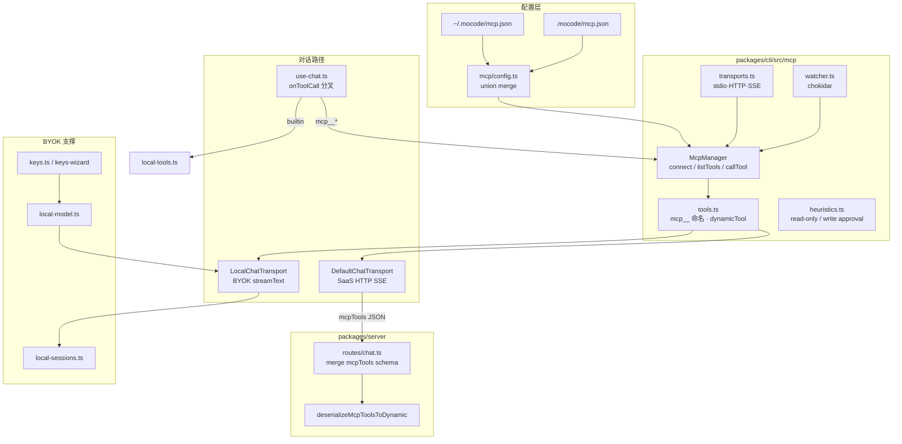
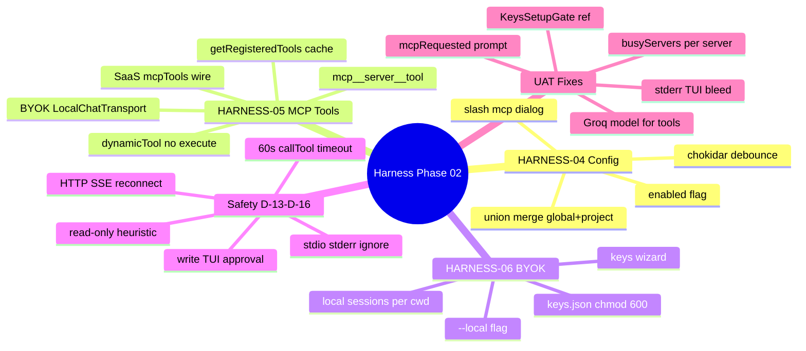
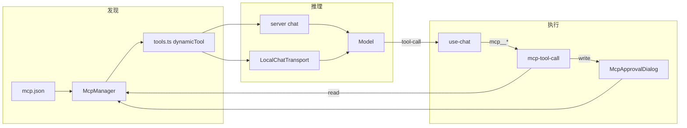
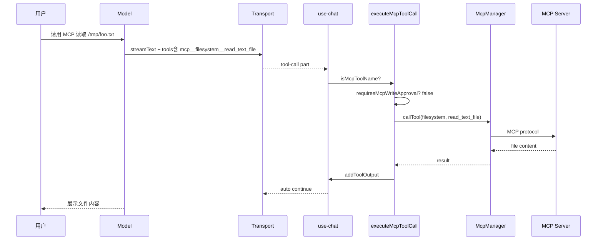
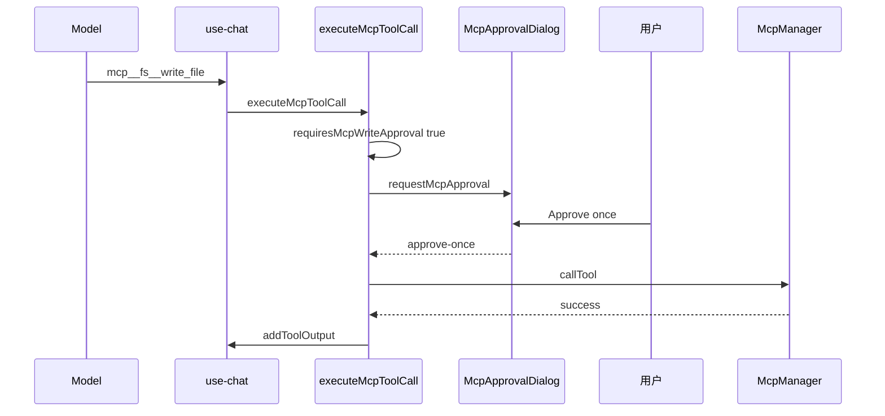
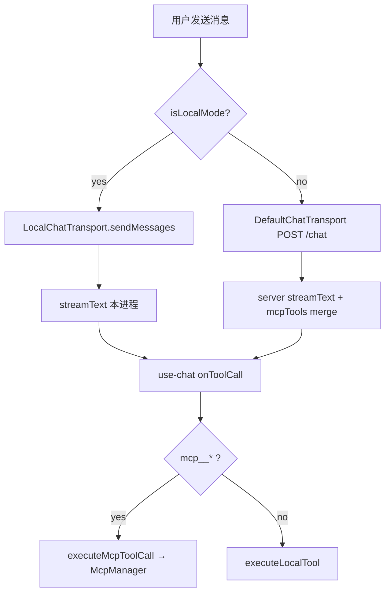

在 Phase 11「Server 流式 + CLI 本地执行」与 Phase 12「bash 审批门」之上，交付 **Harness 平台扩展**：CLI 作为 **唯一 MCP 客户端**，通过 `~/.mocode/mcp.json` 与项目 `.mocode/mcp.json` **并集合并**连接外部工具服务器；工具以 Claude Code 命名 **`mcp__<server>__<tool>`** 注册进模型上下文，**执行始终在 CLI**（SaaS 模式仅合并 schema）。新增 **`mocode --local`** **BYOK**：`keys.json` + `/keys` 向导 + `LocalChatTransport` 进程内 `streamText`，会话落盘 `~/.mocode/projects/<cwd>/`。MCP **写工具**复用 bash 三选项审批；`/mcp` 提供运行时状态、启用切换与重连。UAT 8/8 通过。


---


## 目录

1. 背景与目标
2. 技术选型
3. 架构总览
4. 知识点思维导图
5. 模块与关键代码
6. 核心流程
7. 知识点详解（含官方文档与用法）
8. 文件索引
9. 开发与调试
10. 错误记录（UAT 复盘）

---


## 1. 背景与目标


### 要做什么


| 能力                               | 状态 | 说明                                                        |
| -------------------------------- | -- | --------------------------------------------------------- |
| HARNESS-04：MCP 配置                | ✅  | 全局 + 项目 `mcp.json` 并集合并；stdio / HTTP / SSE                |
| HARNESS-04：`/mcp` 运行时管理          | ✅  | 状态、enabled 切换、重连、tool count                               |
| HARNESS-04：chokidar 热重载          | ✅  | 300ms debounce 后 disconnectAll + connectAll               |
| HARNESS-05：MCP 工具发现与调用           | ✅  | `listTools` → dynamicTool；`onToolCall` → MCP SDK          |
| HARNESS-05：SaaS schema 合并        | ✅  | CLI POST `mcpTools`；server `deserializeMcpToolsToDynamic` |
| HARNESS-05：BYOK 本地合并             | ✅  | `LocalChatTransport` 进程内 streamText                       |
| HARNESS-06：`--local` 入口          | ✅  | 显式 opt-in，无 OAuth 静默回退                                    |
| HARNESS-06：`keys.json` + `/keys` | ✅  | chmod 600；多 provider；掩码预览                                 |
| HARNESS-06：本地会话持久化               | ✅  | `~/.mocode/projects/<normalized-cwd>/`                    |
| MCP 写工具 TUI 审批                   | ✅  | Approve once / Reject / Allow for session                 |
| PLAN 模式只读 MCP                    | ✅  | 前缀启发式 + `readOnly` 配置覆盖                                   |
| UAT 8 项                          | ✅  | 含 stderr 穿透、busy 锁、模型选型等修复                                |


### 非目标（本阶段不做）

- Server 端执行 MCP（违反 Phase 11 本地执行隐私模型）
- Stream resume / 中断恢复（Phase 03，HARNESS-07/08）
- 子 Agent、Skills、Hooks、LSP、垂直 Agent
- MCP 每工具 allowlist/denylist（v1 暴露全部已连接工具）
- BYOK 云端会话同步
- 修改默认聊天模型（仍为 `openai/gpt-oss-120b:free`，UAT 推荐 Groq `llama-3.3-70b-versatile`）

---


## 2. 技术选型


| 层级         | 选择                                | 理由                                             |
| ---------- | --------------------------------- | ---------------------------------------------- |
| MCP 协议     | **`@modelcontextprotocol/sdk`**   | 官方 TS 客户端；stdio / Streamable HTTP / SSE        |
| 配置热重载      | **`chokidar`**                    | 监听 global + project `mcp.json`                 |
| 工具桥接       | **AI SDK** **`dynamicTool`**      | schema-only 注册；execute 在 CLI `onToolCall`      |
| SaaS 跨包序列化 | **`@mocode/shared/mcp-tools.ts`** | server 不依赖 MCP SDK                             |
| BYOK 推理    | **`LocalChatTransport`**          | 实现 `ChatTransport`；镜像 server `chat.ts` 循环      |
| BYOK 密钥    | **`~/.mocode/keys.json`**         | chmod 600；与 server `.env` 解耦                   |
| 写审批 UI     | **复用 DialogProvider 模式**          | 与 Phase 01 bash approval 同 UX（D-15）            |
| 测试         | **Bun test**                      | manager / config / heuristics / integration 单测 |


---


## 3. 架构总览


### 3.1 分层图





### 3.2 依赖方向（单向）


```plain text
mcp/config-schema (Zod)
  → mcp/config (load/merge/persist)
  → mcp/manager + mcp/watcher

mcp/transports
  → mcp/manager (connect only)

mcp/heuristics (pure)
  → mcp/tools (PLAN filter)
  → lib/mcp-tool-call (approval gate)

mcp/tools + mcp/manager
  → lib/local-chat-transport (BYOK)
  → use-chat prepareSendMessagesRequest (SaaS wire)

@shared/mcp-tools
  → server/routes/chat.ts (schema merge only)

lib/mcp-approval-ui → dialogs/mcp-approval-dialog
lib/mcp-tool-call → use-chat onToolCall
```


**原则**：MCP SDK 与 chokidar **仅存在于 CLI**；server 只接收 JSON schema，绝不 `callTool`。


---


## 4. 知识点思维导图





---


## 5. 模块与关键代码

> **给非技术读者的导读**
>
> 本 Phase 给 MoCode 装了两块「外挂」：
>
> - **USB 集线器（MCP）**：插上 filesystem、数据库等外部工具服务，Agent 能调用它们，但代码仍在你电脑上跑
> - **自带电池（BYOK）**：不连 MoCode 云端也能聊，API Key 存本机，对话记在本机文件夹里
>

---


### 5.1 MCP 配置合并 — `packages/cli/src/mcp/config.ts`


**通俗说明**：读两份配置文件（用户主目录 + 当前项目），项目里同名服务器覆盖全局。


**类比**：像「系统环境变量 + 项目 `.env`」，项目优先。


```typescript
// 并集合并：project.mcpServers 同名键覆盖 global
function mergeRawConfig(global: McpConfig, project: McpConfig): McpConfig {
  return {
    mcpServers: { ...global.mcpServers, ...project.mcpServers },
  };
}

// enabled: false 仍保留在 JSON，connectAll 时过滤
export function getEnabledServers(config: McpConfig) {
  return Object.fromEntries(
    Object.entries(config.mcpServers).filter(([, s]) => s.enabled !== false),
  );
}
```


| 关键点                | 用人话说                               |
| ------------------ | ---------------------------------- |
| 同名覆盖               | 项目 `filesystem` 可覆盖全局 `filesystem` |
| `setServerEnabled` | `/mcp` 按 `t` 写回「定义该 server 的那份文件」  |
| Zod 校验             | 非法 JSON 加载失败时不 silently 连错服务器      |


---


### 5.2 连接管理器 — `packages/cli/src/mcp/manager.ts`


**通俗说明**：负责「插上/拔掉」每个 MCP 服务，记住它们提供哪些工具，真正调用时转发给 SDK。


```typescript
// 工具 schema 给模型用：连接断了也尽量保留上次 listTools 结果，避免 tool-loop 中途 schema 消失
getRegisteredTools(): DiscoveredMcpTool[] {
  // live connected tools || cached entry.tools
}

async callTool(serverName, toolName, args) {
  await this.ensureConnected(serverName); // 调用前尝试重连
  return entry.client.callTool({ name: toolName, arguments: args }, undefined, {
    timeout: entry.config.timeoutMs ?? 60_000,
    resetTimeoutOnProgress: true,
  });
}

// 仅 HTTP/SSE 失败时指数退避重连；stdio 子进程挂了需用户在 /mcp 手动重连
private scheduleReconnect(serverName: string) {
  const delay = 1000 * 2 ** (entry.reconnectAttempts - 1); // max 5 次
}
```


| 关键点                        | 用人话说                               |
| -------------------------- | ---------------------------------- |
| `connecting` Set           | 同一 server 不会并发连两次（修 `/mcp` 连点 `t`） |
| `applyServerEnabledChange` | 只动一个 server，不全量 disconnectAll      |
| stderr 无关                  | transport 层处理（见 5.3）               |


---


### 5.3 传输工厂 — `packages/cli/src/mcp/transports.ts`


**通俗说明**：按配置启动「子进程」或「远程 HTTP/SSE 连接」。


```typescript
case McpTransport.STDIO:
  return new StdioClientTransport({
    command: entry.command,
    args: entry.args ?? [],
    env: { ...process.env, ...entry.env },
    stderr: "ignore", // 防止 npx MCP 横幅日志穿透 OpenTUI 对话框
  });
```


| 关键点   | 用人话说                                                      |
| ----- | --------------------------------------------------------- |
| stdio | 典型：`npx -y @modelcontextprotocol/server-filesystem /path` |
| HTTP  | Streamable HTTP，远程首选                                      |
| SSE   | 兼容旧服务，不推荐新项目                                              |


---


### 5.4 工具命名与桥接 — `packages/cli/src/mcp/tools.ts`


**通俗说明**：把 MCP 的 `read_file` 变成模型看到的 `mcp__filesystem__read_file`，并和内置 readFile 等工具合并。


```typescript
export function mcpToolName(serverName: string, toolName: string): string {
  return `mcp__${serverName}__${toolName}`;
}

// dynamicTool 只有 description + inputSchema，没有 execute
export function mcpToolsToDynamicTools(serverName, tools): ToolSet {
  result[mcpToolName(serverName, tool.name)] = dynamicTool({
    description: tool.description,
    inputSchema: jsonSchemaToInputSchema(tool.inputSchema),
  });
}

// PLAN：过滤写 MCP；BUILD：全量
export function buildMergedToolSet(mode, mcpDynamicTools, config) {
  return { ...getToolContracts(mode), ...filterMcpToolsForMode(mode, mcpDynamicTools, config) };
}
```


---


### 5.5 MCP 工具执行 — `packages/cli/src/lib/mcp-tool-call.ts`


**通俗说明**：模型点了 MCP 工具后，CLI 在这里决定要不要弹窗、然后真的去调 MCP。


```typescript
export async function executeMcpToolCall(toolCall, deps): Promise<boolean> {
  // 模型偶发 Mcp__ 大小写 → 归一化为 mcp__
  const toolName = isMcpToolName(raw) ? raw : raw.toLowerCase().startsWith("mcp__") ? raw.toLowerCase() : raw;

  if (mode === Mode.PLAN && !isMcpReadOnlyTool(tool, toolConfig)) {
    addToolOutput({ state: "output-error", errorText: "Tool not available in PLAN mode" });
    return true;
  }

  if (requiresMcpWriteApproval(toolName, sessionMcpAllowRef, toolConfig)) {
    const verdict = await requestMcpApproval(dialog, toolName, input);
    if (verdict === "reject") { /* MCP_REJECT_ERROR_TEXT */ return true; }
    if (verdict === "allow-session") sessionMcpAllowRef.add(toolName);
  }

  const output = await getMcpManager().callTool(server, tool, args);
  addToolOutput({ toolCallId, output });
  return true;
}
```


| 关键点          | 用人话说                              |
| ------------ | --------------------------------- |
| 返回 `false`   | 不是 MCP 名 → 交给 readFile/bash 等内置工具 |
| 会话 allowlist | 与 bash 的 `sessionAllowRef` 分开存    |


---


### 5.6 use-chat 双路径 — `packages/cli/src/hooks/use-chat.ts`


**通俗说明**：同一个聊天钩子，根据是否 `--local` 走云端或本机推理；MCP 执行两条路都一样在 CLI。


```typescript
const transport = useMemo(() => {
  if (isLocalMode()) {
    return new LocalChatTransport({ resolveModel: resolveChatModel, getMcpManager, buildSystemPrompt });
  }
  return new DefaultChatTransport({
    prepareSendMessagesRequest({ messages }) {
      return {
        body: {
          mcpTools: getMcpManager().getToolDefinitions(requestMode), // schema only
        },
      };
    },
  });
}, [sessionId]);

async onToolCall({ toolCall }) {
  const isMcpCall = isMcpToolName(toolCall.toolName);
  // AI SDK 标 dynamic 的工具默认跳过；MCP 必须客户端执行
  if (toolCall.dynamic && !isMcpCall) return;

  if (isMcpCall) {
    await executeMcpToolCall(...);
    return;
  }
  // ... bash approval + executeLocalTool
}
```


---


### 5.7 BYOK 本地传输 — `packages/cli/src/lib/local-chat-transport.ts`


**通俗说明**：`--local` 时不请求 server `/chat`，在本进程里直接 `streamText`。


```typescript
async sendMessages({ messages, abortSignal }) {
  const mcpDynamicTools = buildMcpDynamicToolsFromManager(getMcpManager(), config);
  const tools = buildMergedToolSet(mode, mcpDynamicTools, config);
  const mcpRequested = isMcpUserRequest(lastUserText(messages)); // 用户说了 "MCP"
  const systemPrompt = buildSystemPrompt({ mode, mcpToolNames, mcpRequested });

  const result = streamText({ model, system: systemPrompt, messages, tools, abortSignal });
  return result.toUIMessageStream({ originalMessages: nextMessages });
}

async reconnectToStream() {
  return null; // Phase 03
}
```


---


### 5.8 System Prompt MCP 路由 — `packages/cli/src/lib/system-prompt.ts`


**通俗说明**：当用户明确要用 MCP 时，在 prompt 里加「ACTIVE TURN」块，要求第一下就调 `mcp__*`，别先去 grep 仓库。


```typescript
function buildMcpToolsSection(mode, mcpToolNames, mcpRequested) {
  const activeTurn = mcpRequested ? `
  ## ACTIVE TURN — MCP REQUESTED
  Your **first** tool call must be a matching\`mcp__*\` tool...` : "";
  // MCP Rules: 禁止用 grep 找 MCP 实现
}
```


| 分工                 | 说明                      |
| ------------------ | ----------------------- |
| `heuristics.ts`    | 执行时拦 PLAN 写、决定是否弹审批     |
| `system-prompt.ts` | 引导模型**选型**（MCP vs 内置工具） |


---


### 5.9 `/mcp` 对话框 — `packages/cli/src/components/dialogs/mcp-dialog.tsx`


**通俗说明**：运行时看每个 MCP 服务连没连上，可重连或开关 enabled。


```typescript
// 每个 server 独立 busy 锁，避免一个 npx 冷启动卡住全部列表
const busyServersRef = useRef(new Set<string>());

// HTTP/SSE pending 时每秒 bump 刷新状态行
useEffect(() => {
  if (hasAutoPending) return setInterval(() => bump(), 1000);
}, [servers]);
```


| 按键    | 行为                                                         |
| ----- | ---------------------------------------------------------- |
| Enter | 对选中 server `reconnect()`                                   |
| t     | toggle `enabled` → 写 mcp.json → `applyServerEnabledChange` |
| ↑↓    | 列表导航                                                       |


---


### 5.10 BYOK 密钥与会话 — `keys.ts` · `local-sessions.ts` · `local-mode.ts`


**通俗说明**：钥匙存 `~/.mocode/keys.json`；对话存 `~/.mocode/projects/<把路径里的/换成->/<session-id>.json`。


```typescript
// local-mode.ts
export function parseCliArgs(argv) {
  return { local: argv.includes("--local") };
}

// keys.ts — 错误信息里脱敏 apiKey
writeFileSync(keysFile, JSON.stringify(data), { mode: 0o600 });

// local-sessions.ts — cwd 归一化：/Users/foo/bar → -Users-foo-bar
export function normalizeProjectPath(cwd: string): string {
  return cwd.replace(/\//g, "-").replace(/^-+/, "") || "-";
}
```


---


### 5.11 Server SaaS 合并 — `packages/server/src/routes/chat.ts` + `packages/shared/src/mcp-tools.ts`


**通俗说明**：云端只负责把 CLI 上报的工具 **定义** 塞进 `streamText`；执行仍回 CLI。


```typescript
// chat.ts
const tools = {
  ...getToolContracts(mode),
  ...deserializeMcpToolsToDynamic(mcpTools), // 来自 CLI POST body
};

// shared/mcp-tools.ts — 无 execute，与 CLI tools.ts 的 jsonSchema 转换逻辑对称
export function deserializeMcpToolsToDynamic(mcpTools?: SerializedMcpTool[]): ToolSet
```


---


### 5.12 模块关系总览





| 模块                        | 职责                           |
| ------------------------- | ---------------------------- |
| `mcp/config.ts`           | 加载、合并、持久化 enabled            |
| `mcp/manager.ts`          | 连接生命周期 + callTool            |
| `mcp/tools.ts`            | 命名、合并、序列化                    |
| `mcp-tool-call.ts`        | 审批 + 调用                      |
| `local-chat-transport.ts` | BYOK streamText              |
| `use-chat.ts`             | transport 选择 + onToolCall 路由 |
| `mcp-dialog.tsx`          | `/mcp` UX                    |


---


## 6. 核心流程


### 6.1 MCP 只读工具调用（BUILD，无审批）





### 6.2 MCP 写工具 + TUI 审批





### 6.3 BYOK vs SaaS 路径对比





### 6.4 Plan 02-00～02-08 交付节奏


| Plan  | 交付                                     |
| ----- | -------------------------------------- |
| 02-00 | 依赖 + RED 测试脚手架                         |
| 02-01 | mcp.json schema + union merge loader   |
| 02-02 | transports + McpManager 生命周期           |
| 02-03 | chokidar + `/mcp` UI                   |
| 02-04 | heuristics + dynamicTool 桥接            |
| 02-05 | onToolCall + SaaS merge + 写审批          |
| 02-06 | `--local` + local sessions + keys gate |
| 02-08 | keys.json + `/keys` wizard             |
| 02-07 | LocalChatTransport + BYOK inference    |


---


## 7. 知识点详解（含官方文档与用法）

> 每节含：**官方文档链接 · API/用法 · MoCode 落点**

### 7.1 Model Context Protocol (MCP)


| 概念                       | 说明                   | 参考                                                                         |
| ------------------------ | -------------------- | -------------------------------------------------------------------------- |
| MCP                      | LLM 应用连接外部工具/资源的标准协议 | [modelcontextprotocol.io](https://modelcontextprotocol.io/)                |
| stdio transport          | 子进程 stdin/stdout 通信  | [MCP transports](https://modelcontextprotocol.io/docs/concepts/transports) |
| `listTools` / `callTool` | 发现与调用                | SDK Client API                                                             |


**MoCode 落点**：`packages/cli/src/mcp/manager.ts` — CLI 唯一 Client


---


### 7.2 AI SDK dynamicTool


| 概念                 | 说明                      | 参考                                                                         |
| ------------------ | ----------------------- | -------------------------------------------------------------------------- |
| `dynamicTool`      | 运行时注册、无静态 `execute` 的工具 | [AI SDK Tools](https://ai-sdk.dev/docs/ai-sdk-core/tools-and-tool-calling) |
| `toolCall.dynamic` | 标记需客户端处理                | `use-chat` 对 MCP 例外                                                        |


**MoCode 落点**：`mcp/tools.ts` 构建 schema；`use-chat.ts` 执行


---


### 7.3 ChatTransport 可插拔


| 概念                   | 说明                | 参考                            |
| -------------------- | ----------------- | ----------------------------- |
| `ChatTransport`      | `useChat` 发送/重连抽象 | AI SDK React                  |
| `LocalChatTransport` | BYOK 实现，绕过 HTTP   | `lib/local-chat-transport.ts` |


**MoCode 落点**：`use-chat.ts` 按 `isLocalMode()` 切换


---


### 7.4 chokidar 配置监听


| 概念       | 说明                                     | 参考                     |
| -------- | -------------------------------------- | ---------------------- |
| debounce | 避免保存时连续触发多次重连                          | `mcp/watcher.ts` 300ms |
| watch 目录 | global `~/.mocode` + project `.mocode` | `resolveWatchTarget`   |


**MoCode 落点**：`session-mcp.ts` 挂载时 `watchMcpConfig`


---


### 7.5 macOS `/tmp` 与 filesystem MCP


| 概念                      | 说明                                                                             |
| ----------------------- | ------------------------------------------------------------------------------ |
| `/tmp` → `/private/tmp` | macOS 符号链接；MCP filesystem 允许目录可能是 `/private/tmp/...`                           |
| 模型行为                    | 良好模型会先 `list_allowed_directories` 再纠正路径                                        |
| 推荐配置                    | filesystem 允许目录指向**项目内目录**（绝对路径），与 cwd/项目定位一致；避免全局 `/tmp` 触发 `/private/tmp` 噪声 |


**MoCode 落点**：UAT Test 7；非代码 bug，属平台常识。配置定位详见 §11 错误记录 E-02


---


### 7.6 知识点 ↔︎ 源码 ↔︎ 文档 速查表


| #   | 知识点           | 文件                        | 官方文档                                              |
| --- | ------------- | ------------------------- | ------------------------------------------------- |
| 7.1 | MCP Client    | `mcp/manager.ts`          | [MCP](https://modelcontextprotocol.io/)           |
| 7.2 | dynamicTool   | `mcp/tools.ts`            | [AI SDK](https://ai-sdk.dev/)                     |
| 7.3 | ChatTransport | `local-chat-transport.ts` | AI SDK React                                      |
| 7.4 | chokidar      | `mcp/watcher.ts`          | [chokidar](https://github.com/paulmillr/chokidar) |
| 7.5 | MCP 写审批       | `mcp-approval-ui.ts`      | 对齐 Phase 01 bash                                  |
| 7.6 | keys.json     | `lib/keys.ts`             | D-12 决策                                           |


---


## 8. 文件索引


| 文件                                                            | 层级     | 一句话                                            |
| ------------------------------------------------------------- | ------ | ---------------------------------------------- |
| `packages/cli/src/mcp/config.ts`                              | 配置     | 全局+项目 mcp.json 合并与 enabled 持久化                 |
| `packages/cli/src/mcp/config-schema.ts`                       | 配置     | Zod schema（stdio/HTTP/SSE discriminated union） |
| `packages/cli/src/mcp/manager.ts`                             | 运行时    | MCP 连接单例、listTools、callTool、重连                 |
| `packages/cli/src/mcp/transports.ts`                          | 运行时    | 三传输工厂；stdio stderr ignore                      |
| `packages/cli/src/mcp/watcher.ts`                             | 运行时    | mcp.json 热重载                                   |
| `packages/cli/src/mcp/tools.ts`                               | 桥接     | mcp__ 命名、dynamicTool、SaaS 序列化                  |
| `packages/cli/src/mcp/heuristics.ts`                          | 策略     | 只读/写判定、写审批需求                                   |
| `packages/cli/src/mcp/session-mcp.ts`                         | 生命周期   | 会话挂载 connectAll + watch                        |
| `packages/cli/src/lib/mcp-tool-call.ts`                       | 执行     | onToolCall MCP 分支实现                            |
| `packages/cli/src/lib/mcp-approval-ui.ts`                     | UI 桥接  | Promise ↔︎ McpApprovalDialog                   |
| `packages/cli/src/lib/local-chat-transport.ts`                | BYOK   | 进程内 streamText                                 |
| `packages/cli/src/lib/local-model.ts`                         | BYOK   | keys.json → AI SDK provider                    |
| `packages/cli/src/lib/local-sessions.ts`                      | BYOK   | 本地会话 JSON 持久化                                  |
| `packages/cli/src/lib/local-mode.ts`                          | BYOK   | `--local` 标志                                   |
| `packages/cli/src/lib/keys.ts`                                | BYOK   | keys.json 读写 chmod 600                         |
| `packages/cli/src/lib/system-prompt.ts`                       | Prompt | BYOK system + MCP 路由规则                         |
| `packages/cli/src/hooks/use-chat.ts`                          | 编排     | 双 transport + MCP/bash 工具门                     |
| `packages/cli/src/components/dialogs/mcp-dialog.tsx`          | UI     | `/mcp` 管理                                      |
| `packages/cli/src/components/dialogs/mcp-approval-dialog.tsx` | UI     | MCP 写审批                                        |
| `packages/cli/src/components/dialogs/keys-wizard-dialog.tsx`  | UI     | `/keys` 向导                                     |
| `packages/cli/src/components/keys-setup-gate.tsx`             | UI     | 冷启动缺 key 自动开向导                                 |
| `packages/shared/src/mcp-tools.ts`                            | 共享     | server 侧 deserialize MCP schema                |
| `packages/server/src/routes/chat.ts`                          | Server | 合并 mcpTools 进 streamText                       |
| `docs/agent-permissions.md`                                   | 文档     | CLI vs Model 权限说明（含 MCP）                       |


---


## 9. 开发与调试


### 启动


```bash
# 仓库根目录
bun install

# SaaS 模式（需 server + OAuth，MCP 仍在 CLI）
bun run dev:cli

# BYOK 本地模式（需 ~/.mocode/keys.json）
bun run dev:cli -- --local
```


### 环境/配置


| 路径                          | 用途                      |
| --------------------------- | ----------------------- |
| `~/.mocode/mcp.json`        | 全局 MCP 服务器              |
| `.mocode/mcp.json`          | 项目级覆盖/追加                |
| `~/.mocode/keys.json`       | BYOK API keys（mode 600） |
| `~/.mocode/projects/<cwd>/` | `--local` 会话目录          |


**示例 stdio filesystem server**（项目 `.mocode/mcp.json`）：

> ⚠️ 允许目录应指向**当前项目内**的目录（绝对路径），与 MoCode 的 cwd / 项目级定位保持一致；  
> 不要用机器全局 `/tmp`（会在 macOS 上被解析成 `/private/tmp`）。  
> 项目级配置应使用与全局**同名**的 `filesystem` entry 覆盖 `~/.mocode/mcp.json`（D-01 按名称合并），  
> 否则全局 `filesystem`（`/tmp`）与项目 `project-only` 会**并存**，模型优先调用前者。  
> `.mocode/mcp.json` 是本地未追踪配置，按自己机器替换为实际项目路径即可。

```json
{
  "mcpServers": {
    "filesystem": {
      "enabled": true,
      "transport": "stdio",
      "command": "npx",
      "args": ["-y", "@modelcontextprotocol/server-filesystem", "/绝对路径/到/你的项目/tmp/mocode-mcp-test"],
      "timeoutMs": 60000
    }
  }
}
```


### 测试


```bash
# MCP 相关单测
bun test packages/cli/src/mcp/
bun test packages/cli/src/lib/mcp-approval.test.ts
bun test packages/cli/src/hooks/use-chat-mcp.test.ts

# 集成（需 npx 可用时跑 filesystem spike）
bun test packages/cli/src/mcp/integration.test.ts
```


### 调试 checklist


| 现象                                | 排查                                                                    |
| --------------------------------- | --------------------------------------------------------------------- |
| `/mcp` 按 `t` 后 UI 乱码/日志穿透         | 确认 `transports.ts` `stderr: "ignore"`                                 |
| 一个 server reconnecting 时其他 `t` 无效 | 确认 per-server `busyServersRef`（非全局单锁）                                 |
| 模型用 grep 不用 MCP                   | 用户消息是否含「MCP」；换 Groq `llama-3.3-70b-versatile`；查 `mcpRequested` prompt |
| `filesystem is not connected`     | `/mcp` 看重连；`callTool` 会 `ensureConnected`                             |
| macOS 路径 Access denied            | 用 `list_allowed_directories` 或 `/private/tmp/...`                     |
| BYOK Esc 关不掉 keys 向导              | `KeysSetupGate` `didAutoOpenRef` 仅 auto-open 一次                       |
| OpenRouter `:free` 限流             | 换付费模型或 Groq；非 MCP 代码问题                                                |
| SaaS 看不到 MCP 工具                   | CLI 是否 `getToolDefinitions` 写入 POST；server 日志看 merge                  |
| 对话只显示 `An error occurred.`        | AI SDK 默认掩码；已由 `formatChatStreamError` 透传真实错误（见 §11 E-01）             |
| MCP 写到 `/private/tmp` 而非项目内       | `.mocode/mcp.json` 允许目录指向了全局 `/tmp`，改为项目内绝对路径（§11 E-02）               |


---


## 10. 错误记录（UAT 复盘）

> 本节记录Test A/B 验收时发现的两类问题，供后续 Phase 与代码审查参考。

### E-01 · 流式错误被掩码成 “An error occurred.”


| 项        | 内容                                                                                                                                                                                         |
| -------- | ------------------------------------------------------------------------------------------------------------------------------------------------------------------------------------------ |
| **现象**   | PLAN 模式问「列出 MCP 有哪些写工具？」后只显示 `An error occurred.`，一度误判为 PLAN/MCP 过滤逻辑 bug                                                                                                                  |
| **根因**   | AI SDK `streamText().toUIMessageStream()` 的默认 `onError = () => 'An error occurred.'`，出于安全默认**掩盖真实错误**；实际错误是 LLM API 失败（Groq TPD 限流、Gemini `User location is not supported`、缺 Cerebras key） |
| **定位手段** | Debug 模式埋点：在 `streamText.onError` / `toUIMessageStream.onError` / `useChat.error` 三处记录真实 error，证实错误来自 provider 而非本地逻辑                                                                      |
| **修复**   | 新增 `packages/cli/src/lib/stream-error.ts` 的 `formatChatStreamError()`，在 `LocalChatTransport` 的 `toUIMessageStream({ onError })` 中**透传真实错误信息**，不再返回通用文案                                     |
| **教训**   | ① AI SDK 的 `onError` 默认掩码是常见坑，BYOK/本地链路必须自定义透传；② UAT 报错先看真实错误再下逻辑结论，避免被掩码文案误导                                                                                                              |
| **关联**   | `local-chat-transport.ts` · `stream-error.ts` · `stream-error.test.ts`                                                                                                                     |


### E-02 · filesystem MCP 允许目录指向全局 `/tmp`，与项目定位不符


| 项      | 内容                                                                                                                                                                                              |
| ------ | ----------------------------------------------------------------------------------------------------------------------------------------------------------------------------------------------- |
| **现象** | MCP 写文件回显 `/private/tmp/mocode-mcp-test/...`，写入的是机器全局临时目录，而非项目内目录                                                                                                                               |
| **根因** | ① 全局 `~/.mocode/mcp.json` 的 `filesystem` 指向 `/tmp/mocode-mcp-test`；② 项目 `.mocode/mcp.json` 用了不同名 `project-only`，D-01 合并**不会覆盖**全局，两 server 并存；③ 模型调用 `mcp__filesystem__*` 返回 `/private/tmp/...` |
| **修复** | 项目 `.mocode/mcp.json` 改用同名 `filesystem` entry 覆盖全局，允许目录指向项目内绝对路径；`/mcp` 应只显示一个 `filesystem`                                                                                                     |
| **教训** | 演示/示例配置也应体现产品定位——MoCode 是项目级终端助手，MCP 允许目录应与当前项目绑定，而非随手用全局 `/tmp`                                                                                                                                |
| **关联** | `.mocode/mcp.json`（本地未追踪）· §7.5 · §9 示例                                                                                                                                                         |


---


## 附录：Slash 命令与 UAT 摘要


### Slash 命令（本 Phase 新增/相关）


| 命令      | 说明                         |
| ------- | -------------------------- |
| `/mcp`  | MCP 服务器状态、重连、enabled 切换    |
| `/keys` | BYOK API Key 向导（list/edit） |


### UAT 8 项结果


| # | 测试                      | 结果   | 备注                               |
| - | ----------------------- | ---- | -------------------------------- |
| 1 | 冷启动 `--local` + keys 向导 | pass | KeysSetupGate Esc 循环已修           |
| 2 | `/keys` 持久化 600         | pass |                                  |
| 3 | 本地会话创建                  | pass | D-10 路径归一化                       |
| 4 | BYOK live chat          | pass | stripIncompleteAssistantMessages |
| 5 | mcp.json 合并             | pass | 误触 `t` 后需恢复配置                    |
| 6 | `/mcp` 管理               | pass | stderr ignore + busy 锁           |
| 7 | MCP 只读调用                | pass | 推荐 Groq；注意 `/private/tmp`        |
| 8 | MCP 写审批                 | pass | McpApprovalDialog                |


### 决策编号速查（02-CONTEXT）


| ID      | 摘要                                              |
| ------- | ----------------------------------------------- |
| D-01    | 配置并集合并，同名项目覆盖                                   |
| D-05    | `mcp__<server>__<tool>` 命名                      |
| D-06    | CLI 注册 schema；SaaS wire + BYOK 本地 merge；执行在 CLI |
| D-08    | PLAN 只读 MCP                                     |
| D-09    | `--local` 显式 BYOK                               |
| D-10    | 本地会话 per normalized cwd                         |
| D-12    | keys.json chmod 600                             |
| D-13–15 | 写审批 + HTTP 重连 + bash 同款对话框                      |
| D-16    | callTool 默认 60s timeout                         |