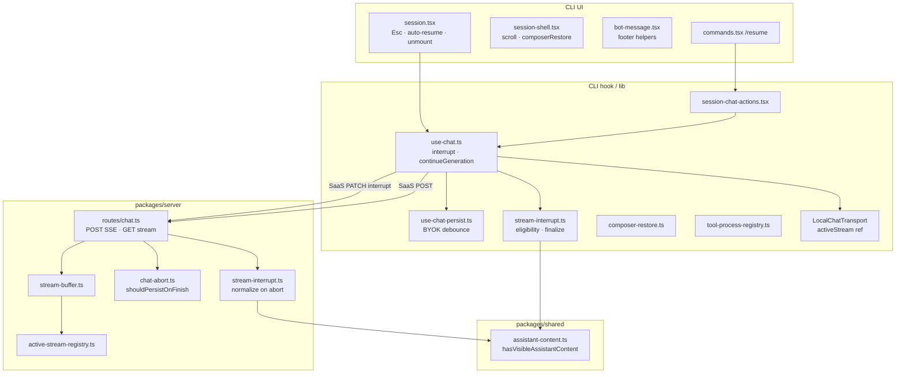
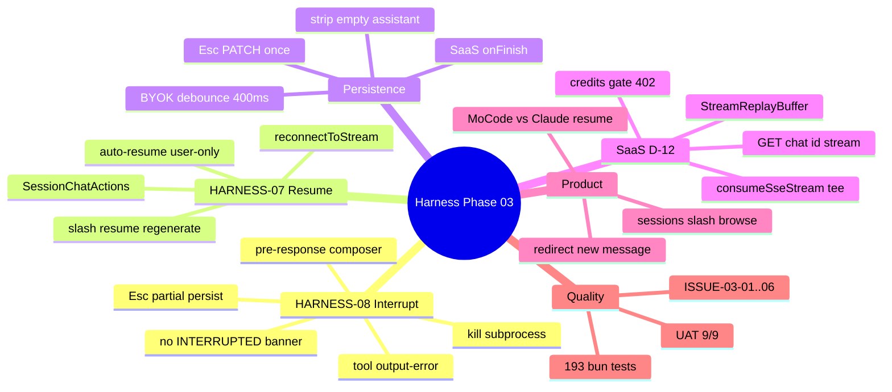
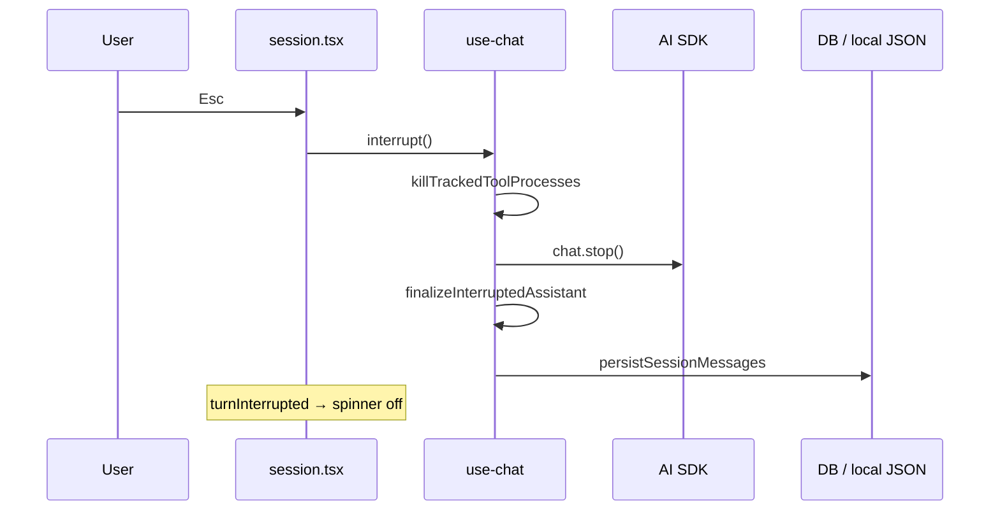
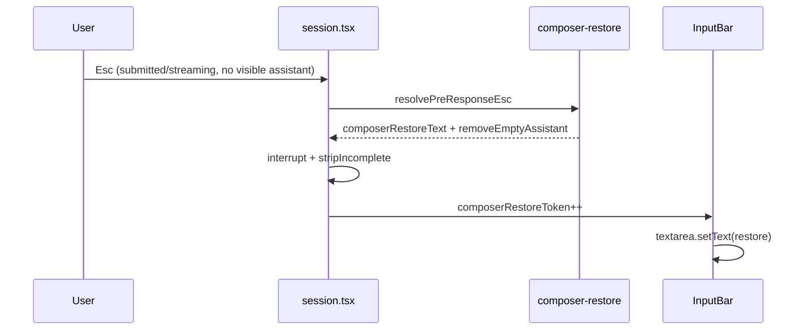
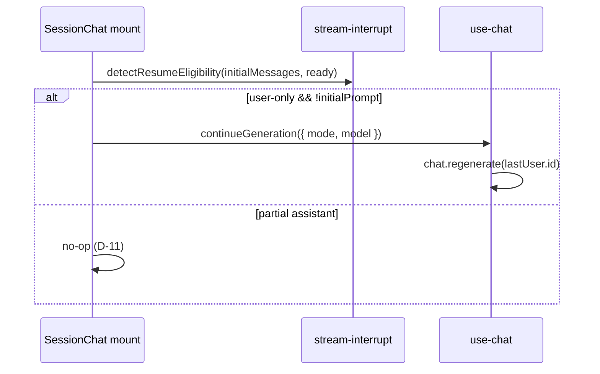
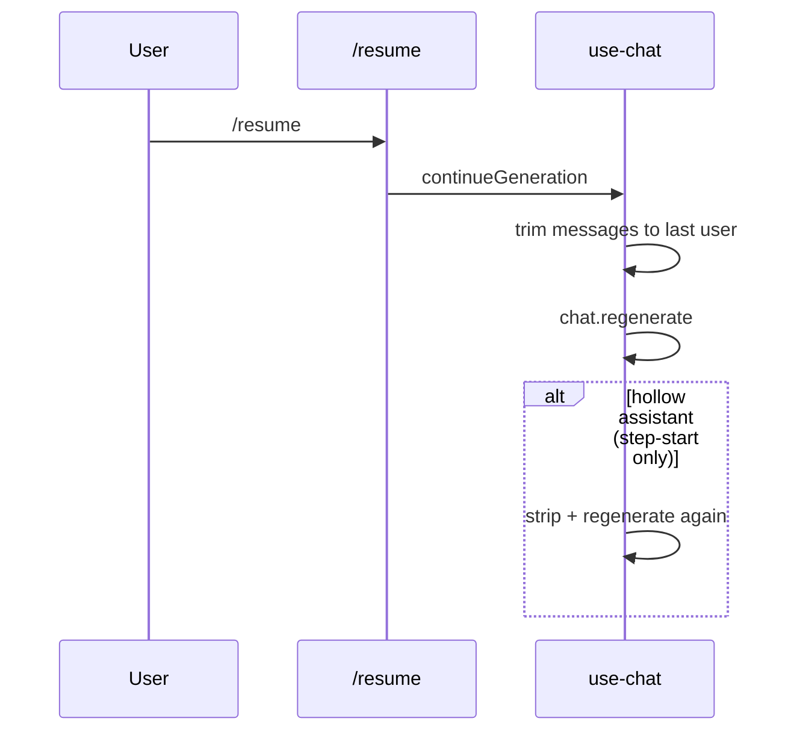
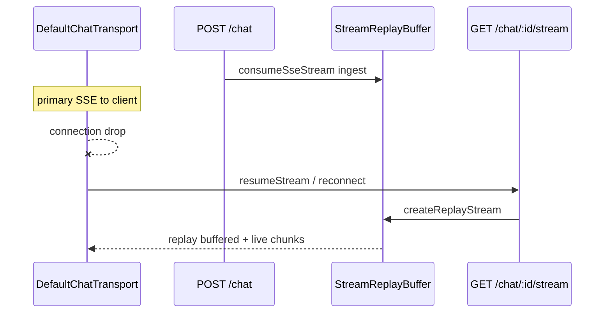

README 曾承诺「支持恢复中断的流式响应」，Phase 11 移除旧 `/resume` 路由后产生缺口。本 Phase 在 **不新增** **`POST /chat/:id/resume`** 的前提下，通过 **Esc 持久化 partial**、**composer 恢复**、**工具** **`Interrupted by user`**、**user-only 自动续写**、**`/resume`** **regenerate** 与 **SaaS** **`StreamReplayBuffer`** 补齐 HARNESS-07/08。


**产品语义（MoCode 现状）：** `/resume` = 当前 session 内从 last user **regenerate**；≠ Claude Code 的 session picker（MoCode 用 **`/sessions`**）。Esc 后也可 **发新消息 redirect**（Claude Code 主路径）。


---


## 目录

1. 背景与目标
2. 技术选型
3. 架构总览
4. 知识点思维导图
5. 模块与关键代码
6. 核心流程
7. 知识点详解
8. 文件索引
9. 开发与调试
10. 错误记录（UAT 复盘）

---


## 1. 背景与目标


### 1.1 问题陈述


| 缺口               | Phase 11 状态                                    | Phase 03 目标                       |
| ---------------- | ---------------------------------------------- | --------------------------------- |
| Esc 后 partial 丢失 | Server `onFinish` 在 `isAborted` 时 early-return | 立即持久化 partial + interrupted tools |
| 无 `/resume` 入口   | 独立 resume 路由已删                                 | slash `/resume` + auto-resume     |
| BYOK reconnect 桩 | `reconnectToStream()` 返回 null                  | 持有 `activeStream` ref             |
| SaaS reconnect   | 无                                              | `GET /chat/:id/stream` + buffer   |
| README 与行为不一致    | 文档过时                                           | Session recovery 专节（EN + zh-CN）   |


### 1.2 要做什么（决策 D-01–D-22 摘要）


| ID   | 能力                             | 状态 | 实现要点                                                     |
| ---- | ------------------------------ | -- | -------------------------------------------------------- |
| D-01 | Esc 立即持久化 partial              | ✅  | client interrupt + server `normalizeInterruptedMessages` |
| D-02 | 空 assistant 不持久化               | ✅  | `stripIncompleteAssistantMessages`                       |
| D-03 | 首 token 前恢复 composer           | ✅  | `resolvePreResponseEsc` + `composerRestoreToken`         |
| D-04 | 工具 Esc → `Interrupted by user` | ✅  | `finalizeInterruptedAssistant` + kill 子进程                |
| D-05 | 离开 session 同 Esc 规则            | ✅  | unmount interrupt（review：仅 loading 时）                    |
| D-06 | 增量持久化                          | ✅  | BYOK 400ms debounce；SaaS server `onFinish`               |
| D-07 | 错误同 Esc 保留 partial             | ✅  | 仅 strip 无可见内容 placeholder                                |
| D-08 | reasoning 一并持久化                | ✅  | `hasVisibleAssistantContent` 含 reasoning                 |
| D-09 | 无 INTERRUPTED 横幅               | ✅  | dim footer only                                          |
| D-10 | user-only 尾 auto-resume        | ✅  | mount + `initialMessages`                                |
| D-11 | partial 不 auto-resume          | ✅  | 需 `/resume` 或新消息                                         |
| D-12 | reconnectToStream              | ✅  | BYOK ref；SaaS `StreamReplayBuffer`                       |
| D-13 | `/resume` slash                | ✅  | `SessionChatActionsProvider`                             |
| D-15 | partial 上 `/resume`            | ✅  | **regenerate**（MoCode 产品决策）                              |
| D-16 | 不重跑 interrupted tools          | ✅  | 保留 `output-error` parts                                  |
| D-17 | 无独立 resume POST                | ✅  | merge POST + GET stream                                  |
| D-18 | resume 用当前 mode/model          | ✅  | `usePromptConfig()`                                      |
| D-19 | 中断计费                           | ✅  | abort 分支 Polar ingest                                    |
| D-21 | footer usage/duration          | ✅  | `bot-message-footer` helpers                             |
| D-22 | credits gate on GET stream     | ✅  | `requireCreditsBalance`                                  |


### 1.3 非目标

- `/rewind`、Esc+Esc checkpoint（Claude Code 能力，另 Phase）
- Claude Code 式 `/resume` session picker
- TUI PTY 端到端自动化
- CLI 网络断线 **自动** `resumeStream()`（API 已就绪）
- merge-continuation（原 D-15 草案；UAT 选定 regenerate）

---


## 2. 技术选型


| 层级             | 选择                                                   | 理由                                          |
| -------------- | ---------------------------------------------------- | ------------------------------------------- |
| 中断             | `chat.stop()` + `finalizeInterruptedAssistant`       | AI SDK 原生；须补 tool output-error              |
| 防 auto-send    | `turnInterruptedRef` + `skipToolOutputIdsRef`        | SDK 在 finalize 后仍可能 `sendAutomaticallyWhen` |
| 子进程            | `tool-process-registry` + `killTrackedToolProcesses` | bash sleep 否则拖住 `streaming`                 |
| 可见内容           | `@mocode/shared` `hasVisibleAssistantContent`        | step-start-only ≠ partial（ISSUE-03-04）      |
| BYOK 持久化       | `scheduleLocalSessionPersist` 400ms                  | crash-safe；仅 `--local`                      |
| SaaS 持久化       | server `onFinish` + Esc 时 client PATCH               | 避免 streaming debounce 双写竞态                  |
| SaaS reconnect | `consumeSseStream` tee → `StreamReplayBuffer`        | 必读 tee 分支，否则 backpressure（ISSUE-03-03）      |
| Resume         | `chat.regenerate({ messageId: lastUser.id })`        | MoCode `/resume` 语义                         |
| 测试             | Bun test 纯函数 + route mock                            | 无 OpenTUI render 层                          |


---


## 3. 架构总览


### 3.1 分层图





### 3.2 依赖方向（单向）


```plain text
@mocode/shared/assistant-content
  → cli/lib/stream-interrupt.ts
  → cli/lib/local-chat-transport.ts (strip)
  → cli/lib/composer-restore.ts
  → server/lib/stream-interrupt.ts

cli/lib/stream-interrupt.ts (pure)
  → use-chat.ts (interrupt / continueGeneration)
  → commands.tsx (/resume eligibility)

use-chat-persist.ts
  → use-chat.ts (BYOK only)

tool-process-registry.ts
  → local-tools.ts (bash track)
  → use-chat.ts (interrupt kill)

server/stream-buffer.ts
  → active-stream-registry.ts
  → routes/chat.ts (consumeSseStream)

server/chat-abort.ts
  → routes/chat.ts (onFinish gate)
```


**原则：** 中断语义在 **CLI** **`use-chat`** **+ 纯函数** **`stream-interrupt`** 收敛；Server 负责 **SSE tee buffer**、**abort 持久化**、**billing**；不在 Server 执行工具。


---


## 4. 知识点思维导图





---


## 5. 模块与关键代码


### 5.1 `stream-interrupt.ts`（CLI）— 纯函数核心


| 导出                             | 用途                                                 |
| ------------------------------ | -------------------------------------------------- |
| `finalizeInterruptedAssistant` | pending tool → `output-error: Interrupted by user` |
| `detectResumeEligibility`      | `user-only` / `partial-assistant` / `none`         |
| `resolveResumeTransport`       | 一律 `regenerate`（MoCode D-15）                       |
| `shouldAutoResumeOnMount`      | 仅 `user-only` + 未 auto-resumed                     |
| `collectPendingToolCallIds`    | Esc 时加入 `skipToolOutputIdsRef`                     |


**Eligibility 判定（须** **`status === ready`****）：**


```plain text
last = user          → user-only
last = assistant + hasVisibleAssistantContent → partial-assistant
last = assistant + step-start-only only       → none
streaming/submitted                         → none
```


### 5.2 `use-chat.ts` — interrupt 链路


关键 ref / 状态：


| 符号                        | 作用                         |
| ------------------------- | -------------------------- |
| `turnInterruptedRef`      | 阻断 `sendAutomaticallyWhen` |
| `skipToolOutputIdsRef`    | 跳过迟到 `addToolOutput`       |
| `turnInterrupted` (state) | UI 立刻停 spinner             |
| `snapshotChatMessages`    | `setMessages` 读 live store |


**interrupt 顺序（ISSUE-03-06）：**

1. `turnInterruptedRef = true` · `killTrackedToolProcesses()`
2. `skipToolOutputIds` ← pending tool ids
3. `chat.stop()`
4. `setMessages(finalizeInterruptedAssistant)`
5. `queueMicrotask` → 再 finalize + `persistSessionMessages`

**持久化：**

- `useEffect` + `scheduleLocalSessionPersist`：**仅** **`isLocalMode()`**
- `interrupt()` 内 persist：**SaaS + BYOK**（Esc 单次 PATCH / local JSON）
- `onPersistError` → toast

### 5.3 `session.tsx` — 键盘与生命周期


| 行为          | 实现                                                                              |
| ----------- | ------------------------------------------------------------------------------- |
| Esc         | `resolvePreResponseEsc` → interrupt + optional strip + `composerRestoreToken++` |
| auto-resume | mount 时 `detectResumeEligibility(initialMessages, "ready")`                     |
| unmount     | `statusRef` 仅 `submitted\|streaming` 时 `abortRef`（ISSUE-03-01 + review）         |
| loading UI  | `(submitted\|streaming) && !turnInterrupted`                                    |


### 5.4 `StreamReplayBuffer`（Server）

- POST `consumeSseStream`：创建 buffer → `registerStreamBuffer(id, userId, buffer)` → `buffer.ingest(stream)`
- GET `/chat/:id/stream`：`entry.buffer.createReplayStream()` → 200 SSE
- `onFinish` / `onError` / abort：`clearActiveStream(id)`
- **限制：** 内存级；单进程；server 重启 → 204

### 5.5 `LocalChatTransport`（BYOK D-12）

- `sendMessages` 包装 `ReadableStream`，持有 `activeStream` ref
- `reconnectToStream({ chatId })`：流未结束则返回同一 ref
- `onFinish` / abort / cancel：清空 ref

### 5.6 Server `onFinish`（abort 与 billing）


```plain text
isAborted → normalizeInterruptedMessages → shouldPersistOnFinish → db.session.update
         → clearActiveStream
         → ingestAiUsage (completedUsage 存在时，D-19)
```


`shouldPersistOnFinish`：aborted 始终 persist（有消息时）；非 aborted 且 pending tools 则跳过。


---


## 6. 核心流程


### 6.1 Esc 中断（流式 partial 已有）





### 6.2 首 token 前 Esc（D-03）





### 6.3 Auto-resume（user-only 尾，D-10）





### 6.4 `/resume`（partial assistant，regenerate）





### 6.5 SaaS SSE reconnect（D-12）





---


## 7. 知识点详解


### 7.1 MoCode vs Claude Code（产品对照）


| 场景                   | Claude Code           | MoCode                                    |
| -------------------- | --------------------- | ----------------------------------------- |
| Esc 中断               | 保留已做工作；可 redirect     | 同左 + persist + tool `Interrupted by user` |
| Esc 后下一步             | **新消息 redirect**（主路径） | 同左，或 **`/resume`** **regenerate**         |
| `/resume`            | **切换 session**        | **regenerate**（当前 session）                |
| 浏览历史 session         | `/resume` picker      | **`/sessions`**                           |
| Partial 在 transcript | 自然保留，无大横幅             | 同左（D-09）                                  |


官方参考：[Claude Code Interactive mode](https://code.claude.com/docs/en/interactive-mode)（Esc 说明）。


### 7.2 持久化矩阵（review remediation 后）


| 事件                   | BYOK (`--local`)                      | SaaS                     |
| -------------------- | ------------------------------------- | ------------------------ |
| streaming 中          | 400ms debounce → `updateLocalSession` | **不写**（server 流结束写 DB）   |
| 正常 finish            | debounce flush + ready 立即写            | server `onFinish`        |
| Esc interrupt        | 立即 persist                            | 立即 `PATCH /sessions/:id` |
| 离开 session (idle)    | 无操作                                   | 无操作                      |
| 离开 session (loading) | interrupt → persist                   | interrupt → PATCH        |


### 7.3 Transcript 可见性规则


`hasVisibleAssistantContent` 为 true 当 assistant parts 含：

- 非空 `text`
- 非空 `reasoning`
- 任意 `tool-*` / `dynamic-tool` part

**不算可见：** 仅 `step-start` 或零 part → strip / pre-response Esc 可恢复 composer。


### 7.4 测试分层（为何仍要人工 UAT）


| 层            | 覆盖                                          | 工具                                         |
| ------------ | ------------------------------------------- | ------------------------------------------ |
| 纯函数          | eligibility、strip、finalize、composer-restore | `stream-interrupt.test.ts` 等               |
| Server route | abort persist、GET stream 204/200/404        | `chat-abort.test.ts`、`chat-stream.test.ts` |
| Buffer       | replay + live subscriber                    | `stream-buffer.test.ts`                    |
| Hook 集成      | debounce timing                             | `use-chat-persist.test.ts`                 |
| **TUI 渲染**   | spinner、scroll、textarea restore             | **人工**（无 OpenTUI test harness）             |


---


## 8. 文件索引


### 8.1 CLI — 运行时


| 路径                                     | 职责                            |
| -------------------------------------- | ----------------------------- |
| `screens/session.tsx`                  | Esc、auto-resume、unmount、toast |
| `components/session-shell.tsx`         | scroll ref、`composerRestore*` |
| `components/input-bar.tsx`             | composer restore effect       |
| `components/messages/bot-message.tsx`  | footer 渲染                     |
| `components/command-menu/commands.tsx` | `/resume`                     |
| `hooks/use-chat.ts`                    | 中枢                            |
| `hooks/use-chat-persist.ts`            | BYOK debounce                 |
| `providers/session-chat-actions.tsx`   | slash 注册点                     |


### 8.2 CLI — 库


| 路径                             | 职责                |
| ------------------------------ | ----------------- |
| `lib/stream-interrupt.ts`      | 纯函数               |
| `lib/composer-restore.ts`      | D-03              |
| `lib/tool-process-registry.ts` | bash kill         |
| `lib/bot-message-footer.ts`    | D-09/D-21         |
| `lib/local-chat-transport.ts`  | BYOK reconnect    |
| `lib/stream-error.ts`          | JSON error unwrap |


### 8.3 Server


| 路径                              | 职责                                 |
| ------------------------------- | ---------------------------------- |
| `routes/chat.ts`                | POST + GET stream                  |
| `lib/stream-buffer.ts`          | SaaS tee buffer                    |
| `lib/active-stream-registry.ts` | sessionId → buffer                 |
| `lib/chat-abort.ts`             | persist gate                       |
| `lib/stream-interrupt.ts`       | server-side normalize              |
| `routes/sessions.ts`            | PATCH messages（Esc client persist） |


### 8.4 Shared


| 路径                     | 职责                           |
| ---------------------- | ---------------------------- |
| `assistant-content.ts` | `hasVisibleAssistantContent` |


### 8.5 测试文件


```plain text
packages/cli/src/lib/stream-interrupt.test.ts
packages/cli/src/lib/composer-restore.test.ts
packages/cli/src/lib/bot-message-footer.test.ts
packages/cli/src/lib/local-chat-transport.test.ts  (-t reconnect)
packages/cli/src/hooks/use-chat-continue.test.ts
packages/cli/src/hooks/use-chat-autoresume.test.ts
packages/cli/src/hooks/use-chat-persist.test.ts
packages/server/src/routes/chat-abort.test.ts
packages/server/src/routes/chat-stream.test.ts
packages/server/src/lib/stream-buffer.test.ts
```


### 8.6 Planning / 用户文档


| 路径                                                         | 用途                   |
| ---------------------------------------------------------- | -------------------- |
| `.planning/phases/03-stream-reliability/03-CONTEXT.md`     | 决策 D-01–D-22         |
| `.planning/phases/03-stream-reliability/03-VALIDATION.md`  | 自动化矩阵                |
| `.planning/phases/03-stream-reliability/03-UAT.md`         | 手工验收记录               |
| `.planning/phases/03-stream-reliability/03-ISSUES.md`      | 缺陷复盘                 |
| `.planning/phases/03-stream-reliability/03-REMEDIATION.md` | Review 收尾            |
| `README.md` / `README.zh-CN.md`                            | Session recovery 用户向 |


---


## 9. 开发与调试


### 9.1 常用命令


```bash
# 全量（193 tests）
bun test packages/cli packages/server

# 中断 / resume 核心
bun test packages/cli/src/lib/stream-interrupt.test.ts
bun test packages/cli/src/hooks/use-chat-continue.test.ts
bun test packages/cli/src/hooks/use-chat-autoresume.test.ts

# composer / footer
bun test packages/cli/src/lib/composer-restore.test.ts
bun test packages/cli/src/lib/bot-message-footer.test.ts

# SaaS reconnect + abort
bun test packages/server/src/lib/stream-buffer.test.ts
bun test packages/server/src/routes/chat-stream.test.ts
bun test packages/server/src/routes/chat-abort.test.ts

# BYOK reconnect
bun test packages/cli/src/lib/local-chat-transport.test.ts -t reconnect

# 本地运行
bun run dev:server    # SaaS API
mocode --local        # BYOK
```


### 9.2 手工冒烟（最小集）

1. 发消息 → 流式正常（ISSUE-03-01 回归）
2. 流式中 Esc → partial 保留
3. 首 token 前 Esc → composer 恢复
4. `sleep 15` 工具 Esc → `Interrupted by user` + 立刻 idle
5. partial 后 `/resume` → 一次完整回复
6. user-only 尾重进 → auto-resume

完整清单见 UAT 记录；review 后额外确认 idle 切 session 无多余 interrupt。


### 9.3 SaaS reconnect 调试（curl）


```bash
# 流式进行中（需有效 token + sessionId）
curl -N -H "Authorization: Bearer$TOKEN" \
  "http://localhost:3000/chat/$SESSION_ID/stream"
# 期望 200 + SSE body（非 204）
```


---


## 10. 错误记录（UAT 复盘）

> 详述见 `.planning/phases/03-stream-reliability/03-ISSUES.md`。此处为开发笔记速查。

| ID          | 严重度     | 现象                             | 根因摘要                                                        | 修复要点                                                |
| ----------- | ------- | ------------------------------ | ----------------------------------------------------------- | --------------------------------------------------- |
| ISSUE-03-01 | blocker | 提交后无流式                         | unmount effect 依赖 `abort` 身份，每次 messages 更新触发 cleanup abort | `abortRef` + deps `[session.id]`                    |
| ISSUE-03-02 | major   | fresh submit 后误 auto-resume    | effect 看 live messages 非 initialMessages                    | mount-only + initialPrompt guard                    |
| ISSUE-03-03 | major   | tee 未读阻塞 SSE                   | consumeSseStream 副本未 consume                                | → **StreamReplayBuffer ingest**                     |
| ISSUE-03-04 | major   | `/resume` 第一次空                 | step-start 误判为 partial                                      | `hasVisibleAssistantContent` + hollow retry         |
| ISSUE-03-05 | major   | initialPrompt Esc 不恢复 composer | 未写 lastSubmittedTextRef                                     | ref + streaming pre-response 路径                     |
| ISSUE-03-06 | major   | 工具 Esc spinner 不停              | auto-send + 未 kill bash + SDK 覆盖 messages                   | skipToolOutput · turnInterrupted · kill · microtask |


### Review remediation


| 项             | 变更                                      |
| ------------- | --------------------------------------- |
| SaaS 双写       | 去掉 SaaS streaming debounce PATCH        |
| idle unmount  | 仅 loading 时 interrupt                   |
| persist 失败    | toast                                   |
| footer        | BotMessage 用 bot-message-footer helpers |
| shared        | `hasVisibleAssistantContent` 上移         |
| system-prompt | revert 计划外 CONVERSATION_SCOPE           |


---


## 附录 A — Wave 交付对照


| Wave        | 主题                             | 关键产出                                            |
| ----------- | ------------------------------ | ----------------------------------------------- |
| 00          | 纯函数 + RED tests                | `stream-interrupt.ts`、abort/stream tests        |
| 01          | Server abort persist + billing | `chat-abort.ts`、`onFinish` isAborted 分支         |
| 02          | Resume 入口                      | `/resume`、`continueGeneration`、GET stream route |
| 03          | UX 收尾                          | composer restore、BYOK reconnect、footer          |
| 04          | Billing + docs                 | credits on GET、credits gate、README              |
| remediation | Review                         | `StreamReplayBuffer`、持久化分层、文档对齐                 |


---


## 附录 B — 与 Phase 06/11 文档关系


| 文档                                   | 关系                                            |
| ------------------------------------ | --------------------------------------------- |
| `cli-tui-phase-6-notes.md`           | 早期 SSE + resume 路由（**已废弃** POST resume）       |
| `cli-tui-phase-11-notes.md`          | 删除 resume 路由、client-side tools                |
| `harness-phase-02-mcp-byok-notes.md` | BYOK `LocalChatTransport`、local sessions      |
| **本文**                               | 在 Phase 11 架构上恢复 HARNESS-07/08，无第三套 transport |