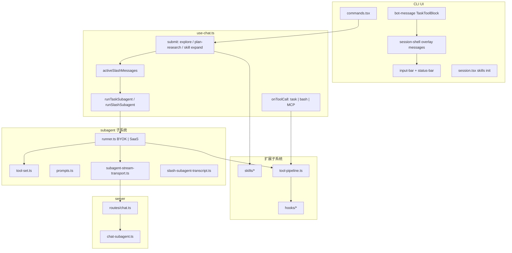
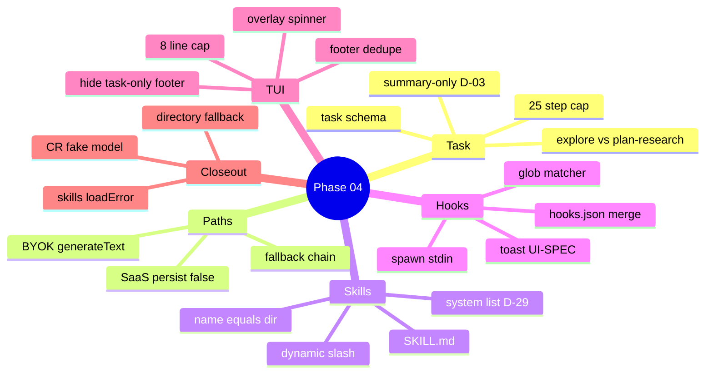
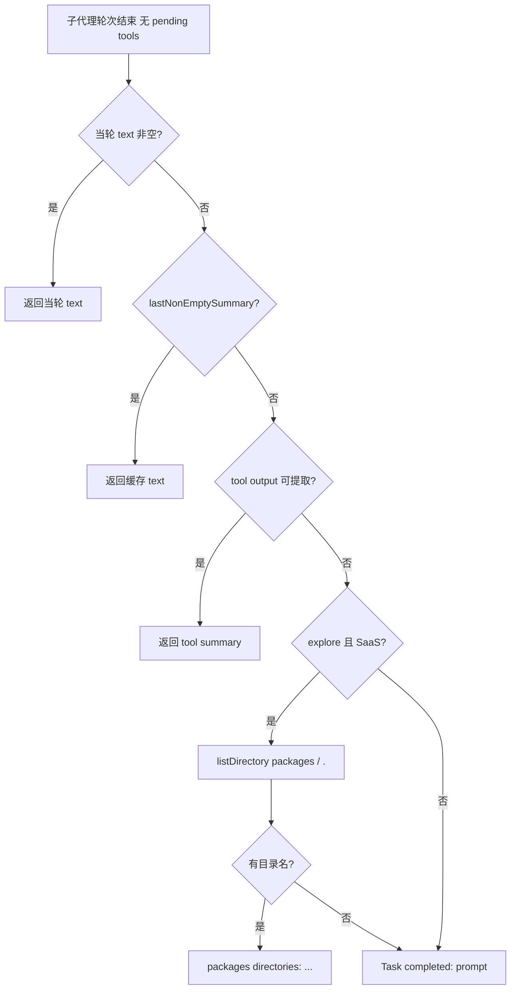
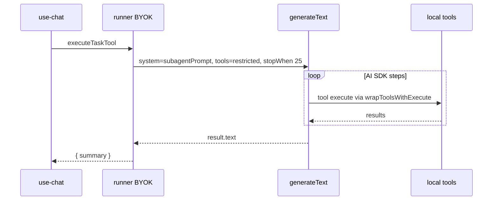
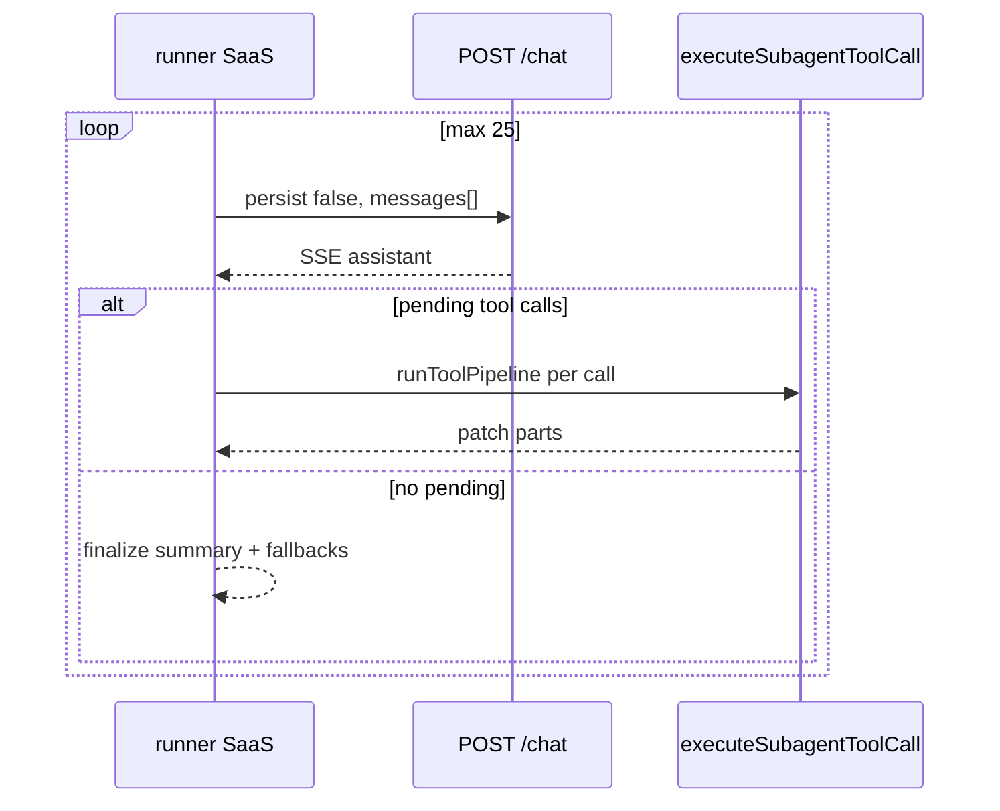
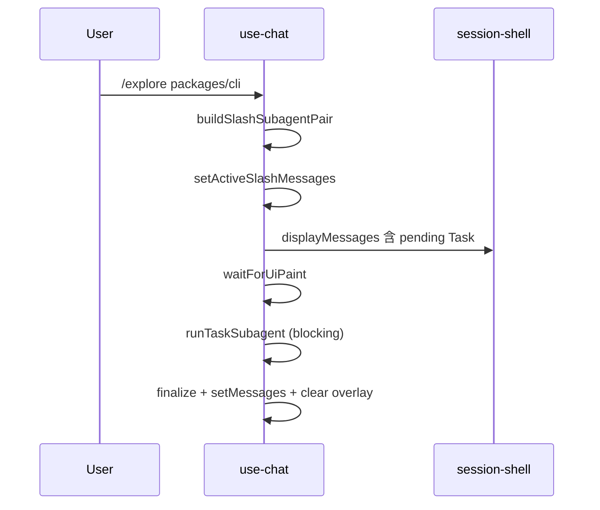
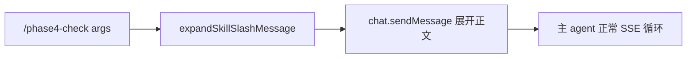
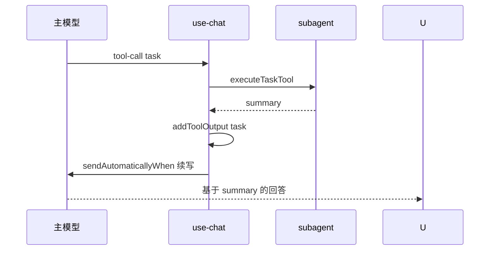

Phase 04 在 **Phase 11 架构不变**（Server 流式推理、CLI 本地执行工具）的前提下，交付 Harness 三大扩展：**Task 子代理**（`explore` / `plan-research`）、**Cursor 兼容 Skills**（动态 `/skill-name`）、**hooks.json 工具钩子**（before/after）。子代理对父会话 **summary-only**、同步阻塞、可 Esc 中断；主 agent 与子代理内层工具均走 **D-40 管线**（hooks → 审批 → 执行 → after hooks）。


---


## 目录

1. [背景与目标](about:blank#1-%E8%83%8C%E6%99%AF%E4%B8%8E%E7%9B%AE%E6%A0%87)
2. [技术选型](about:blank#2-%E6%8A%80%E6%9C%AF%E9%80%89%E5%9E%8B)
3. [架构总览](about:blank#3-%E6%9E%B6%E6%9E%84%E6%80%BB%E8%A7%88)
4. [知识点思维导图](about:blank#4-%E7%9F%A5%E8%AF%86%E7%82%B9%E6%80%9D%E7%BB%B4%E5%AF%BC%E5%9B%BE)
5. [模块与关键代码](about:blank#5-%E6%A8%A1%E5%9D%97%E4%B8%8E%E5%85%B3%E9%94%AE%E4%BB%A3%E7%A0%81)
6. [核心流程](about:blank#6-%E6%A0%B8%E5%BF%83%E6%B5%81%E7%A8%8B)
7. [知识点详解（含官方文档与用法）](about:blank#7-%E7%9F%A5%E8%AF%86%E7%82%B9%E8%AF%A6%E8%A7%A3%E5%90%AB%E5%AE%98%E6%96%B9%E6%96%87%E6%A1%A3%E4%B8%8E%E7%94%A8%E6%B3%95)
8. [文件索引](about:blank#8-%E6%96%87%E4%BB%B6%E7%B4%A2%E5%BC%95)
9. [开发与调试](about:blank#9-%E5%BC%80%E5%8F%91%E4%B8%8E%E8%B0%83%E8%AF%95)
10. [已知限制与后续](about:blank#10-%E5%B7%B2%E7%9F%A5%E9%99%90%E5%88%B6%E4%B8%8E%E5%90%8E%E7%BB%AD)
11. [错误记录与 UAT 复盘](about:blank#11-%E9%94%99%E8%AF%AF%E8%AE%B0%E5%BD%95%E4%B8%8E-uat-%E5%A4%8D%E7%9B%98)

---


## 1. 背景与目标


### 1.1 问题陈述


| 缺口                  | Phase 11 状态 | Phase 04 目标                             |
| ------------------- | ----------- | --------------------------------------- |
| 无子代理委派              | 主 agent 单循环 | `task` 工具 + `/explore` `/plan-research` |
| 无用户可扩展 slash        | 仅内置命令       | `.mocode/skills/` → `/skill-name`       |
| 无工具生命周期钩子           | 仅 TUI 审批    | `hooks.json` before/after               |
| README 无 Harness 深度 | 工具表为主       | 专节 + **Quality Contract**               |
| SaaS 子代理计费/隔离       | 无           | `persist:false` 内层流 + Polar ingest      |


### 1.2 决策全表 D-01–D-40


Task 子代理（HARNESS-09）


| ID   | 决策                                                   | 状态 | 代码落点                                             |
| ---- | ---------------------------------------------------- | -- | ------------------------------------------------ |
| D-01 | `task` 工具，`subagent_type` + `prompt` + `description` | ✅  | `shared/schemas.ts`                              |
| D-02 | `/explore`、`/plan-research` 与 Task 同路径               | ✅  | `use-chat.ts` submit 拦截                          |
| D-03 | **summary-only**，内层 transcript 不 merge 父上下文          | ✅  | `runner.ts` 返回值；`addToolOutput({ summary })`     |
| D-04 | 同步阻塞；footer `esc to interrupt`                       | ✅  | `runTaskSubagent`；`status-bar.tsx`               |
| D-05 | 禁止嵌套 Task                                            | ✅  | `tool-set.ts` `omitTask`                         |
| D-06 | 失败 → error summary，父 agent 决策                        | ✅  | `output-error` / `{ error: true }`               |
| D-07 | 子代理最多 **25 步**                                       | ✅  | BYOK `stopWhen: stepCountIs(25)`；SaaS `for` 25 轮 |
| D-08 | 同 `process.cwd()`                                    | ✅  | `buildSubagentSystemPrompt` cwd 注入               |
| D-09 | SaaS 子代理 token **计入同 session** Polar                 | ✅  | `chat-subagent.ts` `ingestAiUsage`               |
| D-10 | Esc 中断子代理                                            | ✅  | `subagentAbortRef` → `abortSignal`               |
| D-11 | `description` 为 Task 行主文案                            | ✅  | `bot-message-task.ts` `formatTaskToolDisplay`    |


子代理隔离与工具面


| ID   | 决策                                      | 状态 | 代码落点                                                     |
| ---- | --------------------------------------- | -- | -------------------------------------------------------- |
| D-12 | 新鲜 history：仅 user prompt + 环境           | ✅  | SaaS seed message；BYOK `[{ role:user, content:prompt }]` |
| D-13 | system 注入 cwd / git / parent mode·model | ✅  | `prompts.ts` `buildSubagentSystemPrompt`                 |
| D-14 | **explore**：只读 local + 只读 MCP           | ✅  | `tool-set.ts` PLAN 工具 + `filterReadOnlyMcpTools`         |
| D-15 | **plan-research**：只读 local，**无 MCP**    | ✅  | `PLAN_RESEARCH_LOCAL_TOOLS` 白名单                          |
| D-16 | 两类 distinct system prompt 文案            | ✅  | `typeInstructions()`                                     |
| D-17 | 内层 transcript 完成后丢弃                     | ✅  | 不 persist；仅 summary 回父                                   |
| D-18 | 仅 `explore` | `plan-research` 内置        | ✅  | Zod enum                                                 |
| D-19 | 继承父 session model                       | ✅  | metadata / `params.model`                                |
| D-20 | 推理 Server 流式；**执行在 CLI**                | ✅  | SaaS POST + CLI `executeSubagentToolCall`                |


TUI（D-21–D-24）


| ID   | 决策                                            | 状态 | 代码落点                                            |
| ---- | --------------------------------------------- | -- | ----------------------------------------------- |
| D-21 | Task 行 inline spinner；**无**内层 live transcript | ✅  | `TaskToolBlock` + `activeSlashMessages` overlay |
| D-22 | 完成 → Task tool output block                   | ✅  | `tool-task` part `output-available`             |
| D-23 | Summary **8 行** cap + click expand            | ✅  | `TASK_SUMMARY_MAX_VISIBLE_LINES = 8`            |
| D-24 | Slash 与模型 Task **同一 transcript 形态**           | ✅  | `slash-subagent-transcript.ts`                  |


Skills（HARNESS-10）


| ID   | 决策                                                 | 状态 | 代码落点                                       |
| ---- | -------------------------------------------------- | -- | ------------------------------------------ |
| D-25 | Cursor `SKILL.md` + frontmatter                    | ✅  | `skills/loader.ts` gray-matter             |
| D-26 | `~/.mocode/skills/` + `.mocode/skills/`，project 覆盖 | ✅  | `loadMergedSkills` Map by name             |
| D-27 | 动态 slash；**启动时**扫描（无 chokidar）                     | ✅  | `initSkillsOnSessionMount`                 |
| D-28 | `/skill args` → body + `\n\n` + args               | ✅  | `expandSkillSlashMessage`                  |
| D-29 | 无 Skill tool；system prompt **列出** skills           | ✅  | `buildSkillsSection` in `system-prompt.ts` |
| D-30 | 继承 Plan/Build；写工具仍审批                               | ✅  | 不改 approval 门                              |
| D-31 | **内置 slash 优先**；冲突 skip + toast                    | ✅  | `registry.ts` `BUILTIN_SLASH_NAMES`        |


Hooks


| ID   | 决策                                      | 状态 | 代码落点                          |
| ---- | --------------------------------------- | -- | ----------------------------- |
| D-32 | 仅 `beforeToolCall` / `afterToolCall`    | ✅  | `hooks/schema.ts`             |
| D-33 | global + project `hooks.json`，同 `id` 覆盖 | ✅  | `hooks/loader.ts`             |
| D-34 | shell `command: string[]`               | ✅  | `hooks/runner.ts` `Bun.spawn` |
| D-35 | `toolName` glob                         | ✅  | `glob-match.ts`               |
| D-36 | before 可 block                          | ✅  | 非 0 exit / stdout JSON deny   |
| D-37 | stdin JSON payload                      | ✅  | `HookPayload`                 |
| D-38 | 默认 30s 超时 → block                       | ✅  | `DEFAULT_TIMEOUT_MS`          |
| D-39 | after 仅观测                               | ✅  | pipeline 末尾，无 block           |
| D-40 | **before → approval → execute → after** | ✅  | `tool-pipeline.ts`            |


---


## 2. 技术选型


| 层级             | 选择                                  | 理由                         | 备选未采用                               |
| -------------- | ----------------------------------- | -------------------------- | ----------------------------------- |
| Task 契约        | `@mocode/shared` Zod                | 与现有 tool 一致；Plan/Build 均暴露 | 独立 RPC 协议                           |
| BYOK 子代理       | CLI `generateText` + 真 `system`     | 完整子代理语义                    | Server 子代理端点（→ 4.1）                 |
| SaaS 子代理       | 每步 `POST /chat` `persist:false`     | 复用计费/鉴权；内层不落库              | 误用 BYOK `generateText`（closeout 已修） |
| SaaS Server 每轮 | `buildSystemPrompt(mode)` 主 agent   | Phase 04 范围最小化             | 子代理 system（→ 4.1）                   |
| Skills         | gray-matter + 目录名=skill name        | Cursor 兼容                  | 自定义 YAML                            |
| Hooks          | `Bun.spawn` + stdin JSON            | 与 CC 对齐；可任意 shell          | TS 插件钩子                             |
| Slash UI       | React overlay `activeSlashMessages` | 阻塞 runner 前可见 pending Task | 仅 chat.messages（spinner 迟到的 bug）    |
| 测试             | Bun mock `ai` / `fetch`             | 快；覆盖管线                     | OpenTUI E2E                         |


---


## 3. 架构总览


### 3.1 分层图





### 3.2 BYOK vs SaaS 子代理路径对比（**根因分析**）


| 维度            | BYOK `runSubagentByok`                            | SaaS `runSubagentSaaS`（当前）                 |
| ------------- | ------------------------------------------------- | ------------------------------------------ |
| 触发条件          | `isLocalMode()` 或无 `sessionId`                    | `sessionId` + 非 local                      |
| 推理 API        | CLI `generateText`                                | Server `streamText` SSE                    |
| System prompt | `buildSubagentSystemPrompt` → **`system`** **参数** | **拼进 user 消息文本**（workaround）               |
| 工具 schema     | `buildSubagentToolSet` 受限集                        | Server **`getToolContracts(mode)`** **全量** |
| 工具执行          | `wrapToolsWithExecute` 内嵌 AI SDK loop             | CLI 手动 `extractPendingToolCalls` + `patch` |
| 步数上限          | `stopWhen: stepCountIs(25)` 一次调用多步                | 最多 25 轮 HTTP                               |
| Summary 质量    | 通常较完整                                             | 弱模型易空文本 → **五层 fallback**                  |
| 根治            | —                                                 | **Phase 4.1**：server 识别 `subagent_type`    |


### 3.3 依赖方向（单向）


```plain text
shared/schemas (task)
  → cli/subagent/* , server/chat.ts

cli/tool-pipeline + hooks/*
  → use-chat (主工具)
  → runner.executeSubagentToolCall (子代理内层)

cli/subagent-stream-transport
  → runner (SaaS only) → server POST

server/chat-subagent
  → chat onFinish (persist gate + billing)
```


---


## 4. 知识点思维导图





---


## 5. 模块与关键代码


### 5.1 Task 契约 — `packages/shared/src/schemas.ts`


```typescript
task: z.object({
  subagent_type: z.enum(["explore", "plan-research"]),
  prompt: z.string(),
  description: z.string().optional(),
}),
```

- 注册于 `readOnlyToolContracts` 与 `buildToolContracts` → **Plan / Build 均可委派**。
- 工具描述明确：“Returns a summary only”。

### 5.2 子代理工具面 — `tool-set.ts`


| `subagent_type` | 本地工具                                                      | MCP                   |
| --------------- | --------------------------------------------------------- | --------------------- |
| `explore`       | `getToolContracts(PLAN)` 去掉 `task`                        | 仅 `isMcpReadOnlyTool` |
| `plan-research` | `readFile, listDirectory, glob, grep, gitStatus, gitDiff` | **无**                 |


```typescript
function omitTask(tools: ToolSet): ToolSet {
  const { task: _task, ...rest } = tools;
  return rest;  // D-05 禁止嵌套
}
```


### 5.3 子代理 System Prompt — `prompts.ts`


注入块：

- `cwd`、`git` summary（`simple-git`）、parent `mode` / `model`
- `explore`：快速只读扫描文案
- `plan-research`：架构/权衡/对比文案
- 合约：**仅返回 concise summary**，无 full transcript

### 5.4 Runner 函数地图 — `runner.ts`


| 函数                                | 职责                                              |
| --------------------------------- | ----------------------------------------------- |
| `runSubagent`                     | 路由 BYOK / SaaS                                  |
| `runSubagentByok`                 | `generateText` + `wrapToolsWithExecute`         |
| `runSubagentSaaS`                 | 25 轮 `postSubagentChatStream` + 本地执行            |
| `executeSubagentToolCall`         | 子代理内层单工具；完整 D-40 管线                             |
| `extractPendingToolCalls`         | 从 assistant `parts` 找未完成的 tool-* / dynamic-tool |
| `patchAssistantWithToolResult`    | 写回 `output-available` / `output-error`          |
| `extractAssistantSummary`         | 拼接 `text` parts                                 |
| `extractToolOutputSummary`        | 从 tool output 合成文本                              |
| `buildSaaSExploreFallbackSummary` | `listDirectory("packages")` → `"."`             |
| `finalizeSubagentSummary`         | 空 → prompt fallback → 默认文案                      |
| `resolveSubagentModel`            | **closeout：** 失败返回 `{ ok:false, error }`        |
| `executeTaskTool`                 | `use-chat` 入口；解析 Zod input                      |


**SaaS seed 消息（workaround，4.1 待改）：**


```typescript
const seededPrompt = `${subagentSystem}\n\n# User task\n${params.prompt}`;
// Server 仍用 buildSystemPrompt({ mode })，非 buildSubagentSystemPrompt
```


**Summary fallback 决策树（closeout）：**





### 5.5 SaaS 传输 — `subagent-stream-transport.ts`


| 导出                       | 作用                                          |
| ------------------------ | ------------------------------------------- |
| `postSubagentChatStream` | `POST` body 含 `persist: false`              |
| `consumeSubagentStream`  | `readUIMessageStream` 收齐 assistant          |
| `runSubagentSaaSTurn`    | **遗留**：本地 `generateText` 单步（runner 已不再作主路径） |


测试断言：`body.persist === false` 且 `body.id === sessionId`。


### 5.6 Slash Transcript — `slash-subagent-transcript.ts`


| API                              | 作用                                            |
| -------------------------------- | --------------------------------------------- |
| `buildSlashSubagentPair`         | user 行=slash 原文；assistant=`tool-task` pending |
| `finalizeSlashSubagentAssistant` | 填 `output-available` / `output-error`         |
| `normalizeSubagentSummary`       | 错误/中断保留原文；空 → 默认文案                            |


**与模型 Task 的行为差异：**


| 路径                   | 写入 chat store                                   | 主 agent 自动续写           |
| -------------------- | ----------------------------------------------- | ---------------------- |
| 模型 `onToolCall` task | `addToolOutput` → SDK 可 `sendAutomaticallyWhen` | ✅ 通常会                  |
| Slash `/explore`     | `setMessages` 追加 user+assistant                 | ❌ 不自动；用户下一条才看到 summary |


### 5.7 Skills 子系统


**目录规则（D-25/D-26）：**


```plain text
~/.mocode/skills/<name>/SKILL.md
.mocode/skills/<name>/SKILL.md   # 同名覆盖 global
```


**frontmatter 校验：** `name` 必须与**目录名**一致，否则 loader 抛错并 skip（warn）。


**`registry.ts`****：**

- `BUILTIN_SLASH_NAMES`：`resume`, `explore`, `plan-research`, `mcp`, …
- 冲突 → `collisions[]` + session mount toast
- **closeout：** `initSkillsOnSessionMount` catch → `{ skills:[], loadError }`

**`expand.ts`****：**


```typescript
// /my-skill fix bug  →  skill.body + "\n\n" + "fix bug"
```


**主 agent system prompt（D-29）：** `LocalChatTransport` / server 均通过 `buildSkillsSection` 列出 `/skill-name` 供模型建议用户调用。


### 5.8 Hooks 子系统


**`hooks.json`** **schema：**


```typescript
{
  hooks: [{
    id: string,
    event: "beforeToolCall" | "afterToolCall",
    toolName: string,      // glob，如 bash、mcp__*
    command: string[],     // argv
    timeoutMs?: number     // default 30000
  }]
}
```


**`runner.ts`** **行为：**

- spawn hook；stdin 写 `HookPayload` JSON
- exit 0 + stdout `{"allow":false,"reason":"..."}` → block（可选）
- exit ≠ 0 → block，`reason` 取自 stderr
- timeout → kill + block，`timedOut: true`

**Toast（UI-SPEC §4，closeout）：**


```typescript
formatHookBlockToast(toolName, { reason, hookId, hookTimedOut })
// → "Hook blocked bash: …" | "Hook timed out — {id} blocked bash"
```


### 5.9 `tool-pipeline.ts`（D-40）


```typescript
before → if !allowed return { blocked, blockedBy: "hook", hookId, hookTimedOut }
approval → if !approved return { blocked, blockedBy: "approval" }
executeTool()
afterHook()
```


`use-chat` 在 `blockedBy === "hook"` 时 toast + `output-error`。


### 5.10 `use-chat.ts` 集成要点


| 机制               | 实现                                                      |
| ---------------- | ------------------------------------------------------- |
| Task             | `onToolCall` → `runTaskSubagent` → `executeTaskTool`    |
| Esc              | `interrupt` 里 `subagentAbortRef.current?.abort()`       |
| Slash            | submit 正则拦截 → `runSlashSubagent`                        |
| Overlay          | `displayMessages` 暴露给 `session-shell`                   |
| `waitForUiPaint` | `queueMicrotask` + `setTimeout(0)` 后再 `executeTaskTool` |
| Skills submit    | `expandSkillSlashMessage` 先于 `chat.sendMessage`         |
| Hooks config     | `hooksConfigRef` 懒加载；失败 → `{ hooks: [] }`               |


### 5.11 Task TUI


| 组件                   | 行为                                                                                |
| -------------------- | --------------------------------------------------------------------------------- |
| `TaskToolBlock`      | pending → `Spinner`；primary=description；dim=subagent_type                         |
| expand state         | 按 `toolCallId` `useState`                                                         |
| `StatusBar`          | `subagentRunning` 时覆盖 mode/model 行                                                |
| `session-shell`      | **closeout：** 删除底部重复 subagent spinner，仅 `loading && !subagentRunning` 显示主 spinner |
| `bot-message-footer` | `shouldShowAssistantMessageFooter` 对纯 tool-task 返回 false                          |


### 5.12 Server — `chat.ts` + `chat-subagent.ts`


**`submitSchema`****：** `persist: z.boolean().optional().default(true)`


**`persist: true`****（主会话）：** merge `session.messages` → `streamText` → `onFinish` → `db.session.update`


**`persist: false`****（子代理内层）：**

- **不** merge 历史进 DB（messages 参数仍传入当轮）
- `onFinish` → `resolveSubagentChatFinish({ persist: false })` → **跳过** `session.update`
- 若有 `completedUsage` → 仍 `ingestAiUsage`（D-09）

---


## 6. 核心流程


### 6.1 BYOK 子代理（`mocode --local`）





### 6.2 SaaS 子代理（closeout 真实路径）





### 6.3 Slash `/explore` + overlay





### 6.4 Skill slash





### 6.5 主 agent 消费 Task summary（模型发起）





---


## 7. 知识点详解（含官方文档与用法）


### 7.1 AI SDK `generateText` + `stopWhen`


**MoCode 落点：** `runSubagentByok` — 单子代理调用内多步 tool loop。


**参考：** https://sdk.vercel.ai/docs/ai-sdk-core/generating-text


### 7.2 `readUIMessageStream` + `persist: false`


**MoCode 落点：** `consumeSubagentStream` · `chat.ts` onFinish 分支。


### 7.3 AI SDK UI `tool-task` part


Task 行使用自定义 part type `tool-task`（非内置 `tool-invocation`），状态机：`input-available` → `output-available` | `output-error`。


**MoCode 落点：** `bot-message.tsx` `TaskToolBlock` · `slash-subagent-transcript.ts`


### 7.4 gray-matter


**MoCode 落点：** `skills/loader.ts` — `name`/`description` 必填；body 为 skill 正文。


### 7.5 Bun.spawn hooks


**MoCode 落点：** `hooks/runner.ts` — `stdin` JSON `HookPayload`。


### 7.6 BYOK 即 `-local`


**MoCode 落点：** `local-mode.ts` — `parseCliArgs(['--local'])`；与 README Session recovery 存储路径一致。


### 7.7 速查表


| #   | 知识点               | 文件                           | 官方文档        |
| --- | ----------------- | ---------------------------- | ----------- |
| 7.1 | generateText      | runner.ts                    | AI SDK      |
| 7.2 | UI message stream | subagent-stream-transport.ts | AI SDK UI   |
| 7.3 | tool-task part    | bot-message.tsx              | 项目内约定       |
| 7.4 | SKILL.md          | skills/loader.ts             | gray-matter |
| 7.5 | Hook spawn        | hooks/runner.ts              | Bun docs    |
| 7.6 | BYOK              | local-mode.ts                | README      |


---


## 8. 文件索引


### 8.1 生产代码（按包）


| 文件                                                     | 层级     | 职责                     |
| ------------------------------------------------------ | ------ | ---------------------- |
| `packages/shared/src/schemas.ts`                       | shared | `task` Zod + contracts |
| `packages/shared/src/models.ts`                        | shared | 模型目录 / default id      |
| `packages/server/src/routes/chat.ts`                   | server | `persist` + streamText |
| `packages/server/src/lib/chat-subagent.ts`             | server | 子代理 finish / billing   |
| `packages/cli/src/lib/subagent/runner.ts`              | cli    | **核心** BYOK+SaaS       |
| `packages/cli/src/lib/subagent/tool-set.ts`            | cli    | 工具面                    |
| `packages/cli/src/lib/subagent/prompts.ts`             | cli    | system prompt          |
| `packages/cli/src/lib/subagent/types.ts`               | cli    | `SubagentType` 等       |
| `packages/cli/src/lib/subagent-stream-transport.ts`    | cli    | SaaS POST/SSE          |
| `packages/cli/src/lib/slash-subagent-transcript.ts`    | cli    | slash transcript       |
| `packages/cli/src/lib/skills/loader.ts`                | cli    | 发现 SKILL.md            |
| `packages/cli/src/lib/skills/registry.ts`              | cli    | 动态 slash + init        |
| `packages/cli/src/lib/skills/expand.ts`                | cli    | slash 展开               |
| `packages/cli/src/lib/skills/schema.ts`                | cli    | frontmatter Zod        |
| `packages/cli/src/lib/hooks/loader.ts`                 | cli    | hooks.json merge       |
| `packages/cli/src/lib/hooks/runner.ts`                 | cli    | spawn hooks            |
| `packages/cli/src/lib/hooks/glob-match.ts`             | cli    | toolName glob          |
| `packages/cli/src/lib/hooks/schema.ts`                 | cli    | hooks Zod              |
| `packages/cli/src/lib/hooks/toast-message.ts`          | cli    | toast 文案               |
| `packages/cli/src/lib/tool-pipeline.ts`                | cli    | D-40                   |
| `packages/cli/src/lib/bot-message-task.ts`             | cli    | Task 行/摘要 helper       |
| `packages/cli/src/lib/bot-message-footer.ts`           | cli    | footer 可见性             |
| `packages/cli/src/lib/system-prompt.ts`                | cli    | skills 列表段             |
| `packages/cli/src/hooks/use-chat.ts`                   | cli    | 总线                     |
| `packages/cli/src/components/messages/bot-message.tsx` | ui     | TaskToolBlock          |
| `packages/cli/src/components/status-bar.tsx`           | ui     | 子代理 footer             |
| `packages/cli/src/components/session-shell.tsx`        | ui     | overlay messages       |
| `packages/cli/src/components/input-bar.tsx`            | ui     | 禁用 + status            |
| `packages/cli/src/screens/session.tsx`                 | ui     | skills mount           |


### 8.2 测试文件（Phase 04 相关）


| 文件                                    | 覆盖点                                           |
| ------------------------------------- | --------------------------------------------- |
| `shared/schemas.test.ts`              | task enum / 拒绝未知 subagent_type                |
| `subagent/tool-set.test.ts`           | omit task、explore MCP、plan-research 无 MCP     |
| `subagent/runner.test.ts`             | D-03/07/10、SaaS transport、fallback 链、model 错误 |
| `subagent-stream-transport.test.ts`   | `persist: false` body                         |
| `slash-subagent-transcript.test.ts`   | pair / finalize                               |
| `skills/loader.test.ts`               | merge / override / 坏 frontmatter skip         |
| `skills/registry.test.ts`             | 内置冲突                                          |
| `skills/registry.init.test.ts`        | loadError 容错                                  |
| `skills/expand.test.ts`               | slash 展开                                      |
| `hooks/loader.test.ts`                | global+project merge                          |
| `hooks/runner.test.ts`                | block / timeout / stdout deny                 |
| `hooks/glob-match.test.ts`            | glob                                          |
| `hooks/toast-message.test.ts`         | toast 模板                                      |
| `tool-pipeline.test.ts`               | D-40 顺序 / hook block                          |
| `bot-message-task.test.ts`            | display / 8 行 cap                             |
| `bot-message-footer.test.ts`          | tool-task footer 隐藏                           |
| `server/routes/chat.subagent.test.ts` | persist false 跳过 DB                           |


### 8.3 规划 / 用户文档


| 路径                                                         | 用途             |
| ---------------------------------------------------------- | -------------- |
| `.planning/phases/04-subagents-skills-hooks/04-CONTEXT.md` | D-01–D-40      |
| `.planning/phases/04-subagents-skills-hooks/04-UAT.md`     | UAT 8/8        |
| `.planning/phases/04-subagents-skills-hooks/04-UI-SPEC.md` | Task 行 / toast |
| `.planning/ROADMAP.md`                                     | Phase 4.1      |
| `README.md` § Subagents + Quality Contract                 | 用户契约           |
| `doc/phase4-known-limitations.md`                          | 非阻塞债务          |


---


## 9. 开发与调试


### 9.1 启动


```bash
bun install
bun run dev:server          # SaaS API :3000
bun run dev:cli             # 在目标项目 cwd 下

# BYOK 对比测试
mocode --local

# CLI 改动后
bun run link:cli && # 重启 mocode
```


### 9.2 测试命令


```bash
bun run check

# 子系统
bun test packages/cli/src/lib/subagent
bun test packages/cli/src/lib/skills
bun test packages/cli/src/lib/hooks
bun test packages/cli/src/lib/tool-pipeline.test.ts
bun test packages/cli/src/lib/slash-subagent-transcript.test.ts
bun test packages/cli/src/lib/subagent-stream-transport.test.ts
bun test packages/server/src/routes/chat.subagent.test.ts
bun test packages/shared/src/schemas.test.ts
```


### 9.3 手工冒烟（对齐 UAT 8 项）


| # | 操作                           | 预期                                |
| - | ---------------------------- | --------------------------------- |
| 1 | `/explore packages/cli`      | Task spinner → summary；可折叠        |
| 2 | 长 summary 点击 expand          | 8 行 cap                           |
| 3 | Task 运行中看 footer             | `explore · esc to interrupt`；输入禁用 |
| 4 | hooks 拦 bash                 | toast + output-error              |
| 5 | SaaS `/explore packages` 弱模型 | 至少目录证据 summary                    |
| 6 | 缺 API key（BYOK）              | 可读错误，不调 generateText              |
| 7 | 主 agent 发起 task              | 续写消费 summary                      |
| 8 | 坏 skills 目录                  | `Skills disabled` toast；会话可用      |


### 9.4 调试 checklist


| 现象                                         | 原因                | 排查                       |
| ------------------------------------------ | ----------------- | ------------------------ |
| 只有 `packages directories: …`               | SaaS fallback 层 4 | 换强模型或 `--local`；待 4.1    |
| `Task completed: {prompt}`                 | fallback 层 5      | 模型无 text 无 tool          |
| `Subagent finished without a text summary` | 旧 closeout 前      | 更新 runner                |
| `/explore cli` 报不存在                        | 根目录无 `cli/`       | 用 `packages/cli`         |
| bash 被拦但 explore 正常                        | hooks 只匹配 bash    | 预期                       |
| spinner 不出现                                | 无 overlay         | 检查 `activeSlashMessages` |
| 双 footer                                   | 旧 UI              | status-bar 与 shell 去重    |
| 改代码无效                                      | 未 link            | `bun run link:cli` 重启    |


---


## 10. 已知限制与后续


### 10.1 已知限制


| 项           | 说明                                 |
| ----------- | ---------------------------------- |
| SaaS 子代理语义  | Server 主 agent prompt/tools；见 §3.2 |
| Explore 深度  | 目录级 fallback ≠ 项目分析                |
| 模型方差        | flash-lite 易浅；gpt-oss-120b 较好      |
| Slash 不自动续写 | 设计如此（D-24 仅 transcript 形态一致）       |
| Skills 冷启动  | 改 SKILL 需重启 session                |
| 无子代理嵌套      | D-05                               |


### 10.2 后续


| 优先级    | 项                             | 位置                |
| ------ | ----------------------------- | ----------------- |
| **P0** | SaaS subagent protocol parity | **Phase 4.1**     |
| P1     | LSP                           | Phase 5           |
| P2     | Review/Architect              | Phase 6（建议 4.1 后） |


### 10.3 Quality Contract（README）

- **Guaranteed：** 本地执行、审批/hooks、子代理隔离、Esc、会话恢复
- **Best effort：** `/explore` summary 深度（尤其 SaaS + 弱模型）

---


## 11. 错误记录与 UAT 复盘

> 记录本分支 **开发 + closeout 调试** 中的真实问题，便于 Phase 4.1 与 onboarding。

| #   | 现象                          | 根因                                                    | 修复                                                      | 状态         |
| --- | --------------------------- | ----------------------------------------------------- | ------------------------------------------------------- | ---------- |
| E1  | Slash `/explore` 无 spinner  | `runTaskSubagent` 阻塞时 chat.messages 尚未写入 pending Task | `activeSlashMessages` overlay + `waitForUiPaint`        | ✅ closeout |
| E2  | Footer 重复 subagent 提示       | `session-shell` 与 `status-bar` 双处渲染                   | hint 迁至 StatusBar；shell 仅 `loading && !subagentRunning` | ✅ closeout |
| E3  | SaaS explore 空 summary      | 误用/弱模型无 text；仅 extract 当轮 text                        | fallback 链 + `lastNonEmptySummary`                      | ✅ closeout |
| E4  | `Task completed: {prompt}`  | 无 text 无 tool 时 prompt 兜底                             | explore 强制 `listDirectory` 兜底                           | ✅ closeout |
| E5  | 目录列表过浅                      | fallback 设计为证据型非分析型                                   | 文档化；Phase 4.1                                           | ⚠️ 已知      |
| E6  | `Missing anthropic API key` | `resolveSubagentModel` 失败后伪造 model 继续跑                | 直接返回 error summary                                      | ✅ closeout |
| E7  | Skills 坏配置崩 session         | `initSkillsOnSessionMount` 未 catch                    | `loadError` + toast                                     | ✅ closeout |
| E8  | Hook toast 缺 hook id        | 硬编码文案                                                 | `formatHookBlockToast` + runner 返回 `hookId`             | ✅ closeout |
| E9  | `/explore cli` 找不到          | 根目录无 `cli/`；非 bug                                     | 文档说明 monorepo 路径                                        | 📖         |
| E10 | hooks 导致 explore 失败？        | hooks 只拦 bash                                         | 实测 explore 只读工具不受影响                                     | 📖         |
| E11 | 主 agent 不消费 slash summary   | Slash 不走 `addToolOutput` 自动续写                         | 设计差异；模型 Task 路径可续写                                      | 📖         |
| E12 | `models.ts` 损坏字符            | 编辑引入 `r√√efine`                                       | 改回 `.refine`                                            | ✅ closeout |


### UAT 正式项（04-UAT.md）


| # | 测试                   | 结果                     |
| - | -------------------- | ---------------------- |
| 1 | Task inline spinner  | pass                   |
| 2 | Summary 8 行折叠        | pass                   |
| 3 | Footer subagent hint | pass                   |
| 4 | Hook 拦截 bash toast   | pass                   |
| 5 | SaaS explore 证据型完成   | pass                   |
| 6 | 模型解析失败可读错误           | pass                   |
| 7 | 主 agent Task 续写      | pass                   |
| 8 | Skills loadError 容错  | pass（单测；toast 未单独 UAT） |


---


## 附录 A — Wave × Plan × 提交


| Wave     | Plan  | Commit 范围           | 交付                         |
| -------- | ----- | ------------------- | -------------------------- |
| 0        | 04-00 | `7c1eeb9`–`4664274` | RED scaffolds              |
| 1        | 04-01 | `9bf79b8`–`04c968a` | Task + hooks + pipeline    |
| 2        | 04-02 | `048d790`–`338b3b9` | Skills                     |
| 3        | 04-03 | `8c1037e`–`ee2c173` | Runner + SaaS + slash wire |
| 4        | 04-04 | `2414b67`–`c0becd8` | TUI + README               |
| closeout | —     | 工作区未提交              | §1.5 表                     |


## 附录 B — hooks.json / SKILL.md 示例


见 README § Subagents, skills & hooks；UAT 用例：


```json
{ "hooks": [{ "id": "uat-bash", "event": "beforeToolCall", "toolName": "bash", "command": ["bash","-c","echo UAT policy block >&2; exit 1"] }] }
```


## 附录 C — 与相邻文档


| 文档                                                                                             | 关系       |
| ---------------------------------------------------------------------------------------------- | -------- |
| [README.md § Subagents, skills & hooks](../README.md#subagents-skills--hooks)                  | 用户向契约    |
| [harness-phase-03-stream-reliability-notes.md](./harness-phase-03-stream-reliability-notes.md) | Esc 中断复用 |
| [harness-phase-02-mcp-byok-notes.md](./harness-phase-02-mcp-byok-notes.md)                     | MCP/BYOK |
| [phase4-known-limitations.md](./phase4-known-limitations.md)                                   | SaaS 债务  |
| `.planning/ROADMAP.md` Phase 4.1                                                               | 根治排期     |


## 附录 D — Closeout 是否「都写了」？


| 类别                      | 是否入笔记         |
| ----------------------- | ------------- |
| 16 个已提交 commit          | ✅ §1.4        |
| 22 个已修改文件 + 5 个新增未跟踪    | ✅ §1.5、§8、§11 |
| BYOK vs SaaS 根因         | ✅ §3.2        |
| Summary fallback 五层     | ✅ §5.4 决策树    |
| UAT 8 项 + 调试踩坑          | ✅ §9.3、§11    |
| Phase 4.1 / limitations | ✅ §10         |
| 全量测试文件列表                | ✅ §8.2        |
| D-01–D-40 逐条            | ✅ §1.2        |


**若仍缺：** OpenTUI `TaskToolBlock` 逐行 JSX 样式 token（见 `04-UI-SPEC.md` / `DESIGN.md`）——属视觉规范，本笔记指向 UI-SPEC 避免与 DESIGN 重复。


---


_文档随_ _`gsd/phase-04-subagents-skills-hooks`_ _分支代码同步维护（含 closeout 未提交改动）。_