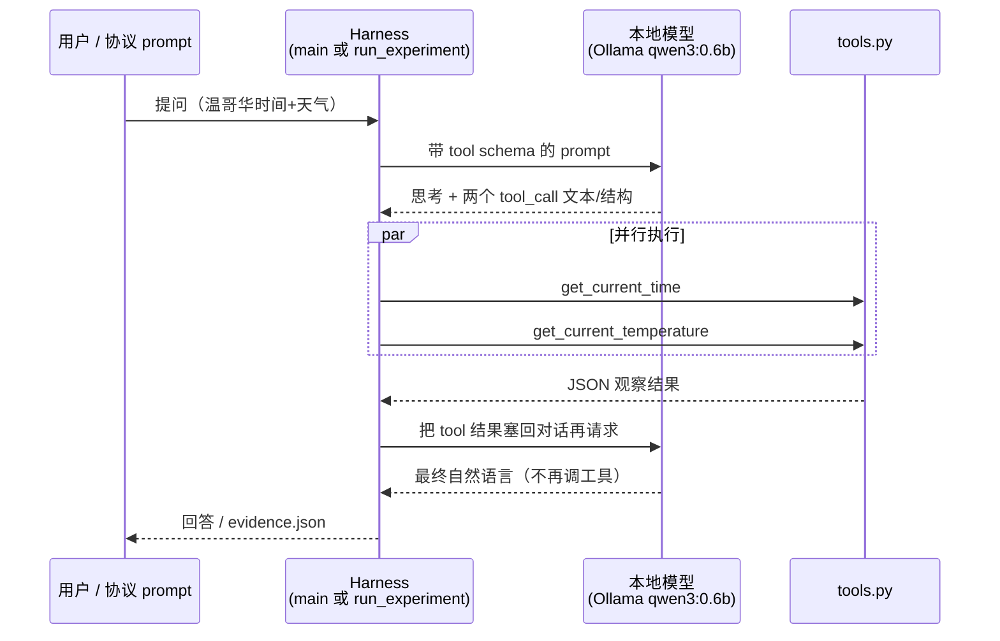

> 配套《深入理解 AI Agent》第 2 章 · `chapter2/local_llm_serving`

## 实验能帮你什么


读完并跟着做，应该能清楚回答：

1. 实验 2-1 到底在证明什么？验收门（gates）各自卡什么？
2. Agent 循环里，**谁思考、谁执行、谁把结果塞回去**？
3. `main.py`（体验）和 `run_experiment.py`（正式验收）在协议与代码上差在哪？
4. `evidence.json` 该搜哪些字段，而不是通读五千行？
5. 顺带测到的 TTFT / 缓存，代码里怎么构造 hit/miss，又如何接到实验 2-3？

一句话结论：

> **Agent ≠ 大模型。**
>
> **Agent = 会决策的模型 + 可执行的工具 + 把观察喂回去的循环。**
>
>
> 0.6B 的本地小模型，在合理提示与清晰的 Harness（框架）下，也能把这一圈跑通。
>
>

---


## 1. 实验在证明什么


书中的核心观点不是「小模型什么都能干」，而是：

- 具备思维链与工具调用能力，**不必然**需要很大参数量
- 在合适的提示与系统结构下，**0.6B** 也能完成可靠的工具调用
- 你要亲眼看到 **ReAct**：思考 → 行动（调工具）→ 观察（看结果）→ 再思考 → 回答并停止
- 顺带观察：前缀不变时二次请求可能更快（KV Cache 预习）

正式「考卷」写在 `experiment_protocol.json`。


### 1.1 工具用例（`tool_case`）


| 项目  | 要求                                                                     |
| --- | ---------------------------------------------------------------------- |
| 问题  | `What are the current time and weather in Vancouver? Call both tools.` |
| 工具  | `get_current_time`、`get_current_temperature`                           |
| 时区  | `America/Vancouver`                                                    |
| 地点  | `Vancouver, Canada`                                                    |
| 执行  | 并行（`parallel`）                                                         |
| 运行时 | Ollama `qwen3:0.6b`，`raw` 模式，`temperature: 0`，`num_predict: 512`       |


### 1.2 为什么「观察后终止」比「会调工具」更重要


| 现象                           | 说明                                    |
| ---------------------------- | ------------------------------------- |
| 第一轮出现两个 `<tool_call>`        | 证明模型会**行动（Act）**                      |
| 第二轮吃掉 tool 结果后直接自然语言回答、不再调工具 | 证明 **Observe → Reason → Stop**，循环真正闭合 |


协议里对应门禁是 `terminated_after_results`：只调工具还不够，必须在观察后停下来。


### 1.3 声明政策（claim_policy）别忽略


协议写明：

- **工具调用**：所有 tool / 终止相关 gate 通过才算 complete
- **吞吐**：如实报告本机 decode tok/s；**未超过 100 就不要宣称**复现了作者 M2 上的观察
- **KV Cache**：保留 matched TTFT 分布即可，**不要求** hit 一定更快

这保证实验是「可审计的工程复现」，不是「必须刷出漂亮曲线」。


---


## 2. 整体架构：一次请求里发生了什么





三张牌：


| 角色              | 产出    | 例子                          |
| --------------- | ----- | --------------------------- |
| **模型**          | 决策与语言 | Thinking、`<tool_call>`、最终回答 |
| **框架（Harness）** | 协议编排  | 渲染 prompt、解析调用、并行执行、回填、写证据  |
| **工具**          | 外部事实  | 时区时间、Open-Meteo 天气（或模拟兜底）   |


容易混淆的一点：

> 模型「一次输出两个 tool call」只是**并行意图**。
>
> 真正并发跑函数的是框架里的 `ThreadPoolExecutor`，不是模型同时执行两段 Python。
>
>

---


## 3. 项目文件地图


目录：`chapter2/local_llm_serving/`


| 文件                         | 角色      | 你该记住的一句话                                                |
| -------------------------- | ------- | ------------------------------------------------------- |
| `main.py`                  | 体验入口    | `ToolCallingAgent` 选后端，支持 interactive / single / 流式     |
| `ollama_native.py`         | 体验路径框架  | `/api/chat` + ReAct while 循环 + 流式 thinking/tool/content |
| `run_experiment.py`        | 正式验收入口  | `/api/generate` + `raw=true` + 证据与 gates                |
| `tools.py`                 | 工具注册与实现 | `ToolRegistry`：时间、天气、汇率、PDF、代码解释器等                      |
| `experiment_protocol.json` | 冻结考卷    | 测什么、runtime、acceptance_gates、claim_policy               |
| `benchmark.py`             | 可选附属    | 吞吐 / TTFT / batching 等 serving 指标（非正文必跑）                |
| `agent.py` / `server.py`   | vLLM 路径 | Linux+GPU 才需要；macOS 默认可忽略                               |


产出物（跑正式实验后）：


| 文件                                  | 作用                                  |
| ----------------------------------- | ----------------------------------- |
| `runs/.../manifest.json`            | 完成回执：`official_complete`、哈希、费用声明    |
| `runs/.../evidence.json`            | 可审计原文：prompt、raw 响应、并行结果、TTFT、gates |
| `runs/.../experiment_protocol.json` | 本次冻结协议的副本                           |


---


## 4. 两条路径：体验课 vs 考试课


### 4.1 体验路径：`main.py` → `ollama_native.py`


`main.py` 在 macOS 上会落到 Ollama（无 CUDA 时不走 vLLM）：


```bash
python main.py --backend ollama --mode single \
  --task "What are the current time and weather in Vancouver? Call both tools."
```


`ollama_native.chat_stream` 的核心是一个 **ReAct while 循环**（最多 10 轮）：

1. 把 user message 放进 `conversation_history`
2. 带着 tools 调 Ollama chat（可 stream）
3. 流式拆出 `thinking` / `content` / tool_calls
4. 若有 tool_calls → 执行工具 → 把结果以 tool 角色写回历史 → **继续下一轮**
5. 若没有 tool_calls → 产出最终 content，结束循环

你在终端看到的 `🧠 Thinking` / `🔧 Tool Calls` / `🤖 Assistant`，就是这条路径把流式 chunk 打印出来的体感版。


特点：

- 主要走 **`/api/chat`**（封装好的对话 API）
- 工具调用多半已是结构化字段，不必自己抠 XML
- 适合建立直觉；参数偶发不准（时区、单位）是小模型的「教学噪声」

### 4.2 正式路径：`run_experiment.py`


文件头写得很直白：故意不用 OpenAI 兼容客户端那套封装，而是用 Ollama **`/api/generate`** **+** **`raw=true`**，让 Qwen chat template 吐出的特殊标记和 `<tool_call>` 原文进入证据。


请求体关键字段：


```python
{
    "model": "qwen3:0.6b",
    "prompt": "<用 tokenizer.apply_chat_template 渲染出的完整字符串>",
    "raw": True,
    "stream": True,
    "options": {"temperature": 0, "num_predict": 512, "seed": 21},
}
```


并用正则自己解析：


```python
TOOL_PATTERN = re.compile(r"<tool_call>\s*(\{.*?\})\s*</tool_call>", re.DOTALL)
```


记忆口诀：

> **体验课坐出租车（chat）；考试课自己看发动机（generate + raw）。**

---


## 5. 正式工具用例：代码里的六步流水线


对应 `run_experiment.py` 的 `run_tool_case`。把它想成工厂流水线：


### 步骤 A — 组装消息与工具 schema

- system 提示明确要求温哥华时间必须用 IANA 时区 `America/Vancouver`
- user 内容来自协议里的 `tool_case.prompt`
- 只保留协议要求的两个 tool schema（避免干扰）

### 步骤 B — 渲染「看得见特殊标记」的 prompt


```python
tokenizer.apply_chat_template(
    messages,
    tools=tools,
    tokenize=False,
    add_generation_prompt=True,
    enable_thinking=True,
)
```


渲染后的字符串里应能看到 `<|im_start|>`、`<|im_end|>`、`<tools>` 等——这正是 gate `chat_template_special_tokens_visible` 在检查的东西。


### 步骤 C — 第一轮 generate，解析 `<tool_call>`


模型典型原文：


```plain text
<tool_call>
{"name": "get_current_time", "arguments": {"timezone": "America/Vancouver"}}
</tool_call>
<tool_call>
{"name": "get_current_temperature", "arguments": {"location": "Vancouver", "unit": "celsius"}}
</tool_call>
```


### 步骤 D — `normalize_tool_call`：容忍小模型的无害变体


0.6B 偶尔会：

- 用 `city` 而不是 `timezone` / `location`
- 把天气工具叫成 `get_weather`

正式脚本会把这些**无害变体归一化**到协议名字与温哥华参数，避免「模型意思对了却因字段名挂科」。这是 Harness 工程细节，很值得记住。


### 步骤 E — `execute_parallel`：框架并行执行


```python
with ThreadPoolExecutor(max_workers=len(calls)) as executor:
    results = list(executor.map(execute, enumerate(calls)))
```


真实证据里常见：


| 工具                          | 单次耗时（量级）                    |
| --------------------------- | --------------------------- |
| `get_current_time`          | ~0.01s（本地时区计算）              |
| `get_current_temperature`   | ~数秒（HTTP：地理编码 + Open-Meteo） |
| `parallel_execution.wall_s` | ≈ 较慢的那个，而不是两者相加             |


这就是「并行生效」的墙钟证据。


### 步骤 F — 第二轮：回填观察并要求终止


```plain text
messages += assistant(第一轮原文)
messages += tool(结果1), tool(结果2)
再 render_prompt → generate
```


然后检查：

- `second_turn` 有非空自然语言
- `parse_tool_calls(second)` 为空 → `terminated_after_results`

### gates 一览（全部为 true 才 `tool_case.passed`）


| Gate                                   | 在验证什么                                      |
| -------------------------------------- | ------------------------------------------ |
| `chat_template_special_tokens_visible` | 第一轮 prompt 含 chat template 特殊标记与 `<tools>` |
| `raw_tool_tags_visible`                | 第一轮原文出现 `<tool_call>`                      |
| `exact_required_tools`                 | 恰好两个，且名字集合匹配协议                             |
| `tool_arguments_match_vancouver`       | 时区精确匹配；location 含 vancouver                |
| `parallel_tool_results_valid`          | 两个结果都不是 `{"error"...}` 开头                  |
| `terminated_after_results`             | 第二轮有回答且不再调工具                               |


---


## 6. 工具层：`tools.py` 在干什么


`ToolRegistry` 注册默认工具（天气、时间、汇率、PDF、代码解释器等）。正式实验只用前两个。


### `get_current_time`

- 入参：IANA 时区名（也兼容 EST/PST 等别名映射）
- 实现：Python `zoneinfo.ZoneInfo`，**纯本地**，不访问外网
- 所以并行时它几乎总是「瞬间完成」的那一侧

### `get_current_temperature`


流水线：

1. Open-Meteo **地理编码** API：地名 → lat/lon
2. Open-Meteo **预报** API：当前温度、湿度、天气代码、风速
3. 天气代码映射成 `clear sky` / `partly cloudy` 等英文描述
4. 成功时带 `"source": "Open-Meteo"`

若 HTTP 失败（超时、断网）：


```plain text
WARNING ... Open-Meteo API error: ... Using simulated data.
返回带 "note": "Simulated data (API unavailable)" 的字典
```


对应源码大约在 `get_current_temperature` 的 `except requests.RequestException` 分支（约 227 行之后）。


**不要和汇率工具的 unsupported currency 分支搞混。**


教学意义：模型不会「真的上网」；上网的是你的工具代码。工具挂了，Harness 仍可返回可审计的降级结果。


---


## 7. 推荐学习顺序


刻意「先懂再跑、先体验再验收」，避免一上来淹没在证据 JSON 里。


### 第 1 步：读目标

1. `book/chapter2.md`「实验 2-1」到「实验总结」
2. 通读 `experiment_protocol.json`

自测：最想证明什么？两个工具与时区/地点？哪条 gate 体现观察后终止？


### 第 2 步：认目录


扫 `main.py`、`run_experiment.py`、`tools.py`、`ollama_native.py` 文件头。


自测：聊天体验跑谁？交证据跑谁？天气请求写在谁里？


### 第 3 步：环境自检


```bash
cd /path/to/ai-agent-book-main
source .venv/bin/activate
# 若尚未安装第 2 章依赖：
# uv sync --locked --python 3.12 --extra ch2

cd chapter2/local_llm_serving
ollama list
curl -s <http://127.0.0.1:11434/api/tags> | head -c 400; echo
python main.py --backend ollama --info
```


需要：Ollama 在跑、存在 `qwen3:0.6b`、`--info` 显示 Ollama 可用。


没有模型：`ollama pull qwen3:0.6b`。macOS 无 CUDA 正常。


### 第 4 步：体验一次 ReAct


```bash
python main.py --backend ollama --mode single \
  --task "What are the current time and weather in Vancouver? Call both tools."
```


观察顺序：Thinking → 是否同时两个 Tool Calls → Tool Results → 结果后是终止还是又想调工具。


常见教学噪声：

- 时区偶发猜错
- Open-Meteo 超时 → 模拟天气
- 汇总时单位说错（`°F` 说成 `°C`）

### 第 5 步：代码对照日志

- `ollama_native.py`：搜 `chat_stream`、`Executing tool`、ReAct `while`
- `tools.py`：搜 `Open-Meteo` / `simulated`（天气兜底，不是汇率那段）
- `run_experiment.py`：搜 `run_tool_case`、`execute_parallel`、`gates`

### 第 6 步：跑正式实验


脚本默认 `AutoTokenizer.from_pretrained(..., local_files_only=True)`，首次需先联网缓存：


```bash
python -c "from transformers import AutoTokenizer; AutoTokenizer.from_pretrained('Qwen/Qwen3-0.6B'); print('tokenizer ok')"

python run_experiment.py --output "runs/exp2-1-mine-$(date +%Y%m%d-%H%M%S)"
```


通常数分钟（工具用例 + 2 次 warmup + 5 对 hit/miss）。结束后先看终端 JSON / `manifest.json`：


| 字段                                            | 含义               |
| --------------------------------------------- | ---------------- |
| `official_complete`                           | 整体是否通过（含凭证扫描）    |
| `tool_case_passed`                            | 工具用例六门是否全过       |
| `mean_tool_case_decode_tokens_per_second`     | 本机平均解码速度         |
| `exceeded_100_tokens_per_second_on_this_host` | 是否达到作者硬件那档观察     |
| `cache_observation.miss_over_hit`             | miss 均值 / hit 均值 |


### 第 7 步：定点读证据


打开 `runs/exp2-1-mine-.../evidence.json`，用搜索：

1. `"raw_response"` —— 第一轮两个 `<tool_call>`
2. 下一个 `"raw_response"` —— 第二轮自然语言
3. `"parallel_execution"` —— `ThreadPoolExecutor` 与各自 `duration_s`
4. `"gates"` —— 是否全 `true`
5. （可选）`"cache_case"` / `"hit_ttft_s"` —— 缓存预习数字

也可对照：


```bash
# 只看摘要级字段（示例）
python -c "import json; e=json.load(open('runs/你的目录/evidence.json')); print(e['summary']); print(e['tool_case']['gates'])"
```


---


## 8. 一次真实复现摘录


不同机器数字会变，结构应类似：


```json
{
  "official_complete": true,
  "tool_case_passed": true,
  "mean_tool_case_decode_tokens_per_second": 54.03,
  "exceeded_100_tokens_per_second_on_this_host": false,
  "cache_observation": {
    "hit_mean_s": 4.40,
    "miss_mean_s": 5.34,
    "miss_over_hit": 1.21,
    "hit_faster_in_pairs": 3,
    "matched_pairs": 5
  }
}
```


解读：

- 工具主线通过
- ~54 tok/s：如实报告；未宣称 >100
- miss 平均约为 hit 的 1.21 倍；5 对里 3 对 hit 更快——符合「保留样本、不强制漂亮结果」

第二轮示例：


```plain text
The current time in Vancouver is **23:58:22** (UTC-7), and the weather is
**clear sky** with a temperature of **15.3°C**. ...
```


---


## 9. 缓存预习：代码如何构造 hit / miss


对应 `run_cache_case` + 协议 `cache_case`。


| 概念                  | 含义                                         |
| ------------------- | ------------------------------------------ |
| **TTFT**            | 发出请求到**第一个输出 token** 的时间（脚本用流式首片计时）        |
| **hit**             | 反复使用**字节完全相同**的长 `stable` prompt           |
| **miss**            | 总长度不变，在 system **最开头**写入 `M0000000` 这类等长标记 |
| **warmups**         | 先跑 2 次，减少冷启动干扰                             |
| **matched_repeats** | 5 对 hit/miss 对照                            |


伪代码级逻辑：


```plain text
造一段约 4K token 量级的稳定 system 手册文字
render → stable
warmup(stable) × 2
重复 5 次:
  hit  = generate(stable)
  miss = generate(开头替换后的 mutated)  # len(stable)==len(mutated)
汇总 hit/miss 的 ttft_s
```


为什么改开头不改结尾？

> KV Cache 按**从前到后的前缀**复用。开头一变，后续链条往往整段失效；只改结尾时，长前缀仍可能命中，对比不干净。

协议句：

> `matched hit and miss TTFT samples are retained without requiring a favorable outcome`

= 验收要**诚实落盘**，不要求每次 hit 都赢。


| 实验 2-1     | 实验 2-3（`chapter2/kv-cache`）      |
| ---------- | -------------------------------- |
| 顺带看到「前缀敏感」 | 系统研究动态 system、打乱工具顺序、滑动窗口等如何破坏缓存 |
| 报告 TTFT 分布 | 结合 cached tokens 与完成行为一起看        |


---


## 10. 和书中「你应观察到的五点」对照


| 书中期望                 | 你在本实验哪里看到                                  |
| -------------------- | ------------------------------------------ |
| 小模型也会工具调用            | 第一轮 `<tool_call>` + `exact_required_tools` |
| 性能观感（作者机 >100 tok/s） | `decode_tokens_per_second`；本机未到就如实写 false  |
| ReAct 多轮             | 第一轮调工具 → 并行观察 → 第二轮终止                      |
| 流式价值                 | 体验路径 `chat_stream` 的 thinking/tool/content |
| KV Cache 线索          | `cache_case` 的 hit/miss TTFT               |


---


## 11. 常见问题


**Q: 体验路径时区/单位不完美，算失败吗？**


A: 不算。体验建立直觉；正式看 `gates` 与 `official_complete`。正式脚本还有 `normalize_tool_call` 吸收部分无害变体。


**Q: 天气变成 Simulated data？**


A: Open-Meteo 超时/网络问题。看 `tools.py` 天气函数的 fallback。外网恢复后证据可出现 `"source": "Open-Meteo"`。


**Q:** **`AutoTokenizer`** **报 local cache 找不到？**


A: 先联网下载 `Qwen/Qwen3-0.6B` tokenizer，再跑 `run_experiment.py`。


**Q: 速度不到 100 tok/s？**


A: 正常。claim_policy 要求报告测值，不强制复现作者硬件。


**Q:** **`official_complete`** **为 false 但工具看起来对了？**


A: 检查 `tool_case.gates` 哪扇是 false，以及 `credential_scan`、`cache_case` 的 `matched_pairs` 是否凑齐。`passed = all(gates.values())`，一扇 false 即工具用例失败。


**Q: 想交互慢慢玩？**


```bash
python main.py --backend ollama --mode interactive
```


**Q: Linux + NVIDIA 能否用 vLLM？**


A: 可以，但需 `--extra vllm` 且显式 `--backend vllm`。正式正文验收协议冻结的是 **Ollama raw + qwen3:0.6b** 这条路径；体验用 vLLM 与「交卷」不是同一套证据格式。


---


## 12. 复习卡片

1. **证明点**：小模型 + 合理提示 + Harness → 可靠工具调用与 ReAct
2. **三件套**：模型决策 · 工具取数 · 框架闭环
3. **双入口**：`main.py` 体验（chat）/ `run_experiment.py` 验收（generate+raw）
4. **raw 的意义**：特殊标记与 `<tool_call>` 原文可审计
5. **并行**：模型表达意图；`ThreadPoolExecutor` 真正并发
6. **归一化**：`normalize_tool_call` 吸收小模型无害字段漂移
7. **终止**：第二轮无 tool call，才算闭环
8. **六门 gates**：全 true 才 `tool_case_passed`
9. **缓存预习**：同前缀 hit；改开头 miss；数字如实报

---


## 参考路径

- 正文：`book/chapter2.md`（实验 2-1 小节）
- 章目录与台账：`chapter2/README.md`、`chapter2/EXPERIMENT_LEDGER.md`
- 项目说明：`chapter2/local_llm_serving/README.md`
- 协议：`chapter2/local_llm_serving/experiment_protocol.json`
- 正式实现：`chapter2/local_llm_serving/run_experiment.py`
- 体验框架：`chapter2/local_llm_serving/ollama_native.py`
- 工具：`chapter2/local_llm_serving/tools.py`