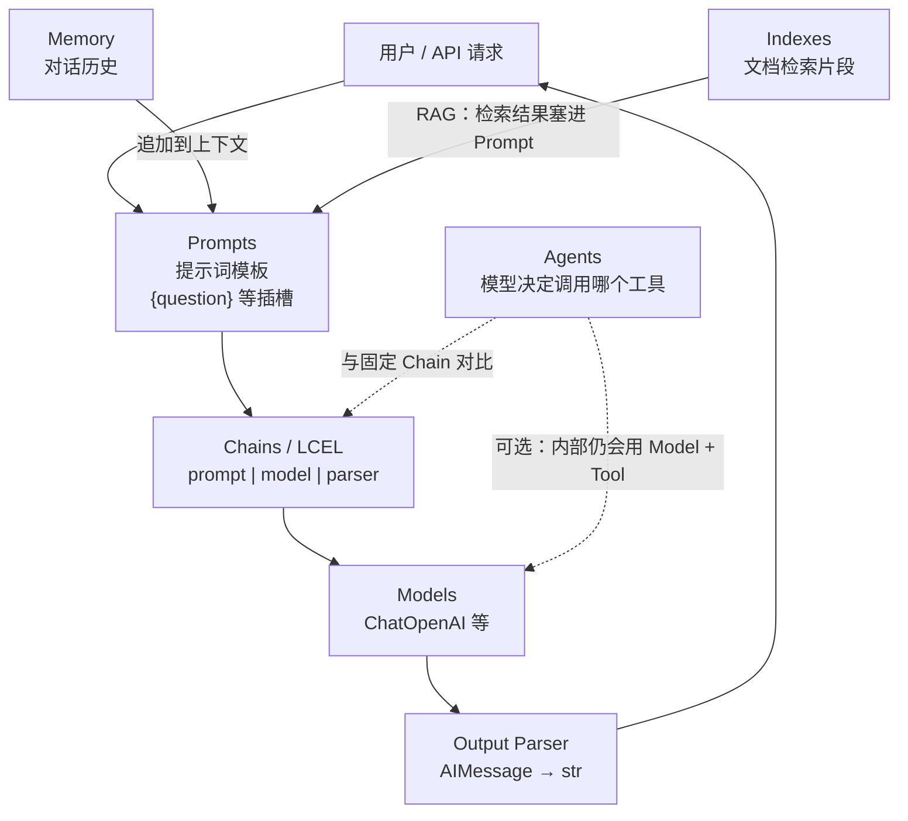

Day1 已经会用 FastAPI 调大模型。Day2 的问题是：如果每次都在代码里手写「拼 prompt → 调 API → 解析字符串」，很快会乱。LangChain 把常见步骤拆成模块，其中 **LCEL** 用 `|` 把组件串成流水线——这是后面 RAG、Agent 的语法基础。


本文从零讲清 **Models / Prompts / Chains / Memory / Indexes / Agents** 各自干什么，并带你手撕第一条 LCEL 链；最后可选挂到 FastAPI。全文自包含，代码可直接复制运行。


## 你将会得到什么

1. 能画出六大模块的关系图，并用自己的话讲清职责
2. 能写并运行：`chain = prompt | model | parser`
3. 能解释 `|` 每一环运行时进什么、出什么
4. 理解 Memory / Indexes / Agents 与「固定 Chain」的差别（深度实战在后续天）
5. （可选）通过 `POST /chain` 用 HTTP 调用同一条 LCEL

---


## 零基础名词表


### LangChain 是什么


**LangChain** 是构建 LLM 应用的 Python 框架。它不替代大模型，而是提供：

- 统一的**模型调用接口**（Models）
- **提示词模板**（Prompts）
- **组件串联**（Chains / LCEL）
- 以及 Memory、检索（Indexes）、Agent 等能力

### LCEL 是什么


**LCEL**（LangChain Expression Language）= 用 `|` 把多个组件连成一条链。


左边组件的输出，自动成为右边组件的输入。


典型一行：


```plain text
prompt | model | parser
```


### Chat Model vs 普通 LLM


本文用的是 **Chat Model**（对话模型）：输入是一组消息（system / human / ai），输出是一条 AI 回复。


`ChatOpenAI` 是 LangChain 里对接「OpenAI 兼容聊天接口」的类——Ollama、OpenRouter 都能用。


---


## 六大核心模块（先建立全图）


### 关系总览：谁依赖谁、数据往哪流


可以把 LangChain 想成「搭 LLM 应用的一套装配线」。**Models 和 Prompts 是原材料**；**Chains（LCEL）把原材料串成固定流水线**；**Memory / Indexes 往 Prompt 里加料**；**Agents 则不再固定流水线，改由模型自己选下一步**。


```plain text
┌─────────────────────────────────────┐
                         │           用户 / 你的 API            │
                         └──────────────────┬──────────────────┘
                                            │ 问题、参数
                                            ▼
    ┌──────────────┐              ┌─────────────────┐
    │   Memory     │──历史对话──▶│                 │
    │  （对话记忆）  │              │     Prompts     │
    └──────────────┘              │  （提示词模板）   │
                                  │  system + human │
    ┌──────────────┐              │  + {变量插槽}    │
    │   Indexes    │──检索片段──▶│                 │
    │ （外部知识库） │              └────────┬────────┘
    └──────────────┘                       │ 填好的消息列表
                                           ▼
                                  ┌─────────────────┐
                                  │     Chains        │
                                  │  LCEL: A | B | C  │◀── Day2 核心：固定流水线
                                  └────────┬────────┘
                                           │
              ┌────────────────────────────┼────────────────────────────┐
              ▼                            ▼                            ▼
       ┌────────────┐            ┌────────────┐              ┌──────────────┐
       │   Models   │            │  (中间步骤) │              │ Output Parser│
       │  （调模型）  │───────────▶│  可继续 |   │─────────────▶│ 消息 → 字符串  │
       └────────────┘            └────────────┘              └──────────────┘
              ▲                            │
              │                            ▼
              │                     最终回答给用户

    ┌─────────────────────────────────────────────────────────────────────┐
    │  Agents（另一条路，Week3 深挖）                                       │
    │  模型当调度员：思考 → 选工具(搜网页/查库/算数) → 再看结果 → 再决定…      │
    │  不是写死 prompt|model|parser，而是「下一步由模型选」                    │
    └─────────────────────────────────────────────────────────────────────┘
```


下面用同一张图换一种画法（便于在支持 Mermaid 的阅读器里查看）：





### 一张表记住「和谁有关系」


| 模块          | 和谁配合                  | 关系一句话                                               |
| ----------- | --------------------- | --------------------------------------------------- |
| **Models**  | Chains、Agents         | 真正「思考」的只有模型；其它模块都是围绕它准备输入、处理输出                      |
| **Prompts** | Models、Memory、Indexes | Prompt 是模型的说明书；Memory/Indexes 常作为**额外上下文写进 Prompt** |
| **Chains**  | Prompts、Models、Parser | LCEL 用 `\|` 把多步串成**你写死的**流水线                        |
| **Memory**  | Prompts（或消息列表）        | 无 Memory = 每次只发当前一句；有 Memory = 把历史消息一起再发给 Models    |
| **Indexes** | Prompts               | 私有文档进不了模型参数；Indexes 检索后把片段**注入 Prompt**（RAG）        |
| **Agents**  | Models + Tools        | 不固定 `\|` 顺序；**Models 决定**下一步调哪个工具、是否结束              |


### 从「简单到复杂」的演进（帮助记忆）


```plain text
第 1 层（Day2 练）     Prompts + Models + Parser  ──用 LCEL | 串起来──▶  Chains
第 2 层（多轮对话）    在上面基础上，Memory 给 Prompt/消息列表加历史
第 3 层（私有知识）    在上面基础上，Indexes 给 Prompt 加检索到的文档片段
第 4 层（自主决策）    Agents：模型自己选工具，不再只有固定 Chain
```


| 模块      | 解决什么问题       | Day2 学到哪                  |
| ------- | ------------ | ------------------------- |
| Models  | 换模型、统一调用方式   | 会用 `ChatOpenAI` + Ollama  |
| Prompts | 同一套话术、不同用户输入 | 会用 `ChatPromptTemplate`   |
| Chains  | 多步任务别手写胶水代码  | **熟练 LCEL**               |
| Memory  | 模型默认不记得上一轮   | 理解机制 + 跑对比 demo           |
| Indexes | 模型不知道你的私有文档  | 理解职责（Day3+ 动手 RAG）        |
| Agents  | 固定流水线不够灵活    | 理解 vs Chain 的差别（Week3 动手） |


**Output Parser** 常和 Chain 一起出现：模型返回的是「消息对象」，Parser 收成你要的格式（如纯字符串）。在 LCEL 里它通常是链的**最后一环**：`prompt | model | StrOutputParser()`。


---


## 环境准备


```bash
# Python 3.12+，已安装 Ollama 并拉取小模型
ollama pull qwen3:0.6b

uv init langchain-lcel-day2 && cd langchain-lcel-day2
uv add langchain langchain-openai langchain-core pydantic-settings python-dotenv
```


可选：若要做文末 FastAPI 加法：


```bash
uv add fastapi "uvicorn[standard]"
```


`.env`（本地 Ollama 可只写前两行）：


```bash
OLLAMA_BASE_URL=http://localhost:11434/v1
OLLAMA_MODEL=qwen3:0.6b
OPENROUTER_BASE_URL=https://openrouter.ai/api/v1
OPENROUTER_API_KEY=
OPENROUTER_MODEL=openrouter/free
```


---


## 第 1 步：Models + Prompts + Parser + LCEL


保存为 `demo_lcel.py`：


```python
"""Models + Prompts + Output Parser + LCEL 最小示例。"""

from langchain_core.output_parsers import StrOutputParser
from langchain_core.prompts import ChatPromptTemplate
from langchain_openai import ChatOpenAI
from pydantic_settings import BaseSettings, SettingsConfigDict


class Settings(BaseSettings):
    model_config = SettingsConfigDict(env_file=".env", extra="ignore")
    ollama_base_url: str = "http://localhost:11434/v1"
    ollama_model: str = "qwen3:0.6b"


settings = Settings()

# Models：对接大模型
model = ChatOpenAI(
    base_url=settings.ollama_base_url,
    api_key="ollama",  # Ollama 本地不校验，任意非空占位即可
    model=settings.ollama_model,
    temperature=0,
)

# Prompts：system 固定，{question} 是用户插槽
prompt = ChatPromptTemplate.from_messages(
    [
        ("system", "你是简洁助手。只用一句话回答。"),
        ("human", "{question}"),
    ]
)

# Output Parser：AIMessage → str
parser = StrOutputParser()

# Chains / LCEL
chain = prompt | model | parser

if __name__ == "__main__":
    question = "在 LangChain 里，LCEL 是什么？用一句话解释。"
    print("Q:", question)
    print("A:", chain.invoke({"question": question}))
```


运行：


```bash
uv run python demo_lcel.py
```


### `|` 每一环的运行时数据流


| 环节       | 进                     | 出           |
| -------- | --------------------- | ----------- |
| `prompt` | `{"question": "..."}` | 填好的消息列表     |
| `model`  | 消息列表                  | `AIMessage` |
| `parser` | `AIMessage`           | 纯字符串        |


注意：`base_url` / `api_key` / `model` 名是**创建** `ChatOpenAI` 时的配置，不是 `|` 管道里传给 model 的运行时输入。


**练习**：改 `system` 那一行，再跑一遍——你会看到同一问题，答案风格变了。因为 **prompt 环吐给 model 的指导变了**。


---


## 第 2 步：理解 Memory（模型默认无状态）


保存为 `demo_memory.py`：


```python
"""Memory：第二次 invoke 是否带上历史，决定模型能不能答上一句的内容。"""

from langchain_core.messages import AIMessage, HumanMessage, SystemMessage
from langchain_openai import ChatOpenAI
from pydantic_settings import BaseSettings, SettingsConfigDict


class Settings(BaseSettings):
    model_config = SettingsConfigDict(env_file=".env", extra="ignore")
    ollama_base_url: str = "http://localhost:11434/v1"
    ollama_model: str = "qwen3:0.6b"


settings = Settings()
model = ChatOpenAI(
    base_url=settings.ollama_base_url,
    api_key="ollama",
    model=settings.ollama_model,
    temperature=0,
)

# 用不常见名字，避免无历史时小模型「蒙对小明」
NAME = "光盾七十九号"

print("=== 无 Memory：两次 invoke 互不相干 ===")
r1 = model.invoke([HumanMessage(f"我叫{NAME}，请记住。只用一句话确认。")])
print("第1轮:", r1.content)
r2 = model.invoke([HumanMessage("我叫什么名字？只输出名字本身。")])
print("第2轮(无历史):", r2.content)

print("\n=== 有 Memory：把历史消息一起发送 ===")
history = [
    SystemMessage("根据对话历史回答。只用一句话。"),
    HumanMessage(f"我叫{NAME}，请记住。"),
]
r3 = model.invoke(history)
history.append(AIMessage(content=r3.content))
history.append(HumanMessage("我叫什么名字？只输出名字本身。"))
r4 = model.invoke(history)
print("第2轮(有历史):", r4.content)
```


运行：


```bash
uv run python demo_memory.py
```


典型现象：

- **无历史**：第 2 轮往往答不对「光盾七十九号」（可能瞎编「AI」等）
- **有历史**：第 2 轮能提到正确名字

结论：**Memory 不是模型内置硬盘**，而是应用层把历史消息再塞进下一次请求。LangChain 的 Memory 组件帮你管理这份历史。


---


## 第 3 步：理解 Indexes 与 Agents（概念）


### Indexes（为 RAG 做准备）


模型参数里装不下你的《员工手册》。**Indexes** 相关能力负责：


```plain text
文档加载 → 切分 → 向量化 → 存入向量库 → 按问题检索 Top-K 片段 → 塞进 Prompt
```


所以「本公司考勤制度是什么」这类问题，需要 **Indexes + Prompt + Model**，不能指望模型训练数据。


### Agents（与固定 Chain 的差别）


|        | Chain / LCEL                        | Agent          |
| ------ | ----------------------------------- | -------------- |
| 谁决定下一步 | 你在代码里写死 `prompt \| model \| parser` | 模型决定要不要调工具、调哪个 |
| 典型用途   | 固定问答、翻译、格式化                         | 搜网页、查库、多步推理    |


Day2 只要说清：**Chain = 固定流水线；Agent = 模型当调度员**。Week3 再动手 Tool Calling。


---


## 第 4 步（可选加法）：FastAPI 暴露同一条 LCEL


保存为 `main.py`：


```python
"""FastAPI + LCEL + Ollama / OpenRouter。"""

from __future__ import annotations

from typing import Literal

from fastapi import FastAPI, HTTPException
from langchain_core.output_parsers import StrOutputParser
from langchain_core.prompts import ChatPromptTemplate
from langchain_openai import ChatOpenAI
from pydantic import BaseModel, Field
from pydantic_settings import BaseSettings, SettingsConfigDict


class Settings(BaseSettings):
    model_config = SettingsConfigDict(env_file=".env", env_file_encoding="utf-8", extra="ignore")
    ollama_base_url: str = "http://localhost:11434/v1"
    ollama_model: str = "qwen3:0.6b"
    openrouter_base_url: str = "https://openrouter.ai/api/v1"
    openrouter_api_key: str = ""
    openrouter_model: str = "openrouter/free"


settings = Settings()
app = FastAPI(title="LangChain LCEL API", version="0.1.0")


class ChainRequest(BaseModel):
    question: str = Field(min_length=1)
    provider: Literal["ollama", "openrouter"] = "ollama"
    temperature: float = Field(default=0.2, ge=0, le=2)


class ChainResponse(BaseModel):
    provider: str
    model: str
    answer: str


def build_chain(provider: Literal["ollama", "openrouter"], temperature: float):
    if provider == "ollama":
        llm = ChatOpenAI(
            base_url=settings.ollama_base_url,
            api_key="ollama",
            model=settings.ollama_model,
            temperature=temperature,
        )
        model_name = settings.ollama_model
    else:
        if not settings.openrouter_api_key:
            raise HTTPException(status_code=400, detail="缺少 OPENROUTER_API_KEY")
        llm = ChatOpenAI(
            base_url=settings.openrouter_base_url,
            api_key=settings.openrouter_api_key,
            model=settings.openrouter_model,
            temperature=temperature,
        )
        model_name = settings.openrouter_model

    prompt = ChatPromptTemplate.from_messages(
        [
            ("system", "你是简洁助手。只用一句话回答。"),
            ("human", "{question}"),
        ]
    )
    return prompt | llm | StrOutputParser(), model_name


@app.get("/health")
def health() -> dict[str, str]:
    return {"status": "ok"}


@app.post("/chain", response_model=ChainResponse)
def run_chain(body: ChainRequest) -> ChainResponse:
    chain, model_name = build_chain(body.provider, body.temperature)
    try:
        answer = chain.invoke({"question": body.question})
    except Exception as exc:
        raise HTTPException(status_code=502, detail=f"LCEL 调用失败:{exc}") from exc
    return ChainResponse(provider=body.provider, model=model_name, answer=answer)
```


启动与验证：


```bash
uv run uvicorn main:app --reload --port 8001
```


另开终端：


```bash
curl -sS http://127.0.0.1:8001/chain \
  -H 'Content-Type: application/json' \
  -d '{"question":"FastAPI 是什么？","provider":"ollama"}'
```


期望：`200` + JSON，`answer` 字段有模型回复。文档页：`http://127.0.0.1:8001/docs`


根路径 `/` 没有路由会 `404`，正常；用 `/health` 或 `/docs` 即可。


---


## 踩过的坑


**1）无 Memory 时偶尔「蒙对」常见名字**


问「我叫什么」时，小模型可能瞎猜「小明」。不代表真记得——换「光盾七十九号」这类罕见名字，无历史时通常露馅。


**2）把配置当成** **`|`** **的运行时输入**


`api_key`、`base_url` 是创建 model 时用的；管道里 model 收到的是 **消息列表**。


**3）LCEL 问法太短，小模型答偏**


问「什么是 LCEL」可能被理解成金融术语。加上「在 LangChain 里」更稳。


**4）终端里重复** **`cd`** **子目录**


若已在项目目录，再 `cd week01/...` 会报错；直接 `uv run python demo_lcel.py` 即可。


---


## 取舍与未做之事


Day2 上游底线是 **理解六大模块 + 熟练 LCEL**，不是一次做完 RAG 或 Agent：

- Memory / Indexes / Agents 的**深度实战**分别在后续天展开
- 今天必须过关的是：**职责讲得清 + LCEL 能写能改**
- 专用 `langchain-openrouter` 包留到需要路由元数据时再学；本文用 `ChatOpenAI(base_url=...)` 与 Day1 心智一致

---


## 小结


LangChain 把 LLM 应用拆成六块：**Models 调模型，Prompts 写模板，Chains(LCEL) 串流水线，Memory 带历史，Indexes 接外部知识，Agents 让模型选工具**。


Day2 的核心动作是：


```python
chain = prompt | model | StrOutputParser()
chain.invoke({"question": "你的问题"})
```