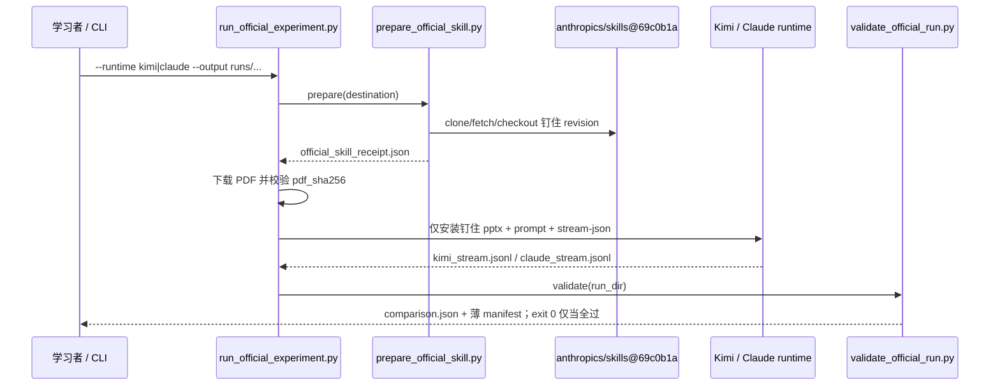

> 配套《深入理解 AI Agent》第 2 章 · `chapter2/agent-skills-ppt`

---


## 这实验能帮你什么


读完并跟着做，你应该能清楚回答：

1. Skills 解决哪一类上下文工程问题？渐进式披露三层各是什么？
2. 正式验收入口是谁？`demo.py` / 自带 `skills/pptx` 为什么不算过关？
3. `prepare_official_skill.py`、`run_official_experiment.py`、`validate_official_run.py` 各自卡什么？
4. 薄 `manifest.json` 与厚 `comparison.json` 怎么读？15 道门各证明什么？
5. Claude blocked 跑为什么保留？和「模型做不出 PPT」差在哪？

一句话结论：

> **Skill = 可版本控制的领域操作手册；渐进式披露 = 先给目录，需要再取正文与细则。**
>
> 实验 2-6 考的不是「随便做出好看的 PPT」，而是：**钉住 revision 的官方 Skill 是否被按层加载，并用官方脚本从真实论文 PDF 落地可审计产物。**
>
>
> **运行时可换（Claude Code / Kimi Code）；Skill 内容与产物门禁不可换。**
>
>

---


## 1. 和 2-4 / 2-5 的衔接


| 实验  | 你学到什么                         | 2-6 怎么接上                                  |
| --- | ----------------------------- | ----------------------------------------- |
| 2-4 | 提示与工具描述的**内容质量**影响成功（τ-bench） | 内容继续变多时，不能无限塞进一条 system                   |
| 2-5 | 外部内容可能劫持上下文；防御要分层（尤其 D4）      | Skills 是**可信、可版本控制**的知识包；不可信网页 ≠ 官方 Skill |
| 2-6 | —                             | **按需披露**专业流程，而不是启动时一次性灌满                  |


书中动机（`book/chapter2.md`「动态提示词与 Agent Skills」）：场景一多，规则/规范/格式全塞进同一条 system → **浪费 token** + **注意力稀释**。于是从「静态大手册」演到「目录 + 按需取书」。


与 2-3（KV Cache）的纪律：目录（name + description）常驻前缀可保持稳定；完整 Skill 正文在调用时**追加**进历史，不必回头改写已缓存的 system——「只增不改」。


---


## 2. 实验在证明什么


目录：`chapter2/agent-skills-ppt/`。


**正式目标（书 +** **`experiment_protocol.json`****）：**


用支持 `SKILL.md` 渐进式披露的 Agent 运行时，加载 **Anthropic 官方 PPTX Skill（钉住 revision）**，把真实论文 PDF（Vaswani et al., _Attention Is All You Need_, arXiv:1706.03762）做成 **10–15 页**演示文稿，并留下可审计轨迹。


| 项              | 冻结约定                                                                       |
| -------------- | -------------------------------------------------------------------------- |
| Skill 仓库       | `https://github.com/anthropics/skills.git`                                 |
| Skill revision | `69c0b1a0674149f27b61b2635f935524b6add202`                                 |
| 为什么钉这版         | 该 revision 含手稿点名的 `html2pptx.md`；更晚的 `4e6907a` 会打成 `html2pptx.tgz`         |
| 论文 PDF         | SHA-256 `bdfaa68d8984f0dc02beaca527b76f207d99b666d31d1da728ee0728182df697` |
| 页数 / 章节        | 10–15；标题、背景/问题、方法/Transformer、关键结果、结论                                      |
| 原图             | ≥3 张从 PDF 裁切，嵌入 deck，并写入 `source_visuals/manifest.json`                    |
| 运行时政策          | **不强制** Anthropic 凭证；Claude Code 或 Kimi Code CLI 均可                        |


台账：`runs/exp2-6-kimi-pptx-20260731-v1/manifest.json` 为通过战役；Claude v2–v4 为 fail-closed 反例。`claim_policy`：bundled `demo.py` **不能**满足 2-6；只有真实 runtime + 钉住官方 Skill + 真 PDF 才算完成。


---


## 3. 渐进式披露：官方路径 vs Legacy 同构物


| 层            | 书中说法                         | 正式官方路径（验收）                                               | Legacy `demo.py`（教学，非验收）                                                             |
| ------------ | ---------------------------- | -------------------------------------------------------- | ------------------------------------------------------------------------------------ |
| **1 · 元数据**  | 启动时只进 `name` + `description` | 目录仅含钉住官方 `pptx`；未加载正文                                    | `scan_skill_catalog()` → `build_system_prompt()`                                     |
| **2 · 核心流程** | 需要时加载完整 `SKILL.md`           | 调用 Skill / 读完整 `SKILL.md`                                | `read_skill("pptx")` → `tool_read_skill()`                                           |
| **3 · 细则**   | 再读子文档与捆绑脚本                   | `html2pptx.md` → `scripts/html2pptx.js` / `thumbnail.py` | `read_skill_file(..., "reference.md")` → `run_skill_script(..., "generate_pptx.py")` |


`description` 应写成 **Use when / Don't use when**（路由条件），不是空泛广告。仓库自建 `skills/pptx/SKILL.md` 的 frontmatter 即按此习惯。

> **正式路径考「官方手册 + 官方脚本 + 真 PDF」；demo 只证明「三层加载」这个形状。**

---


## 4. 项目文件地图


### 4.1 正式验收链路


| 文件                            | 角色             | 一句话                                                  |
| ----------------------------- | -------------- | ---------------------------------------------------- |
| `experiment_protocol.json`    | 冻结考卷           | revision、PDF 哈希、页数、披露/产物门、`claim_policy`             |
| `prepare_official_skill.py`   | 钉住外部 Skill     | checkout `69c0b1a…`，校验四文件并写哈希收据                      |
| `run_official_experiment.py`  | 正式验收入口         | prepare → 下 PDF → 启 Claude/Kimi → 调校验器               |
| `validate_official_run.py`    | Fail-closed 判卷 | 解析 stream → 15 gates → 厚 `comparison` + 薄 `manifest` |
| `test_official_validation.py` | 校验器单测          | 门禁可回归；不替你跑 live                                      |


### 4.2 Legacy 教学链路（非验收）


| 文件                                     | 角色         | 一句话                                                             |
| -------------------------------------- | ---------- | --------------------------------------------------------------- |
| `demo.py`                              | 体验 / 离线入口  | 薄目录 → agentic loop 或 `run_offline` → `output/presentation.pptx` |
| `skills/pptx/SKILL.md`                 | 自建同构 Skill | L1 frontmatter + L2 页序与脚本约定                                     |
| `skills/pptx/reference.md`             | L3 细则      | 版式 / 配色 / python-pptx                                           |
| `skills/pptx/scripts/generate_pptx.py` | L3 捆绑脚本    | `build_presentation(data, path)`                                |
| `papers/sample_outline.json`           | offline 输入 | 预置大纲；模型不决策选 Skill                                               |
| `papers/sample_paper.md`               | 在线 demo 输入 | 短样例，不是 Attention PDF                                            |


### 4.3 收据目录


| 路径                                         | 作用                                                                        |
| ------------------------------------------ | ------------------------------------------------------------------------- |
| `runs/exp2-6-kimi-pptx-20260731-v1/`       | **通过**：`manifest.json`、`comparison.json`、`kimi_stream.jsonl`、`workspace/` |
| `runs/exp2-6-claude-pptx-20260730-v2`～`v4` | **fail-closed**：凭证 blocked                                                |
| `output/presentation.pptx`                 | legacy 产物（常见 9 页），**不是**验收证据                                              |


---


## 5. 整体控制流





`run_official_experiment.main()` 六步：

1. 解析 `-runtime` / `-output`（新目录必须不存在）/ 可选 `-resume-validation`、`-auth-source`
2. 把 `experiment_protocol.json` 原样拷进 `run_dir/`
3. `prepare(official_repo)` → `official_skill_receipt.json`
4. 建 `workspace/output/`；下载 `attention-is-all-you-need.pdf`，哈希不符则 `RuntimeError`
5. `run_kimi` 或 `run_claude`：symlink 安装「本次唯一 Skill」，落 `prompt.txt` / `command.json` / stream
6. 子进程 `validate_official_run.py`；返回码 = 是否 `official_complete`
- `-resume-validation`：跳过下载与 runtime，只对已有 `run_dir` 重判卷。

---


## 6. 源码走读 A：`prepare_official_skill.py`


核心：`prepare(destination) -> dict`。

1. 读协议里的 repository / revision
2. 无 `.git` 则 `git clone --filter=blob:none --no-checkout`
3. `fetch` + `checkout --detach`；`rev-parse HEAD` 必须**精确等于**钉住 revision
4. 必填四文件：`SKILL.md`、`html2pptx.md`、`scripts/html2pptx.js`、`scripts/thumbnail.py`
5. 返回 `repository` / `revision` / `skill_path` / `required_file_hashes`

教学点：正式 Skill **不是**仓库里那份教学同构物；外部钉住内容才是考题原文。


---


## 7. 源码走读 B：`run_official_experiment.py`


### 7.1 Prompt 共同点（`CLAUDE_PROMPT` / `KIMI_PROMPT`）

- 从真实 PDF 做 10–15 页
- 披露链：invoke pptx → 完整 `SKILL.md` → 再读 `html2pptx.md`
- 官方 `html2pptx.js` + `thumbnail.py`；缩略图目检后修 overlap/cutoff
- ≥3 张 PDF 原图进 `source_visuals/` + `manifest.json`（`file`/`page`/`label`/`caption`）
- **禁止** `demo.py`、本地 proxy Skill、sample outline

Claude 版以 `/pptx` 开头；Kimi 版要求经 **Skill 工具**调用（校验器查工具名）。


### 7.2 安装方式：保证「启动时只有官方元数据」


**Kimi（****`run_kimi`****）**


```plain text
workspace/kimi-skills/pptx  --symlink-->  official_skill
kimi --prompt ... --skills-dir <kimi-skills> --add-dir <official_skill>
```

- `-skills-dir` **替换**本次自动发现目录。`runtime.json` 只记 binary、model、`skills_dir`、哪些 auth **变量名**存在——**从不写密钥值**。

**Claude（****`run_claude`****）**


```plain text
workspace/.claude/skills/pptx  --symlink-->  official_skill
```

- `-auth-source claude-login` 时 `env.pop("ANTHROPIC_API_KEY")`，避免无效环境密钥盖过本机登录；只把 `auth_source` 写入 JSON。

`stream_process` 把 stdout 逐行写入 `*_stream.jsonl`——后续披露门的原始证据。


---


## 8. 源码走读 C：`validate_official_run.py`


入口：`validate(run_dir) -> dict`。


### 8.1 Stream 归一化

- 有 `kimi_stream.jsonl` → `runtime="kimi"`，否则 Claude
- `collect_tool_calls`：统一 Kimi 的 `tool_calls[].function` 与 Claude 的 `tool_use` blocks
- 注释强调：披露证据必须来自**实际工具轨迹**，不能只因 prompt 点名就给过

### 8.2 产物侧

- 固定路径：`workspace/output/attention-is-all-you-need.pptx`
- `ZipFile.testzip()` → `pptx_zip_valid`；`Presentation` → `pptx_reopens` + `slide_count`
- `extract_slide_text` + 关键词 → `section_checks`
- 读 `source_visuals/manifest.json`：文件 sha256 是否落在 `ppt/media/*` → `embedded`
- 缩略图：`output/*thumbnail*.jpg`

### 8.3 披露链判据（progress）


| Gate                           | Kimi（摘要）                                           | Claude（摘要）                      |
| ------------------------------ | -------------------------------------------------- | ------------------------------- |
| `pptx_skill_invoked`           | `Skill` 工具且参数含 `"pptx"`                            | stream 含 skill/pptx 或 `/pptx` 等 |
| `skill_md_loaded`              | 已 invoke，且结果含 `skill "pptx" loaded`                | 证据含 `skills/pptx/skill.md`      |
| `html2pptx_guide_loaded`       | 证据/参数含 `html2pptx.md`                              | 同左                              |
| `official_html2pptx_used`      | 含 `html2pptx.js`                                   | 同左                              |
| `official_thumbnail_used`      | 含 `thumbnail.py`                                   | 同左                              |
| `thumbnail_visually_inspected` | 含 thumbnail / overlap / cutoff / visual inspection | 同左                              |


串成：


```plain text
pptx_skill_invoked → skill_md_loaded → html2pptx_guide_loaded
  → official_html2pptx_used → official_thumbnail_used → thumbnail_visually_inspected
```


### 8.4 成功门、凭证扫描、落盘

- Kimi：`kimi_run_succeeded` = `return_code==0` 且有 `final_response` 且 `num_tool_calls>0`
- Claude：`claude_run_succeeded` = 有 result 且 `is_error` 为假
- `credential_scan_passed`：已配置密钥**值**不得出现在 stream；另扫 `sk-ant-…` 形态——**不把密钥写入 comparison**
- `official_complete = all(gates.values())` → 厚 `comparison.json` + 薄 `manifest.json`；通过 exit 0，否则 1

---


## 9. 十五道门：在卡什么


### A. 输入与运行时


| Gate                                          | 证明什么                        |
| --------------------------------------------- | --------------------------- |
| `source_pdf_hash_matches`                     | PDF 真是钉住的 Attention 论文      |
| `kimi_run_succeeded` / `claude_run_succeeded` | 运行时跑完且有工具轨迹；凭证 blocked 时直接假 |


### B. 渐进式披露


| Gate                           | 证明什么                                      |
| ------------------------------ | ----------------------------------------- |
| `pptx_skill_invoked`           | 选中官方 pptx，而非臆造流程                          |
| `skill_md_loaded`              | 加载完整 `SKILL.md`（第二层）                      |
| `html2pptx_guide_loaded`       | 进入 `html2pptx.md`（第三层入口）                  |
| `official_html2pptx_used`      | 用钉住的 `html2pptx.js`，不是 `generate_pptx.py` |
| `official_thumbnail_used`      | 跑了官方 `thumbnail.py`                       |
| `thumbnail_visually_inspected` | 有目检/修缺陷轨迹                                 |


### C. 产物与审计


| Gate                                           | 证明什么                              |
| ---------------------------------------------- | --------------------------------- |
| `pptx_zip_valid` / `pptx_reopens`              | OOXML 完整且可重开                      |
| `slide_count_in_range`                         | 10–15 页                           |
| `required_sections_present`                    | 五类内容齐全                            |
| `three_source_visuals_embedded_and_documented` | ≥3 张原图：有 page/label/caption 且字节嵌入 |
| `thumbnail_grid_present`                       | 全稿缩略图网格存在                         |
| `credential_scan_passed`                       | stream 未夹带密钥                      |


**为什么不能省？** 只交「看起来像论文分享」的 pptx，可能是任意脚本硬编码。门禁逼你证明：看见官方手册、按官方流程、官方缩略图目检、原图来自钉住 PDF。


---


## 10. 薄 `manifest.json` vs 厚 `comparison.json`


### 薄回执（指针级）


```json
{
  "experiment_id": "2-6",
  "runtime": "kimi",
  "official_complete": true,
  "protocol_sha256": "1316b6c5…",
  "comparison_sha256": "52f7e327…",
  "pptx_sha256": "be890e73…"
}
```


台账扫一眼够用；**解释「为什么过」要打开厚报告**。


### 厚报告该搜的字段


路径：`runs/exp2-6-kimi-pptx-20260731-v1/comparison.json`

1. `official_complete` / `gates`
2. `slide_count`（canonical = **13**）
3. `section_checks`
4. `source_visuals`（file / page / label / `embedded`）
5. `official_skill_receipt.revision`（`69c0b1a0674149f27b61b2635f935524b6add202`）
6. `agent_result`（模型、轮次、工具次数）
7. `artifacts`（pptx / stream / PDF / thumbnail 的 sha256）

同目录：`runtime.json`、`official_skill_receipt.json`、`kimi_stream.jsonl`（很大，通常不必通读）、`workspace/source_visuals/manifest.json`、`workspace/output/attention-is-all-you-need.pptx`、`full-deck-thumbnail.jpg`。


---


## 11. Canonical Kimi v1 关键数字


路径：`runs/exp2-6-kimi-pptx-20260731-v1/`


| 项              | 值                                                                                                                                      |
| -------------- | -------------------------------------------------------------------------------------------------------------------------------------- |
| 运行时 / 模型       | Kimi Code CLI · `kimi-code/k3`                                                                                                         |
| Skill revision | `69c0b1a0674149f27b61b2635f935524b6add202`                                                                                             |
| 页数             | **13**                                                                                                                                 |
| 轨迹             | ~**25** assistant turn、**114** 次工具调用                                                                                                   |
| 工具集合           | Bash / Edit / Grep / Read / ReadMediaFile / **Skill** / TodoList / Write                                                               |
| 原图             | **4** 张（超过下限 3）：Figure 1、Figure 2、Table 2、Figure 3                                                                                     |
| 披露链            | Skill → [SKILL.md](http://skill.md/) → [html2pptx.md](http://html2pptx.md/) → html2pptx.js → [thumbnail.py](http://thumbnail.py/) → 目检 |
| 15 gates       | **全部 true**                                                                                                                            |


| file            | 论文位置                   |
| --------------- | ---------------------- |
| `fig1-03.png`   | Figure 1, p.3（架构）      |
| `fig2-04.png`   | Figure 2, p.4（注意力结构）   |
| `table2-08.png` | Table 2, p.8（BLEU）     |
| `fig3-13.png`   | Figure 3, p.13（注意力可视化） |


四张均 `embedded: true`，与 `ppt/media/*` 字节一致。`final_response` 还记录了修下标、bullet OOXML、chart 关系等——这正是缩略图目检门的工程理由。


---


## 12. Legacy：`demo.py --offline`（机制课 ≠ 考卷）


官方 live 依赖重（LibreOffice、`pdftoppm`、Node、CLI、费用）。demo 用自建同构通道展示三层形状。README / 协议双双写明：**online 与 offline 都不算正式验收。**


### 关键函数


| 函数                                         | 作用                            |
| ------------------------------------------ | ----------------------------- |
| `parse_frontmatter` / `scan_skill_catalog` | 只抽 name+description           |
| `build_system_prompt`                      | 薄目录；声明「详细流程此刻不在上下文」           |
| `tool_read_skill`                          | 第二层：完整 `SKILL.md`             |
| `tool_read_skill_file`                     | 第三层：`reference.md` 等（防目录穿越）   |
| `tool_run_skill_script`                    | 动态加载脚本，调 `build_presentation` |
| `dispatch`                                 | 缺参返回 `[error]`，让 loop 可自纠     |
| `run_offline`                              | 无网络固定调用链                      |
| `verify_pptx`                              | python-pptx 重开，打印页标题          |


### `run_offline` 固定链


```plain text
read_skill(pptx)
  → read_skill_file(pptx, reference.md)
  → run_skill_script(pptx, generate_pptx.py, sample_outline.json)
  → verify_pptx
```


本机典型观察：薄目录 → [SKILL.md](http://skill.md/) → [reference.md](http://reference.md/) → **9 页** `output/presentation.pptx`。


|       | offline demo          | canonical Kimi v1               |
| ----- | --------------------- | ------------------------------- |
| 页数    | 9                     | 13                              |
| 来源    | `sample_outline.json` | 真实 Attention PDF                |
| Skill | 仓库自建同构                | 外部官方 `69c0b1a…`                 |
| 脚本    | `generate_pptx.py`    | `html2pptx.js` + `thumbnail.py` |
| 验收    | **否**                 | **15 门全过**                      |


在线 `run_agent`（可选）：有 `OPENAI_API_KEY` / OpenRouter 时走 chat+tools，仍用本地同构 Skill，**仍非验收**。


---


## 13. Claude blocked：fail-closed，不是「模型失败」


目录：`runs/exp2-6-claude-pptx-20260730-v2`～`v4`。


以 v4 为例：`claude_run_succeeded: false`（认证 401 类）；披露门几乎全假；`source_pdf_hash_matches` / `credential_scan_passed` 仍可为 true；`slide_count: 0`；`pptx_sha256: null`；`official_complete: false`。

> 凭证在推理前 blocked → 框架拒绝假装完成。
>
> 证明「没有有效运行时就过不了」——**不是**「Claude 做不出 PPT」。
>
>
> 作者政策随后 runtime-agnostic；canonical 用 Kimi 完成同一套 Skill/产物门禁。
>
>

有 Anthropic 凭证仍可：`python run_official_experiment.py --runtime claude --output runs/...`


---


## 14. 推荐学习顺序


**第 1 步（零 API）**


读 `book/chapter2.md` 实验框 + README「Canonical / Legacy」+ `experiment_protocol.json`（尤其 `claim_policy`）。自测：对象是 Skill 还是品牌运行时？demo 能否交卷？


**第 2 步（零 API）**


薄 `manifest` → 厚 `comparison.json`（第 10–11 节字段）→ 对比一份 Claude blocked 的 `official_complete: false`。自测：13 页、4 原图、15 门、revision 能否指出来？


**第 3 步（推荐）**


```bash
cd /path/to/ai-agent-book-main
source .venv/bin/activate   # 需要时：uv sync --locked --python 3.12 --extra ch2
cd chapter2/agent-skills-ppt
python demo.py --offline
```


观察 read_skill 链与 9 页校验；自测「为什么不算验收」。可选：`python -m pytest tests`（需 `--extra dev`）。


**第 4 步（可选 live）**


```bash
python run_official_experiment.py --runtime kimi \
  --output runs/exp2-6-mine-$(date +%Y%m%d)-v1
```


依赖 CLI、密钥、LibreOffice、`pdftoppm`、Node 等；费用明显高于 offline。已有目录可 `--resume-validation` 重判卷。


---


## 15. 常见问题


**Q: 没密钥算学完吗？**


A: 读协议 + 读 v1 `comparison.json` + 跑通 `--offline` 通常够；live 是另算的工程复现。


**Q:** **`output/presentation.pptx`** **能当验收吗？**


A: 不能。看 `runs/.../comparison.json` 的 15 门。


**Q: 为什么钉** **`69c0b1a…`****？**


A: 该版含手稿点名的 `html2pptx.md`；追最新会改考题原文与哈希。


**Q: Claude v2–v4 失败 = 实验失败？**


A: 否。fail-closed 反例；Kimi 路径后来完成验收。


**Q: 与 2-5 冲突吗？**


A: Skill = 可信领域知识；网页/邮件仍不可信。分层信任，执行层权限不能省。


**Q: 门名叫 three，canonical 为何 4 张？**


A: 下限 ≥3；多裁合法。


---


## 16. 复习卡片

1. 问题：领域知识膨胀 → token 浪费 + 注意力稀释
2. 解法：Skills + 渐进式披露（目录 → 正文 → 细则/脚本）
3. `description` = Use when / Don't use when
4. 正式：`run_official_experiment.py` + `prepare_official_skill.py` + `validate_official_run.py`
5. 对象：官方钉住 Skill（`69c0b1a…`）+ 真 PDF + 披露轨迹 + 产物门
6. 运行时无关：Claude / Kimi 均可；15 门不变
7. `demo.py --offline`：read_skill 链、常见 9 页，**非验收**
8. 证据：薄 `manifest` → 厚 `comparison.json`（15 gates）
9. Canonical：13 页、4 原图、`kimi-code/k3`、114 tool calls
10. Claude blocked = fail-closed 反例
11. 与 KV Cache：目录稳、正文追加

---


## 参考路径

- 正文：`book/chapter2.md`（Agent Skills / 实验 2-6）
- 章目录 / 台账：`chapter2/README.md`、`chapter2/EXPERIMENT_LEDGER.md`
- 项目：`chapter2/agent-skills-ppt/README.md`、`experiment_protocol.json`
- 正式：`run_official_experiment.py`、`prepare_official_skill.py`、`validate_official_run.py`
- Canonical：`runs/exp2-6-kimi-pptx-20260731-v1/`
- Fail-closed：`runs/exp2-6-claude-pptx-20260730-v2`～`v4`
- Legacy：`demo.py`、`skills/pptx/`、`output/presentation.pptx`
- 带练：`docs/zh-CN/EXPERIMENT_TUTOR.md`