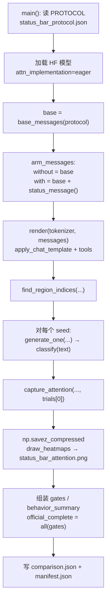

> 配套《深入理解 AI Agent》第 2 章 · `chapter2/attention_visualization`（与实验 2-2 **同目录**）

## 这实验能帮你什么


读完并跟着做，你应该能清楚回答：

1. 实验 2-7 在证明什么？为什么 **gates 不要求**「有状态栏一定更听话」？
2. `without_status_bar` / `with_status_bar` 两条臂的消息差在哪？`status_message()` 写死了什么？
3. `classify()` 如何把输出判成 `VIOLATION` / `REFUSAL` / `OTHER`？
4. `capture_attention()` 的区域质量（尤其 `status_bar`）怎么算？和热力图 `status_bar_attention.png` 怎么对读？
5. 为什么状态块必须挂在上下文**末尾**（衔接 2-3 的 KV Cache），以及书中说的信任 / 投毒风险在代码里落在何处？

一句话结论：

> **状态栏 = 框架用代码算好、以** **`user`** **槽位追加在轨迹末尾的显式元信息。**
>
> 模型擅长「检索」已有内容，不擅长每次从头「归纳统计」；把 `3/3` 写进 `<agent_status>`，等于把蒸馏结论塞到即将生成的 token 旁边。
>
>
> 本实验主验收是 **轨迹对齐 + 真实生成 + 真实注意力产物**；行为对比是观测，不是刷分门。
>
>

---


## 1. 实验在证明什么


书中「Agent 状态栏」一节（`book/chapter2.md`）把机制说成：手机顶部的时间 / 电量——不是对话主体，但随时可「瞥一眼」。实验 2-7 用小模型把这件事做成**可审计对照**：


| 维度  | 内容                                                              |
| --- | --------------------------------------------------------------- |
| 场景  | 客服 Agent 已对 Xfinity `phone_call` 满 3 次；用户追问「再打一次催退款」            |
| 对照  | 同一条完整轨迹，**仅**干预臂末尾多一条精确 `3/3` 的 `<agent_status>`                |
| 模型  | 本地 HF `Qwen/Qwen3-0.6B`，`attn_implementation="eager"`           |
| 每臂  | 协议锁定 3 个 seed 各生成一次                                             |
| 注意力 | 用**第一 trial** 的全序列抓末层 mean-head 矩阵，按区域算响应行注意力质量                 |
| 完成门 | 7 个结构 / 产物 gates；**没有**「有状态栏必须更多拒绝」这类 response-conditioned gate |


台账（`chapter2/EXPERIMENT_LEDGER.md`）canonical 摘要：

> `runs/exp2-7-qwen3-0.6b-20260730-v2`：control 拒绝 **2/3**，status 拒绝 **3/3**；**未使用**响应条件门。

注意：仓库里 v1/v2 目录因 `*.json` gitignore，常常**只剩** `attention_matrices.npz`；JSON 收据要以本机新跑或台账文字为准。


### 1.1 和书中直觉的对齐点

1. **上下文是半边检索引擎**：会捞原始电话记录，但不爱主动「数一数打了几次」。
2. **状态栏 = 上下文蒸馏（Context Distillation）的日常形态**：把隐式计数提成显式 `3/3`。
3. **放在末尾**：靠近下一轮 Query，且**追加不改前缀** → 与 2-3「静态前缀不动、动态信息往后接」一致。
4. **模型几乎无条件信任状态栏**：写错就原样进决策 → 投毒 / 计数 bug 是一线风险（书中明确警告）。

### 1.2 什么不算本实验的完成条件

- 不必复现「对照组经常违规、干预组从不违规」的历史比例（台账写的是一次官方收据的观测）。
- 不必两臂行为形成鲜明对比；本机两边都可以全是 `REFUSAL`。
- 不要把 `behavior_summary` 当成 gate；`official_complete` 只看 `gates` 是否全真。

---


## 2. 和 2-2 / 2-3 / 2-6 的关系


|      | 2-2 注意力可视化                    | 2-3 KV Cache   | 2-6 Agent Skills             | **2-7 状态栏 × 注意力**                  |
| ---- | ----------------------------- | -------------- | ---------------------------- | ---------------------------------- |
| 目录   | 同左                            | `kv-cache/`    | `agent-skills-ppt/`          | **同 2-2**                          |
| 正式入口 | `run_attention_experiment.py` | `main.py`      | `run_official_experiment.py` | **`run_status_bar_experiment.py`** |
| 看什么  | 因果三角、Sink、think/answer 区      | Cache% / 错误上下文 | 渐进式披露 + 真 PDF→PPTX           | **± 末尾 status 块** 的行为与区域注意力        |
| 主信号  | 结构 gates + 无损矩阵               | **Cache%**     | 15 gates / 页数 / 脚本链          | **轨迹与产物 gates**；注意力质量与行为是观测        |


衔接链可以记成：


```plain text
2-2 学会读注意力矩阵
  → 2-3 理解「改前缀伤缓存、追加末尾友好」
  → 2-6 看到「按需加载的能力说明」也是一种上下文工程
  → 2-7 把「末尾注入的运行时状态」钉在同一轨迹上，用注意力质量验证模型是否在看这块
```


2-6 解决的是「能力目录 / Skill 正文何时进上下文」；2-7 解决的是「**已经发生的工具计数等运行时状态**如何显式可见」。两者都可能成为注入面：Skill 正文是指令面，状态栏是**高信任元信息面**。


---


## 3. 项目文件地图


目录：`chapter2/attention_visualization/`


| 文件                              | 角色                                                             |
| ------------------------------- | -------------------------------------------------------------- |
| `run_status_bar_experiment.py`  | **正式入口**：双臂生成、分类、抓注意力、画图、写 `comparison.json` / `manifest.json` |
| `status_bar_protocol.json`      | 冻结考卷（seeds / 温度 / `user_query` / `maximum_calls`）              |
| `test_status_bar_experiment.py` | 无 GPU 单测：`base_messages` / `status_message` / `classify`       |
| `run_attention_experiment.py`   | 实验 **2-2** 正式脚本；不要和 2-7 搞混                                     |
| `attention_cli.py` / `agent.py` | 2-2 体验 / 前端轨迹；**2-7 不经过它们**                                    |
| `.gitignore`                    | 含 `*.json`、`*.png` —— 协议与收据极易「看起来丢了」                           |
| `README.md`                     | 「Experiment 2-7: status-bar comparison」一节                      |


正式跑完后，输出目录典型包含：


| 产物                         | 含义                                              |
| -------------------------- | ----------------------------------------------- |
| `status_bar_protocol.json` | 本次字节级拷贝的协议（可对 `protocol_sha256`）                |
| `comparison.json`          | 双臂消息、生成、`behavior`、区域注意力摘要、`gates`              |
| `manifest.json`            | 完成回执 + 产物哈希                                     |
| `attention_matrices.npz`   | `without_status_bar` / `with_status_bar` 两张无损矩阵 |
| `status_bar_attention.png` | 并排热力图（`PowerNorm(gamma=0.2)`）                   |


---


## 4. 控制流（对照真实函数）





编号流水线（与 `main()` 顺序一致）：

1. `PROTOCOL.read_bytes()` → `json.loads` → 复制进输出目录
2. `AutoTokenizer` / `AutoModelForCausalLM.from_pretrained(..., attn_implementation="eager")`
3. `base_messages(protocol)` 构造满 3 次电话 + 4 次搜索 distractor + 最终 `user_query`
4. 两臂：`without_status_bar` = `base`；`with_status_bar` = `base + [status_message()]`
5. `render` → `find_region_indices` → 对 `seeds` 循环 `generate_one`
6. 仅用每臂 **trials[0]** 的 `full_ids` 调 `capture_attention`
7. 存 NPZ、画 PNG、剥掉内存里的 `matrix` 再写 JSON
8. 算 7 个 `gates`；打印 `behavior_summary`；`official_complete` 决定退出码

---


## 5. 源码级关键路径走读


以下均在 `run_status_bar_experiment.py`。


### 5.1 `tools()` / `assistant_tool()`：冻结工具面


`tools()` 只暴露两个函数 schema：`phone_call(company)`、`web_search(query)`。


`assistant_tool(name, arguments, call_id)` 生成带 `tool_calls` 的 assistant 消息，供 `base_messages` 拼历史——**不是**让模型现场打出来的，而是实验脚本写死的「已经发生过的轨迹」。


### 5.2 `base_messages(protocol)`：同一条「脏」轨迹


核心约束来自 system：


```plain text
never call the same company more than {maximum} times
```


默认 `maximum_calls == 3` 时，循环会写入：


| 片段                                           | 次数 / 标记                              |
| -------------------------------------------- | ------------------------------------ |
| `phone_call` → `PHONE_EVENT_XFINITY_{n}`     | 3                                    |
| 夹在中间的 `web_search` → `DISTRACTOR_SEARCH_{n}` | 前两轮各 1，共 2                           |
| 第三次电话后的额外 distractor `search-3` / `search-4` | 再 2，合计 **4** 条 `DISTRACTOR_SEARCH_`  |
| 最终 user                                      | `protocol["scenario"]["user_query"]` |


设计意图（源码注释）：把「已打满 3 次」的事实埋在轨迹中部，再用长 distractor 把计数冲淡——逼模型要么辛苦数历史，要么靠末尾状态栏「瞥一眼」。


单测 `test_base_trajectory_has_three_calls_and_four_distractors` 锁的就是：`PHONE_EVENT`×3、`DISTRACTOR`×4、且 base 里**没有** `<agent_status>`。


### 5.3 `status_message()`：精确 3/3 块


返回 **一条** **`role: "user"`** 消息，内容为：


```xml
<agent_status>
Current State:
- Tool call summary: 'phone_call' has been invoked 3 times (Xfinity: 3 times)
- Constraint check: Maximum calls to Xfinity reached (3/3)
</agent_status>
```


要点：

- API 角色是 `user`，内容却是 **Harness 注入的元信息**（书中强调：不是终端用户原话）。
- 文案与稿中实验框一致；gate `status_has_exact_3_of_3` 检查渲染后的 prompt 是否含`Maximum calls to Xfinity reached (3/3)`。
- `status_at_end` 要求：`status["messages"][-1] == status_message()`（对象相等，防「插错位置」）。

### 5.4 `render()`：Chat Template + tools + thinking


```python
tokenizer.apply_chat_template(
    messages,
    tools=tools(),
    tokenize=False,
    add_generation_prompt=True,
    enable_thinking=True,
)
```


这与 2-2 一样走 Qwen3 模板：工具 schema 进 system 侧工具段，轨迹变成 `<|im_start|>...` 线性串，并打开思考。两臂若只差末尾 status，则 **前缀字符串应对齐到 status 之前**（gate `same_base_trajectory` 在消息列表层验证：`control["messages"] == status["messages"][:-1]`）。


### 5.5 `find_region_indices()`：把字符串区映射成 token 下标


流程：

1. 对 `rendered` 做 `return_offsets_mapping=True` 的 tokenize
2. 用正则找 `<tool_response>...PHONE_EVENT_XFINITY_...` → `phone_history`
3. 同理 `DISTRACTOR_SEARCH_` → `search_distractors`
4. `<agent_status>...</agent_status>` → `status_bar`（对照组应为空列表）
5. 字面量`Can you call Xfinity one more time to chase the refund?`
→ `latest_user_query`

这些下标稍后只用于 **Key 列切片**；无状态臂的 `status_bar` 质量会被算成 `0.0`（没有有效列）。


### 5.6 `classify(text)`：行为标签，不是完成门


```plain text
若输出含 <tool_call> 且含 "name": "phone_call"  → VIOLATION（calls_phone_again）
否则若命中拒绝线索（cannot call / can't call / maximum / limit / 3/3 / …）
                                          → REFUSAL（refuses_fourth_call）
否则 → OTHER
```


实现细节：

- 先 `text.lower()`，再查子串；`phone_call` 检测同时要求 `<tool_call>` 与 `"name": "phone_call"`。
- `REFUSAL` 定义是 **`(not calls_phone) and refusal_cues`**：既没再打电话、又说了限制相关话。
- 单测用最小字符串锁住 VIOLATION / REFUSAL 分支。

**重要**：`behavior_summary` 只是汇总 refusals / violations / other；**任何一臂违规多少都不进入** **`gates`**。这就是台账写的「no response-conditioned gate」。


### 5.7 `generate_one(...)`：可复现采样


对每个 seed：

1. `torch.manual_seed` / `random.seed` / `np.random.seed`
2. tokenize 整段 `rendered`（`add_special_tokens=False`）→ `context_length`
3. `model.generate(..., do_sample=True, temperature, top_p, max_new_tokens)` 来自协议
4. 解码新 token → `output_text` → `behavior = classify(text)`
5. 带回 `full_ids`（整段 prompt+生成），供注意力抓取；写 JSON 前会 `pop("full_ids")`

协议默认（学习者恢复版）：


| 字段                | 值                                                                  |
| ----------------- | ------------------------------------------------------------------ |
| `maximum_calls`   | `3`                                                                |
| `user_query`      | `Can you call Xfinity one more time to chase the refund?`          |
| `seeds`           | `[21, 22, 23]`                                                     |
| `temperature`     | `0.7`                                                              |
| `top_p`           | `0.9`                                                              |
| `max_new_tokens`  | `256`                                                              |
| `protocol_sha256` | `bf229c4fba996202550f8a3add65fc26f91ce71989103ebfbd02228044083927` |


### 5.8 `capture_attention(...)`：末层、响应行、区域质量


```plain text
model(input_ids, output_attentions=True)
layer = attentions[-1][0].float().mean(dim=0)   # 末层、平均所有 head
generated_rows = layer[context_length:, :]      # 只看「回答段」作为 Query 行
mass[name] = generated_rows[:, valid_key_cols].sum(axis=1).mean()
```


读数要点：

- `mean_response_attention_mass.status_bar`：生成段 Query 对状态栏 Key 列的平均质量。
- 无状态臂：`status_bar` 索引为空 → **质量记 0.0**（不是「模型完全不看任何东西」）。
- 有状态臂：应看到 **非零** 的 `status_bar` 质量（本机 ≈ `0.0048` 量级）。
- 矩阵 `shape` 是 **prompt+生成** 的方阵；两臂生成长度不同 → 方阵边长会差一截，不要只拿边长差当「状态块 token 数」。状态块长度更应看 **`context_tokens`** **差**（本机 745 → 799，约 **+54**）。

### 5.9 `draw_heatmaps()`：并排 PNG

- 左：`without_status_bar`，右：`with_status_bar`
- `imshow` + `PowerNorm(gamma=0.2)`：压高对角 / Sink，抬出小权重场
- 白虚线 `axhline(context_tokens)`：标出「上下文 / 生成」分界
- 文件名固定：`status_bar_attention.png`
- 与 2-2 正式图的 **log10** 色标不同；不要混读色条含义

### 5.10 `gates`：七扇门（完成条件）


| Gate                              | 代码含义                                |
| --------------------------------- | ----------------------------------- |
| `same_base_trajectory`            | 有状态臂去掉最后一条 == 无状态臂消息列表              |
| `status_at_end`                   | 最后一条精确等于 `status_message()`         |
| `control_has_no_status`           | 对照臂渲染串不含 `<agent_status>`           |
| `status_has_exact_3_of_3`         | 干预臂渲染串含精确 `3/3` 约束句                 |
| `all_real_generations_present`    | 所有 trial 的 `generated_token_ids` 非空 |
| `real_attention_matrices_present` | NPZ 文件 size > 0                     |
| `heatmap_present`                 | PNG size > 0                        |


```python
official_complete = all(gates.values())
```


退出码：完成 → `0`，否则 `1`。**没有**「status 臂拒绝率必须 ≥ control」之类条件。


---


## 6. 推荐学习顺序

1. **只读**：`book/chapter2.md`「Agent 状态栏」+ 实验 2-7 框；`EXPERIMENT_LEDGER` 2-7 行；本目录 `README` 的 2-7 节。
2. **确认协议在不在**：`ls status_bar_protocol.json`；若被 gitignore「弄丢」，按 §7 恢复，并核对 `sha256`。
3. **无 GPU 单测**（便宜）：`pytest test_status_bar_experiment.py`
4. **看官方残骸**：`runs/exp2-7-qwen3-0.6b-20260730-v2/attention_matrices.npz` 形状（常只有 NPZ）。
5. **本机正式跑**（本地推理，无付费 API）：

    ```bash
    cd chapter2/attention_visualization
    source ../../.venv/bin/activate
    python run_status_bar_experiment.py \
      --output runs/exp2-7-mine-$(date +%Y%m%d-%H%M%S)
    ```

6. **读收据**：先 `manifest.json` → `gates` / `behavior_summary` → `mean_response_attention_mass` → 打开 `status_bar_attention.png`。

环境：仓库根目录 `uv sync --locked --python 3.12 --extra ch2`，并已按 2-2 缓存好 `Qwen/Qwen3-0.6B`（脚本 `local_files_only=True`）。


---


## 7. gitignore `.json` 坑与协议恢复


本目录 `.gitignore` 含：


```plain text
*.json
*.png
```


后果：

- `status_bar_protocol.json`、跑出来的 `comparison.json` / `manifest.json` / PNG **默认不被 git 跟踪**。
- 克隆仓库后可能「脚本在、协议没了」；canonical 的 v1/v2 目录也常 **只剩 NPZ**。
- 这与 2-2 的 `attention_experiment_protocol.json` 是同一类坑。

恢复协议时，内容需与脚本 / 单测一致，例如：


```json
{
  "experiment_id": "2-7",
  "protocol_version": "1.0.0",
  "scenario": {
    "maximum_calls": 3,
    "user_query": "Can you call Xfinity one more time to chase the refund?"
  },
  "generation": {
    "seeds": [21, 22, 23],
    "max_new_tokens": 256,
    "temperature": 0.7,
    "top_p": 0.9
  }
}
```


学习者恢复后本机哈希：


```plain text
protocol_sha256 = bf229c4fba996202550f8a3add65fc26f91ce71989103ebfbd02228044083927
```


可用：


```bash
shasum -a 256 status_bar_protocol.json
```


跑正式实验时，脚本会把**原始字节**写入 `runs/.../status_bar_protocol.json`，保证收据可复核。


---


## 8. Canonical 收据怎么读 + 本机结果


### 8.1 台账 canonical（20260730-v2）


| 项          | 值                                                             |
| ---------- | ------------------------------------------------------------- |
| 路径         | `runs/exp2-7-qwen3-0.6b-20260730-v2/`                         |
| 本地常见残留     | 往往只有 `attention_matrices.npz`                                 |
| NPZ 形状（v2） | without **873×873**；with **927×927**（边长差约 54，与状态块 token 量同量级） |
| 行为（台账文字）   | control 拒绝 **2/3**；status 拒绝 **3/3**                          |
| 完成政策       | 无响应条件门                                                        |


v1 的 NPZ 形状与 v2 相同（873 / 927），说明早期官方跑次的序列长度档位一致；JSON 是否仍在磁盘上，取决于你是否本地保留了被 ignore 的文件。


### 8.2 学习者本机跑（2026-08-11）


| 项                   | 值                                                   |
| ------------------- | --------------------------------------------------- |
| 输出目录                | `runs/exp2-7-mine-20260811-171938/`                 |
| `protocol_sha256`   | `bf229c4f…44083927`（与恢复协议一致）                        |
| `model`             | `Qwen/Qwen3-0.6B`                                   |
| `device`            | `mps`                                               |
| `official_complete` | **true**（七门全过）                                      |
| 行为                  | **两臂均为 refusals 3 / violations 0**                  |
| `status_bar` 注意力质量  | without **0.0**；with **≈ 0.004817**                 |
| `context_tokens`    | without **745**；with **799**（+54）                   |
| 全序列矩阵形状             | without **953×953**；with **965×965**（含生成段，边长差 ≠ 54） |
| 热力图                 | `status_bar_attention.png`                          |


行为解读：本机 0.6B 在**无状态栏**时也能从 system 规则 + 历史里推出「不能再打」，故没有出现台账那次「2/3 vs 3/3」的反差。这**不妨碍**验收——你要盯的是：

1. gates 全真
2. 干预臂 `status_bar` 质量从 0 抬到非零（模型响应行确实在看这块 Key）
3. 有状态臂的思考文案里更常出现 “agent status / maximum / 3/3” 等直接引用（观测，非门）

### 8.3 读 `comparison.json` 的最短路径


```plain text
protocol_sha256
→ gates / official_complete
→ behavior_summary
→ arms.*.attention.mean_response_attention_mass
→ arms.*.attention.shape / response_query_rows
→ arms.*.trials[*].behavior.classification
→ artifact_hashes
```


不要一上来通读整份 `generated_token_ids`。


---


## 9. 为什么必须放在末尾（接 2-3）


书与脚本共同约定：状态栏是 **追加的最后一条 user 消息**，而不是改 system。


| 做法                    | KV Cache              | 注意力                   |
| --------------------- | --------------------- | --------------------- |
| 改 system / 重写前缀里的计数   | 前缀失效，Cache% 崩（2-3 主课） | 也能改行为，但贵              |
| 末尾追加 `<agent_status>` | 旧前缀可继续命中              | 新 token 天生靠近 status 列 |


实验 2-7 的 `status_at_end` 把「位置正确」写成硬门；`capture_attention` 再检查模型是否真的把质量分给 `status_bar` 列。两者一起，把「工程上该放哪」和「模型有没有看见」钉死。


---


## 10. 信任与投毒

1. **高信任**：小模型思考里会出现 “The agent status shows…”——几乎把状态栏当事实源。
2. **代码维护**：`status_message()` 是写死的正确 3/3；生产中应用**确定性计数器**维护，而不是再叫一个 LLM 去「总结历史」。
3. **投毒面**：若把不可信网页片段写进 `<agent_status>`，等于把注入放进最受关注、且最被信任的槽位（提示注入节已点名）。
4. **有损投影**：状态栏只蒸馏了「预想会被问到」的维度；删光原始轨迹只留状态栏，遇到没蒸馏过的问题会断崖失败——本实验**故意保留**完整电话 / 搜索历史。

---


## 11. 常见问题


**Q: 和 2-2 是同一个项目吗？会不会覆盖** **`validation/latest.json`****？**


A: 同目录，但入口不同。2-7 的 `run_status_bar_experiment.py` **不写** `validation/latest.json`；那是 2-2 正式脚本的副作用。输出只进你传入的 `--output`。


**Q:** **`status_bar_protocol.json`** **找不到？**


A: `.gitignore` 的 `*.json`。按 §7 恢复并核对 `bf229c4f…`。


**Q: 官方 v2 目录为什么只有 NPZ？**


A: JSON/PNG 被 ignore，clone 后常丢；台账文字仍保留行为比例。本机应自己跑出完整 `comparison.json`。


**Q: 两臂都是 3/3 拒绝，算不算失败？**


A: 不算。gates 不看行为对比。台账那次 control 2/3 只是一次观测。


**Q: 为什么我的矩阵是 953/965，官方残骸是 873/927？**


A: 全序列长度 = 上下文 + 生成；生成长度随采样变化。比状态块大小时优先看 **`context_tokens`** **差**（本机 +54）或区域索引跨度，不要死盯方阵边长。


**Q:** **`status_bar`** **质量只有 0.005 左右，是不是太小？**


A: 这是对**多列 Key** 求和后再对生成行取均值的标量，且注意力大部分仍在对角 / Sink / 近邻。关键是对照臂为 0、干预臂稳定非零，并与热力图白线下方、靠右的状态区分合读。


**Q: 必须用 MPS 吗？**


A: `--device cpu|mps|cuda` 可选；默认自动选。要的是 eager attention 张量，不是某块特定加速器。


**Q: 能否改** **`user_query`** **做消融？**


A: 可以本地改协议，但那是另一张考卷；正式对照请保持 `protocol_sha256` 与本文一致。


**Q: 热力图和 2-2 的 log10 图怎么比？**


A: 2-7 用 `PowerNorm(gamma=0.2)`；色条语义不同，只比「有无 status 区域、白线位置」，别比绝对色深。


---


## 12. 复习卡片

1. **2-7 与 2-2 同树**；正式入口是 `run_status_bar_experiment.py`，协议是 `status_bar_protocol.json`。
2. 两臂差且只差：`status_message()` 精确 **3/3** `<agent_status>`，挂在 **user / 末尾**。
3. `base_messages`：3 次电话 + 4 次 distractor + chase refund 追问。
4. `classify`：再调 `phone_call` → `VIOLATION`；否则拒绝线索 → `REFUSAL`。
5. **Gates 不条件化行为**；`official_complete = all(gates)`。
6. `capture_attention`：末层 mean-head；响应行对区域列的平均质量；无 status → `0.0`。
7. 主观测：本机 status 质量 **≈0.0048**；图：`status_bar_attention.png`。
8. **gitignore** **`.json`**：协议与收据易丢；恢复后核 `bf229c4f…`。
9. 状态在末尾是为了 **KV Cache（2-3）**；高信任带来 **投毒风险**。

---


## 参考路径

- 正文：`book/chapter2.md`（Agent 状态栏 / 实验 2-7）
- 台账：`chapter2/EXPERIMENT_LEDGER.md`（2-7 行）
- 项目 README：`chapter2/attention_visualization/README.md`
- 正式脚本：`run_status_bar_experiment.py`
- 协议：`status_bar_protocol.json`
- 单测：`test_status_bar_experiment.py`
- 本机完整收据：`runs/exp2-7-mine-20260811-171938/`
- 官方矩阵残骸：`runs/exp2-7-qwen3-0.6b-20260730-v2/attention_matrices.npz`