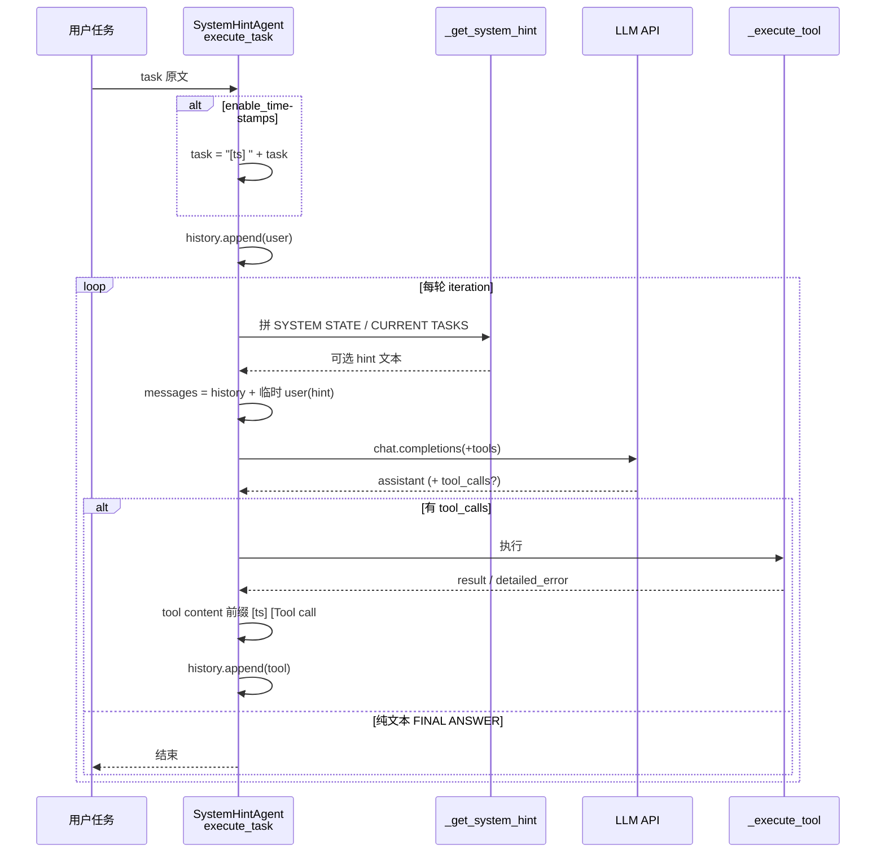

> 配套《深入理解 AI Agent》第 2 章 · `chapter2/system-hint`

---


## 这实验能帮你什么


读完并跟着做，你应该能清楚回答：

1. 「System Hint」和「Agent 状态栏」是不是一回事？五种技术各自**挂在哪一类消息、哪个时机**？
2. 教学 Agent（`main.py` / `agent.py`）与正式 campaign（`run_experiment_2_8.py`）在包装上差在哪？
3. 为什么短任务轨迹里往往**看不到 TODO / 详细错误**，但配置里五个开关都是 `true`？
4. `comparison.json` 里哪些 contrast 的 `hypothesis_supported` 为真，哪些只是「跑完协议」？历史 15-vs-21、60%-vs-95% 为何**不能**当本 suite 完成门？
5. 最小 live 的轨迹该搜哪些字段，而不是通读整份 JSON？

一句话结论：

> **状态栏 = 框架用代码维护的运行时元信息，以人类可读形式注入上下文（常挂在末尾** **`user`** **槽或 tool 结果前缀），不是再写一长段静态 system prompt。**
>
> 五种技术分散在不同消息角色上；开关「开着」≠「本轮一定可见」——还要任务足够复杂、或工具真的失败。
>
>
> 正式验收看 **65 次预注册 run + 干预可见 / 对照干净 + 收据完整**；单项「有状态就一定涨分」**不是**统一完成门。
>
>

---


## 1. 实验在证明什么


书中「Agent 状态栏」一节（`book/chapter2.md`）把机制比作手机顶部的时间 / 电量：不是对话主体，但随时可「瞥一眼」。实验 2-7 用注意力矩阵证明**末尾块会被看**；实验 2-8 则实现并对照**几种好用的注入技术**：


| 技术   | 书中一句话意图                                           |
| ---- | ------------------------------------------------- |
| 时间戳  | 给 user / tool 结果加 `[时间]` 前缀（不改 system，护 KV Cache） |
| 工具计数 | `Tool call #N for 'name'`，诱导「第三次换策略」              |
| TODO | 外部记忆 + 复述，降低遗漏子任务                                 |
| 详细错误 | 类型 / 参数 / 建议，从盲目重试变分析性修复                          |
| 系统状态 | cwd / OS / Shell / Python，支撑 `cd` 与包管理器选择         |


正式「考卷」写在 `experiment_protocol.json`（目录常 gitignore `*.json`，本机需有协议副本）。Canonical 收据：


`runs/exp2-8-kimi-k3-20260730-v1/comparison.json`

- `unique_runs` / `expected_unique_runs` = **65**
- `campaign_complete: true`
- Provider 钉死 Moonshot `kimi-k3`

### 1.1 完成门 vs 历史数字


`historical_claim_policy` 写明：书中常见的 **15 vs 21 迭代**、**错误恢复 60%→95%**、六模型 time-sense 涨点，**不能**直接标成「本五对 suite 复现了那组数字」。本 suite 只报告自己的 pass / 组件分 / turns。


`acceptance` 关心的是工程可审计性，例如：

- 预注册 run 齐全、模型名精确、tool 协议合法、provider 收据合法
- 臂顺序记录正确
- **干预可见且对照干净**（enabled 臂能看到注入痕迹；disabled 臂不能脏污染）
- `detailed_error_feature_exercised`
- 凭证扫描通过

### 1.2 本机最小 live 证明什么、不证明什么


```bash
python main.py --mode single --provider kimi \
  --model "nvidia/nemotron-3-ultra-550b-a55b:free" \
  --task "…" --output runs/exp2-8-mine-single.json
```


证明：OpenRouter key 可经 `provider=kimi` 自动回退；时间戳 / 工具计数 / `SYSTEM STATE` 会进真实轨迹；任务 3 轮写读闭环。


**不证明**：与 disabled 臂的客观涨分；不替代 65-run campaign。


---


## 2. 和 2-7 / 2-3 / 下一实验的关系


|     | 2-3 KV Cache | 2-7 状态栏 × 注意力              | **2-8 五种技术**       | 2-9 压缩                 |
| --- | ------------ | -------------------------- | ------------------ | ---------------------- |
| 目录  | `kv-cache/`  | `attention_visualization/` | **`system-hint/`** | `context-compression/` |
| 问什么 | 改前缀伤缓存吗      | 末尾块有没有被看                   | **怎么注入、对照有没有用**    | 上下文太长怎么减               |
| 主信号 | Cache%       | 结构 gates + 注意力质量           | **协议完整性 + 组件评分**   | 压缩策略效果                 |


衔接链：


```plain text
2-3 动态信息追加末尾、静态前缀不动
  → 2-7 用注意力验证「末尾 <agent_status> 会被看」
  → 2-8 把时间戳 / 计数 / TODO / 错误 / 系统状态做成可开关的 Harness
  → 2-9 状态栏是「加」显式结论；压缩是「换」臃肿原文为结论（同一枚硬币两面）
```


---


## 3. 文件地图


| 路径                                 | 作用                                                                       |
| ---------------------------------- | ------------------------------------------------------------------------ |
| `agent.py`                         | 教学用 `SystemHintAgent`：五开关、注入、工具、轨迹落盘                                     |
| `main.py`                          | CLI：`preview` / `single` / `demo` / `sample`；`preview_status_bar()` 离线对照 |
| `config.py`                        | 环境变量与默认开关；`OPENROUTER_API_KEY` 回退                                        |
| `run_experiment_2_8.py`            | **正式验收**：沙箱、对照臂、组件分、`comparison.json`                                    |
| `experiment_protocol.json`         | 冻结 cases / conditions / claim_policy（常被 `*.json` ignore）                 |
| `env.example`                      | `KIMI_API_KEY` 优先；注释说明 OpenRouter                                        |
| `view_trajectory.py`               | 读轨迹                                                                      |
| `test_hint_behavior.py` 等          | 行为 / 畸形 tool JSON 测试                                                     |
| `runs/exp2-8-kimi-k3-20260730-v1/` | Canonical：65 cases + `comparison.json`                                   |
| `runs/exp2-8-mine-single.json`     | 学习者最小 live 轨迹                                                            |


---


## 4. 架构：一轮里状态栏插在何处





关键实现细节（与书中图 2-15 一致）：

1. **状态摘要常借** **`role=user`** **追加在末尾**，而不是改开头 system —— 避免打碎 Prompt / KV Cache 前缀。
2. 教学 Agent 里，这条末尾 user **默认不写回** `conversation_history`，只进当轮 `messages_to_send`；所以读证据要看 **`last_llm_messages`**。
3. 时间戳与工具计数则是**写进**持久 `role=tool` / 首条 user 内容的前缀。

正式 runner 包装不同：多段状态进 `<agent_status>…</agent_status>`，并有 `TIME GUIDANCE:` / `TOOL COUNTS:` 等标签（见 `status_message()`）。


---


## 5. 源码走读：五种技术落点


配置入口（`SystemHintConfig`）：


```python
# agent.py — dataclass 字段（默认全开）
enable_timestamps: bool = True
enable_tool_counter: bool = True
enable_todo_list: bool = True
enable_detailed_errors: bool = True
enable_system_state: bool = True
```


### 5.1 时间戳（timestamps）


**时机 1 — 用户任务进入循环前**


```python
# execute_task
if self.config.enable_timestamps:
    timestamp_prefix = f"[{self._get_timestamp()}] "
    task = timestamp_prefix + task
self.conversation_history.append({"role": "user", "content": task})
```


**时机 2 — 工具结果回写**


```python
if self.config.enable_timestamps:
    metadata_parts.append(f"[{self._get_timestamp()}]")
# …再拼 tool_counter，然后：
tool_content = " ".join(metadata_parts) + "\n" + tool_content
```


**本机轨迹**：`[2026-08-10 14:54:58] 在当前目录创建…`；tool 行 `[2026-08-10 14:55:01] …`。


正式 campaign 还有 **raw vs guided**：guided 额外注入 `TIME GUIDANCE: Treat explicit timestamps as decision evidence…`（`status_message`），假设「带引导的时间戳」更能转成行动。Canonical 上 `timestamps_guided.hypothesis_supported: true`，`timestamps_raw` 为 `null`（nondirectional caveat）。


### 5.2 工具计数（tool_counter）


```python
if self.config.enable_tool_counter:
    self.tool_call_counts[function_name] = (
        self.tool_call_counts.get(function_name, 0) + 1
    )
    call_number = self.tool_call_counts[function_name]
# …
if self.config.enable_tool_counter:
    metadata_parts.append(
        f"[Tool call #{call_number} for '{function_name}']"
    )
```


计数是**按工具名分桶**的：`write_file` 的 #1 与 `read_file` 的 #1 互不覆盖。


正式侧除了 tool 文本后缀，还会在 `<agent_status>` 写 `TOOL COUNTS: probe_resource=3, …`，并在评分里约束「primary 探测次数 ≤ 3 且用了 fallback」（`component_scores`）。


Canonical：`tool_counter` 对照臂双方都 5/5 通过，`hypothesis_supported: false` —— **干预可见 ≠ 本 suite 上分差显著**。


### 5.3 系统状态（system_state）


```python
def _get_system_hint(self) -> Optional[str]:
    if not any([self.config.enable_system_state, self.config.enable_todo_list]):
        return None
    hint_parts = []
    if self.config.enable_system_state:
        hint_parts.append("=== SYSTEM STATE ===")
        hint_parts.append(self._get_system_state())
    if self.config.enable_todo_list and self.todo_list:
        hint_parts.append("=== CURRENT TASKS ===")
        hint_parts.append(self._format_todo_list())
    ...
```


在 `execute_task` 循环内：


```python
messages_to_send = self.conversation_history.copy()
system_hint = self._get_system_hint()
if system_hint:
    messages_to_send.append({"role": "user", "content": system_hint})
self.last_llm_messages = messages_to_send
```


**本机轨迹**：不要只在 `conversation_history` 里找；打开 `last_llm_messages` 最后一条 user，可见：


```plain text
=== SYSTEM STATE ===
Current Time: …
Current Directory: …/chapter2/system-hint
System: Darwin …
Shell Environment: …
Python Version: 3.12.12
```


正式 suite：用 `inspect_system` / `install_package` 等工具验证模型是否按 OS 选对包管理器；`<agent_status>` 内写 `SYSTEM STATE: os=…, manager=…`。


### 5.4 TODO 列表（todo_list）


两层，常被混为一谈：


| 层    | 位置                                           | 何时出现                              |
| ---- | -------------------------------------------- | --------------------------------- |
| 规则层  | system prompt 里 TODO Management Rules        | `enable_todo_list` 时初始化就写进 system |
| 状态栏层 | `_get_system_hint` → `=== CURRENT TASKS ===` | **且** `self.todo_list` 非空         |


工具：`rewrite_todo_list` / `update_todo_status`。短任务模型可在 reasoning 里写「不需要 TODO」——本机 `exp2-8-mine-single.json` 即 `"todo_list": []`，**开关 true 但状态栏无 TODO 块**。


离线 `python main.py --mode preview` 会**强制**造一条有 in_progress 的清单，专门让你看见对照。


正式评分看 artifacts 文件内容 + `submit_result`，不是看模型自述。Canonical 上该臂 `hypothesis_supported: false`（enabled 甚至更差）——再次提醒：**历史 15-vs-21 不在本 suite 强制复现**。


### 5.5 详细错误（detailed_errors）


```python
except Exception as e:
    error_detail = self._get_detailed_error(e, tool_name, arguments)
    if self.config.enable_detailed_errors:
        return {"error": error_detail}, error_detail, duration_ms
    else:
        return {"error": str(e)}, str(e), duration_ms
```


`_get_detailed_error` 拼：异常类型名、arguments JSON、（verbose）traceback、`_get_error_suggestions`。


本机最小任务 write/read 全成功 → 轨迹无详细错误。正式 `detailed_errors` suite 故意让 `read_document` 先失败请求路径，enabled 臂返回带 `error_type` / `available_documents` 的 JSON（`execute_tool`），再读重命名后的真实文件。


Canonical：`detailed_error_feature_exercised: true`，但该 contrast 的 `hypothesis_supported: false`（本五对上 enabled 未必更高分）。


### 5.6 正式 runner：`<agent_status>` 拼装


```python
def status_message(features, state, counters, todos) -> str | None:
    sections = []
    if "timestamp_guidance" in features:
        sections.append("TIME GUIDANCE: …")
    if "tool_counter" in features:
        sections.append("TOOL COUNTS: " + …)
    if "todo_list" in features:
        sections.append("TODO LIST: " + …)
    if "system_state" in features:
        sections.append("SYSTEM STATE: " + …)
    if not sections:
        return None
    return "<agent_status>\n" + "\n".join(sections) + "\n</agent_status>"
```


`timestamp_wrap` 只管 `[ts] content`。`disabled` 臂的验收要求请求/事件里**不能**出现 `<agent_status>`、`TOOL COUNTS:`、`FileNotFoundError` 结构化残留、`rewrite_todo_list` 等污染痕迹。


### 5.7 Provider 注意点（踩过的坑）


| 现象                                               | 原因                                                                                       |
| ------------------------------------------------ | ---------------------------------------------------------------------------------------- |
| `--provider openrouter` → `Unsupported provider` | `SystemHintAgent` 只认 `kimi` / `moonshot`；OpenRouter 靠 **key 形态** `is_openrouter_key` 自动切 |
| `main.py` 可用 `OPENROUTER_API_KEY`                | `api_key = KIMI or MOONSHOT or OPENROUTER`                                               |
| `run_experiment_2_8.py` 拒 OpenRouter             | 硬性 `MOONSHOT_API_KEY or KIMI_API_KEY`，钉协议 base_url                                       |


---


## 6. 推荐学习顺序

1. **只读**：`book/chapter2.md`「Agent 状态栏」+ 实验 2-8 框；`README.md` Canonical 段。
2. **零密钥**：`python main.py --mode preview` —— 五案例 without / with。
3. **离线收据**：读 `runs/exp2-8-kimi-k3-20260730-v1/comparison.json` 的 `contrasts` + `acceptance` + `historical_claim_policy`。
4. **最小 live**（教学路径）：`main.py --mode single` + 免费 / 便宜模型；打开轨迹核对 §5 表格。
5. **（可选）** 正式 65-run：仅在有 Moonshot/`kimi-k3` 预算时跑 `run_experiment_2_8.py --output runs/…`。

不要一上来用 OpenRouter 硬扛正式 campaign —— runner 根本不认那条路径。


---


## 7. 怎么读收据


### 7.1 Canonical `comparison.json`


先看顶栏：`unique_runs == expected_unique_runs == 65`，`campaign_complete`。


再扫 `contrasts`（本机摘要）：


| feature           | enabled_passes / control | hypothesis_supported |
| ----------------- | ------------------------ | -------------------- |
| timestamps_raw    | 5 / 3                    | `null`（只报 delta）     |
| timestamps_guided | 5 / 3                    | **true**             |
| tool_counter      | 5 / 5                    | false                |
| todo_list         | 0 / 1                    | false                |
| detailed_errors   | 4 / 5                    | false                |
| system_state      | 5 / 5                    | false                |
| combined          | 5 / 3                    | **true**             |


解读习惯：

- **true**：在本预注册假设口径下，客观通过数 / 组件分支持「开这个干预更好」。
- **false / null**：仍可能 `campaign_complete` —— 协议跑完、干预可见即可。
- **combined true**：书中说的「涌现」在本 suite 上有客观支撑，但不要过度外推到「每个单臂都赢」。

深入单 case：`runs/.../cases/<suite>__<id>__<condition>.json`，对照同目录 `sandboxes/` 文件系统真值。


### 7.2 学习者 `exp2-8-mine-single.json`


| 想确认      | 搜 / 看                                         |
| -------- | --------------------------------------------- |
| 时间戳      | history 里 user / tool 的 `[YYYY-…]`            |
| 工具计数     | `[Tool call #`                                |
| 系统状态     | `last_llm_messages` 末条 `=== SYSTEM STATE ===` |
| TODO 状态栏 | `"todo_list"` 数组是否非空；`CURRENT TASKS`          |
| 详细错误     | tool `error` 非 null / `FileNotFoundError`     |
| 开关快照     | 文件尾 `config.enable_*`                         |


本机一次成功样本：3 iterations、write_file + read_file 各 1、OpenRouter 200、最终 FINAL ANSWER；TODO / 详细错误未触发。


---


## 8. FAQ


**Q：五种不是都该出现在同一条** **`SYSTEM STATE`** **里吗？**


A：不是。时间戳与计数主要在 **tool/user 前缀**；系统状态与 TODO 摘要在 **末尾临时 user**；详细错误在 **失败 tool 正文**。分散是刻意设计。


**Q：为什么配置全 true，轨迹却没有 TODO？**


A：状态栏层要求列表非空。短任务模型可不调用 `rewrite_todo_list`。规则层仍在 system 里。


**Q：preview 算验收吗？**


A：不算。它只渲染对照文案，不调模型。验收是 `run_experiment_2_8.py`。


**Q：和 2-7 的** **`<agent_status>`** **是同一份代码吗？**


A：概念相同、目录不同。2-7 在 `attention_visualization` 钉死电话计数场景抓注意力；2-8 在 `system-hint` 做多套任务与五技术开关。正式 2-8 runner 的标签风格更接近 2-7。


**Q：书上 60%→95% 我没复现算失败吗？**


A：不算。以 `historical_claim_policy` 与本 suite 客观分为准。


**Q：密钥写哪？**


A：`.env` 用 `KIMI_API_KEY` / `MOONSHOT_API_KEY` / `OPENROUTER_API_KEY`（教学路径）。**不要**把密钥贴进聊天或轨迹（runner 会 credential scan）。


---


## 9. 复习卡

1. 状态栏为什么多用末尾 `user` 而不改 system？
2. 教学 Agent 里，为什么要读 `last_llm_messages` 才能看到 `SYSTEM STATE`？
3. `enable_todo_list=true` 却看不到 `CURRENT TASKS`，缺了哪一步？
4. `hypothesis_supported: false` 能否与 `campaign_complete: true` 共存？含义各是什么？
5. `-provider openrouter` 为什么会炸？正确最小 live 命令怎么写？

（自测答案要点：1. 护前缀缓存；2. hint 默认不落 history；3. 模型须写入 todo_list；4. 能共存——完成=协议/收据，hypothesis=对照涨分；5. 只用 `kimi`，靠 sk-or key 自动回退。）


---


## 10. 边界

- 本文最小 live **不是** 65-run 正式复现。
- 免费模型可能跳过 TODO；要「五种同屏」需更复杂任务或依赖 `preview` / 正式 suite。
- Canonical 上多个单臂 hypothesis 为 false：说明状态栏是**高杠杆工具**，不是「一开就涨分」的魔法。
- 模型几乎无条件信任状态栏（书中警告）：注入源被污染或计数算错，会原样进决策 —— 与 2-5 注入面、2-7 信任结论一脉相承。

---


## 附录：本机命令速查


```bash
# 仓库根
uv sync --locked --python 3.12 --extra ch2
source .venv/bin/activate
cd chapter2/system-hint

# 1) 离线五技术对照
python main.py --mode preview

# 2) 最小 live（勿写 --provider openrouter）
python main.py --mode single --provider kimi \
  --model "nvidia/nemotron-3-ultra-550b-a55b:free" \
  --task "在当前目录创建 hello_hint.txt，写入 Hello System Hint，再读回确认。" \
  --output runs/exp2-8-mine-single.json

# 3) 正式 campaign（需 Moonshot/Kimi 官方 key，成本高）
# python run_experiment_2_8.py --output runs/exp2-8-$(date +%Y%m%d-%H%M%S)
```