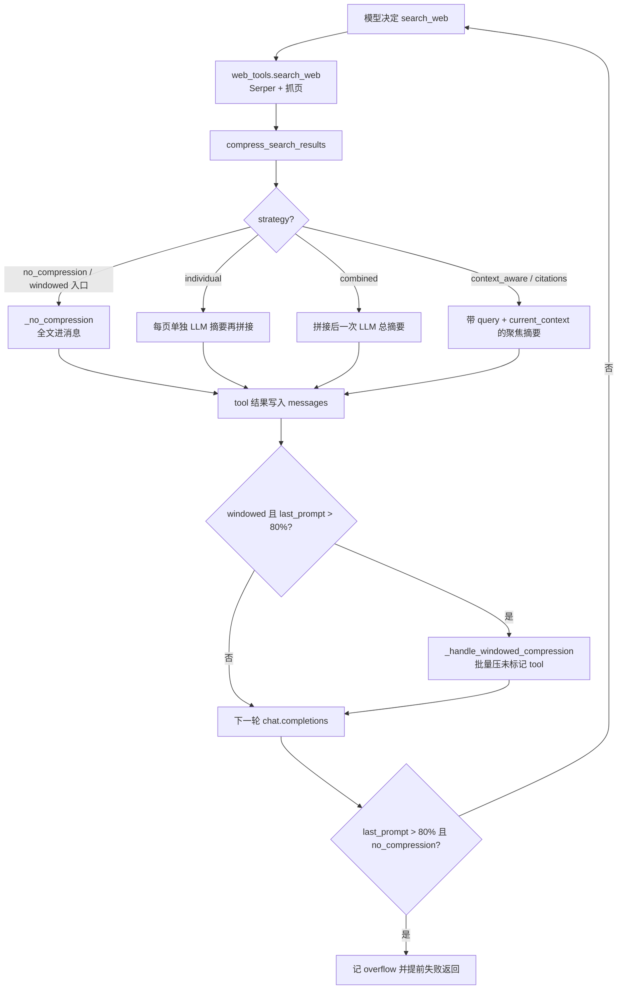

> 配套《深入理解 AI Agent》第 2 章 · `chapter2/context-compression`

---


## 这实验能帮你什么


读完并跟着做，你应该能清楚回答：

1. 压缩的两个动机分别是什么？和实验 2-8 状态栏的「加 / 换」怎么区分？
2. 六种策略在代码里叫什么、各自在哪一层动手（搜完立刻压 vs 历史批量压）？
3. 书中「压缩率」怎么读？为什么 `windowed` 的字符压缩比可以接近 100% 仍算成功？
4. `CONTEXT_WINDOW_SIZE=128000` 相对 Kimi K3 真实 ~1M 窗口为什么是故意收紧？
5. OpenRouter 与 Serper 各管什么？本机 `exp2-9-mine-context_aware.json` 该看哪些字段？

一句话结论：

> **压缩 = 在两次 API 调用之间，由 Harness 把 tool 原文换成更高密度的摘要（或延后到窗口将满再批量换）。**
>
> System / Tools 定义尽量不动，护住 KV Cache 前缀；改的是对话中段的 tool 结果。
>
>
> 主信号是 **Overflow / 压缩率 / 是否触发压缩与任务能否在预算内完成**；不要把免费模型、`-n 8` 的 Success 失败当成「压缩坏了」。
>
>

---


## 1. 实验在证明什么


书中任务：识别并追踪 **OpenAI 联合创始人**当前归属。搜索结果又长又杂（数千到十几万字符），同一任务下切换六种压缩策略，在 **128K 演示预算**下对比 token、迭代、压缩率、溢出。


台账（`chapter2/EXPERIMENT_LEDGER.md`）：

> Passed · `context-compression/results/kimi_k3_real_20260718.json` 保留六臂真实 Kimi K3 收据。

本机常因 `*.json` ignore **看不到**该文件；用 README / 书中表代替即可。


### 1.1 两个动机（别停在「省钱」）


| 动机    | 说明                                                       |
| ----- | -------------------------------------------------------- |
| 长度与成本 | 装得下、少付费、少溢出中断                                            |
| 思考质量  | 注意力擅长**检索**已有结论，不擅长每轮从头**归纳统计**；先炼成摘要，等于把「要想出来的」变成「能搜到的」 |


宠物店黑猫白猫例子（书中）：不总结就得每次数笼子；写上「黑猫 90、白猫 10」就能直接查。这和状态栏同源——都是**上下文蒸馏**；差别是状态栏多半由**代码**维护并**追加**，压缩多用 **LLM 摘要替换**原文。


### 1.2 和 KV Cache 的「矛盾」


压缩会改历史中间的 tool 内容 → 改点之后的缓存失效。书中的权衡是：

1. System + Tool Definitions **永远不动**
2. 压的是 **tool results**
3. 不压会溢出失败；压了丢部分缓存但任务可续 —— 所以 `windowed` 才强调**别每轮都压，接近阈值再批量压**

---


## 2. 和 2-8 / 2-3 的关系


|     | 2-3 KV Cache | 2-8 状态栏        | **2-9 压缩**                 |
| --- | ------------ | -------------- | -------------------------- |
| 动作  | 观察前缀稳定收益     | **加**运行时元信息    | **换**臃肿 tool 原文            |
| 主信号 | Cache%       | 干预可见 / 对照干净    | Overflow、压缩率、完成度           |
| 目录  | `kv-cache/`  | `system-hint/` | **`context-compression/`** |


```plain text
2-3 动态信息往后接、静态前缀不动
  → 2-8 末尾追加状态（加）
  → 2-9 历史中段把原文换成摘要（换）——同一枚硬币的两面
```


---


## 3. 文件地图


| 路径                                       | 作用                                                                |
| ---------------------------------------- | ----------------------------------------------------------------- |
| `compression_strategies.py`              | `CompressionStrategy` 枚举 + `ContextCompressor` 六分支实现              |
| `agent.py`                               | `ResearchAgent`：搜索后压缩、windowed 批量压、溢出检测、研究循环                      |
| `web_tools.py`                           | Serper 搜索 + 抓页；无 key 则 mock                                       |
| `experiment.py`                          | 正式对比入口：`-s` / `-m` / `-n` / `-o`，打对比表写 JSON                       |
| `main.py` / `quickstart.py`              | 交互 / 菜单；**不是**台账口径的六臂表                                            |
| `run_all_strategies.py`                  | 带详细日志的另一套跑法                                                       |
| `config.py`                              | `CONTEXT_WINDOW_SIZE=128000`、`resolve_llm()`（Moonshot→OpenRouter） |
| `results/kimi_k3_real_20260718.json`     | Canonical（本机可能缺失）                                                 |
| `results/exp2-9-mine-context_aware.json` | 学习者 2026-08-10 单臂收据                                               |


CLI 别名（`experiment.py` 的 `STRATEGY_CHOICES`）：


```plain text
no_compression → no_compression
individual     → non_context_aware_individual_summary
combined       → non_context_aware_combined_summary
context_aware  → context_aware_summary
citations      → context_aware_with_citations
windowed       → windowed_context
```


---


## 4. 架构：一次工具调用后发生了什么





要点：

- **多数策略**：压缩发生在 **刚搜完、写回 tool 消息之前**（即时压）。
- **windowed**：入口先当「无压缩」；真正动手在循环开头的 `_handle_windowed_compression`。
- **溢出保护**：看的是 **`last_prompt_tokens`**（当前上下文），不是累计 token（累计会二次计数前缀、过早误报）。

---


## 5. 源码走读：六策略


### 5.1 分发入口


```python
# compression_strategies.py — compress_search_results
if self.strategy == CompressionStrategy.NO_COMPRESSION:
    return self._no_compression(search_results)
elif self.strategy == CompressionStrategy.NON_CONTEXT_AWARE_INDIVIDUAL:
    return self._non_context_aware_individual_summary(search_results)
elif self.strategy == CompressionStrategy.NON_CONTEXT_AWARE_COMBINED:
    return self._non_context_aware_combined_summary(search_results)
elif self.strategy == CompressionStrategy.CONTEXT_AWARE:
    return self._context_aware_summary(search_results, query, current_context)
elif self.strategy == CompressionStrategy.CONTEXT_AWARE_CITATIONS:
    return self._context_aware_with_citations(search_results, query, current_context)
elif self.strategy == CompressionStrategy.WINDOWED_CONTEXT:
    # 窗口化：此处仍返回全文；压缩发生在 agent 历史侧
    return self._no_compression(search_results)
```


Agent 侧在 `search_web` 成功后：


```python
compressed = self.compressor.compress_search_results(
    result, query, self._get_current_context_summary()
)
```


`current_context` 来自最近最多 3 次 tool 的 query 拼接——给「上下文感知」用的廉价侧写，不是完整对话重放。


### 5.2 无压缩（`no_compression`）


`_no_compression`：把每条结果的 title / url / snippet / **Full Content** 拼成大字符串，**不调 LLM**。


演示预算下几次搜索就可能让 `last_prompt_tokens` 越过 `CONTEXT_WINDOW_SIZE * 0.8`：


```python
# agent.py — execute_research 循环内
if self.trajectory.last_prompt_tokens > Config.CONTEXT_WINDOW_SIZE * 0.8:
    self.trajectory.context_overflows += 1
    if self.compression_strategy == CompressionStrategy.NO_COMPRESSION:
        return {"error": f"Context window exceeded - …", …}
```


Canonical：约第 5 轮、~165k prompt > 128K，Overflows=1，Success=false。这是**基线问题展示**，不是实现 bug。


### 5.3 非任务感知：逐页 / 合并（`individual` / `combined`）


**individual**（`_non_context_aware_individual_summary`）对每个有 `content` 的结果单独打一枪：


```plain text
Summarize the following webpage content in 2-3 paragraphs:
Title: …
URL: …
Content: {original_content[:5000]}
Provide a concise summary:
```


注意：这里**没有**塞进当前研究 query。页与页之间各自为政，同一事件被多页重复描述时，摘要里也会重复——这就是书中说的信息碎片化。每页一次 LLM → 书表 ~276k tokens、~50 分钟量级，慢是结构性的。


**combined**（`_non_context_aware_combined_summary`）先把每页截到 5000 字符拼成一块，再**一次**：


```plain text
Summarize the following combined webpage content comprehensively:
…
Requirements: comprehensive summary covering all pages …
```


仍不带任务 query。优点是摘要调用次数少；风险是拼接后超长时末尾页更容易被模型「看不见」，且页级归属变弱。


### 5.4 上下文感知（`context_aware`）——本机最小 live 跑的就是它


与上两者的关键差别在 prompt 第一行就写死了 query，并可选附上近期搜索侧写：


```plain text
Given the search query: "{query}"
Current context: {current_context[:1000]}   # 来自最近 ≤3 次 tool 的 query

Analyze the following search results and provide a focused summary
that directly addresses the query.
Focus on extracting information most relevant to answering: {query}
…
Requirements:
1. Focus only on information relevant to the query
2. Prioritize current/recent information
3. Include specific names, dates, and affiliations
```


每页仍 `[:5000]`，防止「摘要请求自己」先把摘要模型的上下文打爆。书中整体压缩率约 **3.0%**（压后/原文），约 7 轮、~40k tokens、0 overflow；例子里一次 147k→1.9k 字符（~1.3%）仍保住创始人姓名与职位变动。


**本机 2026-08-10**（`-m nvidia/nemotron-…:free`，`-n 8`，真 Serper）：


| 字段                          | 值                             |
| --------------------------- | ----------------------------- |
| `success`                   | `false`（8 轮未写出 FINAL ANSWER）  |
| `context_overflows`         | **0**                         |
| `compression_ratio`         | **0.005**（929,975 → 4,310 字符） |
| `total_tokens`              | 13,578                        |
| `iterations` / `tool_calls` | 8 / 8                         |


日志对照（机制证据，不必复述人名对错）：

- 配置：`Serper API Key Set: Yes`，模型为带 `/` 的 free id
- 第 1 轮：`Compressed: 185,537 → 843`；其后多轮同样「十几万 → 几百」
- 部分 [openai.com](http://openai.com/) / Medium / Britannica **403**、YouTube 超时：抓页失败，不等于 Serper 没配上
- 第 3 轮摘要曾报 `'NoneType' object is not subscriptable`（`message.content` 为空），压缩路径仍继续

**机制验证成功；任务收口失败**——免费模型还在逐人搜索，`-n 8` 触顶。不要拿来否定策略四；若要对齐书上 Success，需要更强模型与更大 `-n`（以及接受更高费用）。


### 5.5 带引用（`citations`）


`_context_aware_with_citations` 在感知摘要的要求上强制「事实 ↔ URL」：内容有损压缩，索引尽量无损。书表 token ~223k、压缩率 4.1%，Overflows 也可能 >0——溯源有成本。后续若用户追问「这条从哪来的」，模型至少还能指向链接，而不是只能说「我记得摘要里有」。


### 5.6 窗口化（`windowed`）


两阶段（最容易看错）：

1. **搜完**：`compress_search_results` → `_no_compression`（近期全文保留，给早期探索最大信息）
2. **每轮请求前**：若 `last_prompt_tokens > CONTEXT_WINDOW_SIZE * 0.8`，遍历 messages，对所有**未**以 `[COMPRESSED]` 开头的 `role=tool` 调用 `compress_for_history`，写回并加标记

```python
context_threshold = Config.CONTEXT_WINDOW_SIZE * 0.8
if self.trajectory.last_prompt_tokens <= context_threshold:
    return messages  # 还不压
# …
compressed_content = (
    f"{COMPRESSION_MARKER} "
    f"[Original: … → Compressed: …]\n"
    f"{compressed.content}"
)
```


`compress_for_history` 的 prompt 以「Focus on information relevant to: {query}」为导向，失败时 fallback 为截断前 2000 字符——保证循环不因摘要 API 挂掉而整死。


因此整次运行的字符「压缩比」可能仍接近 100%（早期原文曾完整进过上下文，统计口径含历史峰值语义），但任务可完成、墙钟时间往往更短。读 windowed 时优先看 **Success / Overflow / 是否出现** **`[COMPRESSED]`**，不要只盯那一个百分比。


### 5.7 Agent 如何判定「研究成功」


`execute_research` 的系统提示要求搜集齐后给出 **FINAL ANSWER** 完整名单。循环在以下情况结束：

- 模型输出含 `FINAL ANSWER:` → `success` 路径（`experiment.py` 据此标 ✅）
- `no_compression` 触发窗口阈值 → 提前 `return` error，记 overflow
- `iteration == max_iterations` 仍无最终答案 → 本机 JSON 的 `success: false`、`final_answer: null`

所以 **Success 是任务层门**；**Overflow / compression_ratio 是机制层门**。最小 live 可以只过机制层。


### 5.8 依赖拆分（易混）


| 变量                                        | 用途                       |
| ----------------------------------------- | ------------------------ |
| `MOONSHOT_API_KEY` / `OPENROUTER_API_KEY` | LLM（规划 + 摘要）             |
| `SERPER_API_KEY`                          | 网页搜索；缺则 `web_tools` mock |


有 OpenRouter **不会**自动真搜。`Config.resolve_llm()` 在缺 Moonshot 时走 OpenRouter；模型名带 `/` 时原样使用（适合 `:free`）；裸 `kimi-*` 会映射到托管的 kimi-k2 系，可能产生费用 / 402。


`fetch_webpage` 工具路径**默认不压缩**（注释写明用于 follow-up），压缩主战场是 `search_web` 批量结果。


`_reasoning_safe_max_tokens`：若模型名含 `kimi-k3` / `gpt-5`，会给摘要预算额外加 reasoning headroom，避免思考痕吃光 `SUMMARY_MAX_TOKENS` 导致空摘要——这也是为什么推理模型上摘要调用比表面「500 tokens」更费。


---


## 6. 推荐学习顺序

1. 读 `book/chapter2.md`「上下文压缩」+ 实验 2-9 框。
2. `python experiment.py --list-strategies`（零 API）。
3. 对照 README「实测结果」六行表（或找回 `kimi_k3_real_20260718.json`）。
4. 配齐 Serper + LLM key；**先单策略**：`s context_aware`。
5. （可选）`s no_compression` 看 Overflow；再考虑六策略全跑（贵且慢）。
6. 读本机 JSON 的 `metrics`，对照 §5 / §7。

---


## 7. 怎么读收据


### 7.1 Canonical / README 表（Kimi K3，2026-07-18）


| # | Strategy       | Success | Iter | Tokens | Compress | Overflows |
| - | -------------- | ------- | ---- | ------ | -------- | --------- |
| 1 | no_compression | ❌       | 5    | 166k   | 102.1%   | 1         |
| 2 | individual     | ✅       | 12   | 277k   | 10.9%    | 4         |
| 3 | combined       | ✅       | 10   | 93k    | 4.3%     | 0         |
| 4 | context_aware  | ✅       | 7    | 40k    | **3.0%** | 0         |
| 5 | citations      | ✅       | 10   | 223k   | 4.1%     | 3         |
| 6 | windowed       | ✅       | 7    | 175k   | 102.4%   | 4         |


相对排序比绝对值重要：感知摘要最省 token；无压缩按设计溢出；窗口化「压缩比」难看但可完成。


### 7.2 学习者 JSON


路径：`results/exp2-9-mine-context_aware.json`


```json
"metrics": {
  "strategy": "context_aware_summary",
  "success": false,
  "iterations": 8,
  "tool_calls": 8,
  "context_overflows": 0,
  "total_tokens": 13578,
  "compression_ratio": 0.005,
  "total_original_size": 928975,
  "total_compressed_size": 4310
}
```


读法：先看 **overflows=0** 与 **ratio≪1**；再解释 success=false（轮次上限 / 模型未 FINAL ANSWER）。


`experiment.py` 里压缩率：


```python
metrics['compression_ratio'] = round(total_compressed / total_original, 3)
```


即 **压后 / 原文**；打印成百分比时 0.005 → 0.5%。


---


## 8. FAQ


**Q：为什么 K3 有 1M 窗口还要 128K 预算？**


A：故意收紧，才能在可控成本内观察到溢出与压缩触发；真实窗口太大时「无压缩」可能迟迟不爆。


**Q：Success 失败算实验失败吗？**


A：对本机最小 live：若已见真搜 + 强压缩 + 0 overflow，机制目标达成。正式六臂 Success 以 canonical / 书表为准。


**Q：****`quickstart.py`** **能当验收吗？**


A：不能。对比表入口是 `experiment.py`。


**Q：部分网页 403 / 超时正常吗？**


A：正常；工具会跳过或报错，模型换源继续。不应用来否定 Serper 配置。


**Q：压缩会不会破坏整段 KV Cache？**


A：前缀（system/tools）保留；被替换的 tool 段及其后缓存失效。这是有意识权衡。


**Q：和上下文腐化（Context Rot）什么关系？**


A：溢出是装不下；腐化是装得下但找不到。压缩通过提高信息密度、去掉重复噪声，同时服务两者。


---


## 9. 复习卡

1. 压缩率 3% 和「压缩了 97%」谁对应该书中定义？
2. `windowed` 在 `compress_search_results` 里为什么还调用 `_no_compression`？
3. 溢出判断用累计 `total_tokens` 还是 `last_prompt_tokens`？为什么？
4. OpenRouter 配好了仍 mock 搜索，缺的是哪个变量？
5. 2-8 与 2-9 分别是「加」还是「换」？

（要点：1. 3%=压后/原文；2. 延后到阈值再压；3. last_prompt，避免二次计数；4. SERPER_API_KEY；5. 加 / 换。）


---


## 10. 边界

- 本机未复跑完整六臂；未持有 canonical JSON 文件时以 README 表为准。
- 免费模型 + `n 8` 不能复现书上「策略四 7 轮成功」。
- 摘要是有损的：压错 / 空摘要会污染后续决策（与状态栏「高信任」同类风险）。
- `individual` 全量跑可能极慢（书表近 50 分钟量级）——先单策略。

---


## 附录：本机命令速查


```bash
uv sync --locked --python 3.12 --extra ch2
source .venv/bin/activate
cd chapter2/context-compression

python experiment.py --list-strategies

# 最小 live（真 Serper + OpenRouter 免费模型示例）
mkdir -p results
python experiment.py -s context_aware \
  -m "nvidia/nemotron-3-ultra-550b-a55b:free" \
  -n 8 \
  -o results/exp2-9-mine-context_aware.json

# 可选对照：无压缩看 Overflow（仍建议限 -n）
# python experiment.py -s no_compression -m "…" -n 8 -o results/exp2-9-mine-no_compression.json
```